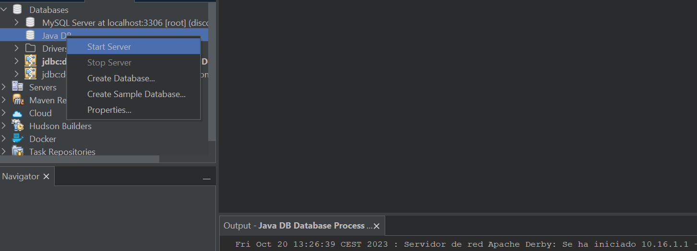

# Instrucciones crear un BD de Derby en Netbeans

Para poder usar una BD de Derby en nuestro proyecto en Netbeans:

1. Descargar la última versión de **Derby** en su web (*for Java 17 and Higher*) y descomprimirla en una carpeta del equipo.

2. Ir a la pestaña Services de Netbeans.

3. Hacer clic en *Java DB* en propiedades y rellenar los datos de la carpeta que contiene Derby (Java DB Installation) así como la localización de la futura BD que creemos (Database Location).

4. Iniciar el servidor que indicará que se ha iniciado correctamente.

5. Podemos probar a crear una BD de ejemplo.

6. Si apareciera un error de conexión con la BD, seguir con el siguiente video para solucionarlo, configurando el driver del Java DB (Network) por una incompatibilidad:
<iframe width="560" height="315" src="https://www.youtube.com/embed/OKiBsWbgrMw?si=KkTjrI_XuazW8jmM" title="YouTube video player" frameborder="0" allow="accelerometer; autoplay; clipboard-write; encrypted-media; gyroscope; picture-in-picture; web-share" allowfullscreen></iframe>

