# UT1.1 Introducción a las interfaces

## Interfaz gráfica de usuario (GUI)

```note
💡 La Interfaz gráfica de usuario o **GUI** (*Graphic User Interface*) es el entorno visual de imágenes y objetos mediante el cual una máquina y un usuario interactúan.
```

Casi todos los programas o apps tienen alguna clase de interfaz visual, que sirve al mismo tiempo para mostrar información al usuario y como un mapa de navegación entre diferentes comandos.

Hay interfaces visuales como las de los smartphones, diseñadas para disminuir al máximo la curva de aprendizaje. También la interfaz de las web está diseñada para que cualquier visitante pueda usarla sin necesidad de conocimientos específico previos.

## Interfaz de un sitio web

```note
💡 La interfaz de un sitio web, se refiere a todos los gráficos, información y herramientas que aparecen en la pantalla al abrir una página web en un navegador.
```

Aunque los elementos específicos de una interfaz web, funcionan de forma similar a cualquier otra interfaz, su diseño suele ser más intuitivo y fácil de usar, pues sería poco práctico que los internautas tuvieran que invertir tiempo aprendiendo a manejar los comandos de cada sitio web que visitan o ajustar entre cada dispositivo desde donde se visitase. Por ello, en el diseño web es crítico crear una interfaz de usuario que facilite al máximo la transmisión de información, la navegabilidad y la interacción.

Existen otras formas de comunicación entre un software y un usuario:

-   **Interfaz de voz** (VUI): Se trata de programas capaces de identificar e interpretar el habla. El ejemplo más claro que tenemos es el reciente auge de las inteligencias artificiales, como Siri, que se controlan por medio de la voz.
-   **Interfaz de texto** (CLI): Se utiliza principalmente en el ámbito de la programación de sistemas operativos y es la evolución de la interfaz de línea de comando primitiva que usaban los primeros programas de computadora.
-   **Interfaz natural**: Se le llama así al tipo de interfaz que identifica e interpreta acciones naturales del ser humano, como movimientos y expresiones faciales. Un ejemplo de ello son interfaces como Kinect o la cámara de PS4.
-   **Interfaz cerebro-ordenador**: Es el tipo de interfaz más innovadora que existe hasta el momento, y aunque aún no cuenta con muchas aplicaciones cotidianas, se está utilizando para controlar prótesis biónicas y dar instrucciones sencillas a un software por medio de las ondas cerebrales.

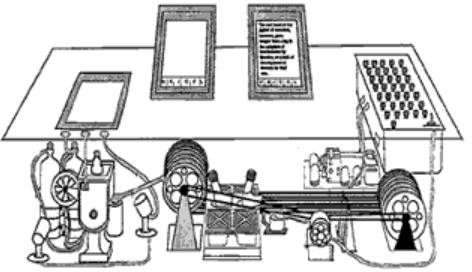

## Evolución histórica de las interfaces

### Antecedentes

A principios de la década de los treinta, Vannevar Bush (asesor científico de Roosevelt) describió un dispositivo llamado *Memex*, que visualizó como una mesa con dos pantallas gráficas, un teclado y un escáner. Permitiría al usuario almacenar libros, grabaciones y comunicaciones, y acceder a la información utilizando conexiones muy parecidas a los hiperenlaces actuales (de manera no lineal).

Sus ideas no fueron aplicadas, porque hasta 1937 no se desarrollarían los primeros ordenadores digitales. No obstante, en 1945 Bush revisó sus ideas en el artículo "As We May Think", e inspiró a Douglas Englebart para intentar construir un dispositivo similar.

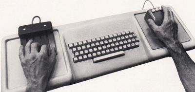

En **1962**, Englebart escribe el ensayo "*Augmenting Human Intellect*", en el que ve la computadora no como un dispositivo de sustitución del intelecto humano, sino como su extensión. Sus ideas son interpretadas como radicales, en un momento en que los ordenadores que existían eran los mainframes.

En **1968**, Englebart consigue realizar una demostración pública de su proyecto ante un millar de profesionales denominado oN-LINE SYSTEM (*NLS*) y un equipo compuesto de:
- Una pantalla basada en gráficos vectoriales, que puede mostrar texto (sólo mayúsculas) y líneas sólidas.
- Un teclado estándar.
- Una caja con tres botones: el primer ratón de la historia.

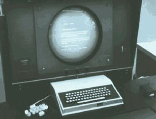

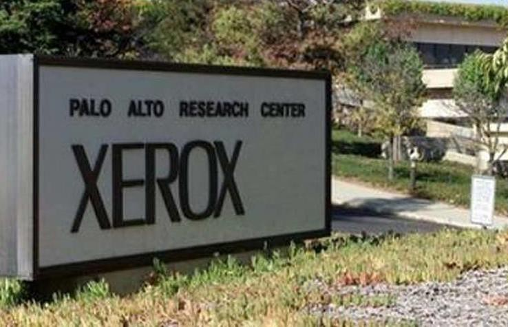

Su demostración incluía hiperenlaces, edición de documentos a pantalla completa, ayuda contextual, trabajo en red, e-mail, mensajería instantánea y videoconferencia. La interfaz se componía de varias ventanas.

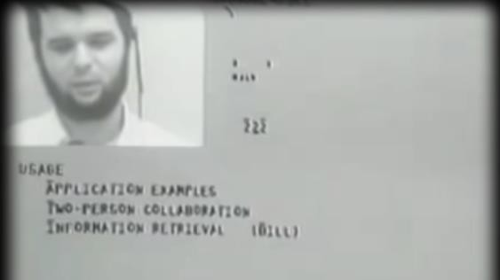

El equipo de Englebart abandonó su actividad en 1969 debido a la falta de fondos y pasó a trabajar para una empresa hasta entonces dedicada a la impresión en papel, **Xerox**, que fundó el **Palo Alto Research Center** (*PARC*), en 1970.

El **PARC** ofrecía total libertad para trabajar en el desarrollo de un proyecto de 5 años.

### Xerox Alto

PARC presenta en 1973 el primer ordenador con interfaz gráfica: el **Alto**, con una resolución de pantalla de 606 × 808 píxeles. Cada píxel puede iluminarse de manera independiente, lo que amplía las posibilidades gráficas. No presenta ventanas.

Incluye un ratón con tres botones, y un cursor en pantalla con el mismo aspecto que el actual (puntero de flecha en diagonal), y modal.

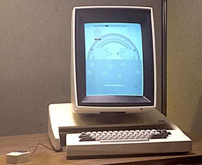


Aunque fue una revolución, Alto no triunfó ya que tenía algunos problemas importantes. En primer lugar, no tenía uniformidad. Cada programa había sido escrito por un grupo de programadores diferente, y a pesar de que funcionaban muy bien, el conjunto carecía de una interfaz común. Y dado que había nacido como una máquina para ser operado por el personal de Xerox, hacían falta sólidos conocimientos técnicos para utilizarlo.

Es el primer equipo de la historia en que se utiliza lainteracción o paradigmaconocido como **WIMP** (Windows, icons, Menusand pointers), usada posteriormente por todas las interfaces modernas.

A pesar de contar con un procesador de textos (Bravo), un sistema de correo electrónico (Hardy), un programa de dibujo vectorial, aún estaba lejos de poder ser utilizado en una empresa

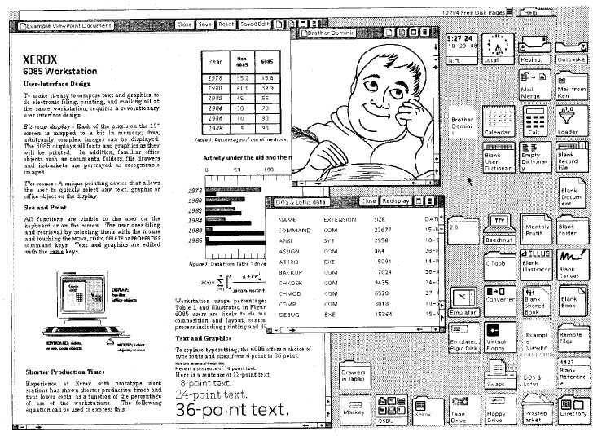

### Smalltalk

Fruto del esfuerzo en poder trabajar con un equipo intuitivamente y el lema de **WYSIWYG** (*What You See Is What You Get*) se empieza un nuevo Proyecto.

Para proporcionar coherencia a las aplicaciones, el PARC desarrolla en 1974 el primer GUI (interfaz gráfica de usuario) llamado **Smalltalk**.

Presenta ventanas individuales, cada una de las cuales puede desplazarse por pantalla desde la barra de título.

Smalltalk es la primera interfaz que incluye iconos, barras de desplazamiento (*scrolls*), botones radiales y ventanas de diálogo así como menús pop-up y ventanas superpuestas.

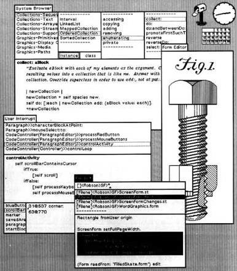


### Xerox Star

En 1981 Xerox presenta la estación de trabajo **Xerox Star**, conocida oficialmente como *8010 Star Information System.*

Fue una revolución al ser el primer sistema comercial en incorporar la interfaz recién creada conocida como Smalltalk manejada por ratón y teclado. Además, poseía conexión de red Ethernet, servidor de ficheros, servidor de impresoras y correo electrónico.

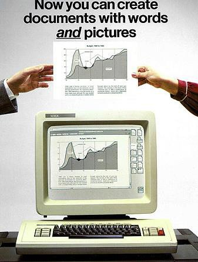

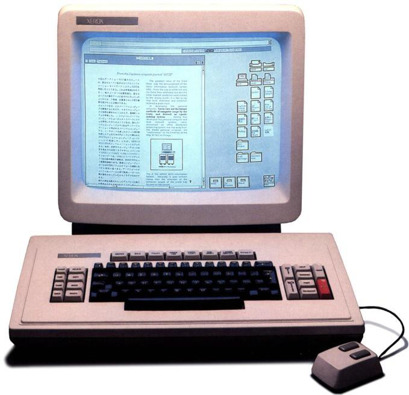

El software desarrollado para el Xerox Star planteó un duro desafío al equipo encargado de proyectar el hardware, ya que las interfaces gráficas eran muy exigentes en los requerimientos de dicho hardware.

El 8010 Star Information System se vendía en 16 mil dólares, aproximadamente el triple de lo que costaba un IBM-PC recién lanzado al mercado.

Las aplicaciones del Star además se programaron con un nuevo lenguaje de programación orientado a objetos llamado **Mesa**, del que más tarde se basarían **Modula-2** y **Modula-3**.

Xerox Star no fue un éxito de ventas. Los motivos fueron varios, pero quizás los más importantes hayan sido su precio y la falta de experiencia de Xerox como proveedor de equipos informáticos.

### Apple Lisa

Algunos de los ingenieros de Xerox desembarcan en otras empresas, entre ellas la fundada en 1976 por Steve Jobs y Steve Wozniak, **Apple Computer**, donde prosiguen las investigaciones iniciadas con Alto y Smalltalk. En diciembre de 1979, una delegación de Apple liderada por Steve Jobs visitó las oficinas de Xerox PARC en Palo Alto.

Posteriormente en 1983 se presentaría a **Lisa**, el segundo ordenador de la historia con interfaz gráfica de usuario, con las siguientes características:

- SO multitarea cooperativo.
- Pantalla monocromo de 17’’, 384Kb de RAM.
- Interfaz icónica: cada icono es un documento o aplicación.
- Una barra de menús desplegables.
- Atajos de teclado y papelera para eliminar ficheros.
- Ratón de dos botones acción de doble-clic    para seleccionar/ejecutar una aplicación.

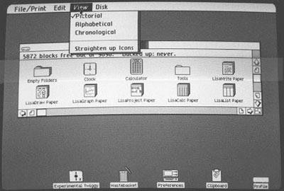


### Apple Macintosh

Las ventas de Lisa no fueron las previstas, en parte por su elevado precio, su falta de control a los programadores, y la feroz competencia de los inferiores técnicamente pero flexibles IBM-PCs.

Apple desarrolla y lanza en 1984 el primer Macintosh, de precio mucho más reducido (6000\$), una campaña de marketing brutal y características técnicas más limitadas (SO no multitarea, pantalla monocroma y 128kb de memoria) con relativo éxito.

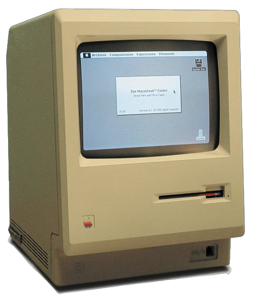

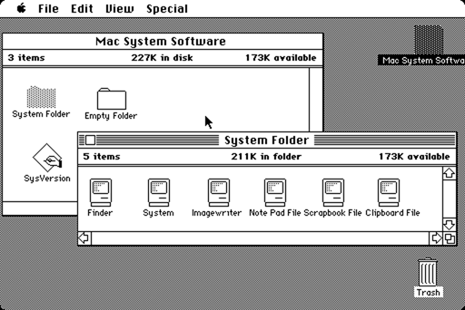


### Windows

Microsoft, la compañía desarrolladora de Windows, fue fundada en 1975 por William Henry Gates y Paul Allen. Su empresa instala MS-DOS en los IBM-PC sin interfaz gráfica. Para suplir esas limitaciones en 1983 Bill Gates anuncia el Interface Manager, simplificado después como **Windows 1.0**, que aparece en 1985.

Windows estuvo severamente limitada a causa de los recursos legales de Apple, que no permitió imitaciones de sus interfaces de usuario.

Sus principales características fueron:

- Interfaz en color.
- Todos los estándares GUI: barras de desplazamiento , elementos de control de ventanas, menús, barra de menú general.
- Ventanas en mosaico (no superpuestas).
- Aplicaciones como el administrador de archivos, calculadora, calendario o la terminal.

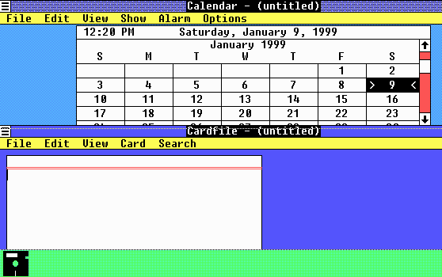

El 9 de diciembre de 1987 Microsoft lanzó Microsoft **Windows 2.0**, una versión que se hizo mucho más popular. Como importante novedades en la interfaz permitía superponer ventanas y la aparición del panel de control. En Windows 2.0 también aparecen los iconos en el escritorio, atajos de teclado, y soporte al uso de la memoria extendida. Microsoft lanza también por primera vez su paquete Office.

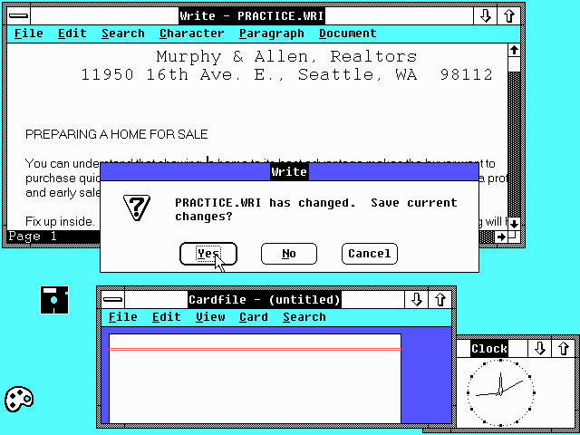


### X Windows System

A finales de los ochenta aparecen nuevas GUI basadas en Unix, sobre una arquitectura llamada **X Windows System** con el que, aún a día de hoy, se basan muchas de las distribuciones GNU/Linux. Tiene sus orígenes en 1980 y fue desarrollado en el **MIT** para dotar de una interfaz de usuario a los sistema de tipo Unix. Se unifican en un entorno de escritorio conocido como CDE.

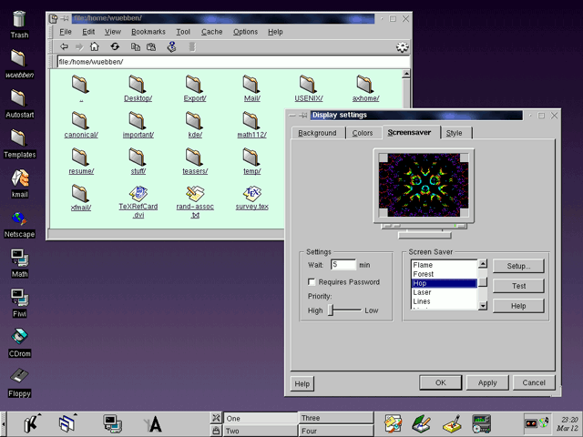

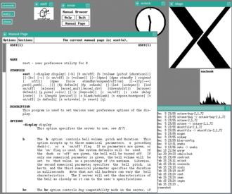

### AmigaOS

A principios de los 90 *Commodore International* lanza su sistema operativo, **AmigaOS**, del cual se destaca el corazón de este sistema, Workbench, este era capaz de soportar multitareas, era increíblemente rápido y con él se pudo experimentar en las primeras animaciones de video y renderizados gráficos en la historia de la computación.

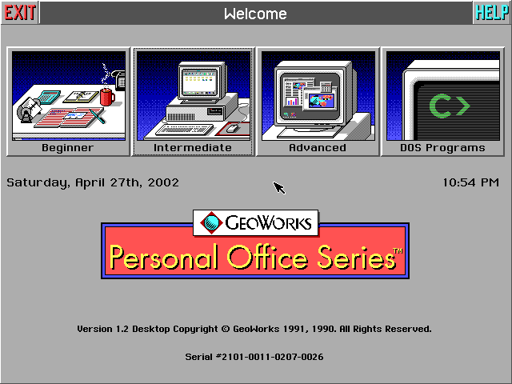

### Windows

En 1992 se presenta Windows 3.1, el cual incluye fuentes TrueType, elementos multimedia y cuadros de diálogo.

Con Windows 95 se introduce por primera vez el menú de inicio y la barra de tareas, que perdurarán hasta nuestros días en entornos de escritorio.


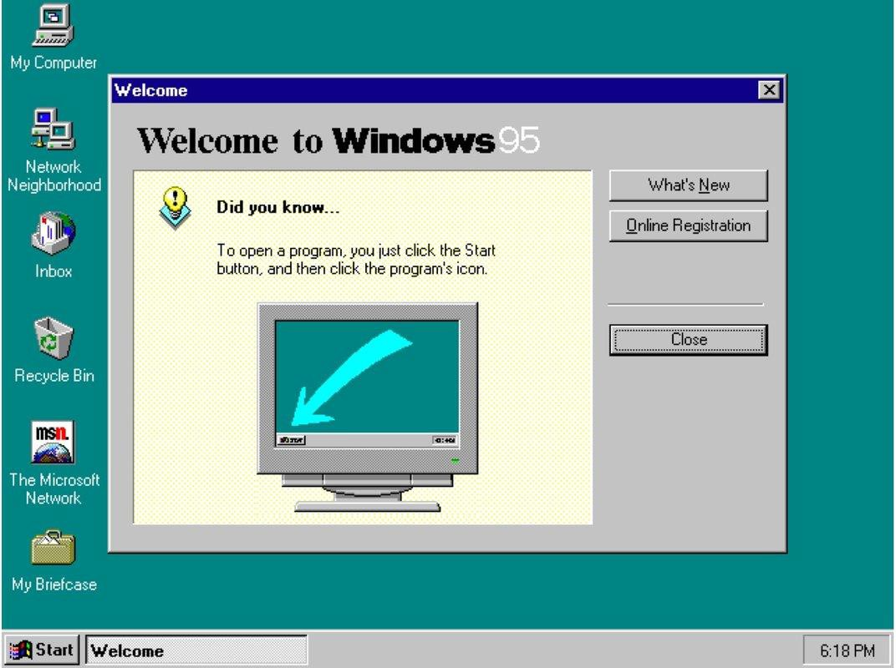


### Linux

A finales de la década de 1990, hubo un crecimiento significativo en el mundo Unix, especialmente entre la comunidad de software libre y la aparición de **Linux**.

Surgieron nuevos movimientos gráficos de escritorio alrededor de Linux y sistemas operativos similares, basados en el sistema **X Window**. Se buscó con moderado éxito proporcionar una interfaz integrada y uniforme al usuario a pesar de la gran variedad de distribuciones. Aparecen entornos de escritorio, como KDE, GNOME y Xfce.

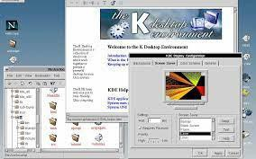

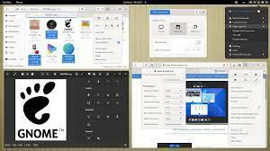

**Mac OS**

En 2001 Apple presenta la interfaz **Aqua** para su Mac OS X, desarrollado en colaboración con NeXT. Aqua incorpora a Exposé que es una característica de Mac OS X que facilita el modo de gestionar las ventanas abiertas, exponiéndolas todas en un mosaico de miniaturas.

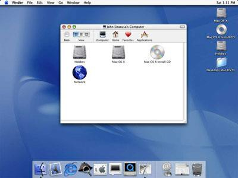

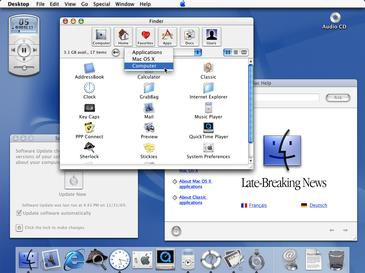

### Dispositivos móviles

Se considera a **General Magic**, la compañía madre de todas las GUI de teléfonos inteligentes modernos. A Marc Porat, que a principios de los 90 trabajaba en Apple, se le ocurrió una idea revolucionaria: la de que era posible crear un dispositivo de comunicación y computación portátil. Con esa idea en mente fundo General Magic, que se adelantó 15 años a la época, y sentó las bases del futuro iPhone.

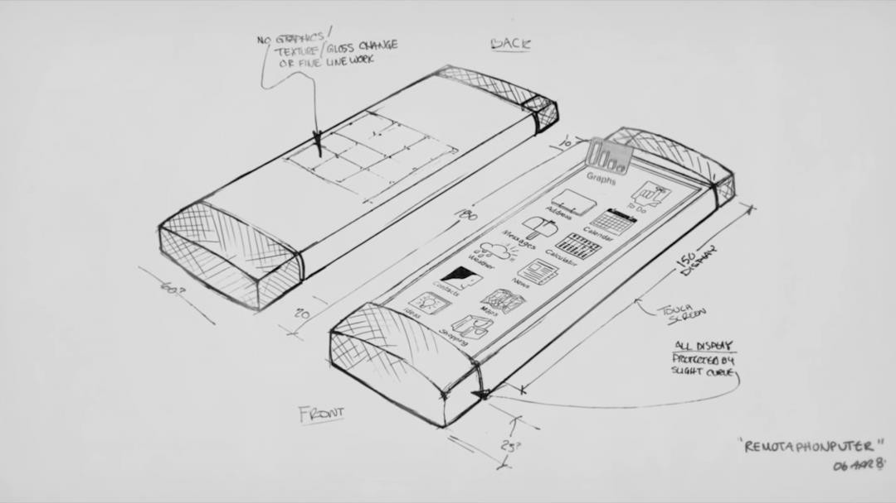


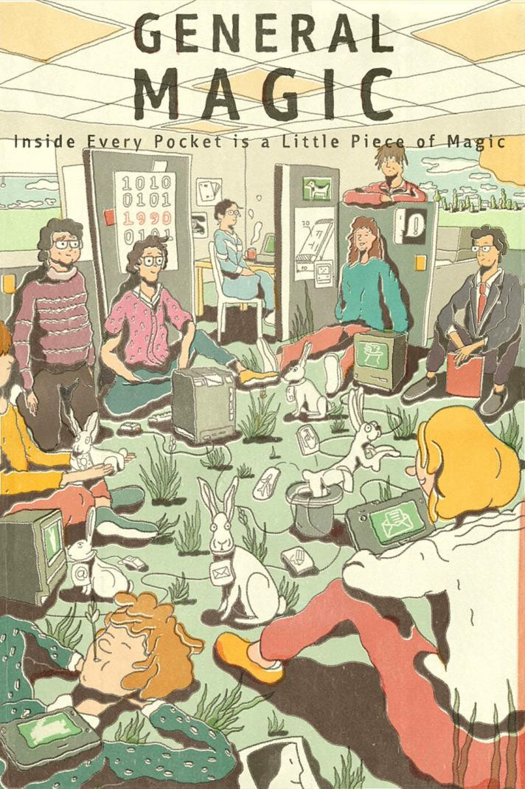

En el equipo de General Magic, hubo empleados muy exitosos como la directora de tecnología de la Casa Blanca (Megan Smith), el co-creador de Android (Andy Rubin), el fundador de eBay (Pierre Omidyar) o el codiseñador del iPod y iPhone (Tony Fadell).

Con el surgimiento de la World Wide Web, se lanza su primer producto serio, el **Apple Newton**, de apariencia similar, un PDA (asistente digital personal) con sistema operativo Newton OS, y reconocimiento de escritura pero que no triunfó.

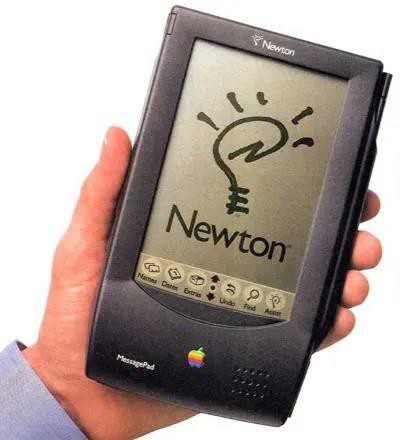


### Actualidad de escritorio

Microsoft seguirá adelante con su sistema operativo de ventanas para escritorio, dando a luz a Windows 2000, ME, XP, Vista, 7, 8 y finalmente 10, lanzado a mediados del 2015 y del cual ya hay un sucesor en el mercado: Windows 11.

Apple y su Mac OS X, lanzarían posteriormente también alrededor de 18 versiones, la más reciente es Monterey lanzada a finales del 2021.

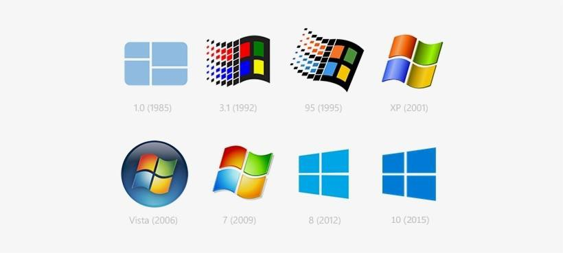

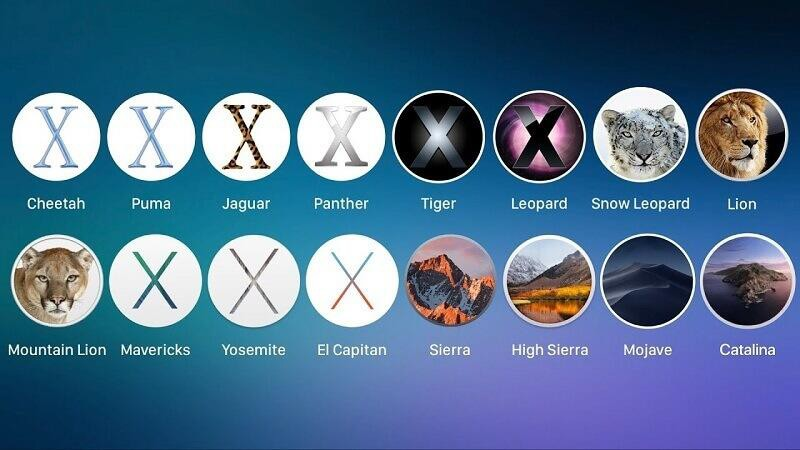

 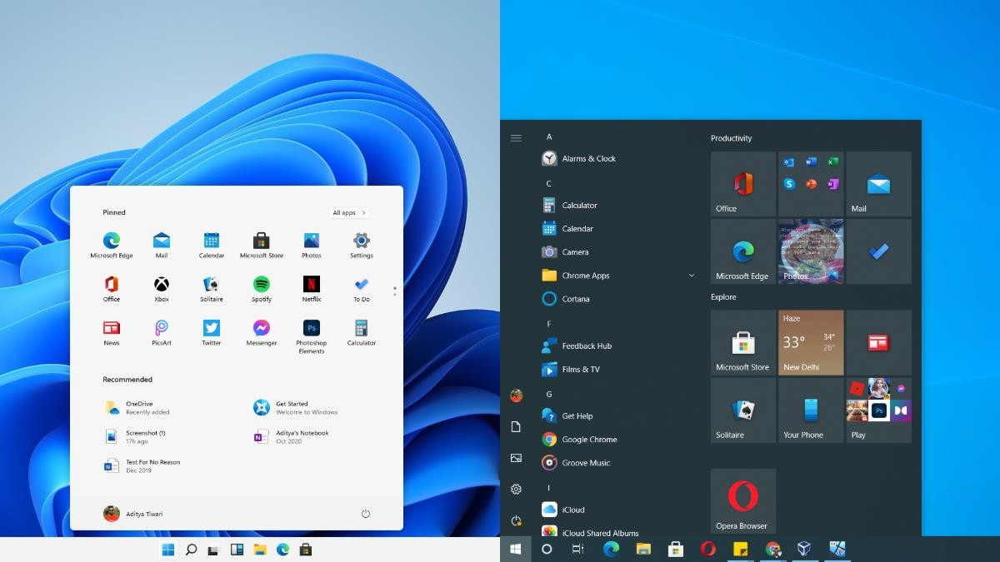


### Dispositivos móviles

A principios del siglo XXI, dos nombres, Apple y Google, entraron oficialmente en la carrera para convertirse en los sistemas operativos mejor calificados, aunque dicha carrera fue iniciado por Apple y su iPhone como luego veremos. No obstante hubo otros competidores como Symbian, Blackberry o Windows Phone que no lograron tener éxito.

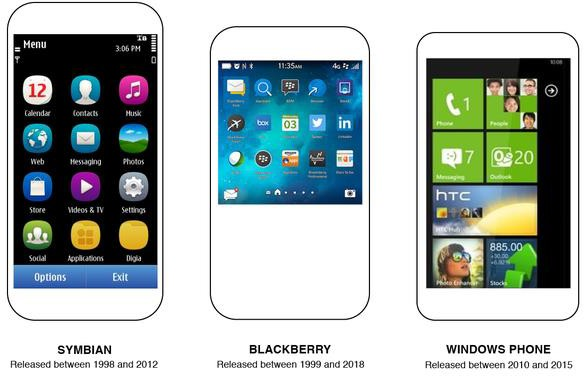

### Dispositivos móviles Apple

En 2007 surge el iPhone y más tarde en con la introducción del iPad, Apple popularizó el estilo de interacción *post-WIMP* para pantallas multitáctiles.

Con el primer iPhone Steve Job presentó una interfaz de usuario basada en tecnología de pantalla táctil; fue el primer móvil en no tener teclado físico, cambiando la interacción humana sobre productos digitales que había hasta entonces..


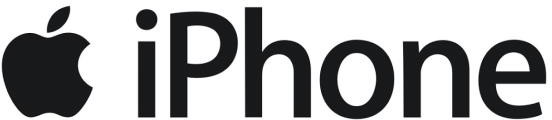


La interfaz de usuario del iPhone tenía un estilo *esqueuomórfico* completo. Ello significa que las funciones de la interfaz de usuario se diseñaron para parecerse a elementos de la vida real.

Se agregaron degradados, sombras paralelas y bordes a los botones para que parezcan 3D y se pueda hacer clic en ellos.

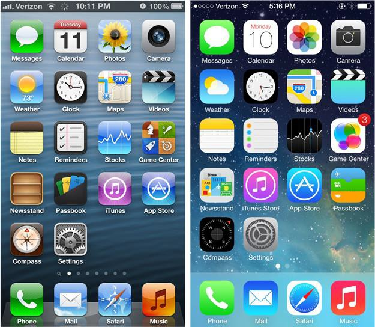

Desde 2007 dicho estilo ha sido sustituido por un nuevo estilo denominado diseño plano (*flat design*) que muy acertadamente introdujo la competencia del iPhone, los SO basados en su competidor Android de Google.

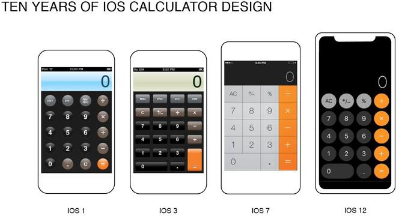 


### Dispositivos móviles Android

Android fue lanzado en 2007 y su primera versión en septiembre de 2008. En un principio, Android fue un sistema operativo pensado para usar con teclado y cursor poder navegar entre las aplicaciones. Desde su comienzo, Android ha sido altamente personalizable. Poco después, antes del lanzamiento del primer teléfono Android, esta filosofía cambió para convertirse en eminentemente táctil, y poder competir contra el iPhone, presentado un año antes. Desde entonces, Android ha pasado por múltiples lanzamientos y una madurez que tampoco tiene que envidiar al SO móvil de Apple.


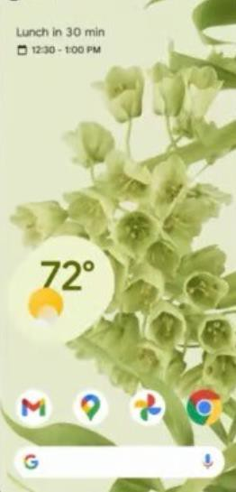

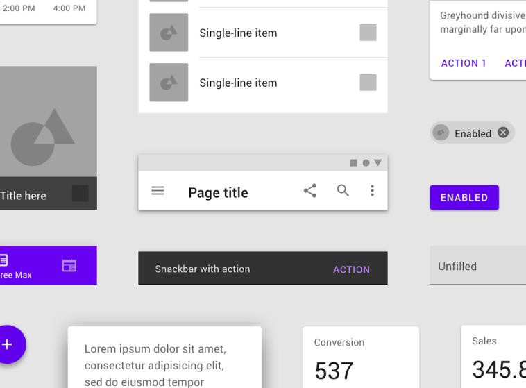

Un hito del GUI de Android fue Material Design, anunciado en 2014, junto con el lanzamiento de la versión 5.0 de Android Lollipop. Desde entonces se ha ido implementando en cada uno de sus aplicaciones para crear un sistema que ofrezca la misma experiencia de usuario en todas las plataformas y dispositivos. Matías Duarte, diseñador de interfaces y vicepresidente de diseño de Google, es uno de los impulsores de este sistema de diseño que ha transformado la IU y UX del entorno web y móvil en la actualidad.


Android es considerado como uno de los modelos de negocio más exitosos, pues su desarrollo estratégico contempla los factores que más se tienen en cuenta dentro de las herramientas y metodologías desarrollados por expertos en negocios. No obstante los problemas de monopolio y privacidad comienzan hacer mella en su marca.

El núcleo de Android se desarrolla de forma abierta y se puede por tanto acceder tanto a su código fuente. No obstante, los servicios de Google siguen siendo propietarios.

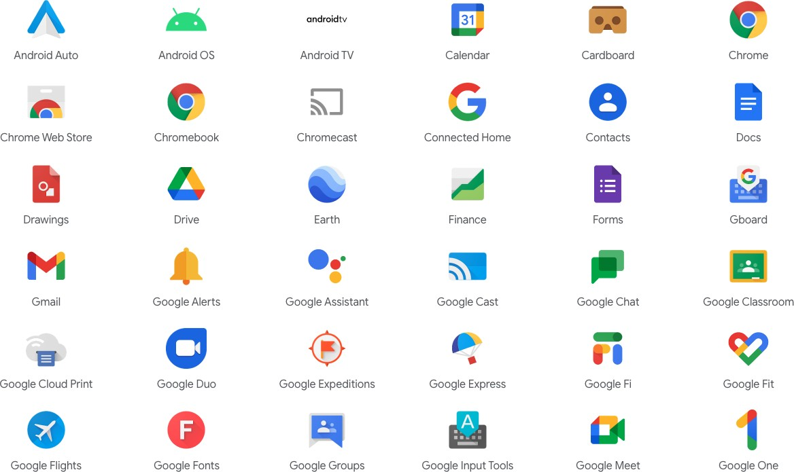 


## Evolución histórica de la web

### Hipertexto y WWW

En 1989 se estandarizan los protocolos de conexión a Internet mediante TCP/IP. **Tim Berners Lee**, un ingeniero del CERN propone un sistema de hipertexto para estructurar la información de Internet, de manera que sea más usable para los científicos.

En 1990 crea un visualizador que constituye el nacimiento de la World Wide Web, con enlaces interconectados (hasta el momento no se podía acceder de un ordenador a otro mediante enlaces, ni existían buscadores, ni se podían integrar imágenes), que se estandariza en 1993 como Hypertext Markup Language (*HTML*).

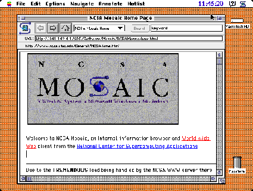

En 1991, un estudiante de 22 años de la Universidad de Illinois llamado Marc Andreesen, quien más tarde sería fundador de Netscape, crea el primer navegador gráfico, llamado Mosaic.


### Evolución del diseño web

En 1992, con la aparición de los navegadores, el diseño mediante tablas fue una revolución en cuanto a la organización de los elementos y la experiencia ofrecida a los usuarios. En esa época no había estilos CSS para poner varios elementos en la misma altura.

Pocos años después, en 1994, se conformó el *World Wide Web Consortium* (W3C) con el fin de desarrollar estándares y recomendaciones web.

A mediados de los noventa, Flash y Javascript dieron lugar a las animaciones con efectos visuales, haciendo posible resolver las limitaciones del HTML. A partir de ese momento, el problema era la larga espera que experimentaban los navegantes cuando cargaban estas páginas tan sumamente animadas.

En 2008 los smartphones comienzan a pedir diseño web propio y en el año 2012 se presenta el diseño web adaptable (**responsive web design**).

Desde aquel momento, se presenta la información al usuario de una manera operativa, bajo el lema el contenido de calidad por encima de todo.


### Evolución del diseño web

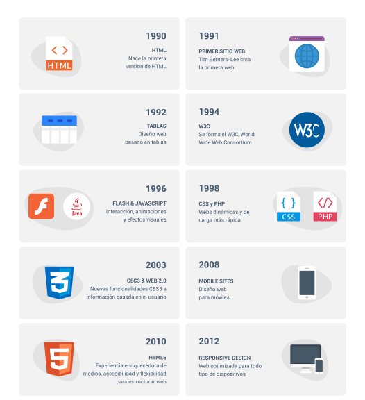

## UI y UX

```note
💡 **UI** (*User Interface*) se corresponde con el diseño visual de una interfaz de usuario.
```

La principal característica del diseño de Interfaces no es enfocarse solamente en crear una aplicación o página, sino crear un diseño que sea usable y satisfactorio.

```note
💡 **UX** (*User Experience*) hace referencia a las sensaciones de utilizar una interfaz de usuario que experimenta una persona al utilizarla.
```

Los colores, la tipografía, las imágenes son algunos de los elementos con los que trabaja el diseñador UI para hacer que un producto sea atractivo. No obstante, no sirve de nada tener un producto bonito si no satisface las necesidades de los usuarios para los que está pensado. Es por ello que el diseño UX busca resolver las necesidades de los usuarios finales buscando la experiencia de uso.

Dentro de las actividades que se realizan en **UI**, están:

- Diseño de interacción (cómo responde el sistema)
- Guías de interacción (estados del sistema)
- Diseño de elementos (botones, formularios)
- Diseño visual (iconos, imágenes)
- Guías de estilo (paletas de color, fonts)

Dentro de las actividades del **UX** están las siguientes:

- Conocer a fondo a los usuarios finales, realizando una investigación correspondiente.
- Diseñar un producto que resuelva sus necesidades y se ajuste a las necesidades de tu organización y usuario.

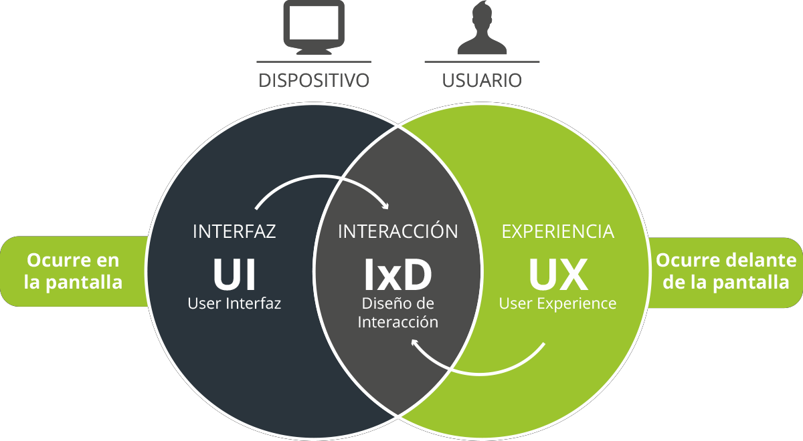

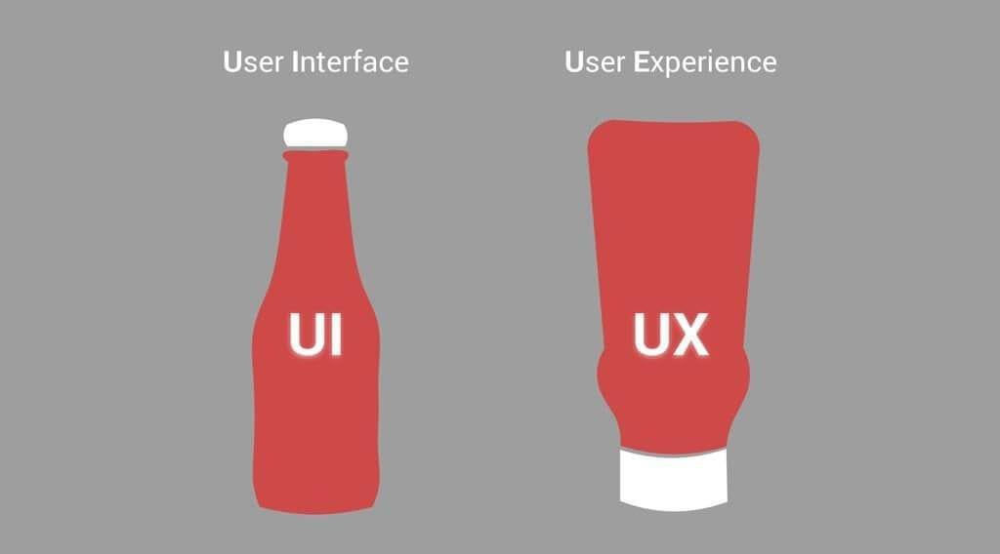

## Lenguajes de programación de interfaces

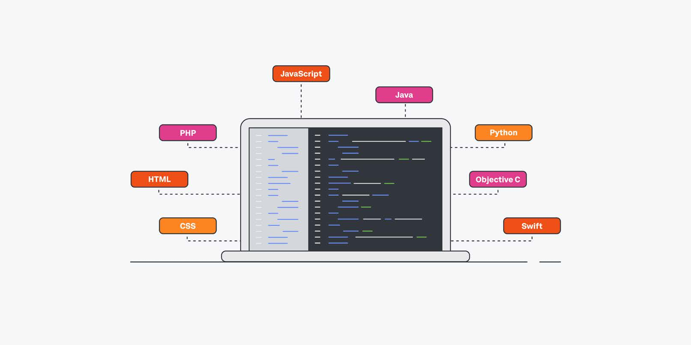