# UT1.2 Interacción Persona-Ordenador

📕 [Contenido en presentación PDF](/pdf/UT1.2 - Interacción persona-ordenador.pdf)

## Introducción

```note
💡 La *Interacción Persona-Ordenador* (**IPO**), también conocida como *Human-Computer Interaction* (**HCI**), es la disciplina dedicada a estudiar cómo se produce la interacción entre las personas y los sistemas informáticos para tratar de mejorar esta relación por medio del diseño gráfico.
```

Su objetivo principal es incrementar la productividad de los equipos y minimizar los errores al tiempo que se dota a los usuarios de una experiencia segura, confortable y satisfactoria.

> “La Interacción persona-ordenador es la disciplina relacionada con el diseño, evaluación y implementación de sistemas informáticos interactivos para el uso de seres humanos, y con el estudio de los fenómenos más importantes con los que está relacionado. ”


Generalmente, los sistemas informáticos son interactivos e involucran al usuario en la resolución de tareas. Para conseguir esta interacción o diálogo entre persona- ordenador se utiliza la interfaz. Esta interfaz de usuario determina, en gran medida, la percepción que el usuario tendrá de una aplicación y es un factor de gran importancia para conseguir una aplicación exitosa.

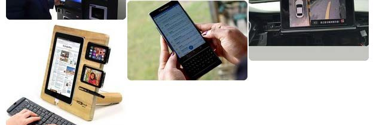

Licklider y Clark, en 1962, elaboran una lista con los diez problemas más comunes que deberán ser resueltos para **facilitar la interacción entre las personas y los ordenadores**:

1.  Compartir el tiempo de uso de los ordenadores entre muchos usuarios.
2.  Un sistema de entrada-salida para la comunicación mediante datos simbólicos y gráficos.
3.  Un sistema interactivo de proceso de las operaciones en tiempo real.
4.  Sistemas para el almacenamiento masivo de información que permitan su recuperación.
5.  Sistemas que faciliten la cooperación entre personas en el diseño y programación de grandes sistemas.
6.  Reconocimiento por parte de los ordenadores de la voz, de la escritura manual impresa y de la introducción de datos a partir de escritura manual directa.
7.  Comprensión del lenguaje natural, sintáctica y semánticamente.
8.  Reconocimiento de la voz de varios usuarios por el ordenador.
9.  Descubrimiento, desarrollo y simplificación de una teoría de algoritmos.
10. Programación heurística o a través de principios generales.

Hansen en su libro *User Engineering Principles for Interactive Systems* hace la primera enumeración de **principios para el diseño de sistemas interactivos**:

1.  Conocer al usuario.
2. Minimizar la memorización, sustituyendo la entrada de datos por la selección de ítems, usando nombres en lugar de números, asegurándose un comportamiento predecible y proveyendo acceso rápido a información práctica del sistema.
3. Optimizar las operaciones mediante la rápida ejecución de operaciones comunes, la consistencia de la interfaz y organizando y reorganizando la estructura de la información basándose en la observación del uso del sistema.
4. Facilitar buenos mensajes de error, crear diseños que eviten los errores más comunes, haciendo posible deshacer acciones realizadas y garantizar la integridad del sistema en caso de un fallo de software o hardware.

Los estudios realizados por Myers y Rosson en una encuesta hecha a diferentes desarrolladores, demuestran que alrededor del **48%** del código de una aplicación está dedicado a la interfaz de usuario.

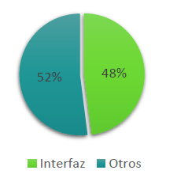


Otros estudios demuestran que el 80% de los costes de mantenimiento de una aplicación son debidos a problemas del usuario con el sistema y no con errores de código o bugs. Entre ellos, alrededor del 64% son problemas de usabilidad.

A pesar de su importancia la interacción persona-ordenador es una disciplina a la que no se le da el suficiente valor en los estudios de informática y, muchas veces, no se utiliza en el momento de hacer la documentación de un proyecto. Igualmente la experiencia de usuario es un campo al que cada vez se le da más importancia empresarial y académica.

Atendiendo a cómo el usuario puede interactuar con una interfaz, ya hemos visto que existen varios tipos de interfaces de usuario:

- **Interfaz de línea de comandos** (Command-Line Interface, **CLI**): Interfaces alfanuméricas (intérpretes de comandos) que solo presentan texto.
- **Interfaz gráfica de usuario** (Graphic User Interface, **GUI**): Permiten comunicarse con la computadora de forma rápida e intuitiva representando gráficamente los elementos de control y medida.
- **Interfaz natural de usuario** (Natural User Interface, **NUI**): Pueden ser táctiles, representando gráficamente un control en una pantalla sensible al tacto que permite interactuar con el dedo de forma similar a si se accionara un control físico; pueden funcionar mediante reconocimiento del habla, como por ejemplo *Siri* o *Alexa*; o mediante movimientos corporales, como *Kinect* u otra cámara de movimiento.

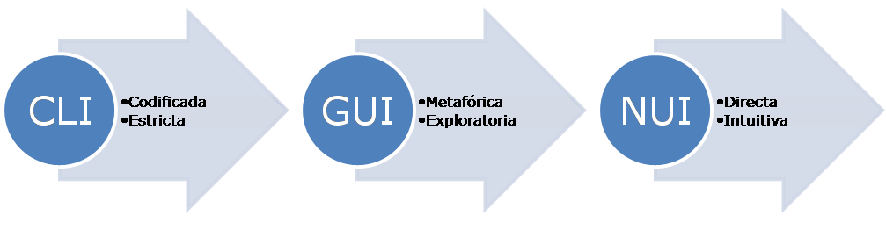

## El factor humano

```note
💡 La **cognición** es el proceso por el que los humanos adquirimos conocimientos e interactuamos con el entorno.
```

Sobre los usuarios es importante entender cuáles son sus capacidades y los procesos de **cognición** involucrados durante el desempeño de tareas a través del computador: la memoria, la visión, el oído o el tacto, son factores que determinan cómo manipulan y hace uso efectivo de la tecnología computacional, radicando allí la importancia del factor humano para optimizar su interacción.

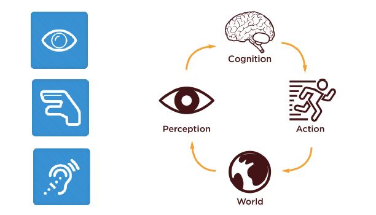

La **cognición** debe tomar en cuenta como el ser humano recibe y procesa la información y la transforma en conocimiento, interactuando en ese instante con las herramientas tecnológicas; todo esto utilizando sus sentidos.

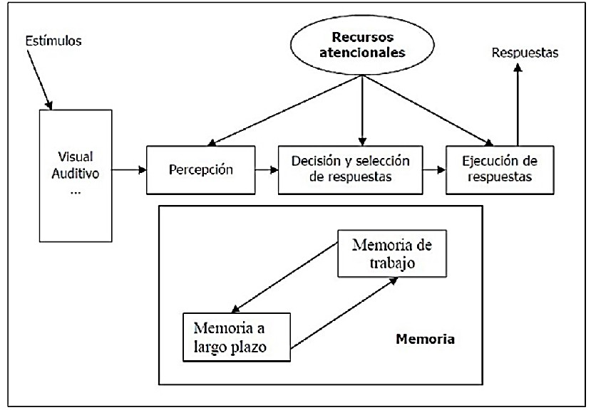


### Canales de Entrada y Salida

En una interacción con el ordenador el usuario recibe información que es generada por el ordenador, y responde proporcionando una entrada al ordenador.

- La **entrada** en el ser humano se produce a través de los sentidos:
    - Vista
    -   Oído
    -   Tacto
    -   Olfato
    -   Gusto

    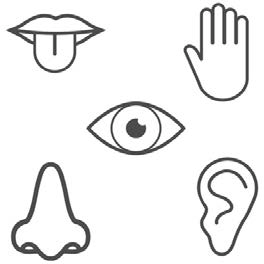

- La **salida** se producirá mediante movimiento de los dedos, ojos, extremidades o cabeza, así como mediante el habla.

Los canales de entrada humanos tienen restricciones como es por todos conocidos. Por ejemplo para el sistema visual:

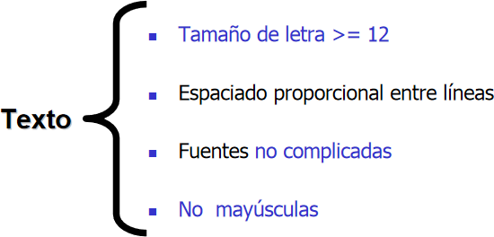


### La memoria

La **memoria** humana se corresponde a una función del cerebro que permite codificar, almacenar y recuperar información.

Está dividida en 3 tipos a su vez:

-   **Memoria sensorial:** información captada por los sentidos (instantánea)
-   **Memoria de corto plazo o de trabajo** (*MCP*): se conoce también como memoria primaria o memoria activa, refiere a la capacidad de conservar en la mente de forma activa una pequeña cantidad de información, de manera tal que se localice disponible inmediatamente durante un corto periodo de tiempo. La duración de la MCP está estimada en varios segundos y unos 7-9 objetos.
-   **Memoria de medio plazo** (*MMP*): es aquí donde se envía la información desordenada, con el propósito de que sea organizada, eliminar duplicados, evaluar frente a otra información que choquen entre sí y la información útil será enviada a nuestra memoria de largo plazo.
-   **Memoria de largo plazo** (*MLP*): se conoce también como memoria inactiva o memoria secundaria refiere al tipo de memoria que provee un almacenamiento de mayor capacidad y con mayores tiempos de permanencia para la información.

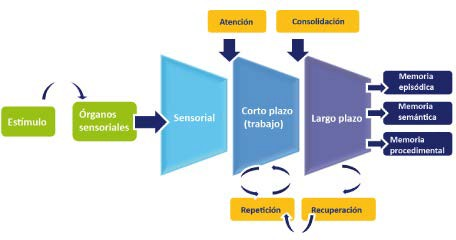

## La interacción

La **interacción** son las diferentes formas en que las personas interactúan con un computador o dispositivo. Existen diferentes tipos de interacción, tal y como ya hemos señalado anteriormente y que describiremos en detalle:

-   La línea de comandos
-   Menús y navegación
-   Manipulación directa de la interfaz
-   Mediante asistente
-   Realidad virtual
-   Computación ubicua e IOT

### La línea de órdenes o comandos

Fue el primer estilo de interacción en la Informática. Indica instrucciones al ordenador directamente mediante teclas, caracteres simples y comandos de palabras completa o abreviaturas con parámetros.

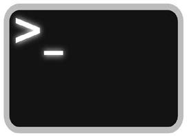

#### Ventajas

-   Flexibilidad: Las opciones de la orden pueden modificar su comporta orden puede ser aplicada a muchos objetos a la vez.
-   Permite la iniciativa del usuario.
-   Es atractivo para usuarios expertos y potencialmente rápido para tareas complejas.

#### Desventajas

-   Requiere un memorización y entrenamiento importantes: No hay indicación visual de la orden que se necesita y es más útil para usuarios expertos.
-   Gestión de errores pobre

### Menús y navegación

Un menú se puede plantear como un grupo de alternativas visualizadas en la pantalla, que se pueden seleccionar de forma individual o grupal lo que da como respuesta la ejecución de una orden subyacente que provoca un cambio en el estado de la interfaz.

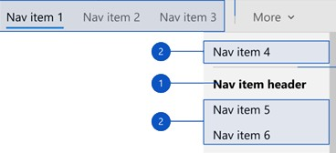

#### Ventajas

-   Entrenamiento reducido, menos tecleo
-   Permiten el uso de herramientas de gestión de diálogos
-   Toma de decisión estructurada.

#### Desventajas

-   Pueden resultar lentos para usuarios experimentados: Solución: atajos de teclado
-   Ocupan mucho espacio en la interfaz: Solución: menús desplegables y pop-up.
-   Requieren una visualización rápida

### Manipulación directa de la interfaz

Las pantallas de alta resolución, las pantallas táctiles y los dispositivos apuntadores, como el ratón, han permitido la creación de los entornos de manipulación directa, estas interfaces suponen un cambio de una sintaxis de comandos compleja a una manipulación de objetos y acciones con gran facilidad, siendo el entorno más común de manipulación directa la interfaz **WIMP** (*Windows, Icons, Menús, Pointers*) y *post-WIMP*.

#### Ventajas

-   Sintaxis más sencilla, reduce los errores
-   Aprendizaje más rápido y mejor retención
-   Incita a la exploración por parte del usuario
-   Problemas

#### Problemas

-   Se necesitan más recursos (no todas las tareas pueden ser descritas por objetos concretos y no todas las acciones se pueden hacer directamente).

### Mediante asistente

La interacción asistida usa la metáfora del asistente personal o agente que colabora con el usuario y este no dirige la interacción, si no que trabaja de forma cooperativa con el agente o agentes reduciendo el esfuerzo global.

Cuando se habla de agente, se entiende que es un programa de ayuda al usuario, con características asociadas a la inteligencia humana, como la capacidad de aprender, inferencia, adaptabilidad, independencia y hasta creatividad.

El usuario no ordena, delega tareas al agente, que procesará información que puede ser relevante para el usuario para dar una respuesta o actuación.

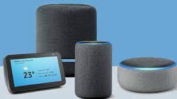

### Realidad virtual

Describen una amplia variedad de estilos de interacción desde interfaces tridimensionales con los que se puede interactuar y actualizar en tiempo real hasta sistemas en los que la sensación de presencia es prácticamente igual al mundo real.

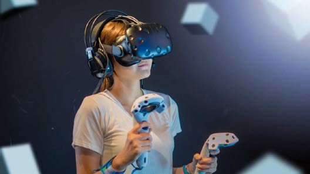

#### Beneficios

-   Simulaciones imposibles en otro sitio

#### Problemas

-   Alto coste
-   Cansancio del usuario

*Usos de realidad virtual*: Entrenamiento de operarios, reconstrucciones virtuales de patrimonio histórico o arquitectónico, medicina, entretenimiento, Defensa y seguridad

### Computación ubicua e IOT

La computación ubicua trata de extender la capacidad computacional al entorno del usuario, permitiendo que la capacidad de información esté presente en todas partes, en forma de pequeños dispositivos muy diversos que permiten interacciones de poca dificultad, conectados en red a servidores de información. El diseño y ubicación de los dispositivos son específicos de la actividad objetivo del proceso de interacción, entre los desarrollos tecnológicos que podemos indicar que trabajan bajo este formato están:

-   Elementos domóticos
-   Tabletas
-   Pizarras
-   Dispositivos inteligentes e IOT

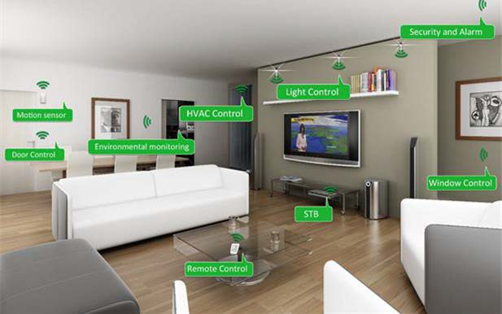

## Elementos de interacción

Algunos de los **elementos de interacción** de las GUI que se pueden encontrar en las interfaces y que estudiaremos para su construcción en diferentes lenguajes de programación, son habitualmente los siguientes:

-   Las ventanas
-   Las ventanas o cuadros de diálogo
-   Los asistentes
-   Los menús
-   pestañas
-   Las Barras de herramientas
-   Los iconos
-   Los controles
-   Las fuentes o tipografía


### Ventanas

Las ventanas son, normalmente, bidimensionales y de forma rectangular, y se ubicarán en el escritorio del sistema operativo. Cuando tenemos abierta más de una ventana ubicada en un mismo escritorio, la que estará activa será la que podremos ver, la que estará más cerca de nosotros, y el resto quedarán por debajo, escondidas.

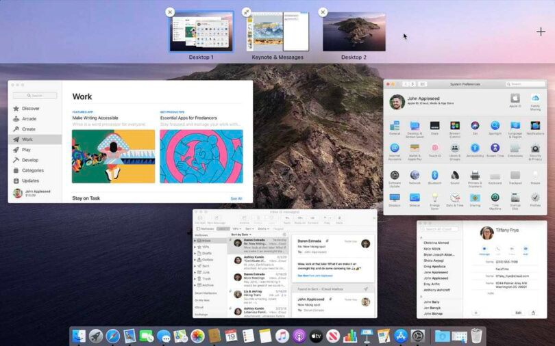En muchos SO se usan transparencias para identificar algunos elementos de las ventanas no activas, ubicadas debajo de la activa.

En un caso de utilización de una misma aplicación, el hecho de trabajar con ventanas nos permitirá tener más de una interfaz abierta al mismo tiempo, lo que nos permitirá comparar la ejecución de dos funcionalidades o tener dos interfaces diferentes abiertas a la vez.

### Ventanas de diálogo

Las ventanas de diálogo son ventanas en las que el sistema presenta alternativas al usuario y solicita respuestas. Suponen una combinación de las características de los menús y los formularios. Existen dos tipos de ventanas de diálogo:

- **Modales**. Suspenden temporalmente todas las acciones y obligan al usuario a responder a la cuestión expuesta en la ventana. Desaparecen sólo cuando el usuario ha elegido una de las opciones que presentan.
- **No modales.** Dotan a la interacción de flexibilidad, ya que el usuario tiene las opciones de la ventana a su disposición sin que el resto de las tareas queden desactivadas.

### Formularios

Permiten solicitar al usuario la introducción de datos de manera estructurada. Los elementos de un **formulario** pueden ser de dos tipos:

1.  **Cajas de texto**. Son campos en los que el formulario puede introducir texto (el número de caracteres puede estar limitado por el sistema) mediante el teclado.
2.  **Opciones de selección**. Pueden ser de varios tipos:
    -  **Cajas**. Contienen opciones que se pueden activar o desactivar, y son independientes unas de otras.
    -  **Botones radiales**. Contienen opciones autoexcluyentes. Se utilizan cuando el número de opciones es limitado.
    -  **Menú desplegable**. Contiene opciones autoexcluyentes. Se utiliza cuando existen muchas opciones.

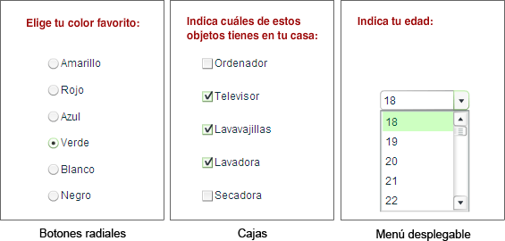

### Asistentes

Los asistentes son ventanas que van apareciendo una tras otra hasta que se llega a un determinado objetivo. Como su nombre indica, asisten al usuario hasta completar una funcionalidad, preguntando paso a paso todas las informaciones necesarias hasta completar correctamente. De esta manera el usuario no podrá olvidarse de introducir una información o escogerá mal una opción. Los asistentes son habituales en la instalación de software o como ayuda en la utilización de una funcionalidad muy concreta.

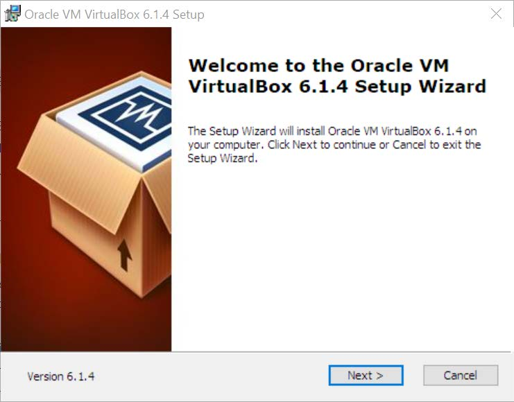

### Menús

Los menús son un elemento importante para las interfaces de usuario, ya que serán los encargados de mostrar todas las posibilidades de interactuar con la aplicación informática.

Los menús desplegarán todo el conjunto de funcionalidades que tendrá el usuario a su alcance. Cada opción de un menú dispondrá de un subconjunto de opciones, lo que convierte a los menús en un árbol jerarquizado con un número de niveles que habrán decidido los desarrolladores. Cuanto más niveles tenga, más complicado será que un usuario llegue a una funcionalidad determinada.

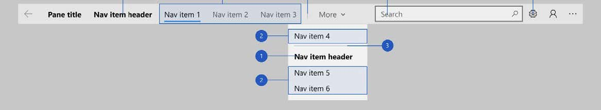

### Iconos

Los iconos son imágenes que representan funcionalidades o acciones que se podrán llevar a cabo haciendo un clic encima. Entre otros lugares, a las interfaces gráficas de usuario, son elementos que se utilizan en las barras de herramientas.

Podrán identificar también archivos, carpetas, otras aplicaciones o dispositivos de un sistema informático. Es necesario que los iconos sean muy fácilmente identificables por parte de los usuarios, o, en su defecto, que estén muy bien informados de sus funcionalidades.

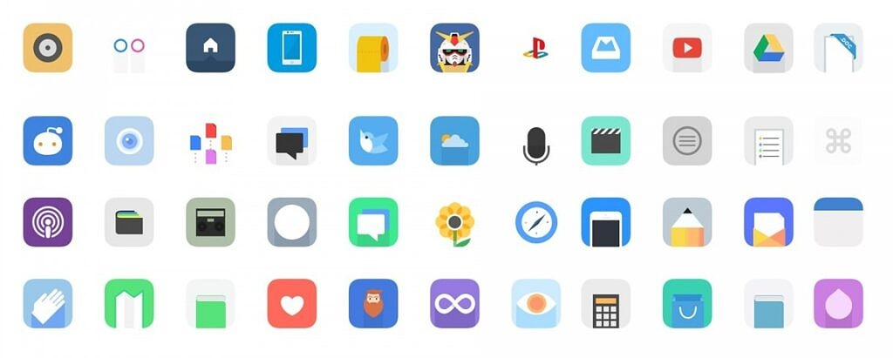

### Tipografía

El texto no es un elemento de interacción en si mismo, pero se utiliza en la comunicación con el usuario. El texto dispone de varias opciones tipográficas para ser mostrado. La elección cuidadosa de estas tipografías también ofrecerá un mensaje específico al usuario y es un elemento más a tener en cuenta en el diseño y desarrollo de las interfaces.

Se conocen como **tipografía digital** las fuentes desarrollados exclusivamente para pantallas, para usarlos en interfaces gráficas de aplicaciones informáticas. De este modo, *Microsoft* por ejemplo, tiene un sistema propio de tipo desarrollado, tanto para su sistema operativo como para las aplicaciones que funcionarán encima. *Apple* es seguramente quien más esfuerzo ha dedicado a este tema, y desarrolló y estudió las primeras fuentes exclusivas para pantallas de sistemas informáticos.

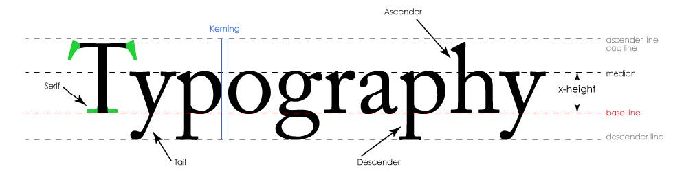

