# UT2.1 Repaso POO, conceptos y metodología

## Introducción

El desarrollo de **interfaces gráficas** permite la creación del canal de comunicación entre el usuario y la aplicación, por esta razón requiere de especial atención en su diseño.

En la actualidad, las herramientas de desarrollo permiten la implementación del código relativo a una interfaz a través de vistas diseño que facilitan y hacen más intuitivo el proceso de creación. La programación orientada a objetos permite utilizar entidades o componentes que tienen su propia identidad y comportamiento.


En este unidad se verán en detalle los principales tipos de componentes de diferentes librerías así como sus características más importantes.

La distribución de este tipo de elementos depende de los llamados **layout**, los cuales permiten situar los elementos en la interfaz.

Una misma aplicación puede presentar más de un tipo de ventana, principal o de diálogo. Las ventanas de diálogo definen los llamados diálogos modales o no modales, elementos destacados en el desarrollo de interfaces. La combinación de tipos de ventanas y elementos de diseño es infinita.

```tip
Un **componente software** está formado por **clases** creadas para ser reutilizadas y que puede ser manipulada por una herramienta de desarrollo de aplicaciones visual.
```

Se define por su **estado** que se almacena en un conjunto de propiedades, las cuales pueden ser modificadas para adaptar el componente al programa en el que se inserte. También tiene un comportamiento que se define por los **eventos** ante los que responde y los **métodos** que ejecuta ante dichos eventos.

Un subconjunto de los atributos y los métodos forman la **interfaz** del componente.

Para que pueda ser distribuida se **empaqueta** con todo lo necesario para su correcto funcionamiento, quedando independiente de otras bibliotecas o componentes.

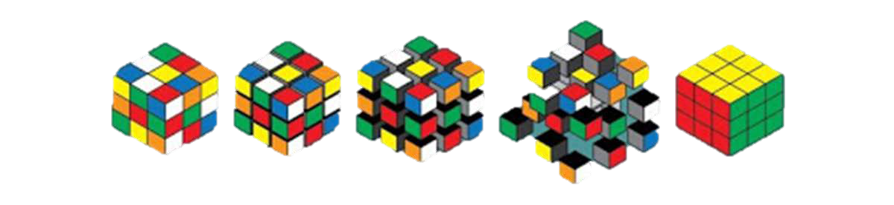

## Programación Orientada a Objetos (POO)

En POO los objetos son entidades que tienen un determinado estado, comportamiento (método) e identidad:

-   El **estado** está compuesto de datos o informaciones, será uno o varios atributos a los que se habrán asignado unos valores concretos (datos).
-   El **comportamiento** está definido por los métodos o mensajes a los que sabe responder dicho objeto, es decir, qué operaciones se pueden realizar con él.
-   La **identidad** es una propiedad de un objeto que lo diferencia del resto, dicho con otras palabras, es su identificador (concepto análogo al de identificador de una variable o una constante).

💡 La definición o instanciación de un objeto, con sus propiedades y comportamiento se lleva a cabo a través de las **clases**.

💡 A su vez, los objetos disponen de mecanismos de interacción llamados **métodos**, que favorecen la comunicación entre ellos.

## Características de la POO

### Abstracción

```note
La **abstracción** es un procedimiento que permite la elección de una determinada entidad de la realidad, sus características y funciones que desempeñan, la cual es representada mediante clases que contienen atributos y métodos de dicha clase.
```

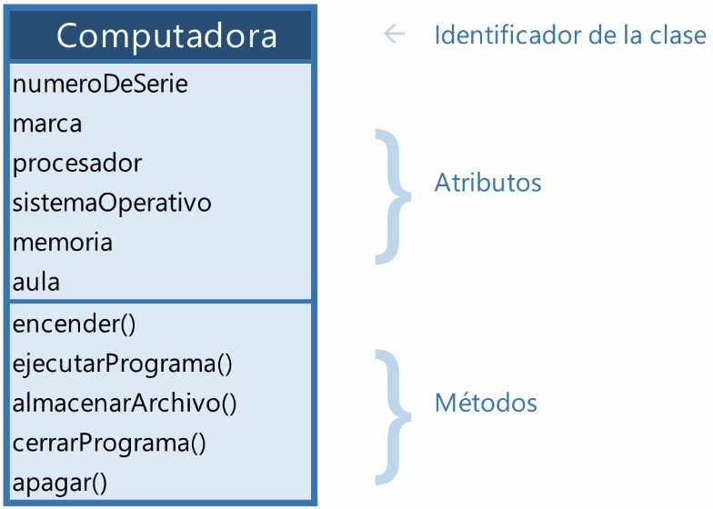

### Encapsulamiento

💡 En POO, se acostumbra a proteger la información o el estado de los atributos para que no se pueda ver o modificar la información del objeto sin el mecanismo adecuado.

Para ello, se utilizan métodos para recuperar la información (**getters**) y a su vez, poder asignar (**setters**) un nuevo valor y verificar que no afecte la integridad del objeto.

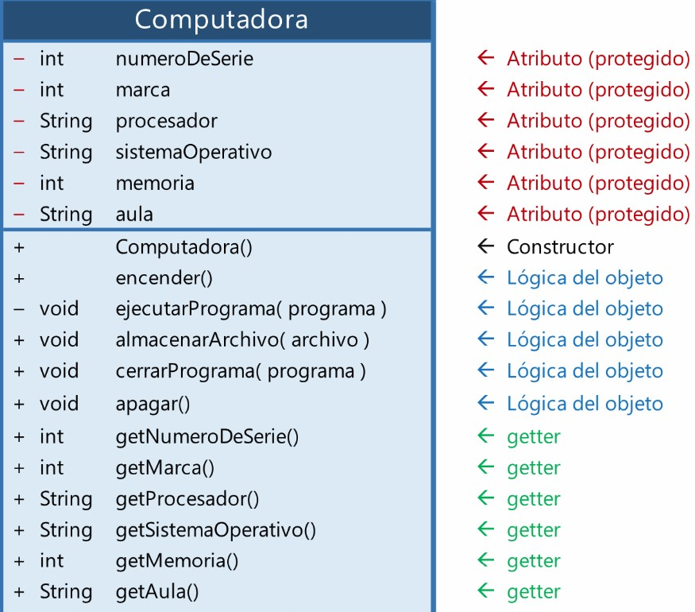
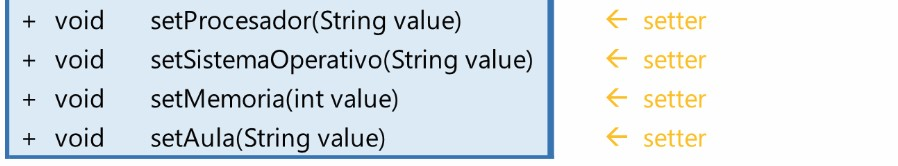

### Herencia

```note
💡 La **herencia** es un mecanismo que permite la definición de una clase a partir de la definición de otra ya existente.
```

Conceptos importantes:

-   **Superclase**: la clase cuyas características se heredan se conoce como superclase (o una clase base o una clase principal).
-   **Subclase**: la clase que hereda la otra clase se conoce como subclase (o una clase derivada, clase extendida o clase hija). La subclase puede agregar sus propios campos y métodos, además de los campos y métodos de la superclase.
-   **Reutilización**: la herencia respalda el concepto de reutilización, es decir, cuando queremos crear una clase nueva y ya hay una clase que incluye parte del código que queremos, podemos derivar nuestra nueva clase de la clase existente. Al hacer esto, estamos reutilizando los campos/atributos y métodos de la clase existente.

**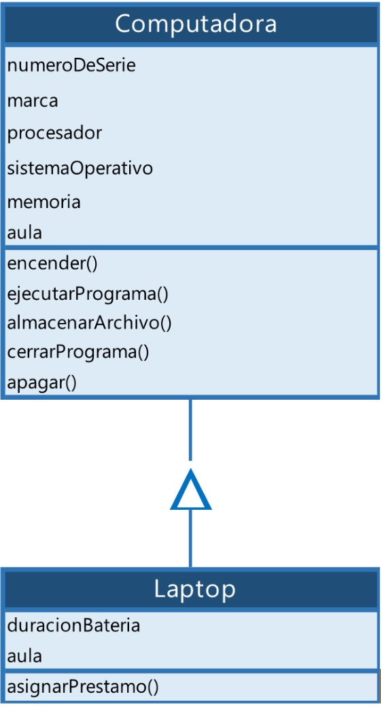**

La clase Laptop sigue siendo una computadora, tiene todos sus atributos y métodos, pero agrega dos **atributos** y un método a la definición original, de lo que se conoce como **superclase**

## Polimorfismo

```note
El **polimorfismo** es la capacidad que tienen los objetos de una clase en ofrecer respuesta distinta e independiente en función de los parámetros usados durante su invocación.
```

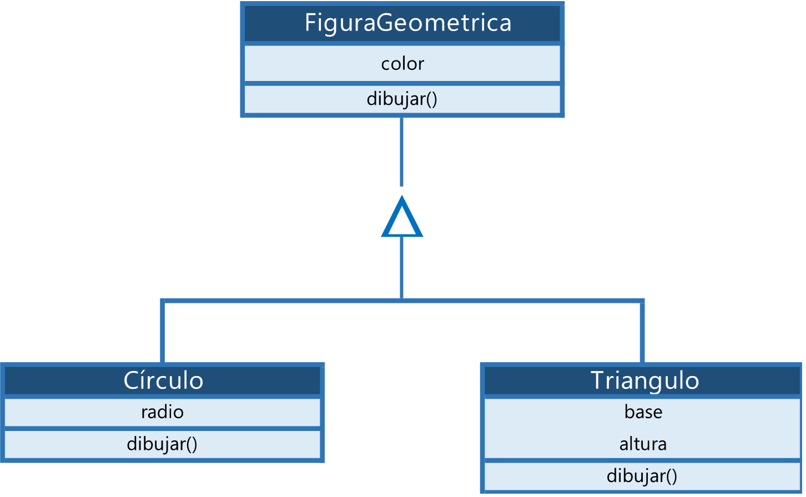

## Conceptos de POO

### Clases

```note
💡 Una **clase** representa un conjunto de objetos que comparten una misma estructura (atributos) y comportamiento (métodos).
```

A partir de una clase se podrán instanciar tantos objetos correspondientes a una misma clase como se quieran. Para ello se utilizan los **constructores**.

Para llevar a cabo la **instanciación** de una clase y así crear un nuevo objeto, se utiliza el nombre de la clase seguido de paréntesis. Un constructor es sintácticamente muy semejante a un método.

El **constructor** de una clase puede recibir argumentos, de esta forma podrá crearse más de un constructor, en función del número de argumentos que se indiquen en su definición. Aunque el constructor no haya sido definido explícitamente, en Java siempre existe un constructor por defecto que posee el nombre de la clase y no recibe ningún argumento.

### Atributos

```note
Un **objeto** es una unidad dentro de un programa que tiene un estado, y un comportamiento.
```

La información contenida en el objeto será accesible solo a través de la ejecución de los **métodos** adecuados, creándose una interfaz para la comunicación con el mundo exterior.

Los **atributos** o propiedades definen las características del objeto. Por ejemplo, si se tiene una clase círculo, sus atributos podrían ser el radio y el color, estos constituyen la estructura del objeto, que posteriormente podrá ser modelada a través de los métodos oportunos.

La estructura de una clase en Java quedaría formada por los siguientes bloques, de manera general: **atributos, constructor y métodos.**

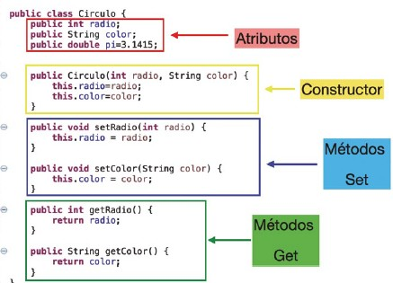

### Métodos

```note
Un **método** es una subrutina cuyo código es definido en una clase y puede pertenecer tanto a una clase, como es el caso de los métodos de clase o estáticos, como a un objeto, como es el caso de los métodos de instancia.
```

Los métodos definen el comportamiento de un objeto, es decir, toda aquella acción que se quiera realizar sobre la clase tiene que estar previamente definida en un método.

-   **getter**: permiten leer el valor de la propiedad. Tienen la estructura:

        public \<TipoPropiedad\> get\<NombrePropiedad\>( )

-   **setter**: permiten establecer el valor de la propiedad. Tiene la estructura:

        public void set\<NombrePropiedad\>(\<TipoPropiedad\> valor)

### Componente

Para que una clase sea considerada un **componente** debe cumplir ciertas normas:

-   Debe poder **modificarse** para adaptarse a la aplicación en la que se integra.
-   Debe tener **persistencia**, es decir, debe poder guardar el estado de sus propiedades cuando han sido modificadas.
-   Debe tener **introspección**, es decir, debe permitir a un IDE que pueda reconocer ciertos elementos de diseño como los nombres de las funciones miembros o métodos y definiciones de las clases, y devolver esa información.
-   Debe poder gestionar **eventos**.

    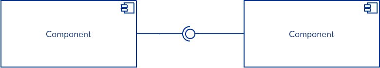

## Programación de eventos

```note
💡 Los **eventos** son acciones o sucesos que se generan en aplicaciones gráficas definidas en los componentes y ocasionado por los usuarios, como presionar un botón, ingresar un texto, cambiar de color, etc.
```

-   Los eventos le corresponden a las interacciones del usuario con los componentes
-   Los componentes están asociados a distintos tipos de eventos
-   Un evento será un objeto que representa un mensaje asíncrono que tiene otro objeto como destinatario

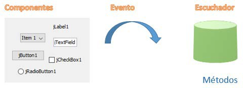

Para poder crear una conexión entre dos o más ventanas, en primer lugar, es necesario crearlas. El paso de una ventana a otra se produce tras la ocurrencia de un **evento**, como por ejemplo la pulsación sobre un botón.

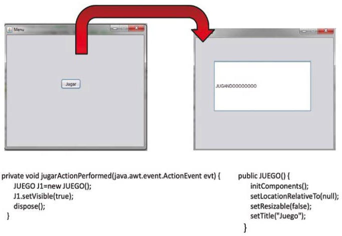

Tras la creación de las ventanas se sitúan los botones de conexión y se modifican sus propiedades de apariencia. Este elemento puede situarse dentro de un *layout*.

Para crear el evento escuchador asociado a este botón basta con hacer doble *clic* sobre él y de forma automática se generará el siguiente código en la clase de la ventana de la interfaz donde estamos implementando el botón conector.

Para que el componente pueda reconocer el **evento** y responder ante el tendrás que hacer lo siguiente:

-   Crear una clase para los eventos que se lancen.
-   Definir una interfaz que represente el oyente (**listener**) asociado al evento. Debe incluir una operación para el procesamiento del evento.
-   Definir dos operaciones, para añadir y eliminar oyentes.

    Si queremos tener más de un oyente para el evento tendremos que almacenar internamente estos oyentes en una estructura de datos como *ArrayList* o *LinkedList*.

-   Finalmente, recorrer la estructura de datos interna llamando a la operación de procesamiento del evento de todos los oyentes registrados.

## Introspección y reflexión

La **introspección** es una característica que permite a las herramientas de programación visual arrastrar y soltar un componente en la zona de diseño de una aplicación y determinar dinámicamente qué métodos de interfaz, propiedades y eventos del componente están disponibles.

Esto se puede conseguir de diferentes formas, pero en el nivel más bajo se encuentra una característica denominada **reflexión**, que busca aquellos métodos definidos como públicos que empiezan por get o set, es decir, se basa en el uso de **patrones de diseño**, o sea, en establecer reglas en la construcción de la clase de forma que mediante el uso de una nomenclatura específica se permita a la herramienta encontrar la interfaz de un componente.

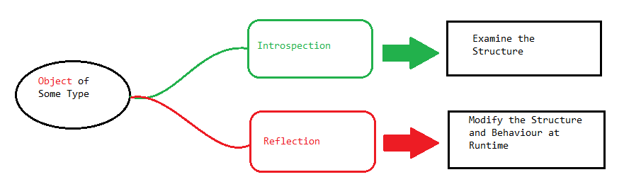

## Empaquetado de componentes

```note
El empaquetado de componentes y aplicaciones consiste en proporcionar las aplicaciones o sus componentes en forma de paquetes. Estos paquetes están formados por los programas ejecutables de la aplicación, así como por las bibliotecas de las que depende y otros tipos de ficheros (como imágenes, traducciones, etc.), 
```

Tras realizar el empaquetado de aplicaciones es necesario que las aplicaciones puedan ser instaladas de una manera rápida y sencilla, para lo que se cuenta con los instaladores o paquetes autoinstalables.

Una vez creado un componente, se puede empaquetar para poder distribuirlo y reutilizarlo después. En el caso de aplicaciones en Java será necesario crear un paquete **jar** que empaqueta en formato ZIP todas las clases que forman el componente:

-   El propio componente
-   Objetos Customizer
-   Clases de utilidad o recursos que requiera el componente, etc.

El paquete jar debe incluir un fichero de manifiesto (con extensión .MF) que describa su contenido, por ejemplo:

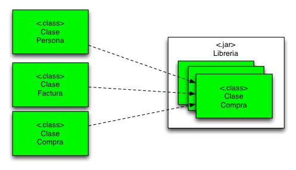

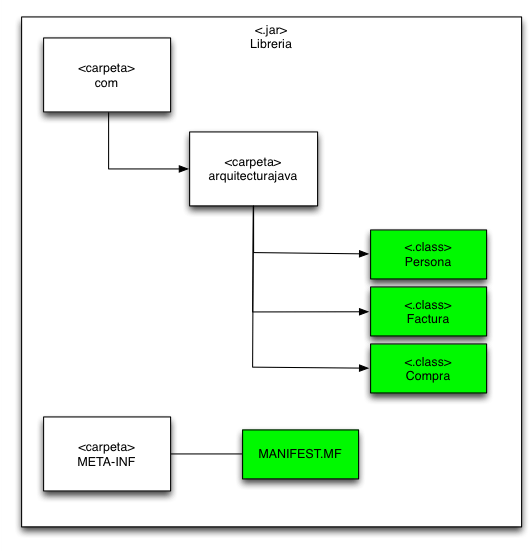


### Metodologías de desarrollo ágil

```note
La **metodología de desarrollo ágil** es un enfoque de desarrollo de software que se basa en principios y valores que promueven la flexibilidad, la colaboración, la adaptabilidad y la entrega continua de software de alta calidad. 
```

Este enfoque se ha convertido en una alternativa popular a los métodos de desarrollo de software más tradicionales que se usaban hasta hace no tanto.


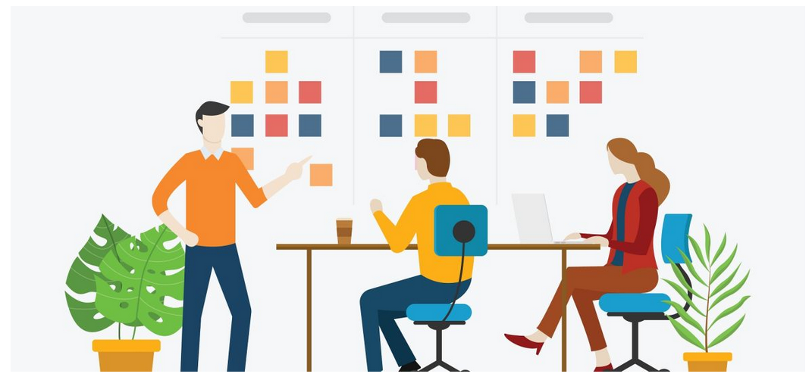


Se basa en varios pilares fundamentales:
- **Entrega incremental**: En lugar de esperar hasta que todo el software esté completo, el desarrollo ágil se basa en la entrega de incrementos de funcionalidad en intervalos cortos y regulares, conocidos como iteraciones o sprints.
- La **colaboración con el cliente** debe estar por encima de la negociación de contratos. El contrato fijará los términos del acuerdo, pero lo realmente importante es trabajar de forma cerca y flexible con el cliente.
- Se debe responder al **cambio constante**, en vez de seguir un plan estático. El cambio continuo es inevitable y se debe responder de forma cercana y flexible.
- El software de trabajo y los equipos están por encima de la documentación exaustiva. Documentar es importante, pero el objetivo es desarrollar software y cuidar el talento.
- Ritmo constante y **mejora continua**: Los equipos ágiles trabajan en ciclos regulares, como sprints de dos a cuatro semanas. Después de cada iteración, se realiza una retrospectiva para evaluar lo que funcionó bien y lo que no.

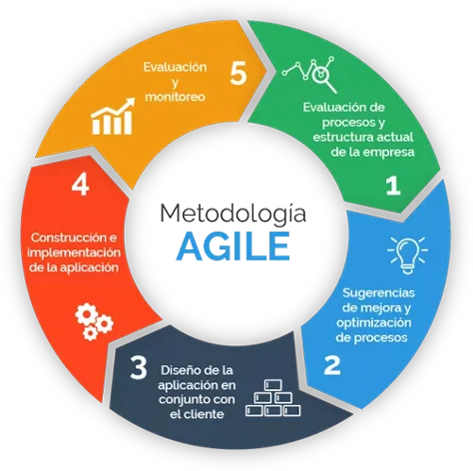

#### Scrum

Scrum es un proceso en el que se aplican de manera regular un conjunto de buenas prácticas para trabajar colaborativamente, en equipo, y obtener el mejor resultado posible de un proyecto. La metodología scrum consiste en abordar cualquier proyecto dividiéndolo en sprints o partes más pequeñas y abordarlo mediante unos **roles** específicos y sistema de asignación de tareas.

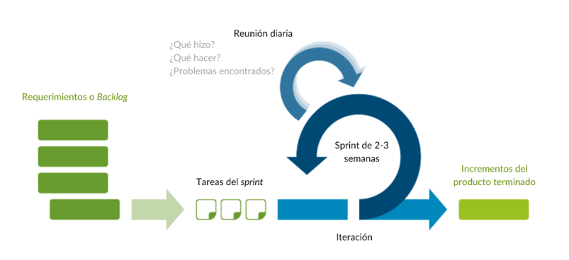

Existen varias implementaciones de sistemas para gestionar el proceso de Scrum, que van desde notas amarillas "post-it" y pizarras hasta paquetes de software. Si se utiliza una pizarra con notas cualquier miembro del equipo podrá ver tres columnas: trabajo pendiente ("To Do"), tareas en curso ("in progress") y hecho ("Done"). De un solo vistazo, una persona puede ver en qué están trabajando los demás en un momento determinado.

##### Roles principales

- Propietario del producto: Perfil del cliente ligado al proyecto, que actúa como su altavoz. Encargado de garantizar que el proyecto sigue los objetivos marcados en todo momento.
- Scrum Master (facilitador) Es el responsable del cumplimiento de las reglas del marco scrum. Se asegura que estas son entendidas por la organización y de que se realiza el trabajo conforme a ellas. Elimina los obstáculos que impiden que se desarrolle el objetivo del sprint.  
- Equipo de Desarrolladores: Cada uno de los profesionales que realizan la entrega del incremento de producto. Es recomendable un equipo de 3 a 9 personas.  

###### Eventos

- Sprint: período de tiempo, generalmente de 2 a 4 semanas, durante el cual el equipo trabaja en la implementación de los elementos de trabajo del backlog.
- Reunión de Planificación del Sprint: Al comienzo del sprint, el equipo se reúne con el Product Owner para seleccionar los elementos de trabajo del backlog que se abordarán durante el Sprint y crear un plan para completarlos.
- Reuniones Diarias (Scrum Diario): El equipo se reúne diariamente durante el Sprint para compartir el progreso e identificar obstáculos.
- Revisión del Sprint: Al final de cada Sprint, el equipo demuestra el trabajo completado al Product Owner y otras partes interesadas para obtener retroalimentación.
- Restrospectiva: analizar futuras mejoras.

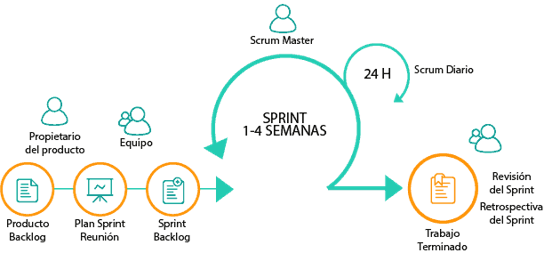


### Metodología Clean code

La metodología **Clean Code** es una filosofía que refiere a un conjunto de principios y prácticas de programación que tienen como objetivo producir un código fuente claro, legible, estructurado y de fácil mantenimiento. 
Clean Code se enfoca en mejorar la calidad del código y hacerlo más comprensible para los desarrolladores y otros miembros del equipo.
Sus principios generales son los siguientes:
- La secuencia de ejecución del programa tiene una lógica y una estructura lo más sencilla posible
- La relación entre las diferentes partes del código es claramente visible.
- La tarea o función de cada clase, función, método y variable es comprensible a primera vista.
    - Las clases y métodos son reducidos: tienen una única y clara tarea.
    - Los nombres de las clases y métodos son auto-identificativos de su función.

#### Evitar repeticiones (DRY) 

De acuerdo con el principio *DRY (Don’t Repeat Yourself)*, cada función debe tener una representación única y, por lo tanto, inequívoca dentro del sistema general .
Ejemplo código redundante y repetido:

```java
//Variante A
let username = getUserName();
let password= getPassword();
let user = { username, password};
client.post(user).then(/*Variante A*/);

//Variante B
let username = getUserName();
let password= getPassword();
let user = { username, password};
client.get(user).then(/*Variante B*/);
```

Usando el principio DRY quedaría de la siguiente forma:

```java
function getUser(){
  return {
    user:getUserName();
    password:getPassword();
  }
}

//Variante A
client.post(getUser()).then(/*Variante A*/ );

//Variante B
client.get(getUser()).then(/*Variante B*/);
```

#### Código legible

El código no solo debe funcionar y ser interpretado por la máquina que lo ejecuta, sino que también **debe ser comprensible para otros desarrolladores**, especialmente si se trabaja en proyectos colaborativos. Por lo tanto, en el ámbito del desarrollo de software, la legibilidad del código siempre es más importante que su concisión. 
Un buen ejemplo de creación de código legible es siempre  nombrar las variables.

Por ejemplo, en lugar de usar la siguiente declaración:
```java
int d;
```
Usar una en la que se identifique el uso de la variable:
```java
int dias_fecha;
```

## Patrones de diseño

Los **patrones de diseño de software**, también llamados **arquitectura de software** son la guía o patrón que vamos a utilizar en el desarrollo de nuestro programa.

Los patrones de diseño son soluciones habituales a problemas que ocurren con frecuencia en el diseño de software. Son como planos prefabricados que se pueden personalizar para resolver un problema de diseño recurrente en el código.

A menudo los patrones se confunden con **algoritmos** porque ambos conceptos describen soluciones típicas a problemas conocidos. Mientras que un algoritmo siempre define un grupo claro de acciones para lograr un objetivo, un patrón es una descripción de más alto nivel de una solución. El código del mismo patrón aplicado a dos programas distintos puede ser diferente.

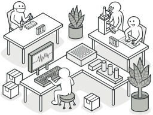


### MVC

```note
El Modelo Vista Controlador (MVC) es un patrón de diseño teórico que separa los **datos** de la aplicación (modelo), la **interfaz** (vista), y la **lógica** de funcionamiento (controlador).
```

-   **Modelo**: Contiene la información de los datos. Es una representación.
-   **Vista**: Es la interfaz de usuario, es decir, con lo que interactúa el usuario.
-   **Controlador**: es la conexión entre el modelo y la vista.

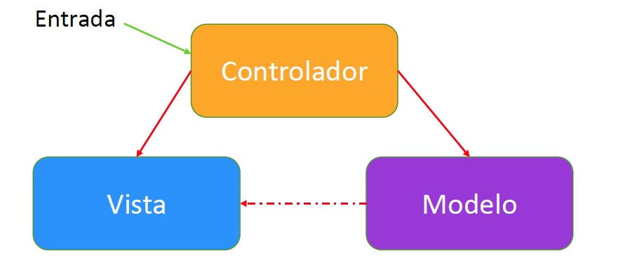

### MVVM

El Modelo Vista Vista-Modelo (MVVM) es parecido al MVC pero en este caso se sustituye al **controlador** por **Vista-Modelo** o Modelo de Vista (*ViewModel*).

A diferencia del MVC, la **vista** tiene una referencia al modelo de vista, pero el **vista-modelo** no sabe nada de la vista. La vista tampoco recibe información del modelo, ya que el vista-modelo hace la función de proveedor de datos.

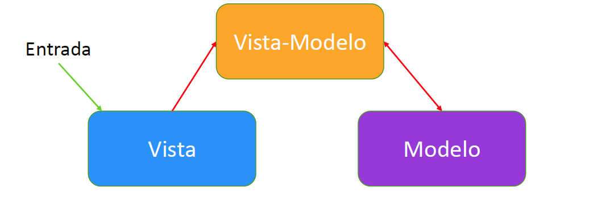
