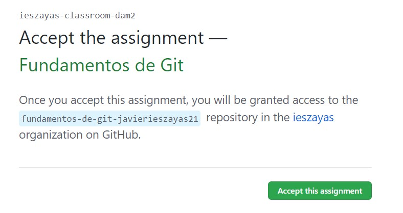
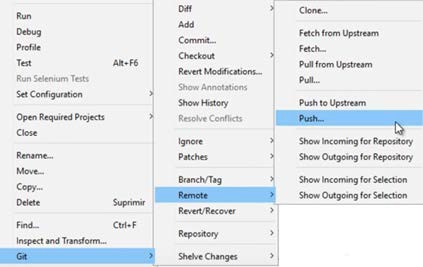
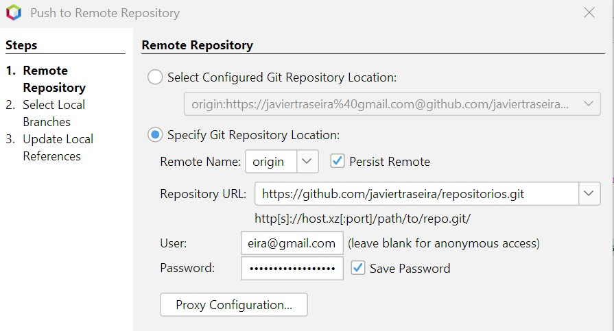
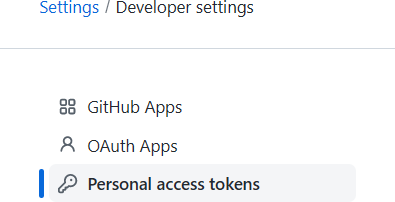

# UT2.1 Repaso POO en Java y conceptos de desarrollo

El desarrollo de **interfaces gráficas** permite la creación del canal de comunicación entre el usuario y la aplicación, por esta razón requiere de especial atención en su diseño.

En la actualidad, las herramientas de desarrollo permiten la implementación del código relativo a una interfaz a través de vistas diseño que facilitan y hacen más intuitivo el proceso de creación. La programación orientada a objetos permite utilizar entidades o componentes que tienen su propia identidad y comportamiento.


En este unidad se verán en detalle los principales tipos de componentes de diferentes librerías así como sus características más importantes.

La distribución de este tipo de elementos depende de los llamados **layout**, los cuales permiten situar los elementos en la interfaz.

Una misma aplicación puede presentar más de un tipo de ventana, principal o de diálogo. Las ventanas de diálogo definen los llamados diálogos modales o no modales, elementos destacados en el desarrollo de interfaces. La combinación de tipos de ventanas y elementos de diseño es infinita.

## Introducción

```tip
Un **componente software** está formado por **clases** creadas para ser reutilizadas y que puede ser manipulada por una herramienta de desarrollo de aplicaciones visual.
```

Se define por su **estado** que se almacena en un conjunto de propiedades, las cuales pueden ser modificadas para adaptar el componente al programa en el que se inserte. También tiene un comportamiento que se define por los **eventos** ante los que responde y los **métodos** que ejecuta ante dichos eventos.

Un subconjunto de los atributos y los métodos forman la **interfaz** del componente.

Para que pueda ser distribuida se **empaqueta** con todo lo necesario para su correcto funcionamiento, quedando independiente de otras bibliotecas o componentes.


## Programación Orientada a Objetos (POO)

En POO los objetos son entidades que tienen un determinado estado, comportamiento (método) e identidad:

-   El **estado** está compuesto de datos o informaciones, será uno o varios atributos a los que se habrán asignado unos valores concretos (datos).
-   El **comportamiento** está definido por los métodos o mensajes a los que sabe responder dicho objeto, es decir, qué operaciones se pueden realizar con él.
-   La **identidad** es una propiedad de un objeto que lo diferencia del resto, dicho con otras palabras, es su identificador (concepto análogo al de identificador de una variable o una constante).

 💡 La definición o instanciación de un objeto, con sus propiedades y comportamiento se lleva a cabo a través de las **clases**.

 💡 A su vez, los objetos disponen de mecanismos de interacción llamados **métodos**, que favorecen la comunicación entre ellos.

## Características de la POO

### Abstracción

```note
La **abstracción** es un procedimiento que permite la elección de una determinada entidad de la realidad, sus características y funciones que desempeñan, la cual es representada mediante clases que contienen atributos y métodos de dicha clase.
```


### Encapsulamiento

 💡 En POO, se acostumbra a proteger la información o el estado de los atributos para que no se pueda ver o modificar la información del objeto sin el mecanismo adecuado.

Para ello, se utilizan métodos para recuperar la información (**getters**) y a su vez, poder asignar (**setters**) un nuevo valor y verificar que no afecte la integridad del objeto.


### Herencia

```note
 💡 La **herencia** es un mecanismo que permite la definición de una clase a partir de la definición de otra ya existente.
```

Conceptos importantes:

-   **Superclase**: la clase cuyas características se heredan se conoce como superclase (o una clase base o una clase principal).
-   **Subclase**: la clase que hereda la otra clase se conoce como subclase (o una clase derivada, clase extendida o clase hija). La subclase puede agregar sus propios campos y métodos, además de los campos y métodos de la superclase.
-   **Reutilización**: la herencia respalda el concepto de reutilización, es decir, cuando queremos crear una clase nueva y ya hay una clase que incluye parte del código que queremos, podemos derivar nuestra nueva clase de la clase existente. Al hacer esto, estamos reutilizando los campos/atributos y métodos de la clase existente.

****

La clase Laptop sigue siendo una computadora, tiene todos sus atributos y métodos, pero agrega dos **atributos** y un método a la definición original, de lo que se conoce como **superclase**

## Polimorfismo

```note
El **polimorfismo** es la capacidad que tienen los objetos de una clase en ofrecer respuesta distinta e independiente en función de los parámetros usados durante su invocación.
```


## Conceptos de POO

### Clases

```note
 💡 Una **clase** representa un conjunto de objetos que comparten una misma estructura (atributos) y comportamiento (métodos).
```

A partir de una clase se podrán instanciar tantos objetos correspondientes a una misma clase como se quieran. Para ello se utilizan los **constructores**.

Para llevar a cabo la **instanciación** de una clase y así crear un nuevo objeto, se utiliza el nombre de la clase seguido de paréntesis. Un constructor es sintácticamente muy semejante a un método.

El **constructor** de una clase puede recibir argumentos, de esta forma podrá crearse más de un constructor, en función del número de argumentos que se indiquen en su definición. Aunque el constructor no haya sido definido explícitamente, en Java siempre existe un constructor por defecto que posee el nombre de la clase y no recibe ningún argumento.

### Atributos

```note
Un **objeto** es una unidad dentro de un programa que tiene un estado, y un comportamiento.
```

La información contenida en el objeto será accesible solo a través de la ejecución de los **métodos** adecuados, creándose una interfaz para la comunicación con el mundo exterior.

Los **atributos** o propiedades definen las características del objeto. Por ejemplo, si se tiene una clase círculo, sus atributos podrían ser el radio y el color, estos constituyen la estructura del objeto, que posteriormente podrá ser modelada a través de los métodos oportunos.

La estructura de una clase en Java quedaría formada por los siguientes bloques, de manera general: **atributos, constructor y métodos.**


### Métodos

```note
Un **método** es una subrutina cuyo código es definido en una clase y puede pertenecer tanto a una clase, como es el caso de los métodos de clase o estáticos, como a un objeto, como es el caso de los métodos de instancia.
```

Los métodos definen el comportamiento de un objeto, es decir, toda aquella acción que se quiera realizar sobre la clase tiene que estar previamente definida en un método.

-   **getter**: permiten leer el valor de la propiedad. Tienen la estructura:

        public \<TipoPropiedad\> get\<NombrePropiedad\>( )

-   **setter**: permiten establecer el valor de la propiedad. Tiene la estructura:

        public void set\<NombrePropiedad\>(\<TipoPropiedad\> valor)

### Componente

Para que una clase sea considerada un **componente** debe cumplir ciertas normas:

-   Debe poder **modificarse** para adaptarse a la aplicación en la que se integra.
-   Debe tener **persistencia**, es decir, debe poder guardar el estado de sus propiedades cuando han sido modificadas.
-   Debe tener **introspección**, es decir, debe permitir a un IDE que pueda reconocer ciertos elementos de diseño como los nombres de las funciones miembros o métodos y definiciones de las clases, y devolver esa información.
-   Debe poder gestionar **eventos**.

    

## Programación de eventos

```note
 💡 Los **eventos** son acciones o sucesos que se generan en aplicaciones gráficas definidas en los componentes y ocasionado por los usuarios, como presionar un botón, ingresar un texto, cambiar de color, etc.
```

-   Los eventos le corresponden a las interacciones del usuario con los componentes
-   Los componentes están asociados a distintos tipos de eventos
-   Un evento será un objeto que representa un mensaje asíncrono que tiene otro objeto como destinatario


Para poder crear una conexión entre dos o más ventanas, en primer lugar, es necesario crearlas. El paso de una ventana a otra se produce tras la ocurrencia de un **evento**, como por ejemplo la pulsación sobre un botón.


Tras la creación de las ventanas se sitúan los botones de conexión y se modifican sus propiedades de apariencia. Este elemento puede situarse dentro de un *layout*.

Para crear el evento escuchador asociado a este botón basta con hacer doble *clic* sobre él y de forma automática se generará el siguiente código en la clase de la ventana de la interfaz donde estamos implementando el botón conector.

Para que el componente pueda reconocer el **evento** y responder ante el tendrás que hacer lo siguiente:

-   Crear una clase para los eventos que se lancen.
-   Definir una interfaz que represente el oyente (**listener**) asociado al evento. Debe incluir una operación para el procesamiento del evento.
-   Definir dos operaciones, para añadir y eliminar oyentes.

    Si queremos tener más de un oyente para el evento tendremos que almacenar internamente estos oyentes en una estructura de datos como *ArrayList* o *LinkedList*.

-   Finalmente, recorrer la estructura de datos interna llamando a la operación de procesamiento del evento de todos los oyentes registrados.

## Introspección y reflexión

La **introspección** es una característica que permite a las herramientas de programación visual arrastrar y soltar un componente en la zona de diseño de una aplicación y determinar dinámicamente qué métodos de interfaz, propiedades y eventos del componente están disponibles.

Esto se puede conseguir de diferentes formas, pero en el nivel más bajo se encuentra una característica denominada **reflexión**, que busca aquellos métodos definidos como públicos que empiezan por get o set, es decir, se basa en el uso de **patrones de diseño**, o sea, en establecer reglas en la construcción de la clase de forma que mediante el uso de una nomenclatura específica se permita a la herramienta encontrar la interfaz de un componente.


## Empaquetado de componentes

Una vez creado un componente, se puede empaquetar para poder distribuirlo y reutilizarlo después. Para ello se necesitará el paquete **jar** que empaqueta en formato ZIP todas las clases que forman el componente:

-   El propio componente
    -   Objetos Customizer
    -   Clases de utilidad o recursos que requiera el componente, etc.


El paquete jar debe incluir un fichero de manifiesto (con extensión .MF) que describa su contenido, por ejemplo:

## Patrones de diseño

Los **patrones de diseño de software**, también llamados **arquitectura de software** son la guía o patrón que vamos a utilizar en el desarrollo de nuestro programa.

Los patrones de diseño son soluciones habituales a problemas que ocurren con frecuencia en el diseño de software. Son como planos prefabricados que se pueden personalizar para resolver un problema de diseño recurrente en el código.

A menudo los patrones se confunden con **algoritmos** porque ambos conceptos describen soluciones típicas a problemas conocidos. Mientras que un algoritmo siempre define un grupo claro de acciones para lograr un objetivo, un patrón es una descripción de más alto nivel de una solución. El código del mismo patrón aplicado a dos programas distintos puede ser diferente.


### MVC

```note
El Modelo Vista Controlador (MVC) es un patrón de diseño teórico que separa los **datos** de la aplicación (modelo), la **interfaz** (vista), y la **lógica** de funcionamiento (controlador).
```

-   **Modelo**: Contiene la información de los datos. Es una representación.
-   **Vista**: Es la interfaz de usuario, es decir, con lo que interactúa el usuario.
-   **Controlador**: es la conexión entre el modelo y la vista.


### MVVM

El Modelo Vista Vista-Modelo (MVVM) es parecido al MVC pero en este caso se sustituye al **controlador** por **Vista-Modelo** o Modelo de Vista (*ViewModel*).

A diferencia del MVC, la **vista** tiene una referencia al modelo de vista, pero el **vista- modelo** no sabe nada de la vista. La vista tampoco recibe información del modelo, ya que el vista-modelo hace la función de proveedor de datos.


## Herramientas de construcción de proyectos

**Ant**, **Maven**, y **Gradle** son herramientas de automatización en la construcción de proyectos y básicamente se emplean para compilar proyectos. No son compatibles entre sí y de su elección depende el desarrollo inicial de nuestro proyecto.


Una **dependencia** es una aplicación o una biblioteca requerida por otro programa para poder funcionar correctamente.

Las dependencias en Java se pueden gestionar de la siguiente forma:

-   Descargar el archivo jar de la biblioteca requerida manualmente desde Internet y añadirlo a nuestro proyecto.
    -   Escribir un script que descargará automáticamente la biblioteca de una fuente externa a través de la red.

Al ser una tarea pesada, pronto aparecieron **herramienta de gestión de dependencias,** las cuales resuelven y gestionan las dependencias que requiera nuestra aplicación.

Las **herramientas de construcción** automatizan la creación de aplicaciones ejecutables a partir del código fuente. La construcción incorpora la compilación, el enlace y el empaquetado del código en una forma utilizable o ejecutable.

### Ant

Apache Ant es una herramienta de línea de comandos basada en Java que utiliza archivos XML para definir scripts de compilación. Se usa principalmente para compilaciones de Java, pero también se puede usar para el desarrollo de C / C ++. 

Ejemplo del fichero build.xml para la clase principal de holamundo:

        <project>
        <target name="clean">
            <deletedir="classes" />
        </target>
        <target name="compile" depends="clean">
            <mkdirdir="classes" />
            <javacsrcdir="src" destdir="classes" />
        </target>
        <target name="jar" depends="compile">
        <mkdirdir="jar" />
        <jardestfile="jar/HelloWorld.jar" basedir="classes">
            <manifest>
                <attributename="Main-Class"
                value="antExample.HelloWorld" />
            </manifest>
        </jar>
        </target>
        <target name="run" depends="jar">
            <java jar="jar/HelloWorld.jar" fork="true" />
        </target>
        </project>


### Maven

Maven fue desarrollado para resolver los problemas que enfrentan los scripts basados ​​en Ant e introdujo la **gestión automática de dependencias**, facilitando en gran manera el desarrollo. Además, la estructura de proyectos está estandarizada.

Ejemplo del fichero pom.xml de la clase principal de holamundo del ejemplo anterior:

        <projectxmlns="http://maven.apache.org/POM/4.0.0"
        xmlns:xsi="http://www.w3.org/2001/XMLSchema-instance"
        xsi:schemaLocation="http://maven.apache.org/POM/4.0.0
        http://maven.apache.org/xsd/maven-4.0.0.xsd">
        <modelVersion>4.0.0</modelVersion>
        <groupId>baeldung</groupId>
        <artifactId>mavenExample</artifactId>
        <version>0.0.1-SNAPSHOT</version>
        <description>Mavenexample</description>

        <dependencies>
        <dependency>
            <groupId>junit</groupId>
            <artifactId>junit</artifactId>
            <version>4.12</version>
            <scope>test</scope>
        </dependency>
        </dependencies>
        </project>

### Gradle

Gradle combina el poder de Ant y Maven. La primera versión de Gradle se lanzó en 2012. Se está adoptando rápidamente. Google lo está usando actualmente para el sistema operativo Android.

En lugar de XML, Gradle usa el lenguaje Groovy. Como resultado, las secuencias de comandos de compilación en Gradle son más fáciles de escribir y leer.

Ejemplo del fichero build.gradle de la clase principal de holamundo del ejemplo:

        applyplugin: 'java'
        repositories{
            mavenCentral()
        }
        jar{
            baseName= 'gradleExample'
            version= '0.0.1-SNAPSHOT'
        }
        dependencies{
        testImpl    ementation'junit:junit:4.12'
        }

## Github Classroom

Acceder con la dirección especificada por el profesor y desde ahí a la tarea que se especifique con las instrucciones de desarrollo requeridas:



**Comandos git**


### Integración con Netbeans

Una vez abierto el proyecto en Netbeans habrá que inicializarlo haciendo clic en

\*Versioning\>\***Initialize Git Repository** y dejar la ruta donde está alojado el proyecto.


A continuación se hará un **Commit** del proyecto actual en *git\>Commit* y se le dará una descripción. El *Commit* guardará los datos en el repositorio local antes de actualizarse.




Para guardar los cambios en el repositorio remoto de Github habrá que hacer un **push**. Para ello ir a *Git\>Remote\>push* e introducir nuestras credenciales de Github en *Specify Git Repository Location*.





Desde el año pasado es necesario generar un **token de acceso personal** en lugar de contraseña. Para ello habrá que acceder a *Github.com\>settings\>Developer Settings* y en *Personal access tokens*

## Netbeans

 💡 Los **debugger** son herramientas imprescindibles en la programación, sin las cuales sería muy complicado detectar cualquier problema, desde un mínimo error de síntesis perdido en cientos de rutinas hasta escribir por equivocación un código que genere un bucle infinito para ciertas casuísticas.


| **Step Over (F8)**              | Ejecuta una línea de código. Si la instrucción es una llamada a un método, ejecuta el método sin entrar dentro del código del método.                                                                                          |
|---------------------------------|--------------------------------------------------------------------------------------------------------------------------------------------------------------------------------------------------------------------------------|
| Step Over Expression (Mayus+F8) | Ejecuta una llamada de método en una expresión. Si una expresión tiene varias llamadas a métodos, se puede usar para recorrer la expresión y ver el valor de cada llamada a método en la expresión en la ventana de variables. |
| **Step Into (F7)**              | Ejecuta una línea de código. Si la instrucción es una llamada a un método, salta al método y continúa la ejecución por la primera línea del método.                                                                            |
| Step Out (Ctrl + F7)            | Si la línea de código actual se encuentra dentro de un método, se ejecutarán todas las instrucciones que queden del método y se volverá a la instrucción desde la que se llamó al método.                                      |
| Run to Cursor (F4)              | Se ejecuta el programa hasta la instrucción donde se encuentre el cursor.                                                                                                                                                      |
| Continue (F5)                   | La ejecución del programa continúa hasta el siguiente breakpoint. Si no existe un breakpoint se ejecuta hasta el final.                                                                                                        |
| Finish Debugger                 | Terminar la depuración del programa.                                                                                                                                                                                           |
