# UT2.2 Herramientas de desarrollo y testing

## Herramientas de construcción de proyectos

**Ant**, **Maven**, y **Gradle** son herramientas de automatización en la construcción de proyectos y básicamente se emplean para compilar proyectos. No son compatibles entre sí y de su elección depende el desarrollo inicial de nuestro proyecto.

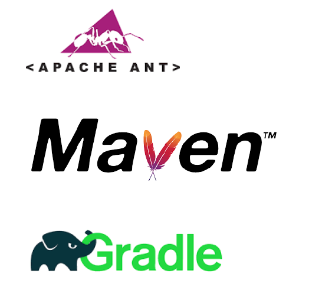

```note
Una **dependencia** es una aplicación o una biblioteca requerida por otro programa para poder funcionar correctamente.
```

Las dependencias en Java se pueden gestionar de la siguiente forma:

-   Descargar el archivo jar de la biblioteca requerida manualmente desde Internet y añadirlo a nuestro proyecto.
-   Escribir un script que descargará automáticamente la biblioteca de una fuente externa a través de la red.

Al ser una tarea pesada, pronto aparecieron **herramienta de gestión de dependencias,** las cuales resuelven y gestionan las dependencias que requiera nuestra aplicación.

Las **herramientas de construcción** automatizan la creación de aplicaciones ejecutables a partir del código fuente. La construcción incorpora la compilación, el enlace y el empaquetado del código en una forma utilizable o ejecutable.

### Ant

Apache Ant es una herramienta de línea de comandos basada en Java que utiliza archivos XML para definir scripts de compilación. Se usa principalmente para compilaciones de Java, pero también se puede usar para el desarrollo de C / C ++. 

Ejemplo del fichero *build.xml* para la clase principal de holamundo:

        <project>
        <target name="clean">
            <deletedir="classes" />
        </target>
        <target name="compile" depends="clean">
            <mkdirdir="classes" />
            <javacsrcdir="src" destdir="classes" />
        </target>
        <target name="jar" depends="compile">
        <mkdirdir="jar" />
        <jardestfile="jar/HelloWorld.jar" basedir="classes">
            <manifest>
                <attributename="Main-Class"
                value="antExample.HelloWorld" />
            </manifest>
        </jar>
        </target>
        <target name="run" depends="jar">
            <java jar="jar/HelloWorld.jar" fork="true" />
        </target>
        </project>


### Maven

Maven fue desarrollado para resolver los problemas que enfrentan los scripts basados ​​en Ant e introdujo la **gestión automática de dependencias**, facilitando en gran manera el desarrollo. Además, la estructura de proyectos está estandarizada.

Ejemplo del fichero *pom.xml* de la clase principal de holamundo del ejemplo anterior:

        <projectxmlns="http://maven.apache.org/POM/4.0.0"
        xmlns:xsi="http://www.w3.org/2001/XMLSchema-instance"
        xsi:schemaLocation="http://maven.apache.org/POM/4.0.0
        http://maven.apache.org/xsd/maven-4.0.0.xsd">
        <modelVersion>4.0.0</modelVersion>
        <groupId>baeldung</groupId>
        <artifactId>mavenExample</artifactId>
        <version>0.0.1-SNAPSHOT</version>
        <description>Mavenexample</description>

        <dependencies>
        <dependency>
            <groupId>junit</groupId>
            <artifactId>junit</artifactId>
            <version>4.12</version>
            <scope>test</scope>
        </dependency>
        </dependencies>
        </project>

### Gradle

Gradle combina el poder de Ant y Maven. La primera versión de Gradle se lanzó en 2012. Se está adoptando rápidamente. Google lo está usando actualmente para el sistema operativo Android.

En lugar de XML, Gradle usa el lenguaje Groovy. Como resultado, las secuencias de comandos de compilación en Gradle son más fáciles de escribir y leer.

Ejemplo del fichero *build.gradle* de la clase principal de holamundo del ejemplo:

        applyplugin: 'java'
        repositories{
            mavenCentral()
        }
        jar{
            baseName= 'gradleExample'
            version= '0.0.1-SNAPSHOT'
        }
        dependencies{
        testImpl    ementation'junit:junit:4.12'
        }


### Comparativa

| Herramienta | Época / Contexto | Valor educativo | Cuándo usarla | Ventajas | Limitaciones |
|-------------|------------------|-----------------|---------------|----------|--------------|
| **Ant** | Primeros 2000, primera gran herramienta para Java | Enseña la construcción paso a paso (clean, compile, jar, run) | En proyectos heredados o para entender la base de la automatización | Flexible, scripts explícitos en XML | Sin gestión integrada de dependencias |
| **Maven** | Estándar de facto durante más de una década | Introduce gestión de dependencias y ciclo de vida predefinido | Proyectos medianos/grandes, entornos corporativos | Estandarización, amplio ecosistema, integración con CI/CD | Configuración extensa en XML |
| **Gradle** | Herramienta moderna (popular en Android y microservicios) | Construcciones rápidas y personalizadas, DSL en Groovy/Kotlin | Proyectos actuales que buscan eficiencia y flexibilidad | Builds incrementales, sintaxis compacta, integración moderna | Más compleja de aprender al inicio |


## Repositorios Github

```note
Un repositorio contiene todos los archivos de un proyecto y el historial de revisiones de cada uno de ellos.
```

Github es un portal creado para alojar el código de las aplicaciones de cualquier desarrollador, y que fue comprada por Microsoft en junio del 2018. La plataforma está creada para que los desarrolladores suban el código de sus aplicaciones y herramientas, y que como usuario no sólo puedas descargarte la aplicación, sino también entrar a su perfil para leer sobre ella o colaborar con su desarrollo.


Utiliza el sistema de control de versiones Git diseñado por Linus Torvalds. Con dicho sistema de gestión de versiones los desarrolladores pueden administrar su proyecto, trabajando colaborativamente y gestionar las distintas versiones para evitar confusiones.

### Github classroom

Github classroom es una herramienta específica para el trabajo con estudiantes.

Acceder a Github Clasroom y desde ahí a la tarea que se especifique con las instrucciones de desarrollo requeridas:

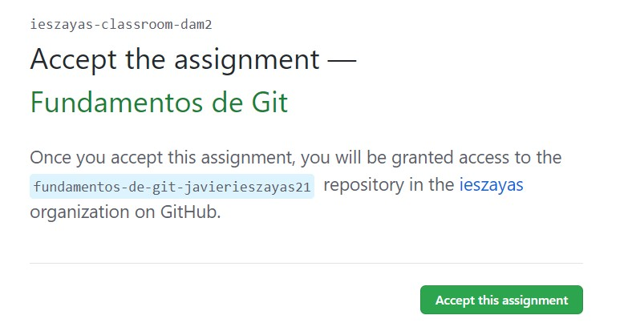


### Comandos git

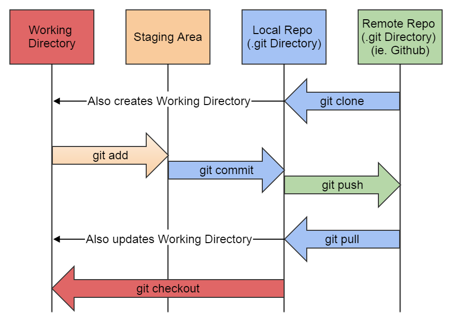

```
git config --global user.name [nombre] # Definir nombre usuario
git config --global user.email [email] # Definir email

git init # Crear un repositorio en la carpeta actual

git clone [url-repository] # Crear un repositorio basado en un repositorio remoto

git add . # Agregar todos los archivos modificados al stage
git reset # Deshacer los cambios locales en el estado de un repositorio de Git.

git commit -m "[description]" # Crear un commit de los archivos en stage, con una descripción breve

git push origin [branch] # Subir al repositorio los cambios de la rama [branch]
git push --force # Ignorar los cambios locales y hacer push
```

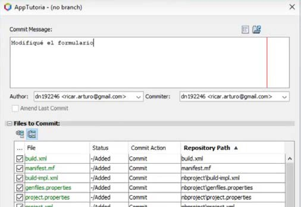

### Clonar y guardar cambios

Utilizar el siguiente comando para clonar un nuevo repositorio:

```
git clone [url-repository]  # Crear un repositorio basado en un repositorio remoto
```

Una vez llevado a cambios en un fichero, se deben de agregar los ficheros modificados:

```
git add .  # Agregar todos los archivos modificados al stage
```

A continuación, para confirmar los cambios se hará un commit:

```
git commit -m "Mensaje describiendo los cambios realizados"
```

### Subir cambios a Github

Para subir los cambios a la rama principal (*main*) del repositorio, usar el comando **push**:

```
git push origin [main] # Subir al repositorio los cambios de la rama [branch]
```
Si queremos *revertir* los cambios deberemos utilizar el comando **reset**, para lo que necesitaremos el commit id que se hizo previamente:

```
git reset --hard <commit-id>
```

### Actualizar cambios desde Github

Para actualizar un repositorio local con los últimos cambios del repositorio remoto hay que utilizar el comando **pull**:

```
git pull origin [branch] # Trae los cambios del repositorio a local
```

### Github desktop

GitHub Desktop es una aplicación gratuita de código abierto que te ayuda a trabajar con código hospedado en GitHub u otros servicios de hospedaje de Git. Con GitHub Desktop, puedes realizar comandos de Git, como confirmar e insertar cambios, en una interfaz gráfica de usuario, en lugar de mediante la línea de comandos. 

Además de Github desktop, es recomendable instalar git para poder utilizar los comandos desde una terminal.

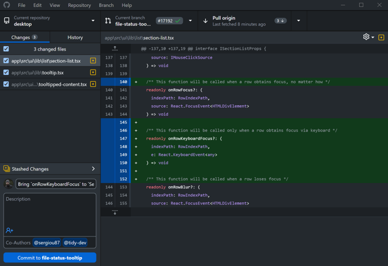


## Proyectos y debugging en Netbeans

💡 Los **debugger** son herramientas imprescindibles en la programación, sin las cuales sería muy complicado detectar cualquier problema, desde un mínimo error de síntesis perdido en cientos de rutinas hasta escribir por equivocación un código que genere un bucle infinito para ciertas casuísticas.

En los desarrollos actuales más del 70% del tiempo se dedica al dieseño del modelo y debugeo continuo, con apenas un 25% del tiempo dedicado al desarrollo de código.

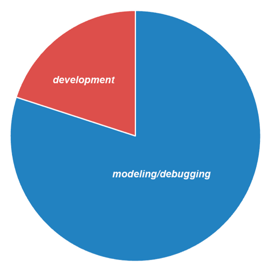

### Debugger


| **Step Over (F8)**              | Ejecuta una línea de código. Si la instrucción es una llamada a un método, ejecuta el método sin entrar dentro del código del método.                                                                                          |
|---------------------------------|--------------------------------------------------------------------------------------------------------------------------------------------------------------------------------------------------------------------------------|
| Step Over Expression (Mayus+F8) | Ejecuta una llamada de método en una expresión. Si una expresión tiene varias llamadas a métodos, se puede usar para recorrer la expresión y ver el valor de cada llamada a método en la expresión en la ventana de variables. |
| **Step Into (F7)**              | Ejecuta una línea de código. Si la instrucción es una llamada a un método, salta al método y continúa la ejecución por la primera línea del método.                                                                            |
| Step Out (Ctrl + F7)            | Si la línea de código actual se encuentra dentro de un método, se ejecutarán todas las instrucciones que queden del método y se volverá a la instrucción desde la que se llamó al método.                                      |
| Run to Cursor (F4)              | Se ejecuta el programa hasta la instrucción donde se encuentre el cursor.                                                                                                                                                      |
| Continue (F5)                   | La ejecución del programa continúa hasta el siguiente breakpoint. Si no existe un breakpoint se ejecuta hasta el final.                                                                                                        |
| Finish Debugger                 | Terminar la depuración del programa.                                                                                                                                                                                           |

### Proyectos

Principales carpetas de un proyecto Java creado en Netbeans:
- Carpeta **src** contiene los archivos fuente codificados para este trabajo en lenguaje Java (extensión .java). Dichos archivos se encuentran distribuidos en carpetas, o paquetes en notación de Java. Además de los archivos fuente, se incluyen imágenes (archivos con extensión .gif) y otros ficheros de texto utilizados.
- Carpeta **build** es utilizada por NetBeans para almacenar los archivos objeto resultado de la compilación. Estos archivos tienen extensión .class y contienen la traducción de Java a bytecode o lenguaje que entiende la Máquina Virtual de Java.
-Carpeta **dist** es utilizada por NetBeans para almacenar el archivo con extensión .jar, que no es más que un archivo comprimido en formato ZIP que contiene toda la estructura de archivos de la carpeta build. Este archivo es el que se utiliza para su distribución por Internet.
- Carpeta **dist\javadoc** es utilizada por NetBeans para presentar la documentación de las clases generada como archivos .html a partir de los comentarios incluidos en los .java.
- Carpeta **nbproject** es interna a NetBeans e incluye opciones de compilación y generación de la documentación del proyecto.
- Carpeta **test** se corresponde con la generación de JUnit de Java para pruebas de clases.

## Testing y casos de prueba

Dentro de la metodología agile, el **testing** es una fase crítica en el desarrollo de software que asegura la calidad, funcionalidad y fiabilidad de las aplicaciones antes de su despliegue. 

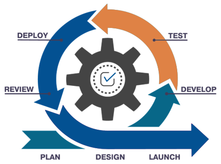

En proyectos desarrollados en Java, especialmente aquellos que incluyen interfaces gráficas, el testing se vuelve aún más esencial debido a la complejidad añadida de la interacción del usuario con la interfaz. Unos de los departamentos más importantes de cualquier empresa de desarrollo es el de Calidad y Testing (QA).


Los beneficios del Testing en Proyectos en Java:

- **Detección temprana de errores**: Identificar errores en las primeras etapas del desarrollo permite corregirlos antes de que se conviertan en problemas costosos.

- Mejora de la **calidad del software**: Asegura que el software cumple con los requisitos funcionales y no funcionales.

- Facilita el **mantenimiento**: Un código bien probado es más fácil de mantener y actualizar, ya que las pruebas existentes pueden validar que las nuevas modificaciones no introducen errores.

- Confianza en el **despliegue**: Proporciona una mayor confianza al equipo de desarrollo y a los clientes de que la aplicación es estable y funciona correctamente en diversos escenarios.

### Casos de prueba

Los **casos de prueba** son específicos escenarios predefinidos que permiten evaluar si diferentes componentes del software funcionan según lo esperado. La implementación de testing y la definición de casos de prueba ayudan a identificar y corregir errores temprano en el ciclo de desarrollo, reduciendo costos y mejorando la experiencia del usuario final.

La **tabla de casos de prueba** que se presenta a continuación es una herramienta esencial para estructurar y organizar las pruebas en un proyecto real. 


| **ID Caso de Prueba** | **Descripción del Caso de Prueba**                      | **Pasos para Reproducir**                                               | **Entrada**                                        | **Salida Esperada**                                          | **Resultado** |
|--------------------------|---------------------------------------------------------|-------------------------------------------------------------------------|----------------------------------------------------|--------------------------------------------------------------|---------------|
| 001                      | Verificación de la carga inicial de la interfaz gráfica | 1. Ejecutar el programa.                                                | N/A                                                | La ventana principal se muestra correctamente.               | OK/No cumple  |
| 002                      | Verificación de los componentes básicos en la ventana   | 1. Ejecutar el programa.                                                | N/A                                                | Todos los componentes (botones, etiquetas, etc.) visibles    | OK/No cumple  |
| 003                      | Comprobación del botón "Aceptar"                        | 1. Ejecutar el programa. 2. Hacer clic en el botón "Aceptar".           | N/A                                                | Muestra un mensaje de confirmación.                          | OK/No cumple  |
| 004                      | Comprobación del botón "Cancelar"                       | 1. Ejecutar el programa. 2. Hacer clic en el botón "Cancelar".          | N/A                                                | Cierra la ventana o limpia los campos.                       | OK/No cumple  |
| 005                      | Verificación de entrada de texto                        | 1. Ejecutar el programa. 2. Ingresar texto en el campo de texto.        | "Texto de prueba"                                  | El texto ingresado se muestra en el campo.                   | OK/No cumple  |
| 006                      | Validación de campos obligatorios                       | 1. Ejecutar el programa. 2. Dejar campos obligatorios vacíos.           | N/A                                                | Muestra un mensaje de error indicando campos vacíos.         | OK/No cumple  |
| 007                      | Comprobación de funcionalidad de menú                   | 1. Ejecutar el programa. 2. Navegar por las opciones del menú.          | N/A                                                | Las opciones del menú realizan las acciones esperadas.       | OK/No cumple  |
| 008                      | Manejo de errores en la entrada de datos                | 1. Ejecutar el programa. 2. Ingresar datos incorrectos.                 | Datos no válidos (p.ej., letras en campo numérico) | Muestra un mensaje de error adecuado.                        | OK/No cumple  |
| 009                      | Comprobación de cierre de la aplicación                 | 1. Ejecutar el programa. 2. Cerrar la ventana.                          | N/A                                                | La aplicación se cierra correctamente.                       | OK/No cumple  |
| 010                      | Verificación de la funcionalidad de guardar             | 1. Ejecutar el programa. 2. Ingresar datos. 3. Hacer clic en "Guardar". | Datos válidos                                      | Los datos se guardan correctamente.                          | OK/No cumple  |
| 011                      | Verificación de la funcionalidad de cargar datos        | 1. Ejecutar el programa. 2. Hacer clic en "Cargar".                     | N/A                                                | Los datos se cargan correctamente.                           | OK/No cumple  |
| 012                      | Prueba de redimensionamiento de la ventana              | 1. Ejecutar el programa. 2. Redimensionar la ventana.                   | N/A                                                | La interfaz se ajusta correctamente al tamaño de la ventana. | OK/No cumple  |

## Markdown

```note
Markdown es un lenguaje de marcado ligero y sencillo que se utiliza para dar formato a texto en la web. Fue creado por John Gruber en 2004, con el objetivo de ser fácil de leer y escribir, y de convertir a HTML de manera sencilla.
```

Markdown es ampliamente utilizado en plataformas como GitHub, foros, blogs, y la mayoría de sistemas de documentación.


Las principales características de Markdown son las siguientes:

-   Simplicidad: El texto en Markdown es fácil de leer, incluso en su formato sin procesar.
    -   Portabilidad: Los archivos de texto en Markdown pueden ser convertidos a otros formatos como HTML, PDF, DOCX, entre otros.
    -   Enfocado en el contenido: Markdown permite a los autores centrarse en el contenido, ya que la sintaxis es mínima y no intrusiva.


### Sintaxis de Markdown

La sintaxis de markdown es muy sencilla:

| **Elemento**       | **Sintaxis**                         | **Ejemplo**                                       |
|--------------------|--------------------------------------|---------------------------------------------------|
|  Cabecera          | \# H1 \#\# H2 \#\#\# H3              |   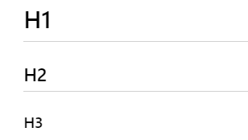                                                |
| Negrita            | \*\*texto en negrita\*\*             |                                                   |
| Cursiva            | \*texto en cursiva\*                 |                                                   |
| Citas              | \> blockquote                        |                                                   |
|  Lista ordenada    | Primer item Segundo item Tercer item |   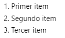                                           |
|  Lista desordenada | Primer item Segundo item Tercer item |   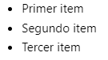                                             |
|  Código            |  \`línea de código\`                 |    |

| **Elemento**      | **Sintaxis**                                                                                       | **Ejemplo**                                      |
|-------------------|----------------------------------------------------------------------------------------------------|--------------------------------------------------|
|  Líneas de código | \`\`\`java int lang="es"; Objeto obj = new Objeto(); \`\`\`                                        |  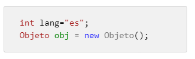 |
| Línea horizontal  | ---                                                                                                |   |
| Enlace            | [enlace](https://www.example.com)                                                                  |   |
| Imagen            |                                                                             |                                                  |
|  Tabla            | \| Sintaxis \| Descripción \| \| ----------- \| \| \| Cabecera \| Titulo \| \| Párrafo \| Texto \| | 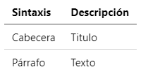  |
|  Lista de tareas  | [x] Realizar commit [ ] Actualizar website [ ] Cargar medios                                       |  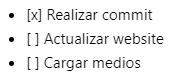 |
