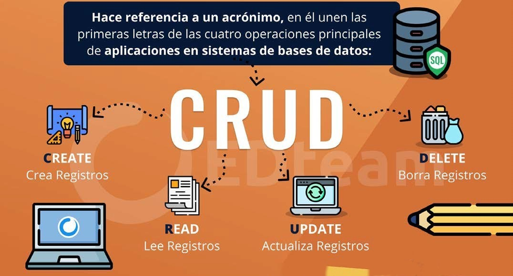
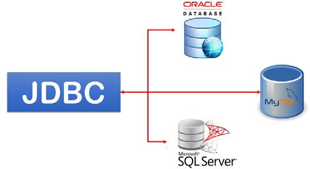
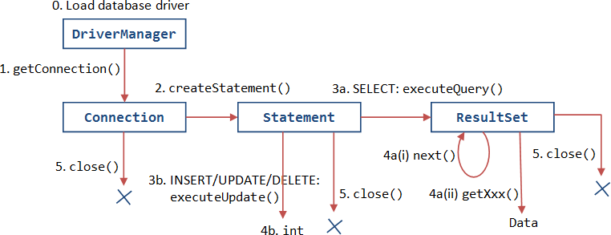
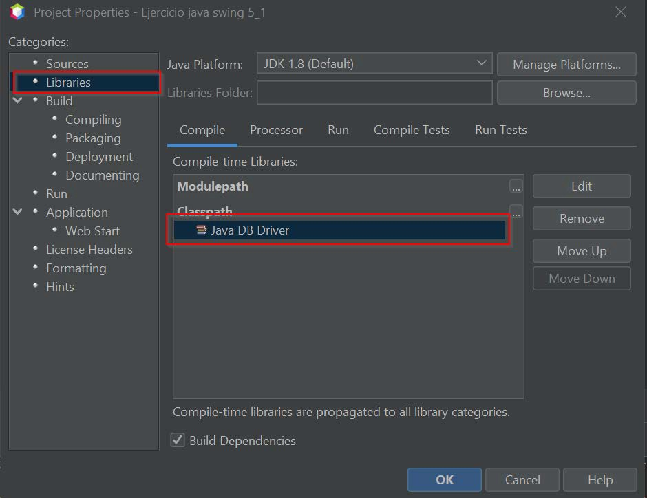

# UT2.3 Conexión a datos mediante JDBC

## CRUD

```note
**CRUD** es un término utilizado en sistemas de Bases de datos y programación, referido a sus operaciones principales; **C**reate, **R**ead, **U**pdate y **D**elete.
```



# JDBC

## JDBC

```note
Java Database Controller (**JDBC**) es una API que implementa un conjunto de interfaces, las que permiten a una aplicación java interactuar con una base de datos, como por ejemplo abrir una conexión, enviar comandos SQL y recibir información devuelta desde la base de datos.
```

Con JDBC tenemos una interfaz para conectarnos con una base de datos sin tener que preocuparnos de si es una base de datos MySQl, Derby, Oracle, SQLServer o cualquier otro tipo de base de datos.

El único cambio que habría que hacer para cambiar el tipo de base de datos de una aplicación sería cambiar el **driver** especifico de la base de datos en cuestión.

JDBC ofrece el paquete java.sql, en el que existen **clases** muy útiles para trabajar con bases de datos.

| **Clase**         | **Descripción**                                                                                                    |
|-------------------|--------------------------------------------------------------------------------------------------------------------|
| DriverManager     | Para cargar un driver                                                                                              |
| Connection        | Para establecer conexiones con las bases de datos                                                                  |
| Statement         | Para ejecutar sentencias SQL y enviarlas a las BBDD                                                                |
| PreparedStatement | La ruta de ejecución está predeterminada en el servidor de base de datos que le permite ser ejecutado varias veces |
| CallableStatement | Para ejecutar sentencias SQL de procedimientos almacenados.                                                        |
| ResultSet         | Para almacenar el resultado de la consulta                                                                         |


## Ciclo JDBC

1. Registrar o asignar driver

2. Establecer conexión con la BD

3. Crear sentencia de consulta

4. Ejecutar consultas o modificaciones

5. Cerrar las conexiones


#  


## Pasos de conectividad

### 1. Asignar driver de conexión

El primer paso es asignar el driver de la base de datos que vamos a utilizar en nuestro IDE (Netbeans), descargando o utilizando un archivo **jar** ya existente que incluiremos en el apartado librerías de nuestro proyecto.



### 2. Establecer conexión con la BD

El siguiente paso es establecer una conexión con la base de datos. Hay dos opciones para establecer una conexión:

-  Crear una nueva conexión con la base de datos.
-  Obtener la conexión de un pool de conexiones ya creado previamente. Se trata de una opción más eficiente ya que no hace falta estar abriendo y cerrando conexiones continuamente.

Un ejemplo de establecimiento de una nueva conexión con una BD (derby):

```java
Connection conexion = DriverManager.getConnection ("jdbc:derby://localhost:3306/cuentas","usuario","password");
```

La cadena de conexión anterior esta compuesta de los siguientes elementos:

     jdbc:protocol://host:port/database,username,password

En donde:

- **jdbc:protocolo** indica el protocolo y driver de conexión
- **host**: es la IP donde está la base de datos. Si está en nuestra misma máquina será *localhost*.
- **port**: es el puerto por donde escucha el servidor de base de datos (por ejemplo, para Derby es 1527 y para MySQL es el 3306)
- **database**: es el nombre de la base de datos a la cual nos queremos conectar.
- **username**: es el usuario de la base de datos.
- **password**: es la clave con que el usuario puede ingresar a la base de datos.

## Generar consultas

### 3.1 Consultas Statement

El tipo de consulta más sencillo. Para obtener datos almacenados en la BD podemos realizar una consulta SQL (*query*). Podemos ejecutar la consulta usando el objeto **Statement.**

La clase **Statement** dispone de un método llamado **executeUpdate** el cual recibe como parámetro la cadena de caracteres que contiene la sentencia SQL a ejecutar.

Este método únicamente permite realizar sentencias de actualización de la BD: creación de tablas (*CREATE*), inserción (*INSERT*) y borrado de datos (*DELETE*).

```java
// Creación del Statement para poder hacer consultas
Statement st = conexion.createStatement();

// La consulta es un String con código SQL String sqlselect = "SELECT * FROM cuentas";
```

### 3.2 Consultas PreparedStatement

Otro tipo de consultas son las **PreparedStatement.** Son consultas más eficientes y facilitan la tarea de escribir las consultas SQL ya que en lugar de tener que estar concatenando las distintas variables con el código SQL, lo que se hace es sustituir en este las variables por **?** y posteriormente se introducen los datos concretos mediante *setters*.

```java
// Creación del PreparedStatement
PreparedStatement pstBuscarCodigo;

// Cadena de asignación y asignación de setters
String sqlBusqueda = "SELECT codigo FROM cuentas WHERE codigo=?"; pstBuscarCodigo = conexion.prepareStatement(sqlBusqueda); pstBuscarCodigo.setString(1, codigo);
ResultSet rs = pstBuscarCodigo.executeQuery();


```

## Ejecutar consultas

### 4.1 ExecuteQuery

Para los dos ejemplos anteriores, que son consultas, veremos como se incluye el código de la ejecución de la consulta mediante el método **executeQuery**.

La consulta del SQL nos devolverá en un objeto **ResultSet**, que tendrá una serie de campos y un conjunto de registros que se pueden recorrer con next:

```java
Statement st = cn.createStatement(); String sql1 = "SELECT * FROM cuentas";

// Ejecuta una consulta que devuelve resultados
ResultSet rs = st.executeQuery(sql1); while (rs.next()) {
System.out.println (rs.getString ("propietario") + " " + rs.getInt(saldo));
}

PreparedStatement pstBuscarCodigo;
String sqlBusqueda = "SELECT codigo FROM cuentas WHERE codigo=?";

pstBuscarCodigo = cn.prepareStatement(sqlBusqueda); pstBuscarCodigo.setString(1, codigo);
ResultSet rs = pstBuscarCodigo.executeQuery();

```

### 4.2 ResulSet

Cuando un campo de un registro de una tabla no tiene asignado ningún valor, la consulta de ese valor devuelve *NULL*. Esta situación puede dar problemas al intentar manejar ese dato. La clase **ResultSet** dispone de un método *wasNull* que llamado después de acceder a un registro nos dice si el valor devuelto fue NULL.
Esto no sucederá así para los datos numéricos, ya que devuelve el valor 0.

```java
String sexo; while(result.next())
{
exp = result.getInt("exp"); System.out.print(exp + "\t");
nombre = result.getString("nombre"); if (result.wasNull()) {
System.out.print("Sin nombre asignado");
else
System.out.print(nombre.trim()); sexo = result.getString("sexo"); System.out.println("\t" + sexo);
}
```

Tanto INSERT, como UPDATE o DELETE realizan modificaciones en la base de datos, con lo que deben llamarse utilizando el método **executeUpdate()**. Este método devolverá el número de filas afectadas (número de filas borradas, modificadas o insertadas).

Un ejemplo con los tres tipos:

```java
Statement sentencia = conexion.createStatement();

int filasInsertadas = sentencia.executeUpdate(
   "INSERT INTO contacto (nombre, apellidos, telefono) VALUES " +
   ('Javier','Gomez','111' )");
int filasModificadas = sentencia.executeUpdate("UPDATE contacto SET telefono='111' WHERE id=3");

int filasBorradas = sentencia.executeUpdate("DELETE FROM contacto WHERE id=4");
```

## Cerrar la conexión

### 5. Cerrar conexiones

Después de hacer las operaciones en la BD que se necesite se deberá **cerrar** la conexión para liberar los recursos. Para ello se utiliza el método close(). Se pueden cerrar también el *Resulset* y el *Statement* de forma manual, pero cerrando la conexión se cierran los otros dos porque están creados a partir de la conexión. Del mismo modo al cerrar el *Statement* también se liberan los recursos del *Resulset*.

    rs.close(); // Cierra el Resulset
    st.close(); // Cierra el Statement
    cn.close(); // Cierra la conexión


Desde Java 7, JDBC tiene la capacidad de utilizar la instrucción **try-with-resources** para cerrar automáticamente los recursos de tipo Connection, ResultSet y Statement.

## Excepciones SQL

A la hora de trabajar con cualquier programa que acceda a una base de datos con Java JDBC se hace obligatorio controlar las excepciones SQL, las **SQLException**.

**SQLException** es la excepción que se lanza cuando hay algún problema entre la base de datos y el programa Java JDBC.

Por ejemplo, cuando realizamos una consulta debemos de poner nuestro código que maneje el **ResultSet** dentro de un bucle **try-catch.**

```java
try {	   
  stmt = con.prepareStatement("SELECT pais FROM paises");
  rs = stmt.executeQuery();
	   
  while (rs.next())
    System.out.println (rs.getString("pais"));
	   
} catch (SQLException sqle) { }
```


Una vez lanzada la **SQLException** podremos, utilizando los métodos apropiados, extraer de ella información de la excepción que se ha producido:

-  getMessage(), nos indica la descripción del mensaje de error.
-  getErrorCode(), es un código de error que lanza la base de datos. En este caso el código de error es diferente dependiendo del proveedor de base de datos que estemos utilizando.
-  getCause(), nos devuelve una lista de objetos que han provocado el error.
-  getNextException(), devuelve la cadena de excepciones que se ha producido. De tal manera que podemos navegar sobre ella para ver en detalle de esas excepciones.

