# UT2.3 Java Swing

## Introducción

**Java Swing** fue una respuesta a las deficiencias presentes en el subsistema GUI original de Java: el **Abstract Window Toolkit (AWT).**

**AWT** define un conjunto básico de controles, ventanas y cuadros de diálogo que admiten una interfaz gráfica útil pero **limitada.** Una razón para la naturaleza limitada del AWT es que traduce sus diversos componentes visuales en sus correspondientes equivalentes específicos de plataforma o pares (peers).

Esto significa que la apariencia de un componente está definida por la plataforma, no por Java. Debido a las variaciones entre los sistemas operativos, un componente puede verse, o incluso actuar, de manera diferente en diferentes plataformas.

No mucho después de la versión original de Java, se hizo evidente que las limitaciones y restricciones presentes en el AWT eran lo suficientemente serias como para necesitar un mejor enfoque. La solución Introducido en 1997, **Swing** se incluyó como parte de **Java Foundation Classes (JFC).**

Comparativa entre Java AWT y Java Swing:

| **AWT**                                     | **Swing**                                                    |
|---------------------------------------------|--------------------------------------------------------------|
| Dependiente de la plataforma                | Independiente de la plataforma                               |
| No sigue el MVC                             | Sigue el MVC                                                 |
| Componentes necesarios                      | Componentes más configurables                                |
| No soporta look and feel                    | Soporta look and feel                                        |
| Tiempo de ejecución más pesado              | Tiempo de ejecución menor ya que tiene elementos más ligeros |
| AWT requiere importar el paquete javax.awt. | Swing requiere importar el paquete javax.swing.              |

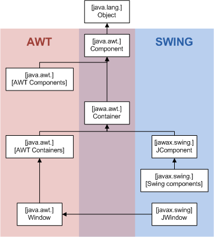

Paquetes de los que depende Java Swing:

-   **java.awt**
-   **java.awt.event**

En cuanto a la jerarquía general de paquetes de Java Swing:

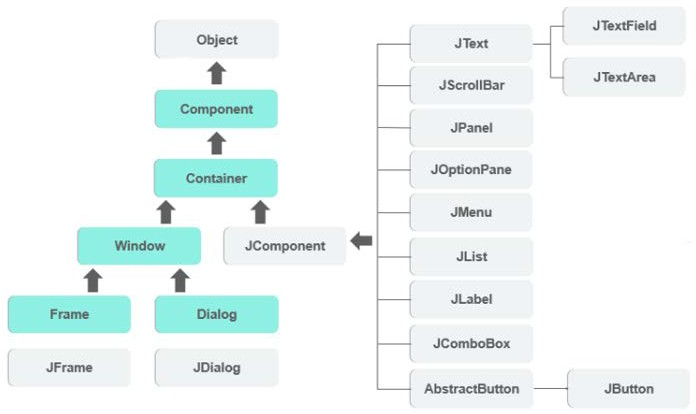

La jerarquía anterior trabaja con tres tipos de niveles en la aplicación:

-   **Contenedor de nivel superior**: Es un elemento que generalmente se usa como base, es decir, proporcionar un lugar para usar otros elementos. Ejemplos de este tipo serían: JFrame, JDialog y JApplet.
-   **Componente de nivel intermedio**: Es un elemento que se usa solo para manejar la ubicación de los elementos de botones y etiquetas. Ejemplos de este tipo serían: JPanel, JScrollPane y JTabbedPane.
-   **Contenedor Atómico**: Es un elemento que no se usa para almacenar otros elementos, es una entidad autosuficiente, que sirve para presentar información al usuario o para recibir información proporcionada por el usuario. Algunos de los ejemplos de este tipo son: JButton, JLabel, JComboBox, JTextField y JTable.

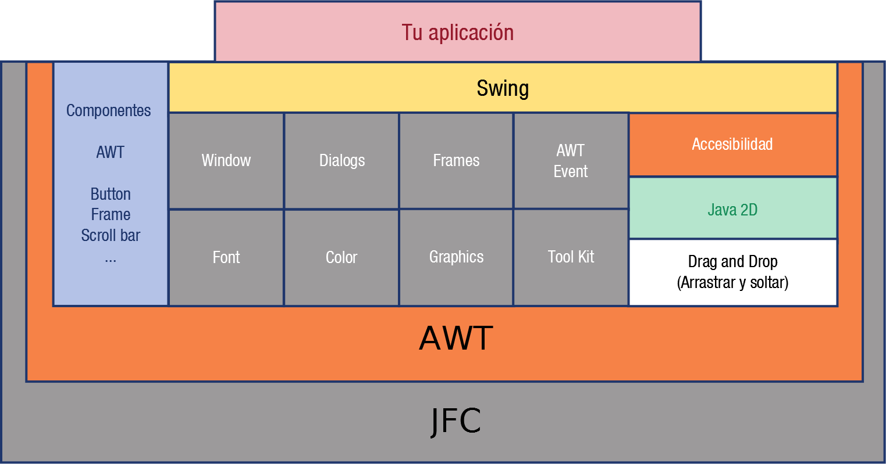

En general el desarrollo de una aplicación en Java Swing seguirá las siguientes etapas:

-   Creación de la ventana que contendrá los demás objetos gráficos de la aplicación
-   Inserción de los componentes de la interfaz
-   Manejo de eventos
-   Lógica del programa

## Componentes Swing

### Ventanas (Jframe)

Cualquier aplicación, con interfaz gráfico de usuario típica, comienza con la apertura de una ventana principal, que suele contener la barra de título, los botones de minimizar, maximizar/restaurar y cerrar, y unos bordes que delimitan su tamaño.

Esa ventana constituye un marco dentro del cual se van colocando el resto de componentes que necesita el programador.

La clase **JFrame** proporciona operaciones para manipular ventanas. Sus constructores son:

-   JFrame ()
    -   JFrame (String titulo)

        Una vez creado el objeto de ventana, habrá que:

    -   Establecer su tamaño.
    -   Establecer la acción de cierre.
    -   Hacerla visible.

En Swing, una cosa es cerrar una ventana, y otra es que esa ventana deje de existir completamente, o cerrar la aplicación completamente.

-   Las ventanas por defecto se crean ocultas y para que funcionen debemos mostrarlas ejecutando el método *setVisible* con el valor true.
-   Se puede hacer que una ventana **no esté visible**, y sin embargo que ésta siga existiendo y ocupando memoria para todos sus componentes, usando el método *setVisible(false)*. En este caso bastaría ejecutar para el JFrame el método *setVisible(true)* para volver a ver la ventana con todos sus elementos.
-   Si queremos cerrar la aplicación, es decir, que no sólo se destruya la ventana en la que se mostraba, sino que se destruyan y liberen todos los recursos (memoria y CPU) que esa aplicación tenía reservados, tenemos que invocar al método *System.exit(0).*
-   También se puede invocar para la ventana JFrame al método *dispose(),* que borra todos los recursos de pantalla usados por la ventana y sus componentes, así como cualquier otra ventana que se haya abierto como hija de esta (dependiente de esta).

| **Atributo**                 | **Métodos**                                                             | **Descripción**                                                                                                  |
|------------------------------|-------------------------------------------------------------------------|------------------------------------------------------------------------------------------------------------------|
| Visibilidad                  | boolean isVisible() void setVisible(boolean estado)                     | Obtiene o establece si la ventana está visible o no                                                              |
| Operación cierre por defecto | int getDefaultCloseOperation() void setDefaultCloseOperation(int valor) | Obtiene o establece lo que ocurre cuando se cierra la ventana                                                    |
| Título                       | String getTitle() void setTitle(String titulo)                          | Obtiene o establece el título de la barra de la ventana                                                          |
|  Posición                    | Point getLocation() void setLocation(Point coordenadas)                 | Obtiene o estable la posición de la ventana. La posición la dan las coordenadas de la esquina superior izquierda |
| Tamaño                       | Dimension getSize() void setSize (Dimension anchoAlto)                  | Obtiene o estable el ancho y el alto de la ventana.                                                              |
| Color de primer plano        | Color getForeground() void setForeground(Color color)                   | Obtiene o estable el color de primer plano de la ventana.                                                        |
| Color de fondo               | Color getBackground() void setBackground(Color color)                   | Obtiene o estable el color de fondo de la ventana.                                                               |
| Icono                        | Image getIconImage() void setIconImage(Image imagen)                    | Obtiene o estable el icono de la ventana.                                                                        |

### Contenedores

El uso de contenedores permite implementar un tipo de componente que puede contener otros componentes. Esto resulta especialmente útil para el diseño de interfaces, puesto que permite determinar la distribución y posición exacta de cada uno de sus elementos.

En realidad existen 3 tipos de contenedores.

-   **Panel**: es un contenedor puro y no es una ventana en sí misma. El único propósito de un Panel es organizar los componentes en una ventana.
-   **Marco**: es una ventana en pleno funcionamiento con su título e iconos.
-   **Diálogo**: se puede considerar como una ventana emergente que aparece cuando se debe mostrar un mensaje. No es una ventana completamente funcional como el Marco.

El uso de contenedores permite implementar un tipo de componente que puede contener otros componentes. Esto resulta especialmente útil para el diseño de interfaces, puesto que permite determinar la distribución y posición exacta de cada uno de sus elementos.

#### Layout Manager

Un layout manager (manejador de composición) permite adaptar la distribución de los componentes sobre un contenedor, es decir, son los encargados de colocar los componentes de una interfaz de usuario en el punto deseado y con el tamaño preciso. Sin los layout los elementos se colocan y, por defecto, ocupan todo el contenedor. El uso de los layout nos permite modificar el tamaño de los componentes y su posición

#### FlowLayout

FlowLayout sitúa los elementos uno al lado del otro, en una misma fila. Permite dar valor al tipo de alineación (*setAlignment*), así como la distancia de separación que queda entre los elementos, en vertical (*setVgap*) y en horizontal (*setHgap*).

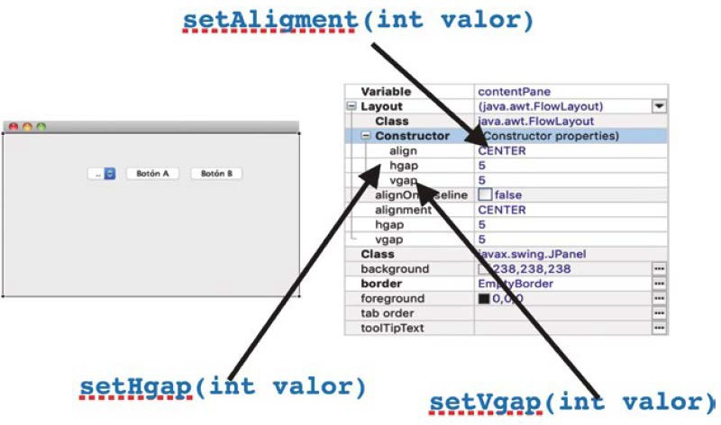

#### GridLayout

Este layout permite colocar los componentes de una interfaz siguiendo un patrón de columnas y filas, simulando una rejilla. Al igual que en el caso anterior, es posible modificar el valor de la separación entre componentes. Las propiedades de este elemento incorporan los atributos *cols* y *rows*.

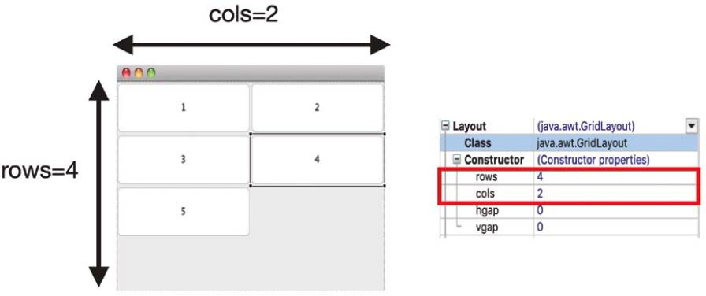

#### BorderLayout

BorderLayout coloca componentes en hasta cinco áreas: arriba, abajo, izquierda, derecha y centro. Es el administrador de diseño predeterminado para cada java *JFrame.*

### Componentes básicos

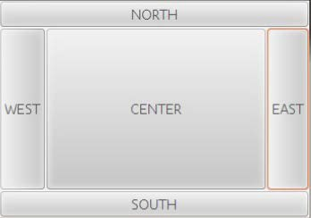

| JButton      | Implementación de un botón "pulsador".                                                                        |
|--------------|---------------------------------------------------------------------------------------------------------------|
| JLabel       | Un área de visualización para una cadena de texto corta o una imagen.                                         |
| JTextField   | JTextField es un componente ligero que permite la edición de una sola línea de texto.                         |
| JComboBox    | Un componente que combina un botón o campo editable y una lista desplegable.                                  |
| JComponent   | La clase base para todos los componentes de Swing excepto los contenedores de nivel superior.                 |
| JDialog      | La clase principal para crear una ventana de diálogo.                                                         |
| JFileChooser | Proporciona un mecanismo simple para que el usuario seleccione un archivo de su sistema de archivos.          |
| JFrame       | Una versión extendida *java.awt.Frame* que agrega el soporte para la arquitectura de componentes de JFC/Swing |

| JCheckBox    | Una implementación de una casilla de verificación: un elemento que se puede seleccionar o deseleccionar y que muestra su estado al usuario. |
|--------------|---------------------------------------------------------------------------------------------------------------------------------------------|
| JRadioButton | Una implementación de un botón de radio: un elemento que se puede seleccionar o deseleccionar, y que muestra su estado al usuario.          |
| JOptionPane  | JOptionPane facilita la creación de un cuadro de diálogo estándar que pregunta a los usuarios                                               |
| JList        | Un componente que muestra una lista de objetos y permite al usuario seleccionar uno o más elementos.                                        |
| JScrollBar   | Implementación de una barra de scroll                                                                                                       |
| JSpinner     | Componente que permite seleccionar un número y variarlo a través de sus botones más o menos.                                                |

#### JButton

Permite crear un objeto de tipo botón dentro de una interfaz gráfica en Java. Las propiedades de este elemento permiten modificar varios aspectos relativos a su apariencia:

|                              |          |
|---------------------------------------|-------------------------------------------------------------------|
| background                            | El color de fondo del botón. Se muestra solo si es opaco.         |
| enabled                               | True/false determina si el botón está activo o no.                |
| font                                  | Fuente del tipo de letra y tamaño.                                |
| foreground                            | Color del texto.                                                  |
| horizontalAlignment verticalAlignment | Alineación vertical y horizontal del texto con respecto al botón. |
| text                                  | Texto que aparece dentro del botón.                               |
| icon                                  | Permite cargar una imagen como fondo del botón.                   |

#### JLabel

Uno de los más sencillos de aplicar y que, al mismo tiempo, más utilidad reporta. No solo se trata de un elemento de texto, sino que este contenedor puede llegar a albergar imágenes, iconos o texto. Sus propiedades características son:

| background                            | El color de fondo de la etiqueta.                                      |
|---------------------------------------|------------------------------------------------------------------------|
| enabled                               | Habilita la etiqueta.                                                  |
| font                                  | Fuente del tipo de letra y tamaño.                                     |
| foreground                            | Color del texto.                                                       |
| horizontalAlignment verticalAlignment | Alineación vertical y horizontal del texto con respecto a la etiqueta. |
| text                                  | Texto que aparece dentro del botón.                                    |
| icon                                  | Permite cargar una imagen .                                            |

#### JTextField

El elemento JTextField se utiliza como contenedor de una línea de texto; el tamaño queda definido por el valor del atributo *columns*. No se trata de un valor exacto en cuanto a número de caracteres, sino que está definiendo su ancho, por lo tanto, en función del carácter que se escriba, variará la capacidad.

|   |       |
|------------|--------------------------------------------|
| background | El color de fondo de la caja de texto.     |
| columns    | Tamaño de la caja de texto.                |
| enabled    | Habilita el campo de texto.                |
| font       | Fuente del tipo de letra y tamaño.         |
| foreground | Color del texto.                           |
| editable   | Permite al usuario modificar el contenido. |
| text       | Texto que aparece dentro del botón.        |
| texto      | Texto que aparece en el inicio de la caja. |

#### JCheckBox

Los elementos de tipo casilla o CheckBox son elementos que se presentan junto a una pequeña caja cuadrada y que pueden ser marcados por el usuario.

Presenta unas propiedades similares a los casos anteriores, añadiendo algunos nuevos atributos como *selected*, el cual puede ser de valor true o false: el primero indicará que la casilla se muestre marcada por defecto y si es false aparecerá sin marcar.

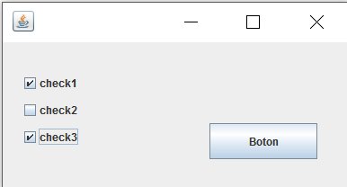

#### JRadioButton

Los elementos JRadioButton se utilizan en el desarrollo de interfaces para indicar varias opciones, de las que solo podrá escoger una, es decir, resultarán excluyentes.

Ahora bien, cuando insertamos un elemento JRadioButton en una interfaz, su funcionamiento va a ser muy parecido a un elemento de tipo **check**. Para conseguir un comportamiento excluyente es necesario utilizar un objeto tipo ButtonGroup.

La creación de un elemento ButtonGroup permitirá asociar a este grupo tantos elemento como se deseen, de esta forma todos aquellos que queden agrupados resultarán excluyentes entre sí puesto que pertenecen al mismo grupo.

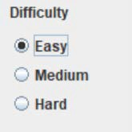

#### JDialog

Las aplicaciones que solo utilizan una pantalla implementarán su interfaz solo con un elemento JFrame, pero cuando la herramienta que se está desarrollando presenta más de una ventana, las de tipo secundario se crearán utilizando **JDialog**, puesto que esta sí permite tener un elemento padre, es decir, un elemento principal a partir del cual se accede a la ventana secundaria.

Las ventanas tipo *JDialog* siempre quedarán situadas por encima de su padres, ya sea de tipo *JDialog* o *JFrame*.

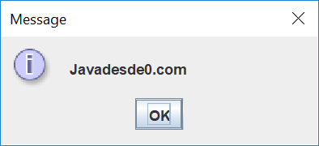

La creación de este tipo de ventanas se realiza de forma similar a la de tipo JFrame, desde el menú File y New seleccionamos Other y, a continuación, dentro de la carpeta *WindowBuilder* pulsamos sobre *JDialog*

#### JOptionPane

Es otra clase que provee una conjunto de ventanas de dialogo, para mostrar mensajes al usuario; ya sean informativos, advertencias, errores, confirmaciones o con la posibilidad de solicitar la introducción de un dato al usuario.

JOptionPane tiene diferentes ventanas de dialogo, que se crean de **forma estática**, entre las que se encuentran:

| JOptionPane.showMessageDialog() | Mostrar simplemente un mensaje informativo                 |
|---------------------------------|------------------------------------------------------------|
| JOptionPane.showInputDialog()   | Permite solicitar la entrada de datos al usuario           |
| JOptionPane.ConfirmDialog()     | Cuadro de confirmación con las opciones: Sí, No, Cancelar. |
| JOptionPane.showOptionDialog()  | Engloba/unifica los 3 anteriores diálogos.                 |

JOptionPane Se crea mediante a métodos estáticos, por eso, no hace falta instanciar nada. A continuación veremos las diferentes partes de una ventana para modificarla. Rellenaremos los datos de los métodos según el resultado que deseemos obtener:

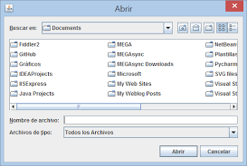

#### JFileChooser

JFileChooser es una clase java que nos permite mostrar una ventana del SO para la selección de ficheros.

La forma de invocarla sería mediante:

    JFileChooser fileChooser = new JFileChooser();

    int seleccion = fileChooser.showOpenDialog(ComponentePadre);

Una vez llevada a cabo la interacción por parte del usuario tendremos:

|      |   |
|-----------------------------|---------------------------------------|
| JFileChooser.CANCEL_OPTION  | Si el usuario pulsa el botón cancelar |
| JFileChooser.APPROVE_OPTION | Si el usuario pulsa el botón aceptar  |
| JFileCHooser.ERROR_OPTION   | Si ocurre algún error                 |

Con el siguiente fragmento de código comprobaremos que se ha dado al botón **aceptar** después de seleccionar un fichero, con lo cual tendremos su lógica básica, y de recuperación del fichero mediante el método *getSelectedFile*:

    if(seleccion== JFileChooser.APROVE_OPTION)
    {
    File fichero = fileChooser.getSelectedFile();
    // Aquí debemos abrir y leer el fichero.
    ...
    }

Para seleccionar un fichero para **guardar** datos, el mecanismo es igual, pero llamando al método *showSaveDialog()*

    JFileChooserfileChooser= new JFileChooser();
    intseleccion= fileChooser.showSaveDialog(ComponentePadre);
    if(seleccion== JFileChooser.APPROVE_OPTION)
    {
    File fichero = fileChooser.getSelectedFile();
    // Abrir a continuación el fichero para escritura y guardar los datos.
    ...
    }

Podemos también establecer un **filtro** de ficheros que aparezcan por defecto en dicho cuadro, usando para ello la clase *FileNameExtensionFilter* a la que le pasaremos un String con las extensiones que queramos filtrar.

    JFileChooserfileChooser= new JFileChooser();
    FileNameExtensionFilterfilter= new FileNameExtensionFilter("jpg", "gif");
    fileChooser.setFilter(filter);

Por defecto, *JFileChooser* solo nos permite elegir ficheros, si queremos elegir solo directorios o ambos, usaremos el método *setFileSelectionMode(int mode),* también tenemos constantes para ello:

|             |           |
|------------------------------------|------------------------|
| JFileChooser.FILES_ONLY            | Solo ficheros          |
| JFileChooser.DIRECTORIES_ONLY      | Solo directorios       |
| JFileChooser.FILES_AND_DIRECTORIES | Ficheros y directorios |

### JList

Este componente nos permite presentar una lista de selección donde podemos escoger uno o varios elementos. **JList** utiliza la separación del modelo y la vista.

> El JList no guarda los elementos por sí mismo, sino que utiliza un modelo de datos para almacenar y gestionar esos elementos.

**Creación del Contenedor de datos:**

El *DefaultListModel* es el lugar donde se guardan los elementos que el JList va a mostrar. Por medio del método addElement, se agregan elementos a nuestro modelo.

**Asociación al Jlist:**

El *JList* se asocia al DefaultListModel. Esto significa que cuando el modelo cambia (por ejemplo, al agregar elementos), el JList cambiará para reflejar esos cambios.

    JListlista=new JList();
    DefaultListModelmodelo = new DefaultListModel();
    modelo.addElement("Elemento1");
    modelo.addElement("Elemento2");
    lista.setModel(modelo);

### JTable

**Jtable** funciona de forma parecida al JList separando modelo y la vista. Un Jtable representa una tabla de datos con sus respectivas Filas y Columnas.

Aparte de usar otros constructores que hay en *JTable*, una de las formas más rápidas de utilizar un JTable es instanciar como modelo de datos un *DefaultTableModel* y luego un JTable , pasándole el modelo en el constructor.

    DefaultTableModelmodelo = new DefaultTableModel();
    JTabletabla = new JTable(modelo);

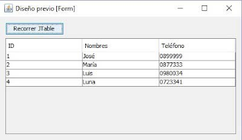

JTable admite muchos **constructores**, lo más conocidos son:

|                                  |              |
|------------------------------------------|-----------------------------------------------------------|
| JTable()                                 | El primer parámetro indica la ventana padre.              |
| JTable(int rows, int cols)               | Contiene el texto a mostrar dentro de la ventana (String) |
| JTable(Object[][] data, Object []Column) | Título de la ventana de diálogo                           |

Y algunos de los métodos de JTable:

| addColumn(TableColumn []column)            | Añade una columna al final de la JTable                                                                                                                                           |
|--------------------------------------------|-----------------------------------------------------------------------------------------------------------------------------------------------------------------------------------|
| clearSelection()                           | Seleccionar filas y columnas dadas                                                                                                                                                |
| editCellAt(int row, int col)               | Edita la celda de intersección del número de columna col y el número de fila fila mediante programación, si los índices dados son válidos y la celda correspondiente es editable. |
| setValueAt(Object value, int row, int col) | Establece el valor de la celda como 'valor' para la fila de posición, columna en JTable.                                                                                          |

Para llenar los elementos de un Jtable el código puede ser más laborioso.

    DefaultTableModelmodelo;
    modelo = new DefaultTableModel();
    miTabla= new JTable();// creamos la instancia de la tabla
    miTabla.setModel(model);
    modelo.addColumn("Nombre");
    modelo.addColumn("Edad");
    modelo.addColumn("dni");

### LookAndFeel

El **LookAndFeel** en swing son clases .java que determinan la apariencia que tendrán los componentes(JPanel, JTable, JButton, etc) de una aplicación al momento de mostrarse en pantalla. Por defecto el LookAndFeel que utiliza swing se llama **Nimbus**.

Por defecto existe un código autogenerado por Netbeans, o que podremos añadir nosotros en el método Main, y desde el que se hace visible generalmente a continuación el elemtno Jframe.

    try {
    for(javax.swing.UIManager.LookAndFeelInfoinfo: javax.swing.UIManager.getInstalledLookAndFeels()) {
        if("Nimbus".equals(info.getName())) {
            javax.swing.UIManager.setLookAndFeel(info.getClassName());
            break;
        }
        }
    } catch (ClassNotFoundExceptionex) {
    java.util.logging.Logger.getLogger(Modulos.class.getName()).log(java.util.logging.Level.SEVERE, null, ex);

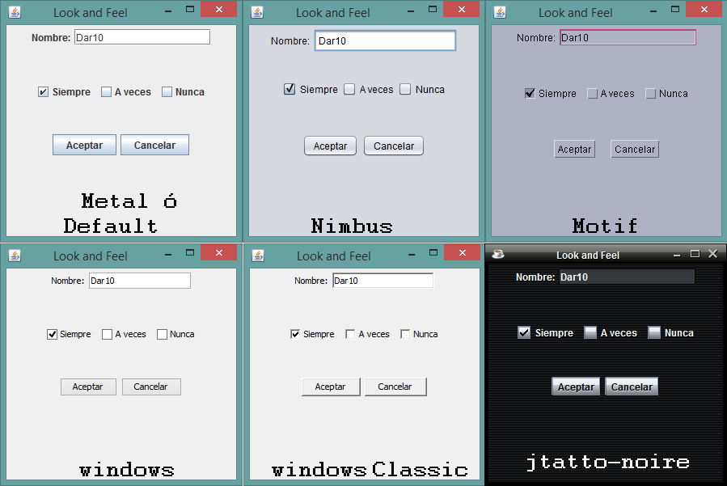

La clave de la interacción entre el usuario y una interfaz es la inclusión de **eventos**. Este tipo de programación podría dividirse en dos grandes bloques: la detección de los eventos y las acciones asociadas a su respuesta.

En función del origen del evento, es decir, en función de dónde se ha producido, diferenciamos entre eventos internos y externos. Por un lado están los producidos por el propio sistema y por otro los producidos por el usuario.

Un evento es por tanto un suceso que ocurre como consecuencia de la interacción del usuario con la interfaz gráfica:

-   Pulsación de un botón.
-   Cambio del contenido en un cuadro de texto.
-   Deslizamiento de una barra.
-   Activación de un *JCheckBox*.
-   Movimiento de la ventana.

## Manejo de eventos

En Java, podremos distinguir entre dos tipos básicos de eventos:

-   **Físicos** o de bajo nivel: que corresponden a un evento hardware claramente identificable. Por ejemplo, se pulsó una tecla (*KeyStrokeEvent*). Destacar los siguientes:
    -   En componentes: *ComponentEvent*. Indica que un componente se ha movido, cambiado de tamaño o de visibilidad
    -   En contenedores: *ContainerEvent*. Indica que el contenido de un contenedor ha cambiado porque se añadió o eliminó un componente.
    -   En ventanas: *WindowsEvent*. Indica que una ventana ha cambiado su estado.
    -   FocusEvent, indica que un componente ha obtenido o perdido la entrada del foco.
-   **Semánticos** o de mayor nivel de abstracción: se componen de un conjunto de eventos físicos, que se suceden en un determinado orden y tienen un significado más abstracto. Por ejemplo: el usuario elige un elemento de una lista desplegable (ItemEvent). *ActionEvent, ItemEvent, TextEvent, AdjustmentEvent*.

### Tipos de eventos asociados

|    			   |                                              													                                                                                                     |
|------------------|-----------------------------------------------------------------------------------------------------------------------------------------------------------------------------------------------------|
| *EventObject*    | Clase principal de la que derivan TODOS los eventos.                                                                                                                                                |
| *MouseEvent*     | Un área de visualización para una cadena de texto corta o una imagen.                                                                                                                               |
| *ComponentEvent* | Eventos relacionados con el cambio de un componente, de tamaño, posición…                                                                                                                           |
| *ContainerEvent* | Evento producido al añadir o eliminar componente sobre un objeto de tipo Container                                                                                                                  |
| *WindowsEvent*   | Este tipo de eventos se produce cuando una ventana ha sufrido algún tipo de variación, desde su apertura o cierre hasta el cambio de tamaño.                                                        |
| *ActionEvent*    | Evento que se produce al detectarse la acción sobre un componente. Es uno de los más comunes, puesto que modela acciones tales como la pulsación sobre un botón o el check en un menú de selección. |

### Componentes y eventos

Los componentes utilizados para el desarrollo de interfaces normalmente tienen un evento asociado, por ejemplo, no es lo mismo el tipo de detección asociado a un botón

o una pulsación de una tecla. En el siguiente cuadro los vemos los más habituales:

|       |            |   |
|----------------|-------------------------|---------------------------------------------------------------------------|
| JTextField     | *ActionEvent*           | Detecta la pulsación de la tecla *Enter* tras completar un campo de texto |
| JButton        | *ActionEvent*           | Detecta la pulsación sobre un componente de tipo botón.                   |
| JComboBox      | *ActionEvent ItemEvent* | Se detecta la selección de uno de los valores del menú.                   |
| JCheckBox      | *ActionEvent ItemEvent* | Se detecta el marcado de una de las celdas de selección.                  |
| JTextComponent | *TextEvent*             | Se produce un cambio en el texto.                                         |
| JScrollBar     | *AdjustmentEvent*       | Detecta el movimiento de la barra desplazamiento (*scroll*)               |

Los **listeners** o escuchadores permiten detectar la ocurrencia de los eventos, se podría decir que cuando estos se definen y activan quedan a la espera (escuchando) si se produce un evento, si este se produce se ejecutan las acciones asociadas a tal ocurrencia.

Todo **evento** requiere de un **listener** que controle su activación.

A continuación, se verán todos los tipos de *listeners* asociados al tipo de evento al que corresponden. Como se puede ver, un mismo tipo de escuchador puede estar presente en varios eventos y componentes diferentes, aunque normalmente presentan un comportamiento muy similar.

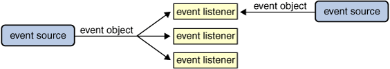

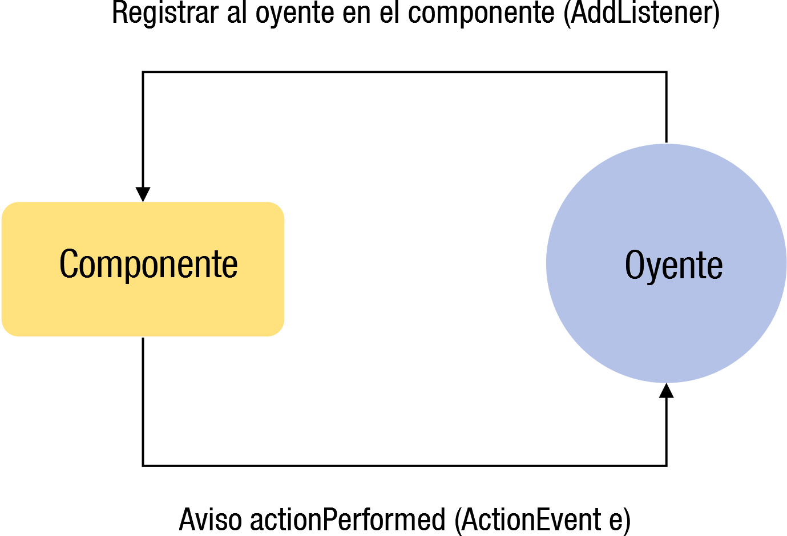

### KeyListener

Este evento se detecta al pulsar cualquier tecla. Bajo este escuchador se contemplan varios tipos de pulsaciones, cada uno de los cuales presentará un método de control propio. Se implementan los eventos **ActionEvent**.

|      |  													|
|-------------|-------------------------------------------------------------------------------------------------|
| keyPressed    | Se invoca cuando se ha pulsado una tecla. 													|
| keyTyped      | Se invoca cada vez que se ha pulsado una tecla y se ha traducido en un carácter.              |
| KeyReleased | Se invoca al soltar una tecla.                     												|

### ActionListener

Este evento detecta la pulsación sobre un componente, está presente en varios tipos de elementos siendo uno de los escuchadores más comunes.

La detección tiene lugar ante dos tipos de acciones, la pulsación sobre el componente con la tecla Enter siempre que el foco esté sobre el elemento, o la pulsación con el puntero del ratón sobre el componente. Estos componentes implementan los eventos de tipo **ActionEvent**.

|       |   |
|-------------|---------------------------------------------------------------------------------------------------|
| JButton     | Al hacer *click* sobre el botón o pulsar la tecla *Enter* con el foco situado sobre el componente |
| JTextField  | Al pulsar la tecla *Enter* con el foco situado sobre la caja de texto.                            |
| *JMenuItem* | Al seleccionar alguna opción del componente menú.                                                 |
| *JList*     | Al hacer doble click sobre uno de los elementos del componente lista.                             |

### MouseListener

Este evento se produce al hacer click con el **puntero del ratón** sobre algún componente. Es posible diferenciar entre distintos tipos de pulsaciones y asociar a cada una de ellas una acción diferente.

|      |   |
|-----------------|----------------------------------------------------------------------------------------------------|
| mouseClicked    | Al hacer *click* sobre el botón o pulsar la tecla *Enter* con el foco situado sobre el componente. |
| mouseExited     | Se produce al salir de un componente utilizando el puntero del ratón.                              |
| *mousePressed*  | Se produce al presionar sobre el componente con el puntero.                                        |
| *mouseReleased* | Se produce al soltar el puntero del ratón.                                                         |

## Modelo Vista Controlador

El Modelo Vista Controlador (**MVC**), tal y como ya comentamos, es un estilo de arquitectura de software que separa los datos de una aplicación (modelo), la interfaz de usuario (vista), y la lógica de control (controlador).

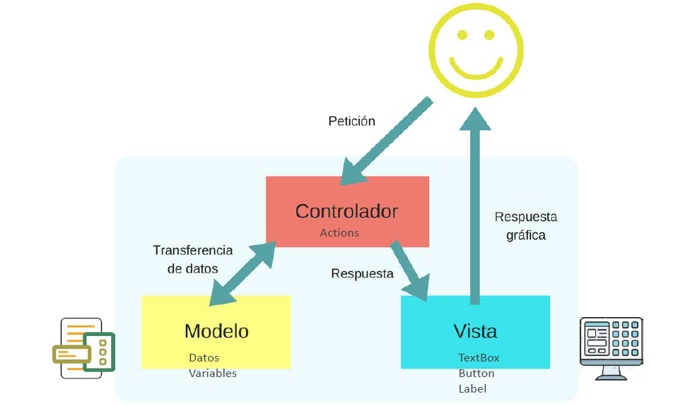

###  Modelo

El modelo (datos) lo define el desarrollador y puede incluir acceso a un BD.

###  Vista

Conjunto de objetos de clases que heredan de *java.awt.Component*

###  Controlador

-   El controlador es el thread de tratamiento de eventos, que captura y propaga los eventos a la vista y al modelo
-   Clases de tratamiento de los eventos (a veces como clases anónimas) que implementan interfaces de tipo *EventListener* (*ActionListener, MouseListener, WindowListener, etc.*)

