# UT3.1 Usabilidad

## Usabilidad

```note
La **usabilidad** es la disciplina que mide y estudia la forma de diseñar sitios webs y aplicaciones para que los usuarios puedan interactuar con ellos de la forma más fácil, cómoda e intuitiva posible.
```

Cuando diseñamos aplicaciones multiplataforma, la interfaz que planteemos será fundamental para que el usuario se sienta cómodo trabajando con ella. Un mal diseño provocará que los clientes dejen de utilizar nuestra aplicación.

Este concepto tiene en la actualidad una vital relevancia, ya que cuanto más sencillo le resulte a un usuario navegar por una aplicación, más posibilidades tendrá de realizar de forma eficiente su trabajo y mayor éxito tendrá nuestro software.

Veremos qué normativas son de aplicación en este campo, qué principios básicos garantizarán la usabilidad y qué parámetros de diseño de la interfaz contribuirán a facilitar el uso de nuestro software a los usuarios.

No confundir con la **accesibilidad**, que veremos más adelante, referida al diseño para que cualquier persona en cualquier circunstancia pueda acceder a sus contenidos.

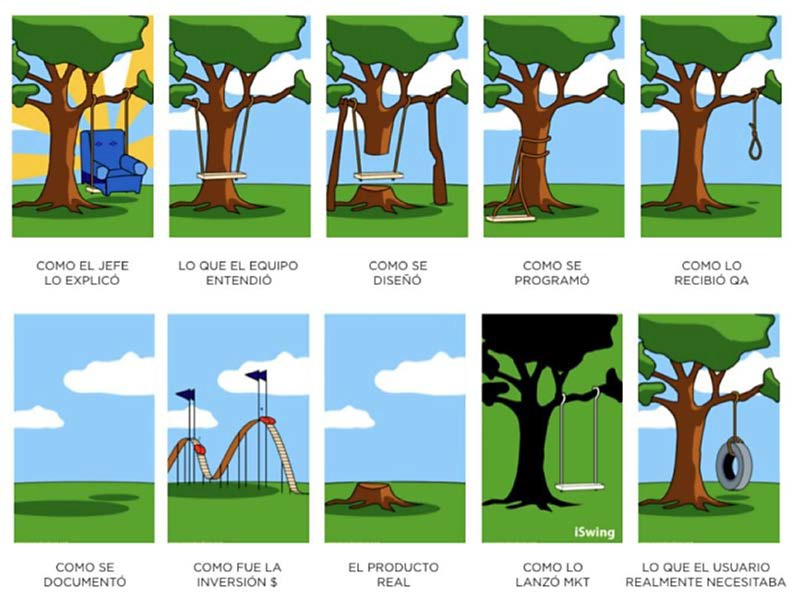

En el diseño de la interfaz de usuario debemos tener en cuenta que los usuarios deben ser capaces de alcanzar sus objetivos con el mínimo de esfuerzo y máximos resultados.

Características más básicas de usabilidad de cualquier interfaz:

-   Útil: que sea capaz de cumplir las tareas específicas para la cual se ha diseñado.
-   Fácil de usar: que sea eficiente, veloz y con la menor cantidad de errores posibles.
-   Fácil de aprender: que no se necesite excesivo tiempo en aprender a trabajar con la aplicación y que sea sencillo recordar su funcionamiento.
-   Elegante en su diseño: para favorecer la percepción del usuario y sus emociones.

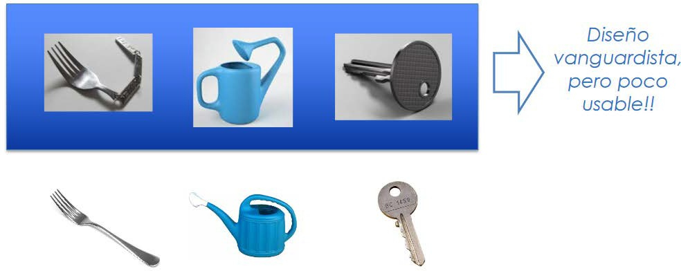

Es recomendable seguir las siguientes consideraciones en cuanto al **diseño de control de una aplicación:**

- Establecer los objetivos de cada componente de la interfaz y sus intenciones.
- Hacer corresponder cada objetivo con una secuencia de interacción.
- Especificar la secuencia de acciones de las tareas.
- Indicar el estado del sistema.
- Definir mecanismos de control.
- Mostrar la manera de cómo los mecanismos de control afectan al estado del sistema.
- Indicar la forma en que los usuarios interpretan el estado del sistema a partir de la información de la interfaz.

## Reglas de usabilidad

### Regla de los dos segundos

Cuando un usuario debe esperar más de dos segundos para obtener una respuesta a una acción sencilla realizada en una aplicación, es muy posible que se impaciente y abandone la página o aplicación en busca de otra plataforma que le ofrezca mejores resultados.

Lo ideal es que la aplicación sea de carga rápida y evitar toda sobrecarga innecesaria.

Además de dicha regla debe combinarse con las siguientes:

-   Todas las opciones de menú, iconos, etc. deben ofrecer una respuesta visual inmediata y si tienen animaciones que sean lo más rápidas posibles.
-   Debe bloquearse la posibilidad de que el sistema inicie un proceso repetidamente después de varios clics sucesivos en un mismo botón. Esto puede ocurrir con frecuencia cuando se trata de usuarios inexpertos o en entornos de ejecución lenta.
-   El usuario ha de poder cancelar cualquier proceso en cualquier momento.
-   Si un proceso lleva más de 3 segundos de ejecución se deberá aplicar la regla siguiente que veremos del **Feedback de información de espera**.

### Feedback de información de espera

En el caso de disponer de procesos que tengan un tiempo de respuesta elevado, se debe diseñar el feedback de información para el usuario.

Por ejemplo: en el proceso de envío de un formulario o cualquier otra acción en la que sea necesario un procesamiento, será necesario utilizar una animación de porcentaje de progreso o un *spinner* para mantener al usuario informado del estado del procesado de la información por parte de nuestra aplicación.

 

### Regla de las tres pulsaciones

El usuario debe poder acceder de forma sencilla a todo el contenido de una plataforma. De este modo, se considera que el contenido que se encuentra a más de tres pulsaciones no es importante.

Es por ello que los contenidos más visitados o con las funcionalidades más útiles deben situarse a tan solo un clic para conseguir interacciones lo más eficientes.


### Espacio entre elementos

Tal y como ocurre con toda composición visual, el espacio es necesario. Los espacios bien utilizados dan a los usuarios tiempo para pensar y observar el espacio sin estar bombardeados de textos e imágenes.

La confusión visual es muy perjudicial, y los proyectos que están muy cargados son tremendamente molestos. El espacio puede ser de cualquier color de fondo.

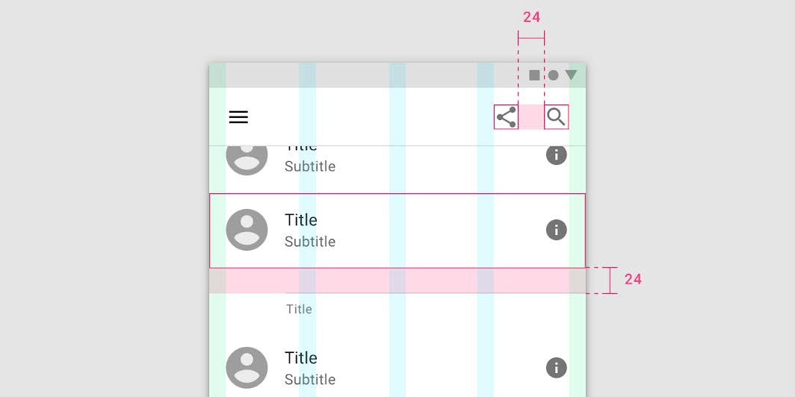 

### Legibilidad de los textos

Los textos son la base de la mayoría de sitios web y en diversas aplicaciones.

Por este motivo, para mejorar la experiencia del usuario debemos prestar mucha atención en la legibilidad de los textos tal y como ya tratamos en la Unidad 2: tipos y tamaño de letra, contraste entre texto y fondo, textos con una longitud adecuada, interlineado, etc. La selección de la **tipografía** adecuada también es crítica en este aspecto.

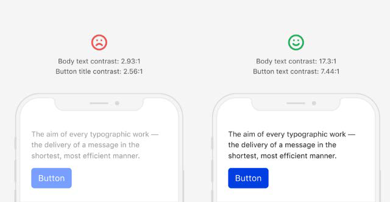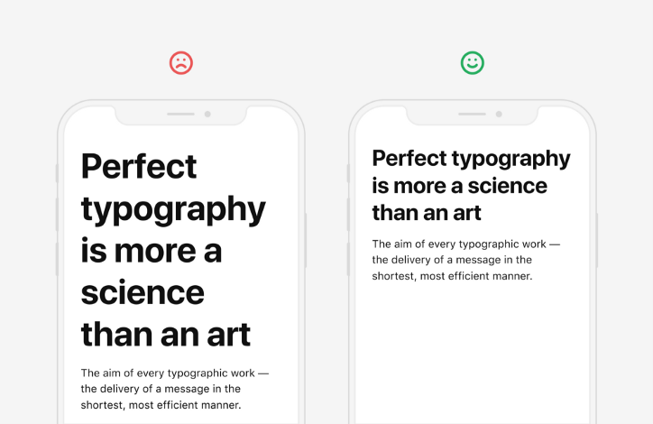

### Evitar mensajes modales

Un comportamiento modal mal diseñado implica restricciones graves a la libertad de acción del usuario.

Los primeros interfaces de usuario eran altamente restrictivos: debía seleccionarse siempre el modo de trabajo (por ejemplo, "modo Copiar") y después ejecutar la acción ya contextualizada (por ejemplo, seleccionar el fragmento del texto que hay que copiar). Actualmente, la modalidad en entornos gráficos suele favorecer el aprendizaje y la facilidad de uso de una aplicación.

Las ventanas de diálogo modales suspenden temporalmente todas las acciones, y obligan al usuario a responder a la cuestión expuesta en la ventana; deberían aparecer solamente en procesos breves.

El respeto de la consistencia tanto en la forma como en la función es un factor clave en la usabilidad de una interfaz; el comportamiento de los elementos de una aplicación debe ser constante y predecible.

### Coherencia y consistencia

La **consistencia** supone la fijación de unas constantes representativas a lo largo de una aplicación, de manera que el mismo tipo de información llegue al usuario siempre de idéntica forma.

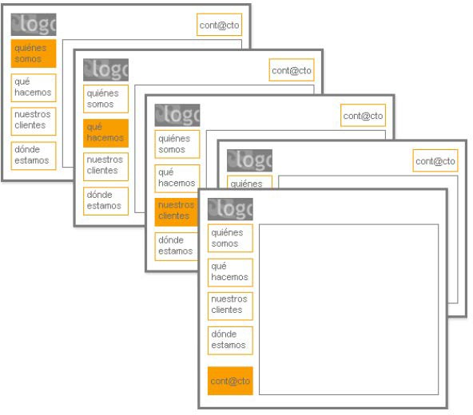

La consistencia también se refiere a la experiencia del usuario. Se facilita el uso de una aplicación cuando se respetan los conceptos de diseño que se han convertido en estándares en el entorno cultural del usuario.

La consistencia debe respetarse también en:

-  **Acciones**: para tareas similares, el usuario debe poder ejecutar la misma secuencia de acciones.
-  **Terminología**: los conceptos utilizados en menús, contenido, ayuda, etc., deben mantenerse a lo largo de toda la aplicación.
-  **Elementos gráficos**: la retícula, la gama de colores, la aplicación de tipografía y otros elementos gráficos deben mantenerse constantes en todo el sistema.

Para lograr esto es recomendable utilizar una guía de estilo unificada y estándar para nuestra aplicación.

### Curva de aprendizaje

Los usuarios se encuentran más cómodos en aplicaciones o sitios web que resulten fáciles de utilizar y que sigan las guías de estilo proporcionadas por el sistema operativo desde donde se manejan.

En este sentido, debe ser tan sencillo utilizar la interfaz que la curva de aprendizaje sea mínima. Se puede aprovechar la asociación para facilitar el aprendizaje de los diferentes procesos.

Existen muchos iconos universales que los usuarios ya comprenden de manera intuitiva, por ejemplo: las barras que indican el menú, los iconos de redes sociales para compartir algún contenido de forma directa o flechas que invitan a deslizar ciertos contenidos.

Se pueden consultar los **patrones** de interfaces más comunes en páginas que se dedican a recopilarlos, como [UI Patterns](http://ui-patterns.com/patterns) o en [UI Garage](https://uigarage.net/).

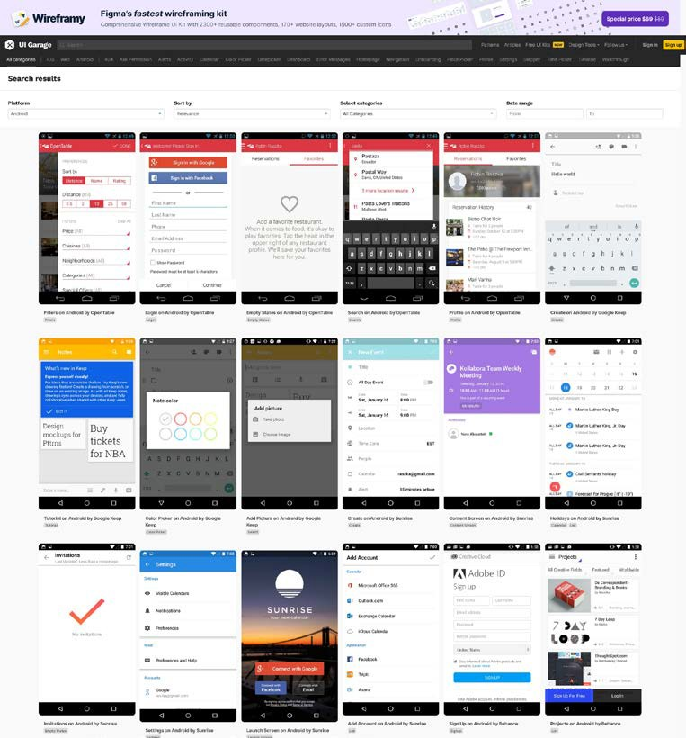

### Atajos de teclado

Los atajos de teclado son combinaciones de teclas que realizan una acción determinada, sustituyendo al uso del puntero del ratón sobre el elemento gráfico de una interfaz gráfica, **válida solo en caso de disponer de teclado físico**.

Es conveniente definir siempre atajos de teclado para aumentar la velocidad de trabajo del usuario en aquellas acciones que realiza con más frecuencia en el caso de interfaces gráficas de escritorio.

Por ejemplo, cuando queremos copiar un bloque de texto, siempre es más rápido pulsar *Ctrl+C* que buscar con el puntero del ratón sobre el menú correspondiente.

### Manejo de errores

Una plataforma debe estar diseñada de forma que si hay una incidencia al acceder a cualquiera de sus partes muestre un error claro al usuario.

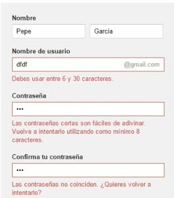

-   El mensaje debe describir el problema en términos sencillos y ser positivo y explicativo. El usuario no tiene por qué conocer la terminología informática, o las causas técnicas por las que el sistema no puede llevar a cabo una acción. Un mensaje genérico ("Error de sintaxis" en lugar de "Falta cerrar el paréntesis") o excesivamente técnico no tiene ninguna utilidad, y es desfavorable.
-   La palabra **error** debe evitarse. No contiene información, y conduce a que el usuario se sienta culpable e inseguro. Los mensajes deben ser positivos y activos.
-   Las señales auditivas deben utilizarse con moderación para no causar alarma excesiva o saturación. Es aconsejable aplicarlas solamente a situaciones críticas. En todo caso, el usuario ha de poder controlar su volumen o desactivarlas.
-   En el caso de plataformas web, si se produce una incidencia al acceder a una página, bien porque se haya eliminado o cambiado la *url*, aparezca la redirección correspondiente o el mensaje de error informativo (denominado *error 404* o *página no encontrada*).
En dicha página los usuarios deben poder ver el mensaje de error y volver a inicio o home. Además, esta "página no encontrada" también debe estar diseñada conforme a la estética de la guía de estilo que hayamos utilizado.


### Interfaz explorable

La estructura de una aplicación debe estar diseñada de manera que el usuario sepa qué rutas existen, y cómo llegar hasta cualquier punto del sistema.

No obstante, esto no implica que se fuerce al usuario a seguir un camino definido, impidiéndole cualquier otra acción. El usuario debe sentir que tiene libertad para navegar por el sistema, y que no va a caer en caminos sin salida.

Junto con la capacidad para investigar el entorno, debe existir una **ruta rápida** para acceder a los contenidos, de manera que tanto el usuario que requiere rapidez como el que quiere explorar el entorno puedan sentirse satisfechos.

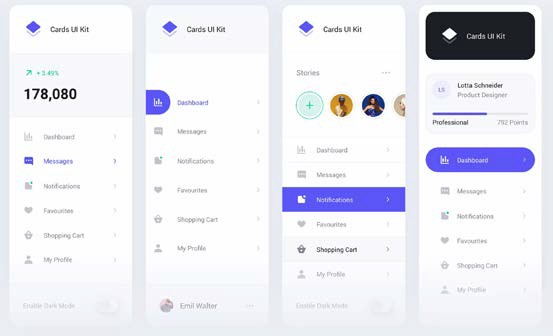

### Diseño responsive

```note
El **diseño responsive** o adaptativo es una técnica de diseño web que busca la correcta visualización de una misma página en distintos dispositivos.
```

El diseño responsive es prácticamente un requerimiento obligatorio para cualquier sitio web. Sin embargo, nunca está de más recordar que, tras el aumento del uso de smartphones y tablets para realizar búsquedas o visitar sitios web (65 % de los usuarios los tienen como su principal dispositivo de búsqueda) es indispensable que el diseño del sitio pueda adaptarse a los diferentes formatos móviles.

Gracias al diseño responsive, los usuarios pueden disfrutar de una navegación adecuada según el dispositivo desde el cual accedan. Este tipo de diseño ayuda a navegar con mayor facilidad y a ver cada uno de los elementos a una escala adecuada. 


A la hora de trabajar con interfaces en dispositivos móviles además debemos tener en cuenta la facilidad de acceso a zonas de la pantalla usando nuestras manos.

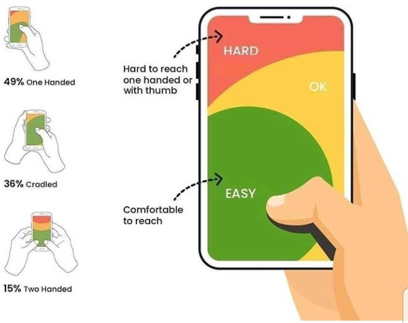

### Protección de datos de los usuarios

La protección del trabajo de los usuarios es algo prioritario, se debe asegurar que el usuario nunca pierda el trabajo realizado como consecuencia de un error.

Por ejemplo: cuando un usuario está finalizando un proceso de compra y está rellenando todos sus datos, si hubiera algún error en el proceso se debería recuperar el carrito de compra y los datos que fueran necesarios.


## Medidas de usabilidad

Se definen las **métricas de usabilidad** como aquellas características de la interfaz que son medibles de forma **objetiva**.

Es decir, dejando a un lado interpretaciones personales, se trata de encontrar una forma que evalúe la usabilidad de manera cualitativa y cuantitativa. Estas características se suelen dividir en tres grupos:

- **Satisfacción**: Mide el grado de satisfacción del usuario.
- **Efectividad**: Mide la plenitud con la que se alcanza un objetivo.
- **Eficiencia**: Mide el esfuerzo para conseguir un objetivo.


-   **Satisfacción**: el nivel de satisfacción de un usuario es clave para la evaluación usable. Las métricas que se contemplan bajo este parámetro son: calificación de satisfacción del usuario sobre la aplicación, frecuencia de reutilización de la aplicación, calificación relativa a la facilidad de aprendizaje o la medida de uso voluntario de la aplicación.
-   **Efectividad**: determina el grado de éxito de una aplicación. Este parámetro está estrechamente ligado también con la facilidad de aprendizaje de la herramienta. Se deben tener en cuenta las siguientes métricas para su evaluación: cantidad de tareas relevantes completadas en cada uno de los intentos, número de accesos a la documentación, al soporte y a la ayuda, cantidad de funciones aprendidas o cantidad y tipos de errores tolerados por los usuarios, entre otras.

-   **Eficiencia**: se define de manera relativa al tiempo que se requiere para completar una determinada tarea con el software implementado.
Las métricas en torno a este atributo se basan en el primero de los intentos: tiempo productivo de uso, tiempo para aprender el funcionamiento de la interfaz o eficiencia relativa al primer intento.

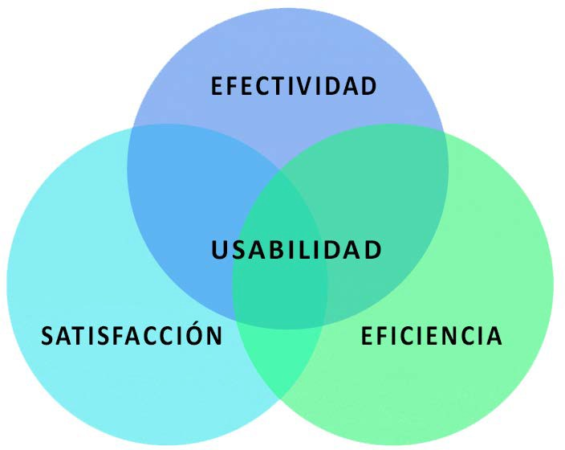

## Evaluación de la usabilidad

La **evaluación de la usabilidad**, aunque siempre se trata de una experiencia subjetiva, se puede medir utilizando las siguientes dos grandes herramientas que veremos a continuación:

-   Las pruebas de expertos
-   Las pruebas con usuarios


### Pruebas de expertos

Los usuarios expertos contribuyen a las pruebas de usabilidad detectando errores del sistema, basando sus opiniones en su propia experiencia.

Tipos de pruebas con usuarios expertos:

-  **Evaluación heurística**: Verificación frente a heurísticas de diseño.
-  **Revisión de normas**: Se revisa la interfaz para asegurarnos de que cumple con las normas establecidas.
- **Inspección de consistencia**: Se hace a través de una familia de interfaces que conforman la aplicación.
- **Inspección formal de usabilidad**: Técnica de evaluación formada por un grupo de expertos que realizan una especie de juicio, con uno de los participantes actuando como moderador, destacando las fortalezas y debilidades de la aplicación. En concreto, se pretenden encontrar problemas de
    -   Diseño: color, vocabulario, presentación..
    -   Navegación: controles, menús, búsquedas..


### Pruebas con usuarios

Las pruebas con los usuarios nos van a permitir obtener una valiosa información que será la base para lograr un diseño centrado en el usuario, sobre la que se construirán las etapas del producto final:

**Metodologías** de pruebas con usuarios:

- Reunión: Son encuentros que se hacen durante distintas etapas del proceso de desarrollo de software. Es aconsejable que en su realización siempre haya presente un experto actuando como moderador.
- Entrevistas y encuestas: Las entrevistas serán contactos personalizados con usuarios y se pueden realizar de forma oral o escrita. Las encuestas deben ser escritas y revisadas por especialistas para asegurarnos que se van a evaluar los aspectos más complejos de la interfaz. Si la encuesta es online pueden ser colocadas en un sitio web o enlace final.
- Diseño participativo: Se trata de una reunión entre los productores y una muestra de usuarios potenciales del producto final. El objetivo es que los usuarios participen en el diseño de la interfaz.
Para ello, se toma nota de sus necesidades y expectativas y los productores les mostrarán la idea general de cómo quedaría el producto final. Se pueden aplicar metodologías clásicas de debate, como son la mesa redonda, el 
*brain storming* (tormenta de ideas)…

**Una muestra de 5-10 usuarios es, en la mayoría de los casos, suficiente para detectar muchos problemas de usabilidad, pero los resultados no tienen validez estadística.**

La prueba con usuarios permitirá que detectemos cuáles son las tareas que les resultan más difíciles, así como los elementos de la interfaz que son menos comprensibles.

### Criterios de evaluación 

Un listado de posibles criterios de evaluación de la **usabilidad** podría ser:

1.  Tiene mapas de navegación interactiva para su correcta utilización y navegación.
2.  Sistema de navegación intuitivo.
3.  Ausencia de redireccionamiento en la entrada al portal.
4.  Identificación clara de los elementos enlazados.
5.  Posibilidad de retorno directo a la página de inicio en todo momento.
6.  Menú permanente con no más de 7 opciones.
7.  Coherencia del diseño de la interfaz.
8.  Los links externos se abren en nuevas ventanas.
9.  Presenta iconos y menús con títulos y textos concisos y explicativos. 10.Los iconos utilizados son comprensibles.
10. Dimensiones óptimas de la página.
11. Se observa correctamente con diferentes resoluciones de pantalla.
12.  Se aprovecha equilibradamente el espacio visual de la página para evitar la sobresaturación de elementos, con espacios en blanco (libres) entre el contenido, para descansar la vista.
13.  Estructura organizada con criterio de perfil de usuario.
14.  Tiempo de descarga adecuado.
15.  Ausencia de ventanas emergentes (pop-ups).
16.  Fuente de texto de tamaño y forma adecuados.
17.  Ausencia de menús desplegables, texto móvil, marquesinas, texto flotante,...
18.  Opción de búsqueda avanzada y cuadro de búsqueda en la parte superior de la página.
19.  No necesidad de *plugins* para visualizar la página.
20.  El manejo de errores presentado es el adecuado.
21. Independencia del navegador y su versión.

## Estándares de usabilidad

```note
La **ISO** (*International Organization for Standardization*) es una organización Internacional de la Normalización que se encarga de la creación de normas y estándares, cuyo objetivo principal es conseguir asegurar que servicios y productos presenten ciertos niveles de calidad, eficiencia y seguridad. 
```

En España se denomina **UNE** y las certificaciones se expiden por la empresa *AENOR*.

Un **estándar** es un documento establecido por consenso y aprobado por una institución reconocida, que prevé, para uso común y repetido, reglas, directrices y características para actividades o sus resultados, encaminada a la consecución del grado óptimo de definición en un contexto dado. Nota: las normas deben basarse en los resultados consolidados de la ciencia, la tecnología y la experiencia, y tener por finalidad promover beneficios óptimos.


Como organismos oficiales de estandarización podemos destacar:

-   En España, el organismo nacional de normalización es **AENOR** (Asociación Española de Normalización y Certificación) que elabora normas técnicas españolas (**UNE**)
-   A nivel europeo está el Comité Europeo de Normalización (**CEN**)
-   A nivel internacional, tal y como hemos visto, la Organización Internacional de Estandarización (**ISO**) compuesta por representantes de los organismos de normalización (ON's) nacionales, que produce normas internacionales industriales y comerciales. Dichas normas se conocen como normas ISO.


Existen diversos estándares **ISO** y normas relacionados directamente con la usabilidad y la accesibilidad, que definen diferentes aspectos relativos a esta.

Se intenta conseguir así una uniformidad en los criterios de diseño, puesto que no sería lógico que cada diseñador de interfaces escogiera unos parámetros distintos.

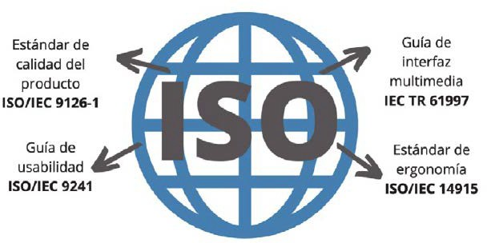

### ISO/IEC 9126

Se trata de un estándar internacional para la evaluación de la **calidad del software**, se presenta dividido en cuatro partes: modelo de la calidad, métricas externas, métricas internas y métricas de calidad en uso.

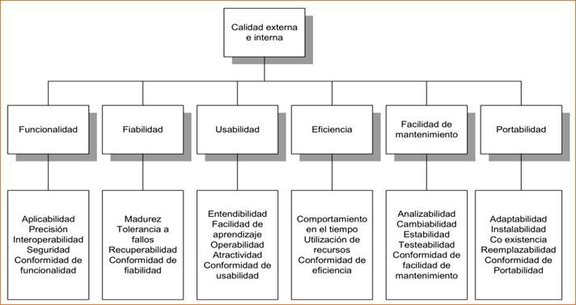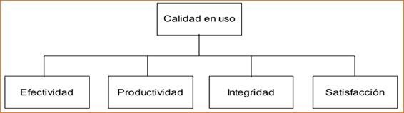

En la actualidad ha sido reemplazada por el **ISO 25000:2014** desarrollando los mismos conceptos.

### ISO/DIS 9241

Se trata de una norma que recoge los beneficios que aporta la **medida de la usabilidad** en términos de resultados y satisfacción obtenidos por el usuario.

Estos beneficios se miden por el grado de consecución de los objetivos previstos en cuanto a utilización, por los recursos empleados para alcanzar estos objetivos y por el grado de aceptación del producto por parte del usuario.

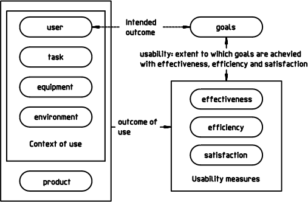

La **ISO 9241 / 151**. Proporciona directrices sobre el diseño centrado en el usuario para las interfaces de usuario web con el objetivo de aumentar su usabilidad.

### ISO 14915

ISO centrada en la **ergonomía del software** para **interfaces** de usuarios **multimedia.**

En general, ofrece recomendaciones y orientación sobre el diseño, la selección y la combinación de interfaces de usuario interactivas que integran y sincronizan diferentes medios. ofrece recomendaciones y orientación sobre el diseño, la selección y la combinación de interfaces de usuario interactivas que integran y sincronizan diferentes medios.

Los problemas de diseño detallados dentro de un solo medio (por ejemplo, el diseño gráfico de una secuencia de animación) solo se abordan en la medida en que implican consecuencias ergonómicas para el usuario.

Asimismo, proporciona recomendaciones sobre medios específicos y dominios específicos como la formación asistida por ordenador.
