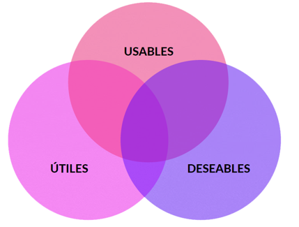
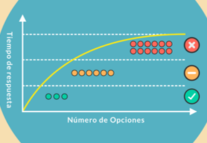
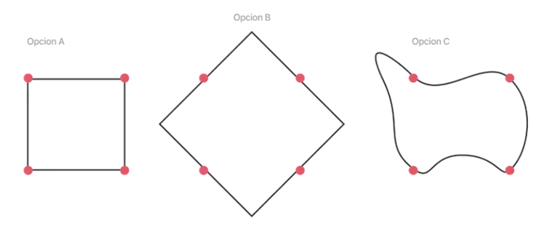
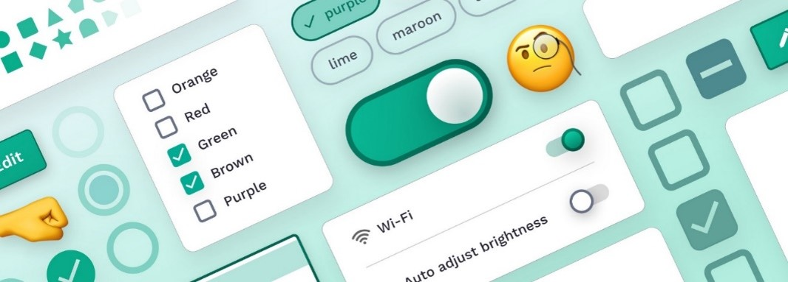

# UT3.2 Leyes básicas del User Experience (UX)

## Introducción

Tal y como hemos visto en la unidad de usabilidad, un buen diseño de interfaz tienda a seguir principios generales o directrices generales para trabajar.

```note
La User Experience (UX) o experiencia de usuario es la suma de percepciones subjetivas que una persona tiene sobre un producto, servicio o sistema diseñado para crear o satisfacer una necesidad.
```
Los 3 pilares de la experiencia de usuario:



## Leyes del UX

### Ley de Fitts

Basada en el psicólogo Paul Fitts en 1954, que determina ‘El tiempo necesario para alcanzar el objetivo es función de la distancia y tamaño que hay que recorrer hasta él.’ 

Esta ley afecta directamente a la experiencia de usuario a la hora del diseño de botones, por citar un ejemplo, más grandes, especialmente en dispositivos móviles que son táctiles, llegando a la conclusión que con los botones más pequeños es más difícil interactuar.


> Este sería un caso de aplicación de Ley de Fitts, se encuentra cerca de la que se presupone la zona de lectura del ratón (a la derecha, pues somos occidentales y leemos de izquierda a derecha), además abarca un amplio espacio (no es un botón pequeño) por lo que la probabilidad de “acertar” y hacer clic en el botón es alta.

### Ley de Hick

El tiempo que se tarda en adoptar una decisión, aumenta a medida que se incrementa el número de opciones.

Así pues, el tiempo que tarda un usuario en tomar una decisión aumenta cuantas más opciones tiene, es obvio el usuario, intenta contemplar todas las opciones posibles y lo que conllevan y tomará la que considere mejor opción.

Así a la pregunta, qué sería mejor de las siguientes opciones:
1. Un único formulario con 20 opciones hasta completarlo
2. Un formulario por etapas con 4 etapas y 5 opciones por etapa.

> La respuesta aplicando Hick, sería la <u>segunda opción</u>.



### Ley de Jackob

La mejor forma de crear algo nuevo, es buscar referencias, para que los primeros clientes entiendan de que va y puedan asociar.

Los usuarios pasan la mayor parte de su tiempo webs o aplicaciones similares, en caso de que el tuyo no lo conozca. 

Esto significa que prefieren sitios y aplicaciones similares a los que conocen y usan. Por eso es mejor no hacer aplicaciones demasiados originales o creativas.


### Ley de Prägnanz

También llamada “Ley de simplicidad”, que establece que los usuarios perciben las formas complejas de la forma más simple porque es la interpretación que menos esfuerzo mental requiere.
Aquellos diseños que complejizan y se llenan de elementos, serán más difíciles de identificar y eventualmente recordar. Mientras que aquellos diseños más simples, con menos estímulos o donde estos están organizados en una totalidad, estructura o patrón, serán más fáciles de reconocer y recordar. Es más fácil entender y asimilar un cuadrado que un octógono u otra forma compleja. Y requiere de menor intensidad mental para reconocer qué es eso y para qué sirve. 



### Ley de proximidad

Los objetos que están próximos tienden a unirse y en la experiencia de usuario se entienden como el mismo grupo.

El principio sostiene que si estás manejando un grupo de datos, todos los datos que entendamos que corresponden al mismo grupo deben de estar juntos y si empezamos a hablar de datos diferentes deberá de haber un espacio entre ellos. La mente hará el resto y los diferenciará.


> Amazon un ejemplo práctico de esto, pese a la sensación de “caos” a nivel datos, está muy claro donde está cada grupo de estos datos A y B.


### Ley de Miller

Según esta ley las personas pueden recordar hasta 7 elementos distintos en su memoria de trabajo. 

Es por ello que los menús de opciones y navegación en una página web más o menos están basados en este tamaño. Más de 7 elementos genera confusión y perdida de foco del usuario, no es capaz de recordar donde estaba una opción que ahora busca.



### Ley de Parkinson

Por una cuestión cultural, pensamos que como más horas le dediquemos a algo mejor es. Pero la práctica demuestra que no es así.

Cuando sabemos que tenemos más tiempo nuestro cerebro se relaja. En cambio, cuando sentimos la presión de la fecha límite nos centramos en realizar lo importante y que debemos finalizar a tiempo.

¿Qué quiere decir esto a nivel Experiencia de usuario?
Que el usuario tiene establecido ciertas ‘normas’ temporales, dependiendo del tipo de usuario obviamente, pero por poner un ejemplo, realizar una compra en Amazon (una vez has seleccionado la compra obviamente) tiene una duración de 5 minutos (entre rellenar los datos, tarjeta, etc…) Todo lo que sea acortar esos plazos será positivo.


#### Efecto de posición en una serie

Según esta ley, entre los elementos de una serie, los usuarios siempre recordarán mejor el primero y el último.

Esta es la razón por la cual vemos que en la barra de navegación de las aplicaciones se colocan las acciones más importantes a la izquierda o a la derecha, las cuales implementan elementos como inicio o perfil teniendo en cuenta la posición en serie.


#### Ley de Tesler

Larry Tesler establece que para cualquier sistema existe cierta complejidad que no se puede reducir al máximo.

Un ejemplo evidente lo encontraríamos en cualquier web o aplicación para comprar billetes, dentro de la cual ya están comprimidas al máximo sus opciones de búsqueda.


