# UT3.3 Guías de estilo. Retícula, color y fuentes

## Guías de estilo

Para asegurar la consistencia de las interfaces gráficas de una web o aplicación es fundamental plasmar las pautas de estilo en una guía que pueda seguir el equipo de desarrollo (programadores, analistas, diseñadores gráficos, etc.) durante el proceso de desarrollo del sitio. Estas guías se llaman **guías de estilo** o *look and feel*.

```note
Las *guías de estilo* recogen los criterios y normas que deben seguir los desarrolladores para que tenga una apariencia uniforme y atractiva para el usuario.
```

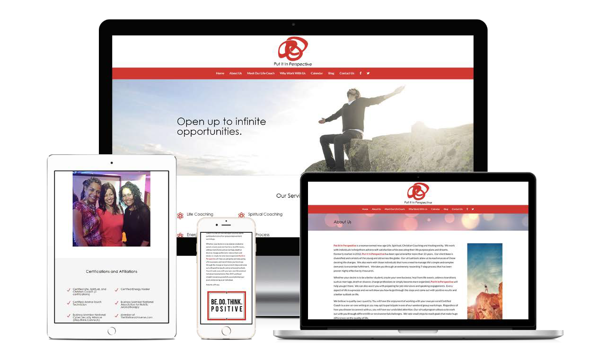

En las guías de estilo se recogen datos como el diseño de la retícula, la gama de colores utilizada, los iconos, la tipografía, el tamaño de las letras, etc.

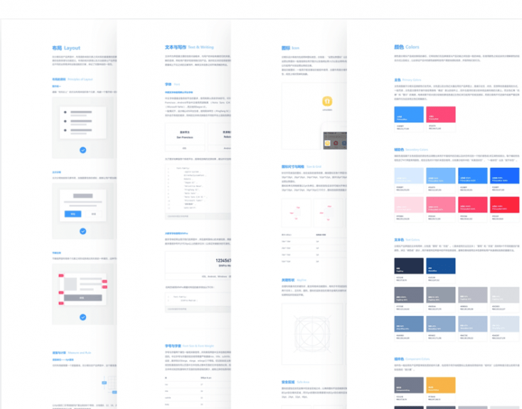


## La retícula

```tip
La retícula, tal y como ya vimos, se utiliza para establecer una estructura de diseño continua y coherente en soportes que deban alojar todo tipo de contenidos.
```

Teniendo en cuenta los espacios determinados por la retícula, se generan las áreas principales, en muchas ocasiones diferenciadas por bloques de color o elementos separadores.

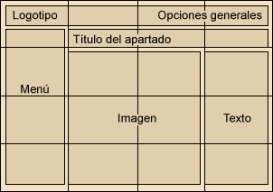

La retícula, tal y como ya vimos, se utiliza para establecer una estructura de diseño continua y coherente en soportes que deban alojar todo tipo de contenidos.

Por ejemplo, en publicaciones que se actualizan frecuentemente, la retícula adquiere la forma de una **rejilla**, que determina las zonas existentes en el soporte, y su subdivisión (generalmente en varias columnas). Durante el proceso de edición de los contenidos se respeta la estructura definida, de manera que exista una continuidad visual a lo largo de toda la publicación.


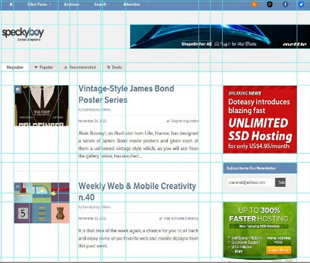
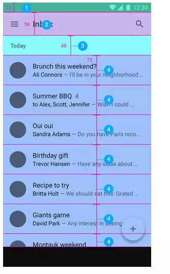

No obstante la retícula, puede basarse en cualquier tipo de escala como pudiera ser la orgánica, Fibonacci o irregulares.


## Tipografías

Los textos son la base de la mayoría de sitios web e interfaces ya que lo más normal es transmitir la información mediante letras. Al diseñar cualquier interfaz resulta fundamental favorecer la legibilidad del texto, un factor crítico debido a la resolución de los soportes digitales.


### Estructura y medidas

La **estructura** de una es precisa. Sus partes fundamentales son las siguientes:


Las **medidas** de una letra se miden según la altura y su anchura:

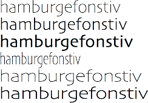

### Variaciones fuentes

Generalmente, cualquier familia tipográfica dispone de tres variaciones sobre el tipo regular:

-   Itálica (también llamada cursiva)
-   Negrita (bold en inglés)
-   Negrita itálica

También existen otras variaciones especiales, según la familia de la fuente

Normal **Negrita** *Cursiva*


### Familias tipográficas

Existen dos grandes de familias tipográficas, las Serif o Sans Serif. Además de estas dos familias existen también otras especiales:

#### Serif

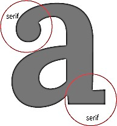

En esta familia tipográfica las fuentes rematan el final con adornos. Estas fuentes nos aportan sentimientos de autoridad y firmeza, ya que su estilo es bastante clásico.

#### Sans Serif

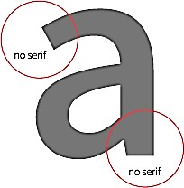

Como su enunciado nos indica, se trata de las sin serif. Este tipo de fuentes están compuestas por letras de palo seco, sin ningún tipo de adorno en el remate de su estructura. Con estas letras transmitiremos modernidad, seguridad, sobriedad o alegría.

Recomendables en medios electrónicos.

#### Manuscritas o script

Este tipo de fuentes simulan una caligrafía escrita, siendo a menudo cursivas. Suelen utilizarse para resaltar la importancia de los titulares o para firmas de autor.

#### Fuentes de exhibición o decorativas

Son las caligrafías más llamativas, ya que cada uno de ellas están personalizadas y cuentan con unas cualidades específicas. Como son fuentes muy especiales se suelen utilizar únicamente en títulos o en textos que queramos destacar.

#### Imágenes y símbolos

Por último, encontramos las tipografías en las que las letras son sustituidas por símbolos e iconos, en las que las palabras quedan codificadas.

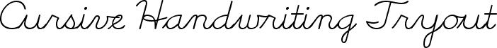


#### Monoespaciada

En los **tipos de letra monoespaciales** cada letra ocupa la misma cantidad de espacio horizontal en la pantalla. Se suelen utilizar para la representación de código informático o de texto escrito mediante una máquina de escribir.


Inicialmente, se utilizaban las fuentes típicas que los usuarios tenían instaladas en sus dispositivos y distintos SO lo que daba lugar a problemas.

Actualmente, gracias a que los navegadores soportan la directiva *@font-face*, es posible utilizar casi cualquier tipo de tipografía sin necesidad de que esté instalada en el dispositivo.

### Composición tipográfica

Los siguientes son los principales conceptos que forman parte de la composición tipográfica:

-   Espaciado
-   Espacio entre palabras
-   Longitud de línea
-   Interlineado (leading)
-   Alineación

### Legibilidad

Elegir la tipografía adecuada según el contenido que debamos diseñar y sus destinatarios: la fuente óptima no será la misma para un público infantil que para uno adulto; para reproducirse en pantalla o impresa.

Para textos extensos como los que suelen caracterizar a los materiales de educación superior, se aconsejan fuentes de caracteres bien proporcionados, regulares y si utiliza serifas, que éstas tengan remates clásicos y armoniosos.

Hasta hace poco se recomendaba el uso de caracteres con serifa para soportes impresos y se sigue recomendando sin serifa en digitales.

La letra **redonda** o regular mantiene las formas más abiertas y proporcionadas y en la mayoría de los casos es más legible que todas sus variantes: más que las cursivas, negritas, versales, condensadas, expandidas, etc.

Usar **colores contrastados** entre fondo y figura; la mejor legibilidad se produce con tipos negros sobre fondo blanco.

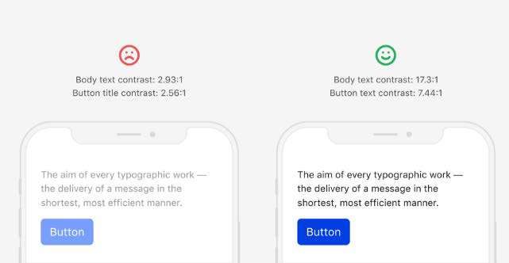
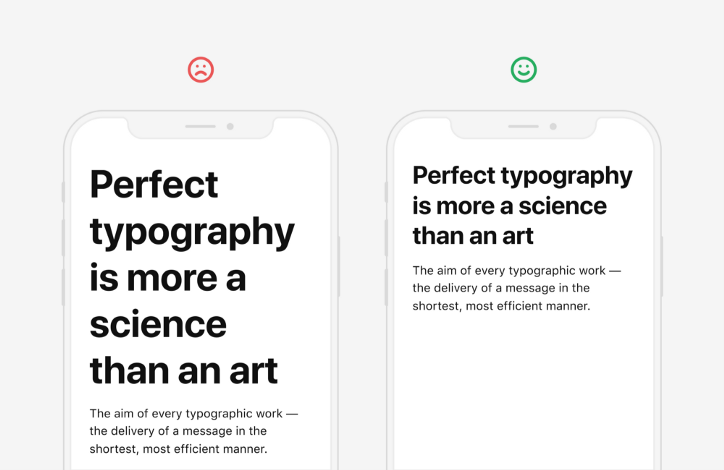

**Recomendaciones generales** respecto a la tipografía utilizada:

-  No usar más de tres tipografías distintas.
-  Utilizar fuentes legibles.
-  Elegir un buen contraste entre el fondo y la letra.
-  Establecer un interlineado de 1,5 puntos por el tamaño de la letra.
-  No abusar de los subrayados ya que suelen utilizarse para los hipervínculos.
-  Los espacios en blanco entre párrafos ayudan a descansar la mirada y a mejorar la concentración gracias a la mejor comprensión de la separación entre ellos. Así pues, es necesario añadir un poco más de espaciado entre párrafos y no dejar la misma separación que con el interlineado.
-  La longitud recomendada para un párrafo está comprendida entre 45 y 75 caracteres. (aunque esto puede depender del tamaño de la pantalla).
-  Es aconsejable no utilizar textos de menos de 12 px.

## Uso del color

El color es una cualidad de la materia y de la luz, pero además es un factor expresivo ya que tiene la virtualidad de **comunicar y suscitar sentimientos**. Por este motivo, el diseñador estudia las dimensiones y los valores del color para poder utilizarlo como **instrumento de comunicación**.

Nuestra capacidad para recordar colores es muy limitada y, en todo caso, se nos hace más difícil retener **diferencias de grado** que de **clase**.

Tenemos capacidad para reconocer y diferenciar fácilmente un máximo de seis colores (los tres primarios + los tres secundarios que les vinculan).


### Armonía del color

A principios del siglo XX, Ostwald desarrolló un conjunto de teorías sobre armonía del color. Básicamente, sus conclusiones son las siguientes:

-  Dos o más colores armonizan si su **saturación** es la misma.
 

-  Existen matices que combinan especialmente bien: son los **colores complementarios** (los enfrentados en el círculo cromático).


-  Todo círculo horizontal en torno al eje del modelo cromático representa un conjunto de colores armónicos, porque contiene todos los matices de igual **saturación y luminosidad**.

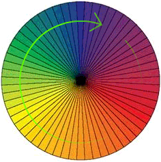

### Interacción del color

El color varía según el contexto. La interacción entre colores produce dos fenómenos diferentes:

-   **Contraste cromático**. Acentúa la complementariedad, o modifica los colores en el sentido de la complementariedad.
-   **Asimilación**. Cuando los matices son similares, los colores se aproximan en lugar de acentuar su contraste.


### Psicología del color

Gracias a la psicología del color sabemos que los colores son capaces de transmitir emociones y provocar así reacciones en nuestro cerebro. De hecho, está demostrado que el color influye en el estado de ánimo y en el comportamiento de las personas. Por este motivo, el color es muy utilizado para vincular a los usuarios con los productos anunciados. A continuación, se pueden ver los colores más usados y sus significados desde una perspectiva cultural occidentalizada pero ya global en su mayor parte:


A mayor luminosidad, mayor es nuestra capacidad para memorizar un color:

-  Amarillo: más memoria de color, menos memoria de forma
-  Rojo: memoria de color y de forma equilibrados
-  Verde: memoria de color y de forma equilibrados
-  Azul: menos memoria de color, más memoria de forma

.

El rango de **impacto visual** de la combinación de colores varía en una escala, de mayor a menor:

### Paleta de colores

Definir la gama de colores que se utilizará en un producto es fundamental porque puede condicionar la experiencia de los usuarios. Esta gama de colores se puede crear mediante una paleta de colores que nos provea de un grupo de matices y tonalidades que nos ayude a marcar la diferencia entre un diseño alegre, elegante, fiable, sobrio, etc.

Una opción para definir la gama de colores es realizando una **composición monocromática**, que consiste en seleccionar un solo color del círculo cromático y crear sus tonalidades añadiendo blanco o negro.

Otra opción consiste en seleccionar los **colores vecinos (análogos) del círculo cromático**, ya que son armónicos y ofrecen estabilidad al diseño. Los colores vecinos son los que se encuentran en un rango de 90 grados en el círculo cromático.


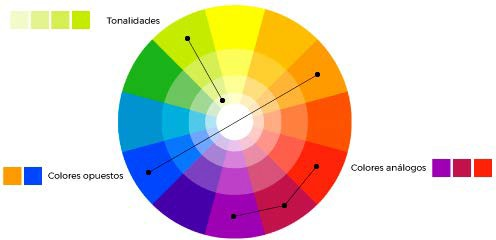

En la red se pueden encontrar diferentes generadores de paletas de color que nos permiten seleccionar las tonalidades o colores idóneos que queremos utilizar: colores vivos, pastel, apagados, grisáceos, etc.

Algunos de los generadores de paletas de color son los siguientes:

-  **Color Picker**: htmlcolorcodes.com
-  **Color Wheel de Adob**e: color.adobe.com
-  **Color Wheel de Canva:** canva.com/colors/color-wheel
-  **Paletton**: paletton.com

### Proporciones esquema color

Para poder organizar y determinar la cantidad de color en una aplicación o web, estas proporciones pueden ser de gran ayuda**: 60-30-10**. Esta es una norma que suelen usar los diseñadores de interiores y decoradores para escoger, estructurar y darle proporción a los colores escogidos.

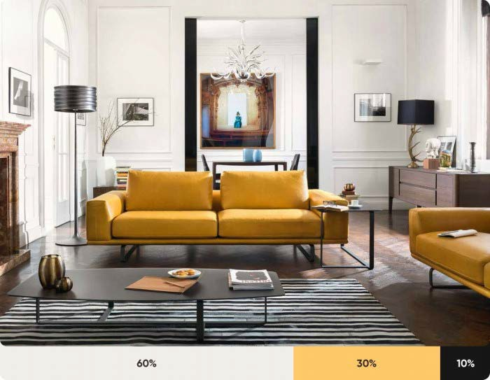

## Iconografía

Los **iconos** son otra parte esencial en cualquier sistema de diseño. Representan acciones y evitan el uso excesivo de textos. Elegir correctamente los iconos y que su diseño global sea coherente, es necesario para que los usuarios interpreten fácilmente su significado. Se suelen utilizar packs de iconos con un diseño y apariencia unificada (formas y color).

Los iconos se pueden encontrar en formatos diferentes:

-  Mapa de bits: PNG, GIF y JPG.
-  Imagen vectorizada: SVG.
-  Fuentes tipográficas o emojis: las fuentes de texto pueden ofrecer iconos sencillos para la representación de elementos de la interfaz.

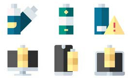


## Modelo guía de estilo

| **Áreas guía de estilo**                | **Preguntas más importantes**                                                                                                                                             |
|-----------------------------------------|---------------------------------------------------------------------------------------------------------------------------------------------------------------------------|
| Principios de diseño básicos            | ¿Cuáles son los objetivos de la aplicación o página web? ¿Cuáles son los principios de diseño propios de la filosofía de la empresa?                                      |
| Público objetivo                        | ¿A quién debe ir dirigida la aplicación? ¿Cómo puede delimitar el público objetivo? ¿Cuáles son sus preferencias, deseos e intereses?                                     |
| Logo y marca denominativa               | ¿Qué apariencia tienen el logo y la marca denominativa? ¿Cuándo, cómo y dónde se deben/tienen que utilizar?                                                               |
| Diseño de la retícula o ventana y menús | ¿Qué anchura tienen las columnas y qué altura tienen las filas? ¿Cómo se tienen que organizar los elementos en las ventanas? ¿Qué estructura de menú tiene que ofrecerse? |
| Colores                                 | Colores utilizados en los distintos componentes de la aplicación ¿Qué colores realzan la intención de la aplicación? Indica sus valores RGB o hexadecimales.              |
| Tipografía (fuente)                     | ¿Qué tipo de letra tiene que utilizarse para qué tipo de textos y elementos? ¿Cuál es el tamaño que tiene que tener la letra y de qué color tiene que ser?                |
| Iconografía                             | ¿Qué iconografía o paquete iconográfico va a utilizarse? ¿Dónde se tienen que insertar y qué significan?                                                                  |
| Contenido                               | ¿Qué contenido debe integrarse en la aplicación? ¿Cómo tiene que plasmarse de manera gráfica, textual o multimedia?                                                       |

