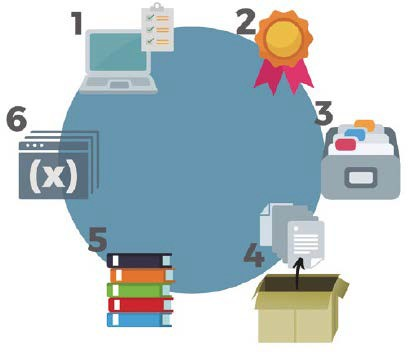
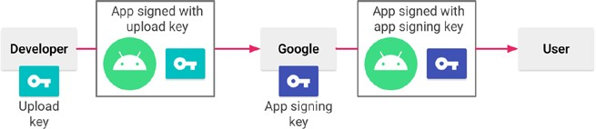

# UT3.4 Distribución de aplicaciones

## Introducción

Tras implementar una aplicación llega el momento de su distribución, para ello será necesario realizar un proceso de instalación que requiere de un paso previo: el **empaquetado**. Para realizar un correcto empaquetado se deben agrupar todos los componentes necesarios para el despliegue de una aplicación.

Un paquete contiene no solo el código que implementa una aplicación, sino que constará de todo lo necesario para **desplegar** una aplicación y realizar una correcta distribución. Los componentes principales son:

-   Las librerías y bibliotecas.
-   Los ficheros ejecutables.
-   Los elementos multimedia.

    El uso de las **librerías** permite reutilizar código y proporcionan un mayor número de funcionalidades que permiten disminuir la cantidad de tiempo invertido a la hora de desarrollar. No obstante, son habitual fuente de problemas.

## Instaladores

Para desplegar una aplicación software es necesario disponer de instaladores que lleven a cabo cada uno de los pasos necesarios del proceso de instalación. Este tipo de programas realizan una serie de operaciones sobre los archivos contenidos en el paquete de distribución que permite la instalación de cualquier software de forma automática.

### Instaladores en sistemas Windows

Dependiendo del sistema operativo en el que nos encontramos, la forma de empaquetar las aplicaciones puede cambiar. Normalmente en el caso de Windows los más utilizados son: EXE o MSI

-   **EXE**. Este tipo de instaladores es uno de los más comunes entre los usuarios y se trata de un archivo binario ejecutable con un asistente incluído. El instalador suele permitir seleccionar las rutas de instalación y marcar qué componentes de los incluidos en el paquete se desean instalar.
-   **MSI**. Los paquetes MSI se definen como instaladores de Microsoft. Son paquetes de software que contienen la información necesaria para automatizar su instalación, minimizando la intervención del usuario (para instalaciones desantendidas).
-   **AppX**: Sistema de empaquetado universal de la tienda de aplicaciones de la Microsoft Store. Usan tecnología de contenderes para su ejecución.

### Instaladores en sistemas Linux

El sistema operativo libre por excelencia permite empaquetar y distribuir aplicaciones con diferentes formatos. En Linux se utilizan algunos tipos de paquetes que requieren de operaciones específicas a través de línea de comandos para su creación.

-   **TAR**: paquetes sin compresión.
-   **TGZ**: se trata de paquetes TAR con compresión a través de GUNZIP.
-   **deb**: sistema de instalación mediante paquetería usado en aquellas distribuciones que están basadas en Debian, como Ubuntu o Kubuntu.
-   **RPM**: Redhat Package Manager (sistemas Red Hat)
-   **Pacman**: el sistema de paquetería de Arch Linux.
-   **ZYpp**: sistemas de paquetería basados en SUSE y OpenSUSE.
-   **Snap**: sistema de paquetes universales compatibles con diversas distribuciones.
-   **Flatpak**: otro sistema de paquetería universal soportado por numerosas distribuciones.

### Instaladores en Android/iOS

En los sistemas Operativos móviles se usan los siguientes sistemas:

-   Los ficheros **APK** (*Android Application Package*) son archivos ejecutables que contiene todos los datos que se necesitan para instalar y hacer funcionar una aplicación **Android**.
-   Los ficheros **IPA** (*iOS AppStore Package*) son el sistema de paquetería que se utiliza en los sistemas **iOS** de Apple.

## Firma de aplicaciones

La **firma de aplicaciones** se refiere al proceso de agregar una firma digital a un archivo de software, como una aplicación o un programa, para verificar su autenticidad e integridad. Esta firma digital es un código único generado a partir de la información contenida en el archivo y la clave privada del desarrollador o entidad que la firma.

La firma de aplicaciones cumple varios propósitos importantes:

-   Autenticación: Permite a los usuarios y sistemas verificar que la aplicación proviene de una fuente confiable. Si la firma digital no se puede verificar, es posible que la aplicación haya sido alterada o provenga de una fuente no confiable.
-   Integridad: Garantiza que el archivo de la aplicación no ha sido modificado desde que fue firmado. Si alguien intenta alterar la aplicación, la firma digital se volverá inválida.
-   Seguridad: Ayuda a prevenir la distribución de aplicaciones maliciosas, ya que los usuarios pueden confiar en que las aplicaciones son genuinas y sin malware.

## Asistentes de instalación

Para realizar la instalación de una aplicación, habitualmente se diseña una interfaz de usuario,también conocida como **asistente de instalación**, que permitirá escoger entre varias opciones de instalación (seleccionar entre diversos componentes que pueden ser instalados, la ruta concreta en la que se coloca el sistema de archivos...).

Este tipo de programas realizan una serie de operaciones sobre los archivos contenidos en el paquete de distribución que permiten la instalación de cualquier software de forma automática como *InstallShield*, *NullSoft Install System* para asistentes generalistas *o InnoSetup* e *Install4J* específicos de Java.

Existen varios programas y herramientas que puedes utilizar para crear asistentes de instalación o instaladores personalizados para tus aplicaciones.

-   **Inno Setup**: Inno Setup es un popular generador de instaladores gratuito y de código abierto para Windows.
-   **NSIS** (Nullsoft Scriptable Install System): NSIS es otra herramienta gratuita y de código abierto que te permite crear instaladores para Windows.
-   **InstallShield**: InstallShield es una herramienta comercial ampliamente utilizada para crear instaladores en Windows.
-   **PackageMaker** (macOS): Si estás desarrollando aplicaciones para macOS, puedes utilizar la herramienta PackageMaker de Apple para crear paquetes de instalación.
-   **RPM** (Linux): Si estás trabajando en aplicaciones para distribuciones de Linux que utilizan el sistema de gestión de paquetes RPM, puedes crear instaladores utilizando las herramientas RPM relacionadas, como rpmbuild.
-   **Install4J***:* Una herramienta de creación de instaladores específica para proyectos en Java y multiplataforma.
