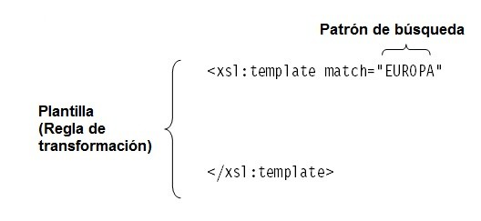
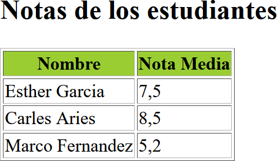
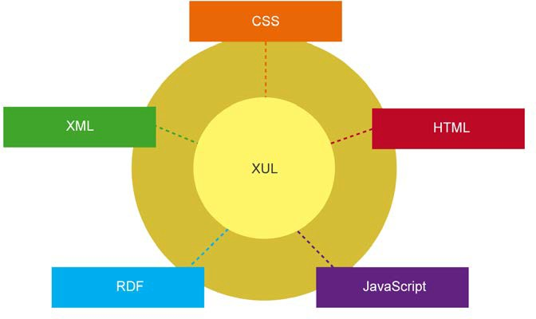
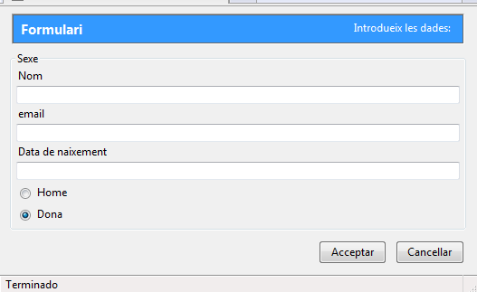

# UT4.1 - Lenguajes de descripción basados en XML

## Lenguajes de marcado

El uso de la tecnología **XML** tiene un papel importante en la actualidad, ya que permite la compatibilidad entre sistemas para compartir información de manera fácil, segura y fiable. Compite en la actualidad con otros dos lenguajes como son **JSON** y **YAML**.


Cuando se trata de compartir datos **JSON** es la mejor herramienta debido a que los datos están almacenados en vectores y registros mientras que XML almacena los datos en árboles.

Con respecto a **YAML** (YAML Ain't Markup Language) su simplicidad también le otorga velocidad pero, a diferencia del JSON, no es usado para servicios web o Apis sino para archivos de configuración, depuración u otros fines en los que la facilidad de lectura juega un rol importante.

Ejemplo de un archivo **JSON**: 

    {
    "squadName": "Super herosquad",
    "homeTown": "Metro City",
    "formed": 2016,
    "members": [
    {
        "name": "MoleculeMan",
        "age": 29,
        "secretIdentity": "Dan Jukes",
        "powers": [
        "Radiationresistance",
        "Radiationblast"
        ]
    },
    {
        "name": "Madame Uppercut",
        "age": 39,
        "secretIdentity": "Jane Wilson",
        "powers": [
        "Milliontonnepunch",
        "Damageresistance",
        "Superhumanreflexes"
        ]
    },
    }


Ejemplo de un archivo **YAML**:

    network:
    version: 2
    renderer: networkd
    ethernets:
    enp3s0:
    addresses:
    -10.10.10.2/24
    nameservers:
    search: [mydomain, otherdomain]
    addresses: [10.10.10.1, 1.1.1.1]
    routes:
    -to: default
    via: 10.10.10.1


| **XML**                                                                                 | **JSON**                                                                                                     | **YAML**                                                                                                     |
|-----------------------------------------------------------------------------------------|--------------------------------------------------------------------------------------------------------------|--------------------------------------------------------------------------------------------------------------|
| El lenguaje de marcado de información general más antiguo y extensible, pero engorroso. | Adecuados para el procesamiento de datos de un programa. Permite usar objetos.                               | No se usa para intercambio de datos. Información de texto. Proporciona facibilidad de lectura y legibilidad. |
|  Utilizado para interacción y transmisión de información en Internet.                   |  Usado en la comunicación de información entre la nube de aplicaciones móviles y el nodo no se puede anotar. |  Usado en archivos de configuración de varios sistemas.                                                      |

### Lenguaje XML

```note
💡 XML es un metalenguaje extensible de etiquetas, es decir que a partir de la definición de datos por medio de etiquetas y ciertas reglas sirve como base para definir otros lenguajes de marcas.
```

XML presenta diversos usos que ya conocemos, entre los que destacan:
-   Intercambio de información entre aplicaciones: al almacenar información mediante documentos de texto plano no se requiere software especial.
-   Computación distribuida: se trata de la posibilidad de utilizar XML para intercambiar información entre diferentes ordenadores a través de redes.
-   Información empresarial: este lenguaje tiene cada vez más importancia para generar interfaces empresariales gracias a la facilidad para estructurar los datos de la forma más apropiada para cada empresa.

Al ser XML un metalenguaje, puede ser empleado para definir otros lenguajes. Entre los más importantes actualmente se encuentran: XHTML, GML, MathML, XAML, RSS y SVG.

## Lenguajes de descripción de interfaces

Un archivo en XML no permite diseñar ni configurar una interfaz gráfica, sólo ofrecerá los datos necesarios para ser mostrados o manipulados.

Existen lenguajes basados en el estándar XML que permiten describir cómo debe ser tratada la información que contiene un documento XML para presentarla en un medio como puede ser una página web ( HTML ) o cualquier otro documento estructurado.

A continuación se llevará a cabo una descripción de algunos lenguajes de programación basados en XML:

-   XSLT (eXtensible Style Language Transformation)
-   XUL (eXtensible User interface Language)
-   XForms
-   XAML (Extensible Application Markup Language)
-   SVG (Scalable Vector Graphics)


### XSLT

XSLT (*XSL Transformations*) es un estándar de la organización *W3C* que presenta una forma de transformar documentos XML en otros tipos de documentos, incluso en formatos que no son XML.


La unión de XML y XSLT ayudará al aumento de la productividad por permitir la separación de contenido y presentación gráfica.


Algunos elementos del lenguaje XSLT:

| **Elemento**     | **Significado**                                                                   |
|------------------|-----------------------------------------------------------------------------------|
| \<xsl:template\> | utilizado para asociar una plantilla con un elemento XML                          |
| \<xsl:sort\>     | utilizado para ordenar la salida                                                  |
| \<xsl:value-of\> | utilizado para extraer el valor de un nodo seleccionado                           |
| \<xsl:for-each\> | utilizado para seleccionar cada elemento XML de un conjunto de nodos especificado |
| \<xsl:if\>       | utilizado para establecer un condicional sobre un valor de un nodo o atributo     |

### XSLT: plantillas

Las reglas de una plantilla (**\<xsl: template\>**) son patrones (patterns) para la transformación del árbol fuente en el árbol resultado. Éstas se componen de dos partes, la primera se conoce como patrones de búsqueda y la segunda como plantillas. A través del patrón se identifican los nodos del árbol fuente a los cuales se aplica una **regla**.



Si no hay plantillas, el procesador simplemente recorrerá todos los nodos y extraerá el texto contenido por cada nodo.

Para acceder a los contenidos de los nodos se recurre al elemento **\<xsl:value-of\>** con su atributo obligatorio **select**.

En el ejemplo siguiente, el documento final contiene los autores de los libros porque la plantilla los genera con la instrucción \<xsl:value-of\>. Como se ha aplicado una plantilla al nodo \<libro\>, sus hijos no se recorren.

    <?xmlversion="1.0" encoding="UTF-8"?>
    <xsl:stylesheetxmlns:xsl="http://www.w3.org/1999/XSL/Transform" version="1.0">
    <xsl:templatematch="libro">
    <xsl:value-ofselect="autor"/>
    </xsl:template>
    </xsl:stylesheet>

### XSLT: Acceso a contenidos

Se puede hacer un **filtro** a la salida de los elementos utilizando [ ]

    <?xmlversion="1.0" encoding="UTF-8"?>
    <xsl:stylesheetxmlns:xsl="http://www.w3.org/1999/XSL/Transform" version="1.0">
    <xsl:templatematch="libro[autor='Almudena Grande']">
    <xsl:value-ofselect="autor"/>
    </xsl:template>
    </xsl:stylesheet>

Para seleccionar atributos se hará uso de la **@**

    <xsl:templatematch="libro">
    <xsl:value-ofselect="autor/@descripcion"/>
    </xsl:template>

### XSLT: Bucles

A veces es necesario copiar sólo determinados elementos del documento de origen. Para estos casos puede usarse el elemento **\<xsl:for-each\>**

    <?xmlversion="1.0" encoding="UTF-8"?>
    <xsl:stylesheetxmlns:xsl="http://www.w3.org/1999/XSL/Transform" version="1.0">
    <xsl:templatematch="/">
    <html>
    <body>
    <h2>MyCD Collection</h2>
    <tableborder="1">
    <trbgcolor="#9acd32">
    <th>Title</th>
    <th>Artist</th>
    </tr>
    <xsl:for-eachselect="catalog/cd">
    <tr>
    <td><xsl:value-ofselect="title"/></td>
    <td><xsl:value-ofselect="artist"/></td>
    </tr>
    </xsl:for-each>
    </table>
    </body>
    </html>
    </xsl:template>
    </xsl:stylesheet>

### XSLT: Condicionales

El elemento **\<xsl:if\>** se usa para poner una prueba condicional contra el contenido del archivo XML.

    <xsl:iftest="precio&gt; 10">
    <tr>
    <td><xsl:value-ofselect="titulo"/></td>
    <td><xsl:value-ofselect="precio"/></td>
    </tr>
    </xsl:if>

### XSLT: Ejemplo

Dado el siguiente fichero **XML** de estudiantes y un fichero **XSL** a aplicarle:

**fichero.xml**

    <?xmlversion= "1.0" encoding= "utf-8" ?><?xml-stylesheettype= "text/xsl" href= "ejemplo.xsl"?>
    <alumnos>
    <alumno>
    <nombre> Esther Garcia</nombre>
    <dni> 38293450S </dni>
    <notaMedia> 7,5 </notaMedia>
    </alumno>
    <alumno>
    <nombre> Carlos Aries </nombre>
    <dni> 34839593G </dni>
    <notaMedia> 8,5 </notaMedia>
    </alumno>
    <alumno>
    <nombre> Marc Fernandez</nombre>
    <dni> 30492839P </dni>
    <notaMedia> 5,2 </notaMedia>
    </alumno>
    </alumnos>

**fichero.xsl**

    <?xmlversion= "1.0" encoding= "iso-8859-1" ?>
    <xsl:stylesheetversion= "1.0"
    xmlns:xsl= "http://www.w3.org/1999/XSL/Transform" >
    <xsl:templatematch = "/" >
    <html>
    <body>
    <h2 > Notas de los alumnos </h2 >
    <table border= "1" >
    <trbgcolor= "#9acd32" >
    <th> Nombre </th>
    <th> Nota Media </th>
    </tr>
    <xsl:for-eachselect= "alumnos/alumno" >
    <tr>
    <td>
    <xsl:value-ofselect= "nombre" />
    </td>
    <td>
    <xsl:value-ofselect= "notaMedia" />
    </td>
    </tr>
    </xsl:for-each>
    </table >
    </body>
    </html>
    </xsl:template>
    </xsl:stylesheet>

El resultado de la transformación será el **documento HTML** siguiente:

    <html>
    <body>
    <h2>Notas de los estudiantes</h2>
    <table border="1">
    <trbgcolor="#9acd32">
    <th>Nombre</th>
    <th>Nota Media</th>
    </tr>
    <tr>
    <td>Esther Garcia</td>
    <td>7,5</td>
    </tr>
    <tr>
    <td>Carles Aries</td>
    <td>8,5</td>
    </tr>
    <tr>
    <td>Marco Fernandez</td>
    <td>5,2</td>
    </tr>
    </table>
    </body>
    </html>



**XUL**

**XUL** (*eXtensible User interface Lan-Language)* es un lenguaje basado en XML para crear interfaces de usuario desarrollado por Mozilla, aunque actualmente ya no está soportado.

XUL utilizaba elementos de un lenguaje de marcas para crear interfaces gráficas de usuario, como lo hace otro lenguaje como HTML. Se podrá definir la apariencia de esta interfaz con hojas de estilo CSS y usar JavaScript para manipular su comportamiento.



Ejemplo en XUL que implementa una interfaz muy sencilla.



## XForms

**XForms** es un formato XML diseñado por el *W3C* para poder definir interfaces de usuario, principalmente formularios web, haciendo uso del Modelo Vista Controlador.

La característica destacable de XForms es que, a diferencia de los formularios web habituales en HTML , las especificaciones del diseño de la interfaz se definen por separado de la funcionalidad.

XForms se diseñó para ser lo suficientemente genérico como para usarse para describir cualquier interfaz de usuario e incluso para realizar tareas simples y comunes de manipulación de datos.

Actualmente, solo Opera es compatible de forma nativa con XForms. Sin embargo, existen complementos y extensiones que permiten usarlo en otros navegadores.

## XAML

**XAML** es un lenguaje de marcas empleado para la creación de interfaces en el modelo de programación *.NET Framework* de Microsoft. Las aplicaciones creadas podrán ejecutarse en entornos Windows.

XAML consta de una serie de elementos XML para representar los principales componentes gráficos, así como la distribución, paneles y manejadores de eventos. Puede hacerse programando directamente la interfaz mediante un editor de texto, o mediante el entorno de desarrollo gráfico incluido en la herramienta Expresión Blend. El código asociado a la interfaz es puramente declarativo, es decir, hace referencia tan solo al aspecto visual, pero no añade funcionalidad, salvo ciertas respuestas muy sencillas a interacciones con el usuario.


## SVG

**SVG** (*Scalable Vector Graphics*) no es un lenguaje de descripción de interfaces en sí mismo, pero es un formato gráfico abierto basado en XML para crear archivos vectoriales, mediante un lenguaje de marcado por medio de etiquetas aprobado por el *W3C* y soportado por todos los navegadores actuales.

Entre sus posibilidades, podemos señalar la capacidad de usar tres tipos de objetos gráficos:

-   Formas de vectores gráficos (entre las que se incluyen líneas, polígonos, polilíneas, rectángulos, círculos o elipses, etc.).
-   Imágenes y texto.

Además, a los objetos gráficos les podemos aplicar transformaciones (traslaciones, escala, etc.), animaciones y efectos de filtro.

Un documento **SVG** sencillo consiste simplemente en un elemento raíz \<svg\> y varias formas básicas que conforman un gráfico. A partir de ahí, se puede hacer todo lo complejo que queramos.


-   Creación de un círculo:

        <svg><circle cx=»60″ cy=»60″ r=»60″ fill=»#FF7700″ stroke=»#333333″ stroke-width=»4″></svg>

    


-   Creación de un rectángulo:

        <svg><rectx=»200″ y=»50″ width=»200″ height=»250″ fill=»#FF7700″ stroke=»#333333″ strokewidth=»10″ /></svg>

    


## Herramientas desarrollo de interfaces en XML

El principal objetivo de las herramientas es ocultar la sintaxis de los lenguajes de modelado y proporcionarles una interfaz que permita especificar adecuadamente el modelo de interfaz en los tres aspectos que hemos visto, a saber: La interfaz se almacena en un archivo de texto plano siguiendo las directrices del estándar **XML**.

Entre otras, podemos encontrar las siguientes aplicaciones de desarrollo de interfaces de **escritorio** y/o **móvil**:

-   Netbeans IDE
-   Eclipse IDE (pluggin)
-   IntelliJ IDEA
-   Scene Builder
-   Visual Code Studio
-   Microsoft Blend
-   QT Designer
-   Glade
-   Android Studio

