# UT4.2 Hojas de estilo CSS

## Hojas de estilo CSS

Las hojas de estilos aparecieron poco después que el lenguaje de etiquetas SGML, alrededor del año 1970. Desde la creación de SGML, se observó la necesidad de definir un mecanismo que permitiera aplicar de forma consistente diferentes estilos a los documentos electrónicos.

El gran impulso de los lenguajes de hojas de estilos se produjo con el boom de Internet y el crecimiento exponencial del lenguaje HTML. La guerra de navegadores y la falta de un estándar para la definición de los estilos dificultaban la creación de documentos con la misma apariencia en diferentes navegadores.

El organismo **W3C** (*World Wide Web Consortium*), encargado de crear todos los estándares relacionados con la web, propuso la creación de un lenguaje de hojas de estilos específico para el lenguaje HTML llamado **CSS** (*Cascade Style Sheet*).

A finales de 1996, el W3C publicó la primera recomendación oficial, conocido como CSS nivel 1. Desde 2011, la versión de CSS que rige y que tardó en desarrollarse más de 10 años es la CSS3.

En **CSS3** la W3C dispuso de nuevas funcionalidades como una gama de colores y fondos mucho más amplia, los media, bordes con imágenes y degradados, cajas y textos con sombras, esquinas o bordes redondeadas, consultas de medios, diseño de cuadrículas, espacios de nombres y el uso de diseños de múltiples columnas.

CSS3 tiene tantas funcionalidades nuevas o mejoradas que trajo consigo la casi desaparición absoluta de CSS1 y CSS2, así como la división del código en módulos. Sin embargo, al principio todas estas funcionalidades nuevas no sirvieron de mucho ya que los principales navegadores web más usados tardaron mucho en ofrecer soporte para la tercera versión de CSS, por lo cual a veces presentan problemas aún hoy en día.

A pesar de todo lo que se puede hacer con este lenguaje de diseño gráfico, aún se presentan importantes limitaciones. La W3C ya está trabajando en CSS4.

| **CSS1**   | 1996 | Propiedades de fuente, colores, alineación, etc...      |
|------------|------|---------------------------------------------------------|
| **CSS2**   | 1998 | Propiedades de posicionamiento, tipos de medios, etc... |
| **CSS2.1** | 2005 | Corrige errores de CSS2 y modifica ciertas propiedades  |
| **CSS3**   | 2011 | Inicio de características de CSS como módulos separados |

## Compatibilidad con los navegadores de las hojas CSS

El consorcio **W3C** define unas especificaciones y normas de recomendación, para que posteriormente, las compañías desarrolladoras de navegadores las sigan y puedan crear un navegador correctamente. Sim embargo dichas compañías establecen prioridades, desarrollan características antes que otras, e incluso algunas características deciden no implementarlas por razones de tiempo o diseño propio.

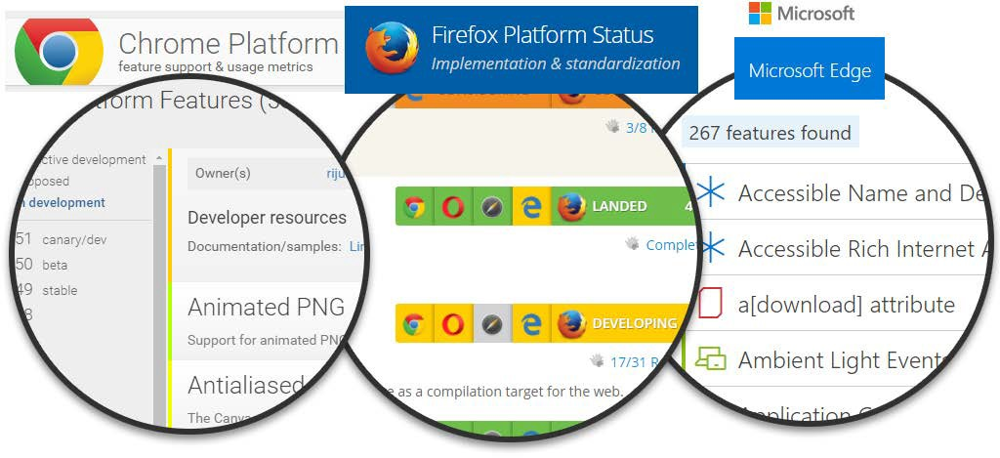

<https://css3test.com/>

| **Navegador**      | **Motor** | **CSS 1**                                    | **CSS 2.1** | **CSS 3**                                                                                           |
|--------------------|-----------|----------------------------------------------|-------------|-----------------------------------------------------------------------------------------------------|
|  Google Chrome     |  WebKit   | Completo desde la versión 85 del motor       |  Completo   | Todos los selectores, pseudo- clases y muchas propiedades                                           |
|  Internet Explorer |  Trident  |  Completo desde la versión 7.0 del navegador |  Completo   | Todos los selectores, pseudo- clases y muchas propiedades a partir de la versión 10.0 del navegador |
|  Firefox           |  Gecko    | Completo desde la versión 1.0 del navegador  |  Completo   | Todos los selectores, pseudo- clases y muchas propiedades                                           |
|  Safari            |  WebKit   | Completo desde la versión 85 del motor       |  Completo   | Todos los selectores, pseudo- clases y muchas propiedades                                           |
|  Opera             |  Presto   | Completo desde la versión 1.0 del navegador  |  Completo   | Todos los selectores, pseudo- clases y muchas propiedades                                           |
|  Edge              |  WebKit   | Completo desde la versión 1.0 del navegador  |  Completo   | Todos los selectores, pseudo- clases y muchas propiedades                                           |

<https://www.w3schools.com/cssref/css3_browsersupport.asp>


<https://www.statista.com/statistics/268254/market-share-of-internet-browsers-worldwide-since-2009/>

## Aplicar CSS a documentos HTML

Existen tres formas conocidas de emplear CSS para maquetar una página HTML:

-   Aplicar CSS en línea HTML mediante atributos.
-   Incrustar el código CSS en una etiqueta dentro del propio documento HTML.
-   Crear un documento CSS externo, referenciado dentro del documento HTML.

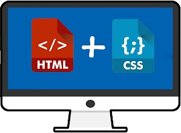

### Aplicar CSS en línea

Se hace utilizando el atributo \<style\>. Dentro de su valor irán las propiedades y sus respectivos valores CSS. Se trata de un formato en desuso al no separar contenido de presentación.

```css
    <p style="color: red;"> este es un párrafo \<p>
```

### CSS incrustado en el HTML

Se hace aplicando también la etiqueta \<style\> que contiene el código CSS que se desea aplicar a todo el documento HTML.

```css
    <style>
    /* Aquí irá todo el código CSS*/
    </style>
```

### CSS externo referenciado

Esta es sin duda la forma más recomendable de aplicar estilos a documentos HTML, consiste en crear un documento CSS aparte y guardarlo con la extensión. CSS.

Para realizar la invocación se empleará la etiqueta \<link\> dentro de la etiqueta \<head\> del documento HTML y mediante el atributo rel y href invocamos al documento CSS mediante su nombre.

```html
    <html>
    <head>
    <title> TITULO </title>
    <link rel="stylesheet" href="midocumento.css">
    </head>

    <body>
    </body>

    </html>
```

## Reglas CSS

Las **reglas** en CSS tienen el siguiente formato:

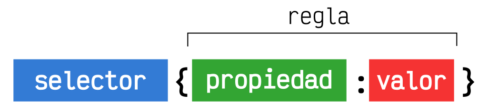

-   **Selector**: El selector es el elemento HTML que vamos a seleccionar del documento para aplicarle un estilo concreto. Por ejemplo, con p seleccionaríamos todas las etiquetas \<p\> del HTML.
-   **Propiedad**: La propiedad es una de las diferentes características que brinda el lenguaje CSS y que aplicaremos al selector para darle estilo.
-   **Valor**: Cada propiedad CSS tiene una serie de valores concretos a que se le pueden asignar, con los que tendrá uno u otro comportamiento.

Un **documento CSS** está compuesto generalmente por una colección de reglas. Como lo más probable es que haya más de una regla, a la colección de reglas se la llama frecuentemente como *rule-set* o juego de reglas.

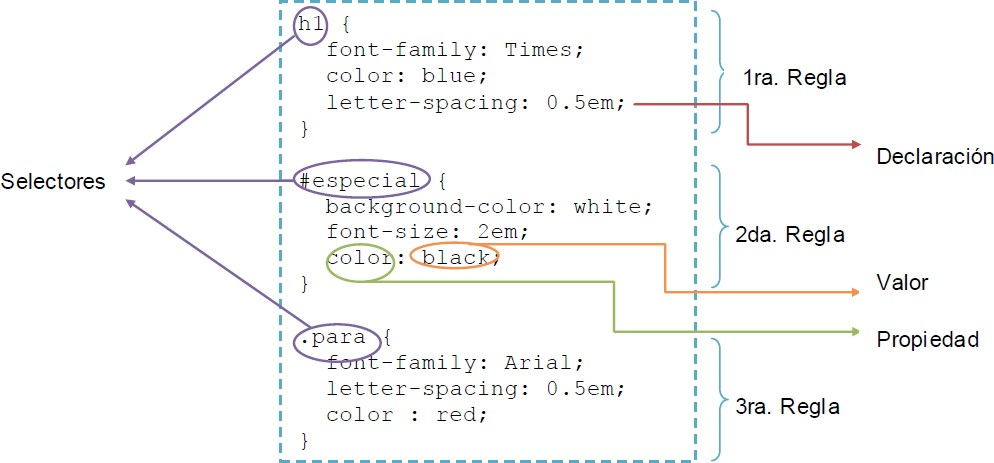

### Selector universal

```tip
El *selector universal* se utiliza para seleccionar todos los elementos de la página. El selector universal se indica mediante un asterisco (\*).
```

A pesar de su sencillez, no se utiliza habitualmente, ya que es difícil que un mismo estilo se pueda aplicar a todos los elementos de una página.

El siguiente ejemplo elimina el margen y el relleno de todos los elementos HTML:

```css
    * { 
    margin: 0;
    padding: 0;
    }
```

### Selector de etiqueta

```tip
El *selector de etiqueta* selecciona todos los elementos de la página cuya etiqueta HTML coincide con el valor del selector.
```

Para utilizar este selector, solamente es necesario indicar el nombre de una etiqueta HTML (sin los caracteres \< y \>) correspondiente a los elementos que se quieren seleccionar.

Para el siguiente ejemplo selecciona todos los párrafos de la página:

```css
    p { 
    margin: 0;
    font-weight: bold;
    }
```

### Selector de etiqueta múltiple

Si se quiere aplicar los mismos estilos a varias etiquetas diferentes, se pueden encadenar los selectores mediante comas.

En el ejemplo, los títulos de sección **h1**, **h2** y **h3** comparten los mismos estilos:

```css
    h1, h2, h3 { 
    color: #8A8E27;
    font-weight: normal;
    font-family: Arial, Helvetica, sans-serif;
    }
```


En las hojas de estilo complejas, es habitual agrupar las propiedades comunes de varios elementos en una única regla CSS y posteriormente definir las propiedades específicas de esos mismos elementos aparte.

### Selector descendente

```tip
El *selector descendente* selecciona los elementos que se encuentran dentro de otros elementos. 
```

El último selector indica el elemento sobre el que se aplican los estilos y todos los selectores anteriores indican el lugar en el que se debe encontrar ese elemento. Su sintaxis:

    selector1 selector2 selector3 ... selectorN

```css
    p span { 
    color: red; 
    font-size: 2em;
    }
```


Dado este código HTML, el selector afectaría también a los selectores *span* de texto2:

```html
    <p>
    <span>texto1</span>
    <a href="">...<span>texto2</span></a>
    </p>
```


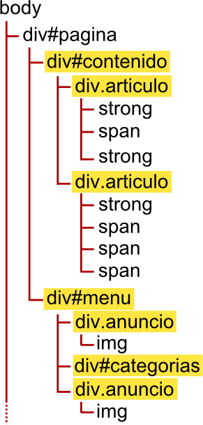

### Selector de clase

```tip
En un documento HTML, se pueden asignar clases utilizando el atributo **class** y luego usar un *selector de clase*.
```

El selector CSS para indicar las clases es el **punto** y se aplica a todos los elementos del documento con esa clase.

Los selectores de clase en CSS se usan por tanto cuando hay más de un elemento que mantienen una relación significativa y se puede compartir el estilo.

En HTML la clase se definirá de la siguiente forma:

```html
    <span class="miclase"\>Aquí hay un span de una clase.\</span\>
```

Y en CSS se referenciará con el **punto**:

```css
    .miclase {
    background-color: blue;
    }
```

Cuidado porque el selector de clases es **case-sensitive**.

Si un elemento dispone de un atributo **class** con más de un valor, es posible utilizar un selector más avanzado:

```css
    .error { color: red; }
    .error.destacado { color: blue; }
    .destacado { font-size: 15px; }
    .especial	{ font-weight: bold; }
```

### Selector de id

```tip
Para el *selector de id* se usa el atributo **id**, el cual debe ser único dentro de un documento HTML y por tanto sólo puede aplicarse a una única aparición de un elemento dentro del árbol del documento.
```

El selector CSS para indicar los id es la **almohadilla** \#. 

En HTML el **id** se referenciará de la siguiente forma:

```html
    <h2 id="oferta"\>Aquí hay una oferta.</h2>
```

Para el siguiente ejemplo:

```css
    h2#ofertas {
    background-color: yellow;
    }
```

Aplicará un fondo amarillo al elemento \<h2\> que tenga el id único ofertas. Al igual que el selector de clases también es **case-sensitive.**

### Selector de clase vs id

La diferencia entre un selector de **id** y uno de clase, es que el selector de id se puede usar para identificar un solo elemento, mientras que una **clase** se puede usar para agrupar más de uno, es decir las clases están pensadas para poder definir el mismo estilo a varios elementos de la página.

```html
    <div id="principal" class="section nuevo"\>
```

Otro ejemplo práctico, si se tiene una página con un menú de navegación que aparece una única vez, se le podría asignar un id a la capa donde está la barra de navegación.

Ese ID sería único, porque no hay otra barra de navegación igual a esa en la página.

### Selector: hijos, hermanos y descendentes

Existen selectores específicos para seleccionar **hijos** y **hermanos**, todos los cuales a su vez son **descendientes** entre sí:

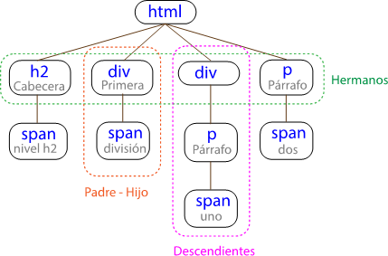

### Selector de hijos

```tip
El *selector de hijos* se utiliza para seleccionar un elemento que es hijo directo de otro elemento y se indica mediante el "signo de mayor que" **\>**
```

Se trata de un selector similar al selector descendente, pero muy diferente en su funcionamiento. 

Para el siguiente ejemplo:

```css
    div > span { 
    color: blue;
    }
```

El selector p \> span se interpreta como cualquier elemento \<span\> que sea hijo directo de un elemento \<div\>

```html
    <div>
    <span></span>   <-----
    </div>
    <div>
    <p> <span></span> </p>
    </div>
```

### Selector de hermanos

```tip
Podemos definir también un selector con la condición de que una etiqueta esté después de otra y al mismo nivel de profundidad o anidamiento o lo que es lo mismo, que sea un **hermano** de otra.
```

Un selector hermano se escribe separando las etiquetas con un carácter **\~**

```css
    div ~ p { 
    color: red
    }
```

Y el HTML:

```html
    <div>
    <p> Párrafo 1</p>
    </div>

    <p> Párrafo 2</p>   <-----
    <code>Código</code>
    <p> Párrafo 3</p>    <-----
```

### Selector adyacente

```tip
El *selector adyacente* se emplea para seleccionar elementos que en el código HTML de la página se encuentran justo a continuación de otros elementos.
```

Su sintaxis emplea el signo + para separar los dos elementos. Su sintaxis:

    elemento1 + elemento2 ... elementoN

Para el siguiente ejemplo por tanto:

```css
    h1 + h2 { 
    color: red;
    }
```

Solo se seleccionará únicamente en el HTML el elemento h2 que se encuentre inmediatamente a continuación del h1.

```html
    <h1>Content</h1>
    <h2>Content</h2>  <-----
    <h3>Content</h3>
```

### Selector de atributos

Permiten seleccionar elementos HTML en función de sus atributos y/o valores de esos atributos.

| **Selector**             | **Descripción**                                                                                                      |
|--------------------------|----------------------------------------------------------------------------------------------------------------------|
|  [nombre_atributo]       | selecciona los elementos que tienen establecido el atributo llamado nombre_atributo, independientemente de su valor. |
|  [nombre_atributo=valor] | selecciona los elementos que tienen establecido un atributo llamado nombre_atributo con un valor igual a valor.      |

Así por ejemplo:

```css
    a[class="externo"] { 
        color: blue;
    }
```

### Resumen de selectores


| **Nombre**                 | **Símbolo** | **Ejemplo**       | **Significado**                                    |
|----------------------------|-------------|-------------------|----------------------------------------------------|
| Agrupación de selectores   | ,           | p, a, div { }     | Se aplican estilos a varios elementos.             |
| Selector descendiente      |             | \#page div { }    | Se aplican estilos a elementos dentro de otros.    |
| Selector universal         | \*          | \* { }            | Se aplican estilos a todos los elementos           |
| Selector de clase          | .           | p.navega          | Se aplica el estilo a la clase                     |
| Selector de id             | \#          | a\#oferta         | Se aplica el estilo al id.                         |
| Selector hijo              | \>          | \#page \> div { } | Se aplican estilos a elementos hijos directos.     |
| Selector hermano           | \~          | div \~ p          | Se aplica el estilo a los hermanos.                |
| Selector hermano adyacente | +           | div + div { }     | Se aplican estilos a elementos que siguen a otros. |


## Pseudoclases

```tip
Las **pseudoclases** se utilizan para hacer referencia a ciertos comportamientos de los elementos HTML.
```

Así como los combinadores CSS se utilizan para dar estilos dependiendo de donde estén colocados en la estructura del HTML, las pseudoclases se utilizan para dar estilos a elementos respecto al comportamiento que experimentan en un determinado momento.

Las pseudoclases son palabras clave que comienzan con dos puntos **:**

    :pseudo-class-name

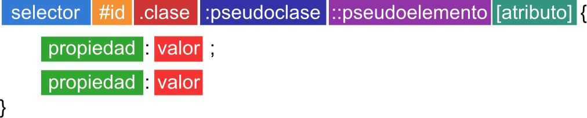

### Pseudoclases de enlaces

Existen algunas pseudoclases orientadas a los enlaces o hipervínculos. En este caso, permiten cambiar los estilos dependiendo del comportamiento del enlace.

| **Pseudoclase** | **Descripción**                                                 |
|-----------------|-----------------------------------------------------------------|
| :link           | Aplica estilos cuando el enlace no ha sido visitado todavía.    |
| :visited        | Aplica estilos cuando el enlace ha sido visitado anteriormente. |

Por ejemplo:

```css
    a:link { 
    color: black;
    font-weight: bold;
    }
```

### Pseudoclases de ratón

Permiten aplicar estilos como respuesta a la interacción con el puntero del ratón sobre dicho elemento:

| **Pseudoclase** | **Descripción**                                           |
|-----------------|-----------------------------------------------------------|
| :hover          | Aplica estilos cuando pasamos el ratón sobre un elemento. |
| :active         | Aplica estilos cuando estamos pulsando sobre el elemento. |

Dado el ejemplo:

```css
    div:hover a {
    background-color: steelblue; color: white;
    }
```


Cuando el usuario mueva el ratón sobre un div se resaltarán todos los enlaces que contenga.

### Pseudoclases de interacción

Existen pseudoclases orientadas principalmente a los campos de formulario de páginas webs y la interacción del usuario con ellos:

| **Pseudoclase** | **Descripción**                                     |
|-----------------|-----------------------------------------------------|
| :focus          | Aplica estilos cuando el elemento tiene el foco.    |
| :checked        | Aplica estilos cuando la casilla está seleccionada. |

Cuando estamos posicionados en un campo de un formulario se dice que ese campo tiene el foco, mientras que al pulsar *TAB* y saltar al siguiente, diremos que pierde el foco.

    input:focus {
    border: 2px dotted #444;
    }

### Pseudoclases de activación

Por norma general, los elementos de un formulario HTML están siempre activados, aunque se pueden desactivar añadiendo el atributo *disabled* (es un atributo booleano) al elemento HTML en cuestión. Esto es una práctica muy utilizada para impedir al usuario escribir en cierta parte de un formulario.

| **Pseudoclase** | **Descripción**                                                 |
|-----------------|-----------------------------------------------------------------|
| :enabled        | Aplica estilos cuando el campo del formulario está activado.    |
| :disabled       | Aplica estilos cuando el campo del formulario está desactivado. |
| :read-only      | Aplica estilos cuando el campo es de sólo lectura.              |
| :read-write     | Aplica estilos cuando el campo es editable por el usuario.      |

### Pseudoclases de posición

Las pseudoclases de posición permiten hacer referencias a los elementos del documento HTML según su posición y estructura de los elementos **hijos**.

| **Pseudoclase**    | **Descripción**                                               |
|--------------------|---------------------------------------------------------------|
| first-child        | Primer elemento hijo (de cualquier tipo).                     |
| :last-child        | Último elemento hijo (de cualquier tipo).                     |
| :nth-child(n)      | N-elemento hijo (de cualquier tipo).                          |
| :nth-last-child(n) | N-elemento hijo (de cualquier tipo) partiendo desde el final. |

Por ejemplo:

    strong:first-child { 
        background-color:cyan;
    }

### Pseudoclases de posición

Si no queremos quedarnos solo en los primeros o últimos elementos podemos hacer uso de la pseudoclase :nth-child(A), que permite especificar el elemento deseado, estableciendo su número en el parámetro A.

Así por ejemplo tendríamos:

```css
    # Para el primer elemento
    strong:nth-child(1) { font-size: 15px;
    }

    # Para el cuarto elemento
    strong:nth-child(4) { font-size: 8px;
    }
```

## Pseudoelementos

Al igual que las pseudoclases, los pseudoelementos son otra de las características de CSS que permiten hacer referencias a comportamientos virtuales no tangibles, o lo que es lo mismo, se le puede dar estilo a elementos que <u>no existen realmente en el HTML</u>, y que se pueden generar desde CSS.

La sintaxis de los pseudoelementos, que está precedida de dos puntos dobles (::) para diferenciarlos de las pseudoclases, las cuales sólo tienen dos puntos (:)


En la siguiente tabla vemos algunos pseudoelementos que nos podrían ser útiles:

| **Pseudoelemento** | **Descripción**                                                      |
|--------------------|----------------------------------------------------------------------|
| content            | Propiedad para generar contenido. Sólo usable en ::before o ::after. |
| ::before           | Aplica los estilos **antes** del elemento indicado.                  |
| ::after            | Aplica los estilos **después** del elemento indicado.                |
| ::first-letter     | Aplica los estilos en la primera letra del texto.                    |
| ::first-line       | Aplica los estilos en la primera línea del texto.                    |

Las medidas en CSS se emplean, entre otras, para definir la altura, anchura y márgenes de los elementos y para establecer el tamaño de letra del texto. Todas las medidas se indican como un valor numérico entero o decimal seguido de una unidad de medida (sin ningún espacio en blanco entre el número y la unidad de medida).

CSS divide las unidades de medida en dos grupos:

-   **Medidas absolutas**: establecen de forma completa el valor de una medida, por lo que su valor real es directamente el valor indicado.
-   **Medidas relativas**: definen su valor en relación con otra medida, por lo que para obtener su valor real, se debe realizar alguna operación con el valor indicado

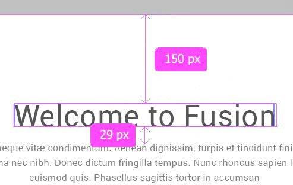

## Unidades de medida

### Unidades absolutas

```tip
Una medida indicada mediante unidades absolutas está completamente definida, ya que su valor no depende de otro valor de referencia y se definen respecto a una unidad dada. 
```

La lista completa de unidades absolutas definidas por CSS y su significado:

| **Nombre** | **Significado**        |
|------------|------------------------|
| in         | pulgadas (*'inches'*). |
| cm         | centímetros            |
| mm         | milímetros             |
| pt         | puntos.                |

La principal ventaja de las unidades absolutas es que su valor es directamente el valor que se debe utilizar, sin necesidad de realizar cálculos intermedios. Su principal desventaja es que son muy poco flexibles y no se adaptan fácilmente a los diferentes medios. La más utilizada de este tipo es el punto o pt.

| **Nombre** | **Equivalencias y conversiones**                    |
|------------|-----------------------------------------------------|
| 1 in       | 1 pulgada = 2.54 cm = 96 px                         |
| 1 cm       | 1cm = 96 px/ 2.54                                   |
| 1 mm       | 1mm = 1/10 cm                                       |
| 1 pt       | 1 pt = 1 pulgada/72 = 2,54/72=0,0352 cm = 0,352 mm. |

En realidad, estas unidades absolutas no lo son hablando estrictamente. Las unidades absolutas son relativas a la resolución de la pantalla (aunque parezca un contrasentido)

### Unidades relativas

```tip
La unidades relativas, a diferencia de las absolutas, no están completamente definidas, ya que su valor siempre está referenciado respecto a otro valor.
```

A pesar de su aparente dificultad, son las más utilizadas en el diseño web por la flexibilidad con la que se adaptan a los diferentes medios.

| **Nombre** | **Significado**                                                                                                                       |
|------------|---------------------------------------------------------------------------------------------------------------------------------------|
| em         | relativo al tamaño de letra del elemento contenedor donde se esté utilizando.                                                         |
| rem        | se tiene en cuenta el tamaño de letra del elemento raíz del documento.                                                                |
| ex         | relativo respecto de la altura de la letra x ('equis minúscula') del tipo y tamaño de letra del elemento. Equivale a la mitad de 1em. |
| px         | relativo respecto de la resolución de la pantalla del dispositivo en el que se visualiza la página HTML.                              |

Por tanto *2em* significa 2 veces el tamaño de la fuente actual

Podemos considerar al **%** un tipo aparte ya que es relativo a su contenedor. Además es de los que más se utiliza.

El porcentaje, se escribe como %, y el valor se calcula en función del contenedor y del atributo sobre el que actúa. Por ejemplo, una etiqueta *p* con *width*: 40%, se calcula como el 40% del ancho de la pantalla, si la etiqueta sólo está contenida en el *body*; y se calcula como el 40% de su contenedor si la etiqueta p está dentro de otra etiqueta contenedora, como una etiqueta *div*.

La unidad **em** hace referencia al tamaño en puntos de la letra que se está utilizando. Si se usa una tipografía de 12 puntos, 1em equivale a 12 puntos y 2em al doble (24)

El valor de **1ex** se puede aproximar por 0.5 em.

La unidad de medida em siempre hace referencia al tamaño de letra del elemento. Por otra parte, todos los navegadores muestran por defecto el texto de los párrafos con un tamaño de letra de 16 píxel. Por tanto, en este caso el margen de 1em equivale a un margen de anchura 16px.

Las medidas indicadas en **píxel** también se consideran relativas, ya que el aspecto de los elementos dependerá de la resolución del dispositivo en el que se visualiza la página HTML. Si un elemento tiene una anchura de 400px, ocupará la mitad de una pantalla con una resolución de 800x600, pero ocupará menos de la tercera parte en una pantalla con resolución de 1440x900.

La gran ventaja de las unidades relativas es que siempre mantienen las proporciones del diseño de la página. Establecer el margen de un elemento con el valor 1em equivale a indicar que "el margen del elemento debe ser del mismo tamaño que su letra y debe cambiar proporcionalmente".

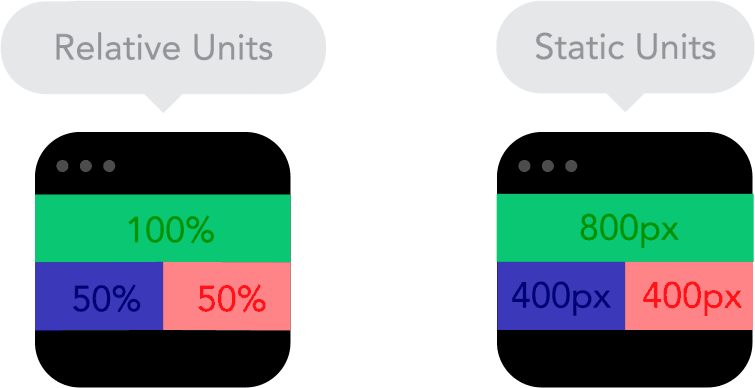

## Tipografías

La elección de una tipografía adecuada, su tamaño, color, espacio entre letras, interlineado y otras características pueden variar mucho, de forma consciente o inconsciente, la percepción en la que una persona interpreta o accede a los contenidos de una página.

CSS define numerosas propiedades para modificar la apariencia del texto. A pesar de que no dispone de tantas posibilidades como los lenguajes y programas específicos para crear documentos impresos, CSS permite aplicar estilos complejos y muy variados al texto de las páginas web.

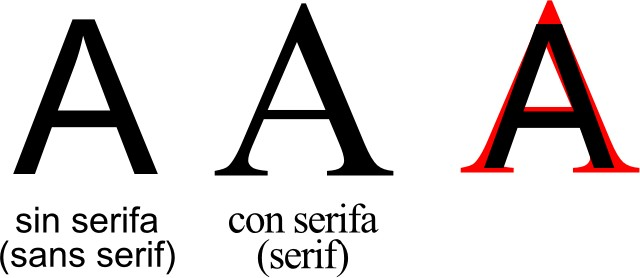

### Propiedades básicas

Existe un amplio abanico de propiedades CSS para modificar las características básicas de las tipografías a utilizar.

| **Propiedad**    | **Valor**                              | **Significado**                                               |
|------------------|----------------------------------------|---------------------------------------------------------------|
| font-family      | fuente                                 | Indica el nombre de la fuente (tipografía) a usar.            |
| font-size        |                                        | Indica el tamaño de la fuente.                                |
| font-style       | **normal** \| italic \| oblique        | Indica el estilo de la fuente.                                |
| font-weight      | peso                                   | Indica el peso (grosor) de la fuente (100-800).               |
|  text-decoration | none \| underline \| overline \| color | Para decoración como subrayado o tachado con color específico |

### Familia tipográfica

```tip
Con esta propiedad, denominada *font-family* , podemos seleccionar cualquier tipografía simplemente escribiendo su nombre.
```

El tipo de letra del texto se puede indicar de dos formas diferentes:

-   Mediante el nombre específico de la fuente: como por ejemplo "*Arial* " o "*Verdana*".
-   Mediante el **nombre genérico** de una familia tipográfica: los nombres genéricos no se refieren a ninguna fuente en concreto, sino que hacen referencia al estilo del tipo de letra. Las familias genéricas definidas son serif (pj *Times New Roman*), sans-serif (pj *Arial*), cursive (pj Comic Sans), fantasy (pj *Impact*) y monospace (pj *Courier New*).

```html
        h3 {
        font-family: sans-serif;
        }
```

Las fuentes específicas sólo se visualizarán **si el usuario las tiene instaladas en su sistema o dispositivo**. En caso contrario, se usará otra tipografía sustituta disponible en el sistema.

Para evitar el problema común de que el usuario no tenga instalada la fuente que quiere utilizar el diseñador, CSS permite indicar en la propiedad font-family más de un tipo de letra (en forma de serie). El navegador probará en primer lugar con el primer tipo de letra indicado.

Algunas series de fuentes se utilizan tan a menudo que prácticamente se han convertido en un estándar:

    font-family: Arial, Helvetica, sans-serif; 
    font-family: "Times New Roman", Times, serif;
    font-family: "Courier New", Courier, monospace;

### Tamaño tipografía

```tip
La propiedad *font-size* permite especificar el tamaño de la tipografía.
```

| **Propiedad** | **Valor**                                                       | **Tipo de medida**                |
|---------------|-----------------------------------------------------------------|-----------------------------------|
| font-size     | xx-small \| x-small \| small \| **medium** \| large \| x- large | Absoluta (tamaño predefinido)     |
| font-size     | smaller \| larger                                               | Relativa (más pequeña/más grande) |
| font-size     |                                                                 | Específica (tamaño exacto)        |

Se pueden indicar tres tipos de valores:

-   Medidas absolutas: Palabras clave como medium que representan un tamaño medio (por defecto), small: tamaño pequeño, x-small: tamaño muy pequeño, etc...
-   Medidas relativas: Palabras clave como smaller que representan un tamaño un poco más pequeño que el actual, o larger, un tamaño un poco más grande que el actual.
-   Medida específica: indicando una unidad para especificar el tamaño concreto de la tipografía

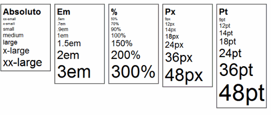


### Peso de la tipografía

```tip
El **peso** de la fuente, especificado mediante font-weight, que no es más que el grosor de la misma.
```

| **Propiedad** | **Valor**                                     | **Significado**                              |
|---------------|-----------------------------------------------|----------------------------------------------|
| font-weight   | **normal** \| bold                            | Medidas absolutas (predefinidas)             |
| font-weight   | bolder \| lighter                             | Medidas relativas (dependen de la actual)    |
|  font-weight  | *Peso* 100, 200, 300, 400, 500, 600, 700, 800 | Medida específica (número del peso concreto) |

### Estilo de la tipografía

```tip
Se puede también aplicar estilos a la tipografía mediante la propiedad *font-style*.
```

| **Valor** | **Tipo de medida**                                                                       |
|-----------|------------------------------------------------------------------------------------------|
| Normal    | Estilo normal, por defecto. Sin cambios aparentes.                                       |
| Italic    | Cursiva. Estilo caracterizado por una ligera inclinación de las letras hacia la derecha. |
| Oblique   | Oblícua. Idem al anterior, salvo que esta inclinación se realiza de forma artificial.    |

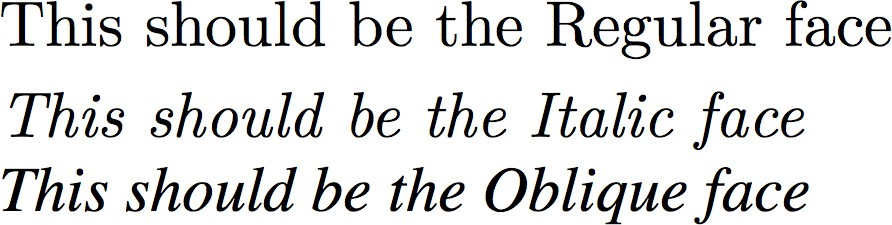

## Colores

```tip
Para establecer **colores** en CSS se utiliza la propiedad *color*.
```

Se pueden establecer el valor de un color mediante varias formas diferentes, aunque el método más habitual es el del RGB hexadecimal.

| **Nombre**         | **Formato**                   | **Ejemplo**           |
|--------------------|-------------------------------|-----------------------|
| Palabra clave      | [palabra clave]               | red                   |
| RGB numérico       | rgb(rojo, verde, azul)        | rgb(255, 0, 0)        |
| RGB con canal alfa | rgba(rojo, verde, azul, alfa) | rgba(255, 0, 0, 0.25) |
| RGB hexadecimal    | \#RRGGBB                      | \#ff0000              |
| Formato HSL        | hsl(hue,saturation,lightness) | hsl(180deg 50% 25%);  |

### Palabra clave color

CSS define **17 palabras clave** para referirse a los colores básicos. Las palabras se corresponden con el nombre en inglés de cada color:

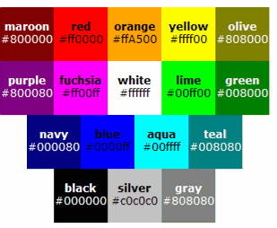

Las distintas revisiones de CSS han agregado muchos más palabras clave, las cuales pueden consultarse en <https://developer.mozilla.org/es/docs/Web/CSS/color_value>

### Colores del sistema

Además de las palabras clave anteriores, también existen otras palabras clave para hacer referencia a ciertos colores establecidos por el propio sistema operativo.

| **Nombre**   | **Descripción**                                             |
|--------------|-------------------------------------------------------------|
| canvas       | Color de fondo del contenido de una aplicación o documento. |
| canvastext   | Color de texto de una aplicación o documento.               |
| linktext     | Enlace no visitado y no activo.                             |
| visitedtext  | Enlace ya visitado.                                         |
| activetext   | Enlace activo.                                              |
| buttonface   | Color de fondo de un botón pulsable.                        |
| buttontext   | Color de texto de un botón pulsable.                        |
| buttonborder | El color del borde un botón pulsable.                       |
| field        | Color de fondo de campos de texto \<input\>.                |

### RGB decimal y hexadecimal

En el modelo **RGB decimal** un color se define indicando sus tres componentes R (rojo), G (verde) y B (azul). Cada una de las componentes puede tomar un valor entre cero y el valor máximo de 255.

    p { 
    color: rgb(60, 25, 200); 
    }


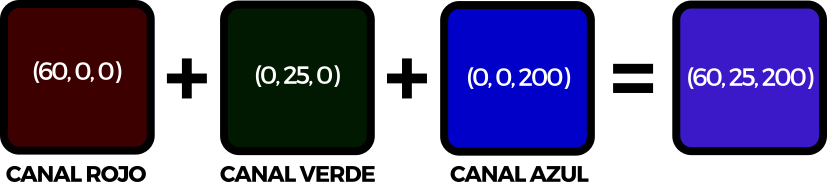

El **RGB hexadecimal** convierte los valores de cada elemento a valor hexadecimal y le añade delante la almohadilla, de la forma: \#RRGGBB

```css
    body { 
    background-color: #4762B0;
    color: #000; 
    }
```

### RGB con canal alpha

Los canales alpha permiten establecer una **transparencia** parcial en determinados colores. En lugar de rgb() indicamos rgba() para establecer que usaremos un canal alfa. 

Posteriormente, en lugar de establecer 3 parámetros (rojo, verde, azul), añadiremos uno más, que será el canal **alfa**. Dicho canal alfa será un valor (del 0 al 1 con decimales) o un porcentaje (del 0% al 100%).

```css
    div { 
    rgba(0 0 0 / 50%);
    }
```

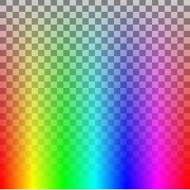

### Formato HSL

Las siglas HSL significan **matiz** (*Hur*), **saturación** (*Saturation*) y **brillo** (*Lightness*). La primera cifra selecciona el matiz de color (una cifra de 0 a 360 grados), seleccionando el color del círculo exterior de la imagen. Por su parte, las dos siguientes, son el porcentaje de saturación y el brillo del color, respectivamente (*ambos, porcentajes de 0% a 100%*).

```css
    div.nav { 
    color: hsl(120deg 25% 75%); 
    }
```

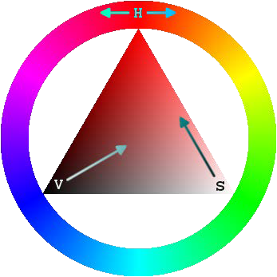

Los códigos de colores HSL también pueden tener transparencia alpha añadiéndola al final, como en RGB; el 0 indica transparencia total y 1 indica transparencia nula.

## Colisión de estilos

En las hojas de estilos complejas, es habitual que varias reglas CSS se apliquen a un mismo elemento HTML.

Es por ello que CSS tiene un método concreto para resolver las colisiones de estilos que veremos en la próxima unidad.

El mecanismo simplificado que se puede aplicar es el siguiente:

1.  Cuanto más **específico** sea un selector, más importancia tiene su regla asociada.
2.  A idéntica *especificidad*, se considera la última regla indicada en CSS. 

Por ejemplo, ante la siguiente regla:

```css
    p { color: red; }
    p { color: blue; }
```

Prevalecerá la última, en este caso el azul (blue).

## Herencia

```note
💡 La herencia en CSS es el mecanismo mediante el cual determinadas propiedades de un elemento padre en CSS se transmiten a sus hijos. 
```


No todas las propiedades CSS son heredadas, porque algunas de ellas no tendría sentido que lo fueran. Por ejemplo, los márgenes no se heredan porque es poco probable que un elemento hijo necesite los mismos márgenes que su padre.

Mediante la herencia, por ejemplo, se pueden especificar las propiedades de las fuentes de los elementos html o body y todo el resto de elementos los heredarán. Se pueden especificar los colores de fondo y de primer plano de un elemento contenedor concreto y todos los elementos hijos de este contenedor heredarán automáticamente el color de primer plano. El color de fondo no se hereda, pero el valor inicial de background-color (color de fondo) es transparent, lo cual significa que el fondo del padre se verá a través de él.

El hecho de que las propiedades heredadas tengan algún efecto o no depende de otros factores, como veremos más adelante cuando hablemos de la **cascada**.

Cascada y herencia son dos conceptos frecuentemente confundidos como veremos posteriormente, pero son diferentes. La herencia se refiere a los estilos que son aplicados de manera **indirecta**.

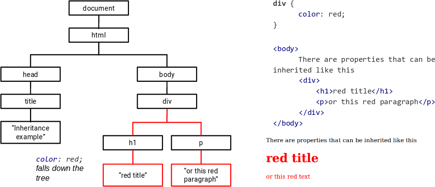

### Propiedades heredadas

En general las propiedades heredadas son las que pertenecen principalmente a **texto**: color, font, font-family, font-size, font-weight, font-variant, font-style, line-height, letter-spacing, text-align, text-indent, text-transform,white- space, y word-spacing.

También se heredan algunas otras, como las propiedades de la **lista**:

list-style, list-style-type, list-style-position, y list-style-image.

Las propiedades del **borde de la tabla**, border-collapse y border-spacing, también se heredan.

### Propiedades no heredadas

La herencia no siempre se aplica, ya que para muchas propiedades la herencia tendría un efecto negativo en la apariencia de una página complicando su diseño.

Tal y como comentamos por ejemplo, tanto los márgenes, como el *padding* y los bordes, entre otras propiedades que veremos en la unidad siguiente, no son heredadables y no tendría sentido que así fuera.
