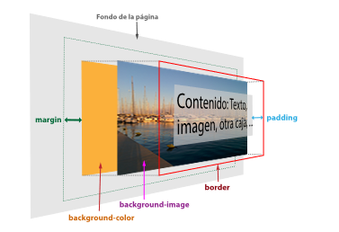
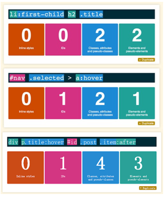
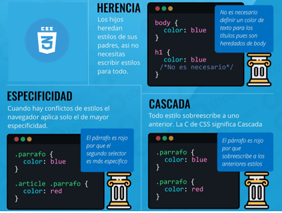

# UT4.3 Hojas de estilo CSS

## Modelo de cajas

```note
El **modelo de cajas** es una de las características más importantes de las hojas de estilos ya que los elementos de HTML están contenidos en cajas rectangulares. 
```

La etiqueta *body* es la caja principal dentro de la cual se van colocando las cajas de las etiquetas que se van creando, las cajas pueden estar unas dentro de otras, al lado de otras, o superponer.


 

Respecto a sus valores por defecto:

-   El atributo **border** tiene inicialmente siempre el valor cero.
-   Los valores por defecto del **margin** y del **padding** no son siempre cero. Sus valores dependen de los navegadores web, aunque son similares en la mayoría de los casos.

```tip
El **padding** y el **margin** siempre son siempre transparentes, y dejan ver la imagen de fondo y el color de fondo de su propia caja.
```

-  La etiqueta párrafo *p* tiene unos valores de *1em* por defecto para los márgenes superior e inferior, y un valor cero para los márgenes derecho e izquierdo. 
Esto tiene sentido porque si no fuese así, dos párrafos quedarían pegados entre sí, no habría diferencia entre un salto de línea y un párrafo.


-   Sin embargo, en otros casos lo correcto es no tener ningún valor por defecto en el **margin**, ni en el **padding**. En el caso de los contenedores *div* no esperamos encontrar ningún margen por defecto.


```warning
🔗 Desde el siguiente enlace podemos repasar y practicar el [modelo de cajas en CSS](https://web.dev/learn/css/box-model/)
```

### Zonas de los elementos

En CSS existen ciertas palabras clave para hacer referencia a una zona u orientación concreta sobre un elemento y muy útiles para definir propiedades de los elementos del modelo de cajas:


### Anchura y altura

```tip
La propiedad que controla la **anchura** de la caja de los elementos se denomina *width*.
```

| **Propiedad** | **Valor**                                         | **Significado**                     |
|---------------|---------------------------------------------------|-------------------------------------|
| width         | unidad de medida \| porcentaje \| auto \| inherit | Establece la anchura de un elemento |

La propiedad *width* no admite valores negativos y los valores en porcentaje se calculan a partir de la anchura de su elemento padre. El valor **inherit** indica que la anchura del elemento se hereda de su elemento padre.

El valor *inherit* indica que la altura del elemento se hereda de su elemento padre. El valor auto, que es el que se utiliza si no se establece de forma explícita un valor a esta propiedad, indica que el navegador debe calcular automáticamente la altura del elemento, teniendo en cuenta sus contenidos y el sitio disponible en la página.

```tip
La propiedad que controla la **altura** de la caja de los elementos es *height*.
```

| **Propiedad** | **Valor**                                         | **Significado**                    |
|---------------|---------------------------------------------------|------------------------------------|
| height        | unidad de medida \| porcentaje \| auto \| inherit | Establece la altura de un elemento |

Al igual que sucede con *width*, la propiedad *height* no admite valores negativos. Si se indica un porcentaje, se toma como referencia la altura del elemento padre. Si el elemento padre no tiene una altura definida explícitamente, se asigna el valor **auto** a la altura.

## Margin y padding

El tamaño de dichos **márgenes** se puede alterar en conjunto (*de forma general*) o de forma específica a cada una de las zonas vistas anteriormente:

| **Propiedad** | **Valor**        | **Significado**                               |
|---------------|------------------|-----------------------------------------------|
| margin-top    | **auto** \| size | Establece un tamaño de margen superior.       |
| margin-left   | **auto** \| size | Establece un tamaño de margen a la izquierda. |
| margin-right  | **auto** \| size | Establece un tamaño de margen a la derecha.   |
| margin-bottom | **auto** \| size | Establece un tamaño de margen inferior.       |

Podemos aplicar diferentes márgenes a cada zona de un elemento utilizando cada una de estas propiedades, o dejando al navegador que lo haga de forma automática indicando el valor **auto**.

Y de forma similar para el **padding**:

| **Propiedad** | **Valor**     | **Significado**                                                    |
|---------------|---------------|--------------------------------------------------------------------|
| margin-top    | **0** \| size | Aplica un relleno interior en el espacio superior de un elemento.  |
| margin-left   | **0** \| size | Aplica un relleno interior en el espacio izquierdo de un elemento. |
| margin-right  | **0** \| size | Aplica un relleno interior en el espacio derecho de un elemento.   |
| margin-bottom | **0** \| size | Aplica un relleno interior en el espacio inferior de un elemento.  |

Como se puede ver en la tabla, por defecto no hay relleno (*el relleno está a cero*), aunque puede modificarse tanto con las propiedades anteriores como la propiedad de atajo que veremos a continuación.

💡 El **margin** y el **padding** se pueden especificar de <u>forma compacta</u>:

| **Nº parámetros** | **Significado**                                          | **Ejemplo**                   |
|-------------------|----------------------------------------------------------|-------------------------------|
| 1 parámetro       | Aplica el mismo margen a **todos** los lados.            | **margin:15px**               |
| 2 parámetros      | Aplica margen **top/bottom** y **left/right**.           | **margin:15px 25px**          |
| 3 parámetros      | Aplica margen **top**, **left/right** y **bottom**.      | **margin:5px 15px 25px**      |
| 4 parámetros      | Aplica margen **top**, **right**, **bottom** y **left**. | **margin:5px 15px 25px 35px** |

Existe un truco para **centrar horizontalmente** cualquier elemento en pantalla con las propiedades vistas hasta ahora. Basta con aplicar un ancho fijo al contenedor; *width: 500px* (*por ejemplo*) y luego aplicar un *margin: auto*. De esta forma, el navegador, al conocer el tamaño del elemento (y por omisión, el resto del tamaño de la ventana) se encarga de repartirlo equitativamente entre el margen izquierdo y el margen derecho, quedando centrado el elemento.


### Márgenes adyacentes

💡 Los **márgenes verticales** pueden **solaparse** cuando tenemos dos elementos adyacentes, lo que puede dar lugar a resultados inesperados. Esto no ocurre en el caso de los márgenes izquierdo y derecho.


Así pues en el caso de **margin-top** y el **margin-bottom** de elementos adyacentes se aplicaría el mayor de los dos:


Se pueden especificar márgenes negativos pero el efecto que producen es que se superpogan con la caja adyacente, pudiendo llegar a solaparse los contenidos.


### Bordes

Las propiedades básicas y específicas de los **bordes** en CSS son las siguientes:

| **Propiedad** | **Valor**                      | **Significado**                                                        |
|---------------|--------------------------------|------------------------------------------------------------------------|
| border-color  | **black** \| color             | Especifica el color que se utilizará en el borde.                      |
| border-width  | thin \| **medium** \| thick \| | Especifica un tamaño predefinido para el grosor del borde.             |
|  border-style | **none** \| style              | Define el estilo para el borde a utilizar (los veremos a continuación) |

💡 La propiedad *border-style* podemos aplicar un estilo determinado al borde de un elemento. En estilo de borde podemos elegir cualquiera de las siguientes opciones:

| **Valor** | **Descripción**                                                        | **Diseño**                                       |
|-----------|------------------------------------------------------------------------|--------------------------------------------------|
| solid     | Establece un borde sólido (línea continua).                            |   |
| dotted    | Establece un borde basado en puntos.                                   |                                                  |
| dashed    | Establece un borde basado en rayas (línea discontinua).                |                                                  |
| double    | Establece un borde doble (dos líneas continuas).                       |                                                  |
| groove    | Establece un borde biselado con luz desde arriba.                      |                                                  |
| ridge     | Establece un borde biselado con luz desde abajo. Opuesto a **groove**. |                                                  |
| inset     | Establece un borde con profundidad *hacia dentro*                      |                                                  |
| outset    | Establece un borde con profundidad *hacia fuera*. Opuesto a **inset**. |                                                  |
| hidden    | Oculto. Idéntico a none, salvo para conflictos con tablas.             |                                                  |

Al igual que con otras propiedades CSS, podemos utilizar la propiedad de atajo border, con la que podemos hacer un resumen y no necesitar indicar múltiples propiedades individuales por separado, realizando el proceso de forma más corta:

| **Propiedad** | **Valor**              | **Ejemplo**                 |
|---------------|------------------------|-----------------------------|
| border        | size \| style \| color | border: 1px solid \#000000; |

También se puede utilizar propiedades para bordes específicos y combinarlos junto con la herencia vista previamente:

```css
    div {
    border-bottom-width: 2px;
    border-bottom-style: dotted;
    border-bottom-color: black;
    }
```

### Fondo

```tip
Dentro del modelo de cajas el **fondo** está formado por dos elementos opcionales, la imagen de fondo y el color de fondo. El contenido está delante de ambos. 
```

Por defecto, tanto la imagen como el color de fondo llegan hasta el border, a continuación tenemos el margin que separa esta caja de las adyacentes.

 

Las imágenes de fondo se establecen con la propiedad *background-image*

| **Propiedad**    | **Valor**       | **Significado**                                    |
|------------------|-----------------|----------------------------------------------------|
| background-image | **none**        | No utiliza ninguna imagen de fondo.                |
| background-image | url(imagen.jpg) | Usa la imagen de nombre **imagen.jpg** como fondo. |

Y esta puede personalizar a su vez con las siguientes propiedades:

| **Propiedad**         | **Valor**  | **Significado**                                             |
|-----------------------|------------|-------------------------------------------------------------|
| background-repeat     | **repeat** | Repite la imagen de fondo horizontal y verticalmente.       |
|                       | no-repeat  | La imagen de fondo no se repite.                            |
| background-attachment | **scroll** | Cuando hacemos scroll la imagen de fondo se desplaza.       |
|                       | fixed      | Cuando hacemos scroll, la imagen de fondo permanece fija.   |
| background-position   |            | 1 parámetro. Desplaza la imagen de fondo al punto (x, 50%). |
|                       |            | 2 parámetros. Desplaza la imagen de fondo al punto (x, y).  |

## Cascada

```tip
Uno de los conceptos principales más importantes de las hojas de estilo CSS es el concepto denominado **cascada**.
```

El navegador, para saber que bloque de estilos tiene prioridad sobre los demás, analiza <u>por orden</u> tres conceptos clave del código CSS que veremos a continuación:

1.  Su **importancia**
2.  Su **especificidad**
3.  Su **orden**

### Importancia

La **importancia** de un código CSS se determina dependiendo de las hojas de estilo donde está colocado. Generalmente, no necesitaremos preocuparnos de este factor, pero siempre es una buena idea conocer como funciona.

Existen varios tipos de hojas de estilo, de menor a mayor importancia:

1.  **Agente de usuario**: son los estilos CSS que aplica cada **navegador** propio por defecto.

2.  **CSS de usuario**: son los estilos CSS que pudiera añadir el **usuario**, por razones de personalización.

3.  **CSS de autor**: son los estilos CSS que coloca el autor o  **desarrollador** de la página.


Aunque no es recomendable utilizarlo frecuentemente, se puede añadir al final de cada regla el texto **!important**, consiguiendo que la regla en cuestión tenga prioridad sobre las demás, independientemente del nivel en el que estén.

### Especificidad

```tip
Si la importancia no elimina la ambigüedad de un CSS, se pasa a determinar la **especificidad** de los selectores CSS, que es uno de los criterios más importantes de la cascada de CSS (y también más desconocido).
```

Para determinar la especificidad de un selector, se sigue un cálculo basado en 4 componentes ordenados de **mayor a menor** especificidad que veremos a continuación:

*Estilos inline IDs Clases Elementos*

En resumen, cada categoría tendrá un valor de 0 a 1 que le dará un valor de especificidad a cada propiedad CSS utilizada:

| **Posición** | **Nombre**     | **Descripción**                                                                     |
|--------------|----------------|-------------------------------------------------------------------------------------|
| **1**        | Estilos inline | **Estilos** aplicados mediante un atributo *style*.                                 |
| **2**        | IDs            | Número de veces que aparece un **id** en el selector.                               |
| **3**        | Clases         | Número de veces que aparece una **clase**, *pseudoclase* o atributo en el selector. |
| **4**        | Elementos      | Número de veces que aparece un **elemento** o un *pseudoelementos* en el selector.  |


Ejemplos de especificidad resueltos:




```warning
🔗 Desde el siguiente enlace podemos practicar con una [calculadora de especificidad](https://specificity.keegan.st/)
```

Algunos ejemplos más con su valor de especificidad:

 

### Orden

Si sigue habiendo empate tras aplicar las reglas de importancia y de especificidad vistas anteriormente, entonces se aplica la regla del **orden** del código: se aplicará el selector que se haya definido más recientemente.

    .intro h2 { 
        color: blue;
    }

    h2.new { 
        color: lime;
    }


El modo <u>inspector</u> de los navegadores (**F12**) puede ayudar a ver colisiones de reglas en código, mostrando como tachadas las colisiones no aplicadas de menor preferencia.


---

```warning
🔗 Desde el siguiente enlace podemos repasar y practicar la [cascada en CSS (importancia orden y especificidad)](https://web.dev/learn/css/the-cascade/)
```

Para resumir, los **3 pilares** de CSS vistos:




