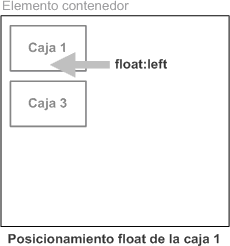

# UT4.4 Posicionamiento y maquetación CSS

## Maquetación CSS

Una de las partes más complejas de CSS, probablemente sea la colocación y distribución de los elementos de una página, también conocida como **maquetación**.

Sin embargo, suele resultar difícil si no se conocen bien todos los detalles particulares que componen CSS que estudiaremos a continuación a través de los distintos tipo de **posicionamientos** de elementos en un navegador.


### Etiquetas semánticas en HTML

HTML hace uso de **etiquetas semánticas** (*nav, header, aside, footer..)* ya conocidas por nosotros, mediante las cuales describe el significado del contenido, permitiendo que los documentos HTML sean más claros para los desarrolladores y que son la clave para ayudar en el proceso de maquetación de contenidos de cualquier interfaz web.


## Posicionamiento en CSS


El posicionamiento de una 'caja' se establece mediante la propiedad *position*, excepto para el flotante, *flexbox* y *grid* que veremos más adelante:

| **Valores** | **Significado**                                                                                                                                                                                                                                                                   |
|-------------|-----------------------------------------------------------------------------------------------------------------------------------------------------------------------------------------------------------------------------------------------------------------------------------|
| static      | Se corresponde con el posicionamiento normal o estático. Si se utiliza este valor, se ignoran los valores de las propiedades top, right, bottom y left.                                                                                                                           |
| relative    | En el posicionamiento relativo, el desplazamiento de la caja se controla con las propiedades top, right, bottom y left respecto a su posición original.                                                                                                                           |
|  absolute   | En el posicionamiento absoluto, el desplazamiento de la caja también se controla con las propiedades top, right, bottom y left, pero su interpretación es más compleja, ya que el origen de coordenadas del desplazamiento depende del posicionamiento de su elemento contenedor. |
|  fixed      | El desplazamiento se establece de la misma forma que en el posicionamiento absoluto, pero en este caso el elemento permanece inamovible en la pantalla y en relación con la ventana del navegador.                                                                                |

### Posicionamiento normal (static)

```tip
El posicionamiento **normal** o **estático** es el modelo que utilizan por defecto los navegadores para mostrar los elementos de las páginas. En este modelo, sólo se tiene en cuenta si el elemento es de bloque o en línea, sus propiedades *width* y *height* y su contenido y **no se tienen en cuenta** top, right, bottom o left.
```

Los elementos de **bloque** forman lo que CSS denomina contextos de formato de bloque. En este tipo de contextos, las cajas se muestran una debajo de otra comenzando desde el principio del elemento contenedor. La distancia entre las cajas se controla mediante los márgenes verticales.


En principio, se parte de dos tipos básicos: *inline* y *block*.

| **Valor** | **Denominación**    | **Significado**                                                            | **Ejemplo** |
|-----------|---------------------|----------------------------------------------------------------------------|-------------|
|  inline   |  Elemento en línea  | El elemento se coloca en horizontal (un elemento a continuación del otro). |  \<span\>   |
|  block    |  Elemento en bloque | El elemento se coloca en vertical (un elemento encima de otro).            |  \<div\>    |

💡 Obsérvese que por defecto, todos los elementos *\<div\>* son elementos de bloque (block) y todos los elementos *\<span\>* son elementos en línea (*inline*)

### Posicionamiento relativo (relative)

```tip
En el posicionamiento **relativo** los elementos se colocan igual que en el estático (permanecen en la misma posición), pero dependiendo del valor de las propiedades *top*, *bottom*, *left* o *right* variaremos ligeramente la posición del elemento.
```

El valor de la propiedad *top* se interpreta como el desplazamiento entre el borde superior de la caja en su posición final y el borde superior de la misma caja en su posición original.

De la misma forma, el valor de las propiedades *left*, *right* y *bottom* indica respectivamente el desplazamiento entre el borde izquierdo/derecho/inferior de la caja en su posición final y el borde izquierdo/derecho/inferior de la caja original.


### Posicionamiento absoluto (absolute)

```tip
El posicionamiento **absoluto** se emplea para establecer de forma exacta la posición en la que se muestra la caja de un elemento pero utilizando un elemento como **referencia** (generalmente el elemento contenedor padre).
```

La posición de la caja se indica mediante las propiedades top, right, bottom y left. La interpretación de los valores de estas propiedades es más compleja, ya que en este caso dependen del posicionamiento del elemento contenedor.

Cuando una caja se posiciona de forma absoluta, el resto de elementos de la página se ven afectados y modifican su posición. Cuando se posiciona de forma absoluta una caja es probable que se produzcan solapamientos con otras cajas.


### Posicionamiento fijo (fixed)

```tip
Cuando una caja se posiciona de forma **fija**, la forma de obtener el origen de coordenadas para interpretar su desplazamiento es idéntica al posicionamiento absoluto.
```

De hecho, si el usuario no mueve la página HTML en la ventana del navegador, no existe ninguna diferencia entre estos dos modelos de posicionamiento. Se coloca el elemento en relación con la ventana del navegador.

El posicionamiento fijo hace que las cajas no modifiquen su posición ni aunque el usuario suba o baje la página en la ventana de su navegador.

Aunque el usuario haga *scroll* y se desplace hacia abajo en una página web, el elemento seguirá en el mismo sitio posicionado. Esta característica puede ser útil para crear encabezados o pies de página en páginas HTML.


### Posicionamiento flotante (float)

El posicionamiento **flotante** es un posicionamiento relativamente complejo de entender y problemático de utilizar. Cuando una caja se posiciona con el modelo de posicionamiento flotante, automáticamente se convierte en una **caja flotante**, lo que significa que se desplaza hasta la zona más a la izquierda o más a la derecha de la posición en la que originalmente se encontraba.



No se usa la propiedad *position*, si no que usaremos las siguientes propiedades:

| **Propiedad** | **Valor**                         | **Significado**                                                      |
|---------------|-----------------------------------|----------------------------------------------------------------------|
| float         | **none** \| left \| right         | Cambia el flujo para que el elemento flote a la izquierda o derecha. |
| clear         | **none** \| left \| right \| both | Impide que los elementos puedan flotar en la orientación indicada.   |


### Posicionamiento flotante (float)

Uno de los principales motivos para la creación del posicionamiento flotante fue colocar imágenes alrededor de las cuales fluye el texto. Los elementos que se encuentran alrededor de una caja flotante adaptan sus contenidos para que fluyan alrededor del elemento posicionado.

💡 Con la propiedad *clear* se consigue que un contenido no fluya alrededor de un contenido *float* sino que se muestre debajo.


### Posicionamiento z-index

```tip
La propiedad **z-index** en CSS sirve para regular el orden de visualización de capas superpuestas.
```

Es un valor numérico que tendrá más prioridad cuanto mayor sea. Sólo funciona con elementos que tengan algún tipo de posicionamiento (relativo, absoluto o fijo).


### CSS Flexbox

**Flexbox** ha supuesto toda una revolución respecto a los métodos vistos anteriormente ya que permite olvidar los mecanismos de posicionamiento clásicos y acostumbrarnos a una mecánica más potente, limpia y personalizable, en la que los elementos HTML se adaptan y colocan automáticamente y es más fácil personalizar los diseños.

En todo caso, Flexbox nos permite, con atributos muy variados, conseguir que los elementos se ordenen en columnas o filas y conseguir que se alineen de la manera que necesitemos, con facilidad, sin complicaciones ni necesidad de trucos (hacks CSS).


La estructura de Flexbox se compone de contenedores padre e hijos (Contenedor-Flex y Elementos-Flex respectivamente) colocados en una sola dimensión:


### CSS Grid Layout

Esta es la herramienta definitiva para maquetación y creación de layouts avanzados, dando todas las posibilidades imaginadas a los diseñadores web.

CSS Grid layout permite definir una plantilla organizada en filas y columnas, destinando el espacio que necesitemos para cada elemento de la página, de una manera muy versátil.

Los elementos se pueden posicionar en cualquier lugar de la rejilla y podemos conseguir que su posición en la página sea totalmente diferente a cómo aparecen en el código HTML.


Grid parte de la filosofía y bases de Flebox. Para utilizar Grid CSS necesitaremos tener en cuenta una serie de conceptos que veremos más adelante.


### Flexbox vs Grid Layout


## CSS Flexbox

Los <u>elementos</u> básicos de **Flexbox** son los siguientes:


-   **Contenedor**: Elemento padre que tendrá en su interior cada uno de los ítems flexibles.
-   **Eje principal**: Los contenedores flexibles tendrán una orientación principal específica. Por defecto, es en horizontal (en fila).
-   **Eje secundario**: De la misma forma, los contenedores flexibles tendrán una orientación secundaria, perpendicular a la principal. Si la principal es en horizontal, la secundaria será en vertical, y viceversa.
-   **Ítem**: Cada uno de los hijos flexibles que tendrá el contenedor en su interior.

💡 Si queremos utilizar las propiedades de Flexbox tendremos que definirlo mediante la propiedad **display** y su valor **flex** o **flex-inline** dentro del selector que nosotros definamos, que será nuestro elemento padre o contenedor-flex.

💡 La propiedad flex no se hereda desde el contenedor donde es aplicada.

```css
.contendor-padre {
 display: flex;
}
```


### Dirección de los ejes: flex-direction

```tip
**flex-direction** es la propiedad encargada de definir el eje principal y secundario de los elementos hijos. Los ejes pueden ser verticales o ser horizontales formando filas.
```

 


Si **flex-direction:row** entonces el margen inicial del eje principal quedará a la izquierda, y el margen final a la derecha.


### Dirección de los ejes: flex-wrap

```tip
Flex trata de disponer de los elementos en una misma línea, si no es el caso, **flex-wrap** tratará de ordenar los elementos en más de una fila o columna.
```

| **Propiedad** | **Valor**                          | **Significado**                                |
|---------------|------------------------------------|------------------------------------------------|
| flex-wrap     | **nowrap** \| wrap \| wrap-reverse | Evita o permite el desbordamiento (multilínea) |


 


### Dirección de los ejes: flex-flow

```tip
Existe una propiedad de atajo (short-hand) llamada **flex-flow**, con la que podemos resumir los valores de las propiedades **flex-direction** y **flex-wrap** anteriores.
```

```css
    .contenedor {
    /*flex-flow: <flex-direction> <flex-wrap>;*/
    flex-flow: row wrap;
    }
```

### Alineación: justify-content

```tip
**justify-content** permite distribuir los elementos respecto al eje horizontal.
```

| **Propiedad**   | **Valor**                                                             | **Eje**    |
|-----------------|-----------------------------------------------------------------------|------------|
| justify-content | **flex-start** \| flex-end \| center \| space-between \| space-around | horizontal |


### Alineación: align-items

```tip
**align-items** permite distribuir los elementos respecto al eje vertical.
```

| **Propiedad** | **Valor**                                                   | **Eje**  |
|---------------|-------------------------------------------------------------|----------|
| align-items   | flex-start \| flex-end \| center \| **stretch** \| baseline | vertical |


### Alineación: align-content

```tip
**align-content** alinea las filas interiores respecto el eje vertical. Para poder usarse es necesario tener definido **flex-wrap** como *wrap* o *wrap-reverse* y tener varias líneas.
```

| **Propiedad** | **Valor**                                                                        | **Eje**  |
|---------------|----------------------------------------------------------------------------------|----------|
| align-content | flex-start \| flex-end \| center \| space-between \| space-around \| **stretch** | vertical |

  

### Propiedades de los hijos

Las siguientes propiedades, en vez de sobre los **contenedores**, se aplican sobre los ítems **hijos.**

| **Propiedad** | **Valor**           | **Descripción**                                                          |
|---------------|---------------------|--------------------------------------------------------------------------|
| flex-grow     | **0** \| número     | Número que indica el factor de crecimiento del ítem respecto al resto.   |
| flex-shrink   | **1** \| número     | Número que indica el factor de decrecimiento del ítem respecto al resto. |
| flex-basis    | Size \| **content** | Tamaño base de los ítems antes de aplicar variación.                     |
| order         | **0** \| número     | Número (peso) que indica el orden de aparición de los ítems.             |

*flex-grow*

*flex-shrink*

### Propiedades de los hijos: grow, shrink

La propiedad **flex-grow** se utiliza para indicar el factor de crecimiento de los ítems en el caso de que no tengan un ancho específico. Por ejemplo, si con *flex-grow* indicamos un valor 1 a todos sus ítems, todos tendrán el mismo tamaño. Si colocamos un valor de 1 a todos, salvo a uno con el valor 2, ese ítem será más grande que los anteriores. Los ítems a los que no se le especifique ningún valor, tendrán por defecto valor de 0.


La propiedad **flex-shrink** es la opuesta a **flex-grow.** Los ítems que tengan un valor numérico más grande, serán más pequeños, mientras que los que tengan un valor numérico más pequeño serán más grandes.

### Propiedades de los hijos: basis

La propiedad **flex-basis**, define el tamaño por defecto (de base) que tendrán los ítems antes de aplicarle la distribución de espacio. Generalmente, se aplica un tamaño (unidades, porcentajes, etc...), pero también se puede aplicar la palabra clave **content** que ajusta automáticamente el tamaño al contenido del ítem.

Si el valor que se pone a flex-basis es 0, el espacio que haya interno a cada elemento no se respeta, sin embargo cuando es auto, sí y se distribuye.


### Propiedades de los hijos: order

La propiedad **order** cambia el orden predeterminado de los elementos flexibles que definimos con *flex-direction* y *flex-flow*. Sólo afecta a la representación visual de los elementos, por lo que no alterará la forma en la que los lectores de pantalla y otros agentes de usuario que no sean CSS leen el código fuente.

Por ejemplo, utilizaremos **order: -1** cuando queramos asegurarnos que ese ítem aparezca el primero. Se utilizan numerales, sin unidades. Además, cuando varios ítems comparten numeral, el orden de aparición será el del HTML original.


### Propiedades de los hijos

Se pueden simplificar dichas propiedades (un atajo) utilizando simplemente la etiqueta **flex**:

```css
.contenedor {
  flex-grow: 2;
  flex-shrink: 2;
  flex-basis: 100px;
}
```

```css
.contenedor {
  flex: 2 2 100px;
}
```

Otra propiedad que nos puede ser útil en ciertas circunstancias es la propiedad **gap**. Con gap podremos controlar el espacio entre los elementos usados en flexbox.


```css
.contenedor {
  display: inline-flex;
  gap: 12px;
}
```


## CSS Grid

Los elementos **Grid** tal y como comentamos se distribuyen en 2 dimensiones:

-  **Contenedor**: El elemento padre contenedor que definirá la cuadrícula o rejilla.
-   **Ítem**: Cada uno de los hijos que contiene la cuadrícula (elemento contenedor).
-   **Celda** (*grid cell*): Cada uno de los cuadros de la cuadrícula.
-   **Área** (*grid area*): Región o conjunto de celdas de la cuadrícula.
-   **Banda** (*grid track*): Banda horizontal o vertical de celdas de la cuadrícula.
-   **Línea** (*grid line*): Separador horizontal o vertical de las celdas de la cuadrícula.


### Grid Container

Si queremos utilizar las propiedades de Grid tendremos que definirlo mediante la propiedad **display,** de igual forma que en **flex,** y especificar el valor **grid** o **grid-inline**.

```css
.contenedor-padre {
  display: grid;
}
```


#### Grid template

Es posible crear cuadrículas con un tamaño concreto en Grid. Para ello, sólo tenemos que usar las propiedades CSS **grid-template-columns**, **grid-template-rows** o directamente **grid-template** indicando las dimensiones de cada celda, columnas y filas:

| **Propiedad**         | **Valor**                             | **Descripción**                                   |
|-----------------------|---------------------------------------|---------------------------------------------------|
| grid-template-columns | *[col1] [col2] ...*                   | Establece el de cada columna (*col 1, col 2...).* |
| grid-template-rows    | *[fila1] [fila2] ...*                 | Establece el de cada fila (*fila 1, fila 2...).*  |
| grid-template         | *[fila1] [fila2].. / [col1] [col2]..* | Establece filas y columnas separadas por /        |


Por ejemplo, dado el siguiente código CSS, se obtendrá la siguiente distribución de la figura:

```css
.grid {
  display: grid;
  grid-template-columns: 50px 300px;
  grid-template-rows: 200px 75px;
}
```


Las propiedades **grid-template-rows** y **grid-template-columns** pueden simplificarse en una sola, llamada **grid-template**, usando como separador el **/**

```css
.grid {
  grid-template: 90px 90px 80px / 80px 150px;}
```


#### Unidad fr

```tip
Grid utiliza una unidad de medida especial llamada **fr** (*fraction*), que simboliza la **fracción de espacio restante** en el grid.
```

Así por ejemplo, el siguiente código CSS, obtendrá la distribución de la figura:

```css
.grid {
  display: grid;
  grid-template-rows: 2fr 1fr;
  grid-template-columns: 1fr 1fr;
}
```


💡 Las unidades **fr** y **auto** de las rejillas grid, a simple vista pueden parecer idénticas en ciertos casos, pero realmente no lo son. 

Aunque ambas gestionan automáticamente el espacio, tienen algunas diferencias:

-   **fr** significa que se toma una fracción del espacio disponible para las columnas o filas. Todas tienen el mismo tamaño.
-   **auto** lo que hace primero es calcular automáticamente el espacio necesario para cada uno de las columnas para que entre su contenido. Si sobra espacio se reparte por igual entre las filas o columnas, pero a partir del tamaño calculado en función de los contenidos que ya existentes. Por tanto no se adapta siempre equitativamente, ya que dependerá del contenido.

#### La función repeat()

Las propiedades que definen el número de filas y columnas en una cuadrícula pueden tomar una función como valor. La función **repeat**() es una de ellas. La función *repeat* () se creó específicamente para CSS Grid.

Así por ejemplo podremos sustituir la siguiente línea:

```css
.grid {
  grid-template-columns: 100px 100px 100px;
}
```

Por esta:

```css
.grid {
  grid-template-columns: repeat(3, 100px);
}
```

#### La función minmax()

Existe otra función útil en Grid, es **minmax**(). Dicha función sirve para definir un valor dentro de un mínimo y un máximo, de la fila o columna afectada.

De esta forma dicha fila o columna tendrá siempre un valor mínimo o máximo del que no pueda bajar o subir, aunque se redimensione la ventana.

```css
.grid {
  grid-template-columns: 200px minmax(100px, 500px);
}
```

#### La función auto-fill

```tip
La función **auto-fill** le indica al navegador que inserte el número de columnas o filas que sea necesario para rellenar el espacio.
```

Podríamos escribir la siguiente línea de código:

```css
.grid {
  grid-template-columns: repeat (auto-fill, minmax (150px, 1fr)
}
```

Lo que querría decir aquí la función *auto-fill* en este caso es que el navegador puede ubicar el número de columnas que quepan en el ancho, mientras que su ancho mínimo sea de 150px. Entonces, cuando la pantalla cambie de tamaño, el navegador modificará automáticamente el número de columnas que haya según el ancho disponible.

#### Posicionamiento contenedor en Grid

Al igual que en Flexbox, también existen las propiedades **justify-content** y **align-content** en Grid y que afectan al contenido del contendor:

| **Propiedad**   | **Valores**                                                                        |
|-----------------|------------------------------------------------------------------------------------|
| justify-content | start \| end \| center \| stretch \| space-around \| space-between \| space-evenly |
| align-content   | start \| end \| center \| stretch \| space-around \| space-between \| space-evenly |


#### Espacios entre filas/columnas: gap

Por defecto, la cuadrícula tiene todas sus celdas pegadas a sus celdas contiguas. Aunque sería posible darle un *margin* a las celdas dentro del contenedor, lo adecuado sería utilizar la propiedad **gap**, o sus correspondientes **column-gap** y **row-gap.**

Por ejemplo:

```css
.grid {
  column-gap: 10px;
  row-gap: 15px;
}
```


```css
.grid {
  gap: 100px 10px;
}
```


### Grid Items

#### Posicionamiento items en grid

Para los elementos (**ítems**) dentro del contenedor también podremos utilizar las propiedades **justify-items** y **align-items**

| **Propiedad** | **Valores**                           | **Descripción**                                |
|---------------|---------------------------------------|------------------------------------------------|
| justify-items | start \| end \| center \| **stretch** | Distribuye los elementos en el eje horizontal. |
| align-items   | start \| end \| center \| **stretch** | Distribuye los elementos en el eje vertical.   |

#### Espacios entre filas/columnas: span

También podemos utilizar la palabra clave **span**, para extender el tamaño de celdas de nuestros ítems en horizontal o vertical.

Por ejemplo, **span 2** quiere decir que el ítem se extiende exactamente dos celdas, fuera el que fuera el tamaño de esta.

```css
.item3 {
  grid-column: span 3;
}
```


```css
.item4 {
  grid-column: span 3;
  grid-row: span 2;
}
```


#### Grid con filas/columnas nombradas

Cuando declaramos un Grid, a cada línea se le asigna un número índice por defecto:


No obstante, tenemos la posibilidad de ponerle nombre a las líneas de nuestro sistema Grid. Así por ejemplo nombraremos las posiciones del eje *X0...Xn y* del eje *Y0...Yn*:

```css
.grid {
  display: grid;
  grid-template-columns: [x0] 1fr [x1] 1fr [x2] 1fr [x3];
  grid-template-rows: [y0] 1fr [y1] 1fr [y2] 1fr [y3];
```


#### Expandir o delimitar zonas

Una vez aplicados nombres, se pueden delimitar que zonas del *grid* queremos que ocupe cada uno de nuestros bloques. Para ello usaremos las propiedades:

    grid-column-start, grid-column-end y grid-row-start, grid-row-end.

```html
 .header {
  background: lightcoral;
  grid-column-start: x0;
  grid-column-end: x3; }
.sidebar {
  background: grey;
  grid-row: y1 / y2;
  color: white; }
.content {
  background: orange;
  grid-column: x1 / x3;
  grid-row: y1 / y2; }
.footer {
  background: green;
  grid-column: x0 / x3;
  grid-row: y2; }
```

 

#### Expandir o delimitar zonas

        grid-column-start, grid-column-end se abrevia utilizando grid-column inicio/fin
        grid-column-start, grid-column-end se abrevia utilizando grid-row  inicio/fin


#### Grid por áreas

Mediante Grids es posible indicar el nombre y posición concreta de cada **área** de una cuadrícula.

-   Para ello utilizaremos primeramente la propiedad **grid-template-areas**, donde debemos especificar el orden de las áreas en la cuadrícula.
-   Posteriormente, en cada ítem hijo, utilizamos la propiedad **grid-area** para indicar el nombre del área del que se trata:

| **Propiedad**       | **Descripción**                                                                              |
|---------------------|----------------------------------------------------------------------------------------------|
| grid-template-areas | Indica la disposición de las áreas en el grid. Cada texto entre comillas simboliza una fila. |
| grid-area           | Indica el nombre del área. Se usa sobre ítems hijos del grid.                                |

```css
grid-template-areas: 
    "header header header"
    "main main sidebar"
    "footer footer footer";
}
```

Una vez definidas las áreas hay que asignárselas a cada elemento de la cuadrícula. Mediante áreas es sencillo crear una cuadrícula altamente personalizada en unas cuantas líneas de CSS, con flexibilidad en la disposición y posición de cada área:


Para dejar un espacio intermedio vacío en ciertas áreas, usaremos el comodín punto **.**

```css
.grid {
  display: grid;
  grid-template-columns: repeat(5, 1fr);
  grid-template-areas: "header header header header header"
                       "ads main main . sidebar"
                       "footer footer footer footer footer";
}
```


## Responsive web Design

```note
El **Responsive web design** o diseño web adaptativo, es una filosofía de diseño y desarrollo cuyo objetivo es adaptar la apariencia de las páginas web al dispositivo que se esté utilizando para visitarlas.
```

Mediante el uso de estructuras flexibles que ya hemos visto (como Flexbox o Grid) y las *Media Queries* que veremos a continuación, podemos adaptar a la apariencia de diferentes dispositivos. Las Media Queries sirven para adaptar de forma más concreta un sitio web al dispositivo en el que se vaya abrir, siempre que persistan diferencias entre ellos. No obstante, haciendo un buen uso de CSS pueden conseguirse también resultados similares a las Media Queries que suelen agregar complejidad añadida.


### Media queries

Las **Media queries** son una sintaxis especial para CSS que nos permite definir unos estilos que solo se aplicarán en el caso de que se cumplan unas condiciones definidas. Podemos asimilarlos a unas líneas de código opcional, que sólo se mostrarán para algunos usuarios o dispositivos.

 

Se definen especificando que queremos aplicar los estilos CSS para tipos de medios concretos; **screen**: sólo en pantallas, que es el caso más común y del modelo de sintaxis a continuación:

```css
@media screen and (*condición*) {
  /* reglas CSS */
  /* reglas CSS */
}

@media screen and not (*condición*) {
  /* reglas CSS */
  /* reglas CSS */
}
```

Para definir las **condiciones** existen los siguientes tipos de características que podemos evaluar:

| **Condición** | **Valores**           | **Definición de aplicación**                                    |
|---------------|-----------------------|-----------------------------------------------------------------|
| width         | size                  | Si el dispositivo tiene el tamaño indicado exactamente.         |
| min-width     | size                  | Si el dispositivo tiene un tamaño de ancho mayor al indicado.   |
| max-width     | size                  | Si el dispositivo tiene un tamaño de ancho menor al indicado.   |
| aspect-ratio  | aspect-ratio          | Si el dispositivo encaja con la proporción de aspecto indicada. |
| orientation   | landscape \| portrait | Si el dispositivo está en colocado en modo vertical o apaisado. |


Ejemplo de **Media queries** para diferentes resoluciones:

```css
@media screen and (max-width: 640px) {
  .menu {
    background: blue;
  }
}

@media screen and (min-width: 640px) and (max-width: 1280px) {
  .menu {
    background: red;
  }
}

@media screen and (min-width: 1280px) {
  .menu {
    background: green;
  }
}
```
