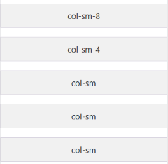

# UT 5.1 Bootstrap

## Introducción a Bootstrap

```note
Bootstrap es un framework CSS (y JS) utilizado para el desarrollo de interfaces web de forma estandarizada para que se adapten a cualquier dispositivo.
```

Bootstrap se desarrolló inicialmente por Twitter en 2010, para estandarizar las herramientas de desarrollo de la compañía.

Inicialmente, se llamó Twitter *Blueprint* y, un poco más tarde, en 2011, se transformó en código abierto y su nombre cambió para Bootstrap. Desde entonces se ha ido actualizado continuamente y ya se encuentra por la **versión 5**, con la que trabajaremos.

Bootstrap combina CSS y JavaScript para estilizar los elementos de una página HTML y proporcionarle interactividad respetando el principio de diseño responsive en todo momento. La documentación está disponible en <https://getbootstrap.com/docs/5.3>


Bootstrap sigue el concepto de **mobile first**. Esto significa que la preocupación del framework es primero desarrollar una página que funcione perfectamente en dispositivos móviles y luego en el escritorio.

Bootstrap además está plentamente basado en **Flexbox** y *CSS3*.

Las funciones disponibles en Bootstrap ofrecen una experiencia rica al usuario. Además Bootstrap se basa en las tendencias de diseño utilizadas en este momento.

Características de Bootstrap:

-   Mobile First
-   Sistema Grid responsive
-   Componentes (navbar, card, botones, etc)
-   Javascript plugins
-   Compatibilidad con Sass

## CDN

La manera más sencilla de comenzar con *Bootstrap 5* es utilizar un **CDN.** (*Content Delivery Network*) Consiste por tanto en utilizar un servidor donde se alojan todos los archivos de Bootstrap.

Agregaremos el siguiente código en nuestro esqueleto de la página HTML principal:

```html
    <link href="https://cdn.jsdelivr.net/npm/bootstrap@5.0.0-beta1/dist/css/bootstrap.min.css" rel="stylesheet" integrity="sha384-giJF6kkoqNQ00vy+HMDP7azOuL0xtbfIcaT9wjKHr8RbDVddVHyTfAAsrekwKmP1" crossorigin="anonymous"/>
```

Las ventajas de utilizar esta forma de cargar Bootstrap son:

-   Reducir la carga de nuestros servidores (importante si utilizamos un hosting compartido con recursos limitado)
-   Facilita que Bootstap 5 quede en caché del navegador y se vuelva a cargar cada vez que se visita una web que lo utilice.
-   Reduce la latencia.

## Cuadrícula (Grid)

Bootstrap incluye un potente sistema de rejillas (grid) para la construcción de diseños de todas las formas y tamaños.

Bootstrap utiliza un modelo de cuadrícula basado en dos tipos de contenedores y una rejilla de hasta **12 columnas** (con Flexbox) con varios niveles que resulta muy flexible, y que como veremos podemos también alterar cuando nos resulte conveniente.

El sistema de cuadrícula utiliza tres clases CSS principales para crear el diseño necesario:

.**container**, .**row** y .**col**. El contenedor cubre el diseño completo, luego las filas y luego las columnas.


En el siguiente ejemplo se crea tres columnas de igual ancho en todos los dispositivos usando las clases anteriores. Esas columnas están centradas en la página con el **.container** principal. Debemos utilizar la clase **row** para indicar el comienzo de una fila. Dentro de la fila dispondremos tantos **div** como columnas tenga dicha fila.

```html
    <div class="container"> 
    <div class="row"> 
        <div class="col"> 
        Columna 
        </div> 
        <div class="col"> 
        Columna 
        </div> 
        <div class="col"> 
        Columna 
        </div> 
    </div>
```


Para indicar el tamaño de columna debemos utilizar la siguiente sintaxis:

    col-\#

El valor del **\#** será uno entre **1 y 12**. El restante del valor indicado será el que debamos de distribuir entre el resto de columnas (sumando 12).

```html
    <div class="container"> 
    <div class="row"> 
        <div class="col-2"> 
        Columna-2 
        </div> 
        <div class="col-4"> 
        Columna-4
        </div> 
        <div class="col-6"> 
        Columna-6
        </div> 
    </div>
```


### Breakpoints

El sistema de cuadrícula de Bootstrap puede a su vez adaptarse a seis **breakpoints**

predeterminados basados en *media queries*:


De esta manera el prefijo de clases cambiará a *col-{breakpoint}* tal y como se muestra en la siguiente tabla:

|                      |  **\<576px** | **sm** **≥576px** | **md** **≥768px** | **lg** **≥992px** | **xl** **≥1200px** | **xxl** **≥1400px** |
|----------------------|--------------|-------------------|-------------------|-------------------|--------------------|---------------------|
| Contenedor max-width | Por defecto  | 576px             | 768px             | 992px             | 1200px             | 1400px              |
| Prefijo de clase     | **.col-\#**  | **.col-sm-\#**    | **.col-md-\#**    | **.col-lg-\#**    | **.col-xl-\#**     | **.col-xxl-\#**     |
| \# de columnas       | 12           |                   |                   |                   |                    |                     |


Usando un solo conjunto de clases *.col-sm-\#,* se puede crear un sistema de cuadrícula básico que comience apilado (por defecto) siempre que sea menor que **sm** y tenga la siguiente distribución de dos filas a partir del breakpoint pequeño (sm).

```html
    <div class="container"> 
    <div class="row"> 
        <div class="col-sm-8">col-sm-8</div> 
        <div class="col-sm-4">col-sm-4</div> 
    </div> 
    <div class="row"> 
        <div class="col-sm">col-sm</div> 
        <div class="col-sm">col-sm</div> 
        <div class="col-sm">col-sm</div> 
    </div> 
    </div>
```




Se pueden hacer combinaciones según diferentes tamaños (para sm y xl) y así obtener:

```html
    <div class="container"> 
      <div class="row"> 
       <div class="col-xl-3 col-sm-5 background">columna1<p> Lorem ipsum dolor sit amet,   consectetur adipiscing elit, sed do eiusmod tempor incididunt.</p></div> 
       <div class="col-xl-9 col-sm-7 background">columna2<p> Lorem ipsum dolor sit amet, consectetur adipiscing elit, sed do eiusmod tempor.</p></div> 
       </div> 
    </div>
```


 

 
 ### Columnas de fila


Para establecer un número columnas predeterminadas, se pueden utilizar las clases responsive **.row-cols-\#** y así establecer rápidamente la cantidad de columnas que mejor representen el contenido y diseño.

Mientras que las clases .col-\# normales se aplican a las columnas las de columnas de fila se establecen en el **.row** principal.

```html
    <div class="row row-cols-2"> 
     <div class="col">Columna</div> 
     <div class="col">Columna</div> 
     <div class="col">Columna</div> 
     <div class="col">Columna</div>
    </div> 
```


### Anidamientos

Para **anidar** el contenido con la cuadrícula predeterminada, se debe agregar un nuevo .row y un conjunto de columnas **.col-\#** dentro de una columna **col-\#** ya existente. Las filas anidadas deben incluir un conjunto de columnas que sumen 12 o menos, aunque no es obligatorio usar las 12 columnas disponibles en los anidamientos.

```html
    <div class="row"> 
    <div class="col-lg-6"> 
    <h1>Columna 2</h1> 
    <div class="row"> 
        <div class="col-lg-6"> <h2>Columna 2a</h2> </div> 
        <div class="col-lg-6"> <h2>Columna 2b</h2> </div> 
        </div> 
    </div>
```


### Glutter

Los **gutters** son el padding horizontal entre las columnas, que se utilizan para espaciar y alinear de manera responsive el contenido en el sistema de cuadrícula de Bootstrap.

Las clases **.gx-\#** se pueden usar para controlar los anchos de los gutters horizontales.

```html
    <div class="container px-4"> 
    <div class="row gx-5"> 
    <div class="col"> 
    <div class="p-3 border bg-light">Padding de columna personalizado</div>
    </div>
    <div class="col"> 
    <div class="p-3 border bg-light">Padding de columna personalizado</div> 
    </div> 
    </div> 
    </div>
```


### Espacios en blanco (offset)

Para generar espacios en blanco (*offsets*) podemos utilizar la clase **.offset-\#**

Con dicha clase moveremos las columnas a la derecha tantas posiciones como el número indicado en la clase **.offset-\#**

```html
    <div class="row">
    <div class="col-md-4">.col-md-4</div>
    <div class="col-md-4 offset-md-4">.col-md-4 .offset-md-4</div>
    </div>
```


### Alineación: align-content

Bootstrap trae también la posibilidad de alinear las columnas en forma vertical con las regla de estilo que provee **Flexbox** CSS en el que está basado, el **align-content**.


 

### Alineación: justify-content

La propiedad **jusfify-content** funciona al igual que en Flexbox alineando en horizontal:


## Contenido

### La clase table

Con solo utilizar la clase **table** en nuestro código dentro del elemento **table** (\<table class="**table**"\>) podemos obtener lo siguiente directamente:


Las reglas que define Bootstrap 5 permiten mostrar las filas separadas por una línea horizontal, los textos de la cabecera en negrita y la tabla se expandirá por defecto a todo su contenedor.

Pueden utilizarse numerosas clases auxiliares (table-primary, table-secondary, table-danger) para darle formato a color a las filas o columnas de una **table** y que pueden consultarse en la página de documentación de Bootstrap.


### Botones

Para crear botones en Bootstrap se utilizará "*button*", y alguna de las siguientes **clases**

listadas a continuación con la siguiente apariencia.


Utilizar este estándar ayuda a que los visitantes se sientan cómodos navegando ya que seguramente sus colores/formas les sean familiares de otros sitios/interfaces.

### Imágenes

Las imágenes en Bootstrap se hacen responsive con **.img-fluid**. Esto aplica un **max-width: 100%** y **height: auto** a la imagen para que se escale con el ancho de su elemento padre.

    


Las siguientes clases se utilizan para personalizar la apariencia de **imágenes** en BS:


```html
    
    
    
```


