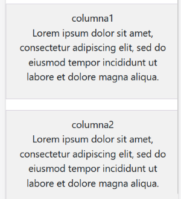
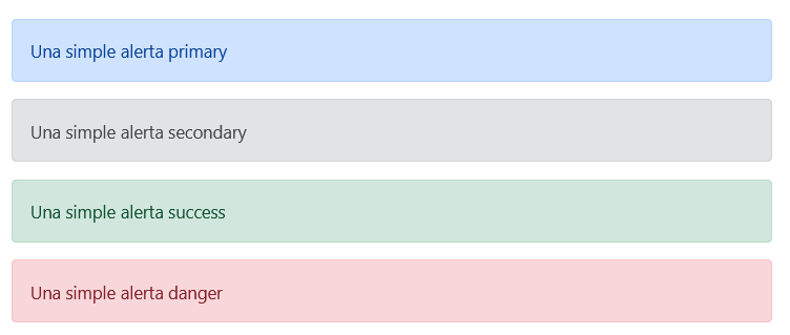
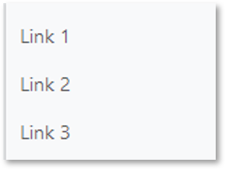
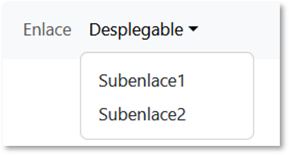
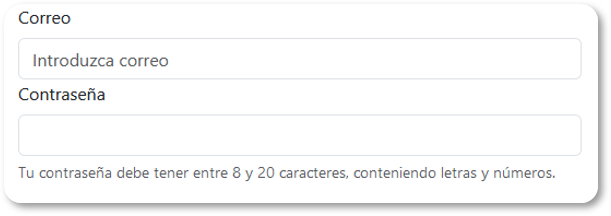
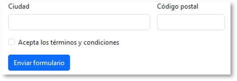

# UT5.1 Bootstrap

📕 [Contenido en presentación PDF](/pdf/UT5.1 - Bootstrap.pdf)

## Introducción a Bootstrap

```note
Bootstrap es un framework CSS (y JS) utilizado para el desarrollo de interfaces web de forma estandarizada para que se adapten a cualquier dispositivo.
```

Bootstrap se desarrolló inicialmente por Twitter en 2010, para estandarizar las herramientas de desarrollo de la compañía.

Inicialmente, se llamó Twitter *Blueprint* y, un poco más tarde, en 2011, se transformó en código abierto y su nombre cambió para Bootstrap. Desde entonces se ha ido actualizado continuamente y ya se encuentra por la **versión 5**, con la que trabajaremos.

Bootstrap combina CSS y JavaScript para estilizar los elementos de una página HTML y proporcionarle interactividad respetando el principio de diseño responsive en todo momento. 

La documentación está disponible en <https://getbootstrap.com/docs/5.3>


Bootstrap sigue el concepto de **mobile first**. Esto significa que la preocupación del framework es primero desarrollar una página que funcione perfectamente en dispositivos móviles y luego en el escritorio.

Bootstrap además está plentamente basado en **Flexbox** y *CSS3*.

Las funciones disponibles en Bootstrap ofrecen una experiencia rica al usuario. Además Bootstrap se basa en las tendencias de diseño utilizadas en este momento.

Características de Bootstrap:

-   Mobile First
-   Basado en Flexbox
-   Sistema Grid responsive
-   Variedad de componentes propios: navbar, card, botones, formularios, etc
-   Tipografía receptiva (adaptable según el dispositivo)
-   Compatibilidad con Javascript nativo y con plugins adicionales.
-   Compatibilidad con Sass

## CDN

La manera más sencilla de comenzar con *Bootstrap 5* es utilizar un **CDN.** (*Content Delivery Network*), es decir, un servidor donde se alojan todos los archivos de Bootstrap.

Usaremos el CDN de jsDelivr, apuntando a la versión 5.3.0 de Boostrap. Agregaremos el siguiente código en nuestro esqueleto de la página HTML principal:


```html
   <link href="https://cdn.jsdelivr.net/npm/bootstrap@5.3.0/dist/css/bootstrap.min.css" rel="stylesheet" >

```
💡 Se puede cambiar de versión de la URL según las necesidades.

Para la parte de Javascript también se puede agregar la URL de un CND, pero desde Bootstrap 5 ya no es necesario para funcionalidades básicas.

Las ventajas de utilizar esta forma de cargar Bootstrap son:

-   Reducir la carga de los servidores propios (importante si utilizamos un hosting compartido con recursos limitados)
-   Facilita que Bootstap 5 quede en caché del navegador y se vuelva a cargar cada vez que se visita una web que lo utilice.

## Cuadrícula (Grid)

Bootstrap incluye un potente sistema de rejillas (grid) para la construcción de diseños de todas las formas y tamaños.

Bootstrap utiliza un modelo de cuadrícula basado en dos tipos de contenedores y una rejilla de hasta **12 columnas** (con Flexbox) con varios niveles que resulta muy flexible, y que como veremos podemos también alterar cuando nos resulte conveniente.

El sistema de cuadrícula utiliza tres clases CSS principales para crear el diseño necesario:

.**container**, .**row** y .**col**. El contenedor cubre el diseño completo, luego las filas y luego las columnas.


En el siguiente ejemplo se crea tres columnas de igual ancho en todos los dispositivos usando las clases anteriores. Esas columnas están centradas en la página con el **.container** principal. Debemos utilizar la clase **row** para indicar el comienzo de una fila. Dentro de la fila dispondremos tantos **div** como columnas tenga dicha fila.

```html
    <div class="container"> 
    <div class="row"> 
        <div class="col"> 
        Columna 
        </div> 
        <div class="col"> 
        Columna 
        </div> 
        <div class="col"> 
        Columna 
        </div> 
    </div>
```


Para indicar el tamaño de columna debemos utilizar la siguiente sintaxis:

    col-\#

El valor del **\#** será uno entre **1 y 12**. El restante del valor indicado será el que debamos de distribuir entre el resto de columnas (sumando 12).

```html
    <div class="container"> 
    <div class="row"> 
        <div class="col-2"> 
        Columna-2 
        </div> 
        <div class="col-4"> 
        Columna-4
        </div> 
        <div class="col-6"> 
        Columna-6
        </div> 
    </div>
```


### Breakpoints

El sistema de cuadrícula de Bootstrap puede a su vez adaptarse a seis **breakpoints**

predeterminados basados en *media queries*:


De esta manera el prefijo de clases cambiará a *col-{breakpoint}* tal y como se muestra en la siguiente tabla:

|                      |  **\<576px** | **sm** **≥576px** | **md** **≥768px** | **lg** **≥992px** | **xl** **≥1200px** | **xxl** **≥1400px** |
|----------------------|--------------|-------------------|-------------------|-------------------|--------------------|---------------------|
| Contenedor max-width | Por defecto  | 576px             | 768px             | 992px             | 1200px             | 1400px              |
| Prefijo de clase     | **.col-\#**  | **.col-sm-\#**    | **.col-md-\#**    | **.col-lg-\#**    | **.col-xl-\#**     | **.col-xxl-\#**     |
| \# de columnas       | 12           |                   |                   |                   |                    |                     |


Usando un solo conjunto de clases *.col-sm-\#,* se puede crear un sistema de cuadrícula básico que comience apilado (por defecto) siempre que sea menor que **sm** y tenga la siguiente distribución de dos filas a partir del breakpoint pequeño (sm).

```html
    <div class="container"> 
    <div class="row"> 
        <div class="col-sm-8">col-sm-8</div> 
        <div class="col-sm-4">col-sm-4</div> 
    </div> 
    <div class="row"> 
        <div class="col-sm">col-sm</div> 
        <div class="col-sm">col-sm</div> 
        <div class="col-sm">col-sm</div> 
    </div> 
    </div>
```


Se pueden hacer combinaciones según diferentes tamaños (para sm y xl) y así obtener:

```html
    <div class="container"> 
      <div class="row"> 
       <div class="col-xl-3 col-sm-5 background">columna1<p> Lorem ipsum dolor sit amet,   consectetur adipiscing elit, sed do eiusmod tempor incididunt.</p></div> 
       <div class="col-xl-9 col-sm-7 background">columna2<p> Lorem ipsum dolor sit amet, consectetur adipiscing elit, sed do eiusmod tempor.</p></div> 
       </div> 
    </div>
```


 

 
 ### Columnas de fila


Para establecer un número columnas predeterminadas, se pueden utilizar las clases responsive **.row-cols-\#** y así establecer rápidamente la cantidad de columnas que mejor representen el contenido y diseño.

Mientras que las clases .col-\# normales se aplican a las columnas las de columnas de fila se establecen en el **.row** principal.

```html
    <div class="row row-cols-2"> 
     <div class="col">Columna</div> 
     <div class="col">Columna</div> 
     <div class="col">Columna</div> 
     <div class="col">Columna</div>
    </div> 
```


### Anidamientos

Para **anidar** el contenido con la cuadrícula predeterminada, se debe agregar un nuevo .row y un conjunto de columnas **.col-\#** dentro de una columna **col-\#** ya existente. Las filas anidadas deben incluir un conjunto de columnas que sumen 12 o menos, aunque no es obligatorio usar las 12 columnas disponibles en los anidamientos.

```html
    <div class="row"> 
    <div class="col-lg-6"> 
    <h1>Columna 2</h1> 
    <div class="row"> 
        <div class="col-lg-6"> <h2>Columna 2a</h2> </div> 
        <div class="col-lg-6"> <h2>Columna 2b</h2> </div> 
        </div> 
    </div>
```


### Glutter

Los **gutters** son el padding horizontal entre las columnas, que se utilizan para espaciar y alinear de manera responsive el contenido en el sistema de cuadrícula de Bootstrap.

Las clases **.gx-\#** se pueden usar para controlar los anchos de los gutters horizontales.

```html
    <div class="container px-4"> 
    <div class="row gx-5"> 
    <div class="col"> 
    <div class="p-3 border bg-light">Padding de columna personalizado</div>
    </div>
    <div class="col"> 
    <div class="p-3 border bg-light">Padding de columna personalizado</div> 
    </div> 
    </div> 
    </div>
```


### Espacios en blanco (offset)

Para generar espacios en blanco (*offsets*) podemos utilizar la clase **.offset-\#**

Con dicha clase moveremos las columnas a la derecha tantas posiciones como el número indicado en la clase **.offset-\#**

```html
    <div class="row">
    <div class="col-md-4">.col-md-4</div>
    <div class="col-md-4 offset-md-4">.col-md-4 .offset-md-4</div>
    </div>
```


### Alineación: align-content

Bootstrap trae también la posibilidad de alinear las columnas en forma vertical con las regla de estilo que provee **Flexbox** CSS en el que está basado, el **align-content**.


 

### Alineación: justify-content

La propiedad **jusfify-content** funciona al igual que en Flexbox alineando en horizontal:


## Contenido

### La clase table

Con solo utilizar la clase **table** en nuestro código dentro del elemento **table** (\<table class="**table**"\>) podemos obtener lo siguiente directamente:


Las reglas que define Bootstrap 5 permiten mostrar las filas separadas por una línea horizontal, los textos de la cabecera en negrita y la tabla se expandirá por defecto a todo su contenedor.

Pueden utilizarse numerosas clases auxiliares (table-primary, table-secondary, table-danger) para darle formato a color a las filas o columnas de una **table** y que pueden consultarse en la página de documentación de Bootstrap.


### Botones

Para crear botones en Bootstrap se utilizará "*button*", y alguna de las siguientes **clases**

listadas a continuación con la siguiente apariencia.


Utilizar este estándar ayuda a que los visitantes se sientan cómodos navegando ya que seguramente sus colores/formas les sean familiares de otros sitios/interfaces.

### Imágenes

Las imágenes en Bootstrap se hacen responsive con **.img-fluid**. Esto aplica un **max-width: 100%** y **height: auto** a la imagen para que se escale con el ancho de su elemento padre.

```html
    
```


Las siguientes clases se utilizan para personalizar la apariencia de **imágenes** en BS:


```html
    
    
    
```

### Alertas

Las alertas están disponibles para cualquier longitud de texto. Para un estilo adecuado, se pueden usar una de las ocho clases contextuales obligatorias. Por ejemplo:

```html
    <div class="alert alert-primary" role="alert"> Una simple alerta primary </div> 
    <div class="alert alert-secondary" role="alert"> Una simple alerta secondary </div> 
    <div class="alert alert-success" role="alert"> Una simple alerta success </div> 
    <div class="alert alert-danger" role="alert"> Una simple alerta danger</div>
```



### Navbar

Un navbar es una barra de navegación superior responsive con menús, submenús, y otros componentes, como una barra de búsqueda entre otros, y que tiene las siguientes características:
- La barra de navegación es <u>adaptable</u> y fluida de forma predeterminada, lo que significa que se amplía o reduce en función de la anchura del viewport.
- Las navbars requieren un envoltorio *.navbar* con las clases *.navbar-expand{-sm|-md|-lg|-xl}*, que determinan cuándo se colapsa la barra en un sólo botón.
- Existen diversas clases para darle color a un navbar como *.bg-light* o *.bg-dark*.


Podemos crear una barra <u>estándar</u> con *\<nav class="navbar .navbar-expand{tamaño}">*

Para agregar **enlaces** dentro de la barra de navegación, usar el elementos *\<ul>* con la clase *class="navbar-nav"*. Luego agrega elementos *\<li>* con una clase *.nav-item* seguido de un elemento *\<a>* con una clase *.nav-link*:

```html
<nav class="navbar navbar-expand-sm bg-light"> 
<div class="container-fluid"> 
<ul class="navbar-nav"> 
<li class="nav-item"> <a class="nav-link" href="#">Link 1</a> </li> 
<li class="nav-item"> <a class="nav-link" href="#">Link 2</a> </li> 
<li class="nav-item"> <a class="nav-link" href="#">Link 3</a> </li> 
</ul> 
</div>
</nav>
```


Si eliminamos el *navbar-expand* tendremos un menú de navegación siempre en vertical:

```html
<nav class="navbar bg-light"> 
<div class="container-fluid"> 
<ul class="navbar-nav"> 
<li class="nav-item"> <a class="nav-link" href="#">Link 1</a> </li> 
<li class="nav-item"> <a class="nav-link" href="#">Link 2</a> </li> 
<li class="nav-item"> <a class="nav-link" href="#">Link 3</a> </li> 
</ul> 
</div>
</nav>
```



Para crear **submenús desplegables** dentro de un elemento de la barra de navegación indicaremos que el elemento es dropdown y dentro anidaremos un elemento ul con la clase dropdown-menú y dentro sus respectivos *\<li>* con sus respectivos enlaces *\<a>*.

```html
<nav class="navbar navbar-expand-sm bg-dark navbar-dark"> 
<div class="container-fluid"> 
    <div class="collapse navbar-collapse" id="collapsibleNavbar"> 
    <ul class="navbar-nav"> 
    <li class="nav-item"> <a class="nav-link" href="#">Enlace</a> </li> 
    <li class="nav-item dropdown"> <a class="nav-link dropdown-toggle" href="#" role="button" data-bs-toggle="dropdown">Desplegable</a> 
    <ul class="dropdown-menu"> 
        <li><a class="dropdown-item" href="#">Subenlace1</a></li> 
        <li><a class="dropdown-item" href="#">Subenlace2</a></li> 
    </ul> 
    </li> 
</ul> 
</div> 
</div> 
<nav>
```




## Formularios

Bootstrap aplica estilos a los elementos de tipo formulario para convertirlos en elementos responsive, mejorando su apariencia y permitiendo crear diferentes alineaciones como en el resto de elementos de Bootstrap ya vistos. 
La estructura básica de un formulario es la siguiente:

```html
<form> 
<div class="mb-3"> 
    <label for="exampleInputEmail1" class="form-label">Correo</label> 
    <input type="email" class="form-control" id="exampleInputEmail1" aria-describedby="emailHelp" placeholder="Introduzca correo"> 
    <label for="inputPassword5" class="form-label">Contraseña</label> 
    <input type="password" id="inputPassword5" class="form-control" aria-describedby="passwordHelpBlock"> 
    <div id="passwordHelpBlock" class="form-text"> Tu contraseña debe tener entre 8 y 20 caracteres, conteniendo letras y números.
</div> 
</form>
```



### Validaciones

La validación de formularios HTML se aplica a través de dos pseudoclases de CSS, *:invalid* y *:valid*. Se aplica a los elementos *\<input>*, *\<select>* y *\<textarea>*. Para los mensajes de feedback se puede combinar como *valid-feedback* o *invalid-feedback*.

```html
<form class="row g-3 needs-validation" novalidate> 
<div class="col-md-6"> 
    <label for="validationCustom03" class="form-label">Ciudad</label> 
    <input type="text" class="form-control" id="validationCustom03" required> 
    <div class="invalid-feedback"> Proporciona una ciudad válida. </div> 
</div> 
<div class="col-md-3"> 
    <label for="validationCustom05" class="form-label">Código postal</label> 
    <input type="text" class="form-control" id="validationCustom05" required>
    <div class="invalid-feedback"> Proporciona un código postal válido. </div> 
</div>
<div class="col-12"> <div class="form-check"> 
    <input class="form-check-input" type="checkbox" value="" id="invalidCheck" required> 
    <label class="form-check-label" for="invalidCheck"> Acepta los términos y condiciones </label> 
    <div class="invalid-feedback"> Debe estar de acuerdo antes de enviar. </div> 
</div> </div> 
<div class="col-12"> 
    <button class="btn btn-primary" type="submit">Enviar formulario</button>
</div> 
</form>
```

