# UT5.2 Introducción a Figma

📕 [Contenido en presentación PDF](/pdf/UT5.2 - Introducción a Figma.pdf)

## Figma

```note
Figma es un programa que se aloja en la web que ofrece herramientas para diseñar prototipos e interfaces de cualquier proyecto.
```

Es ideal para crear interfaces y prototipos de usuario tanto para la web, como para móvil o incluso wereables. Permite crear interacciones básicas, generar código para el traspaso (hand-off) e ilustración vectorial, aunque para esto no es la mejor herramienta.

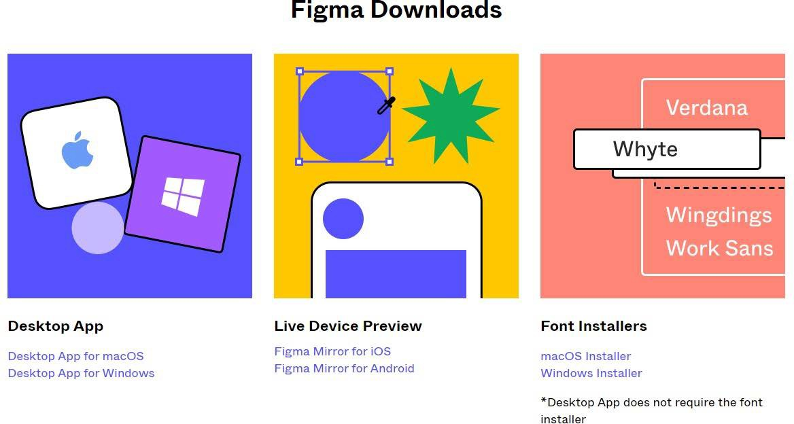

Figma fue diseñada para mejorar **el proceso de UX/UI** y, en general, el diseño de productos gracias a su funcionamiento principalmente online.

A través de **Figma** se pueden crear variedad de productos digitales como, por ejemplo, diseño de prototipos web y aplicaciones, diseño de interfaces, generación de código de la interfaz y otras funciones ampliadas por sus plugins.

En septiembre de 2022, Adobe anunció que había llegado a un acuerdo para adquirir Figma por unos 20.000 millones de dólares. Esta compra se criticó mucho en redes por motivos antimonopolio (en un intento de suplantar a su propio competidor Adobe XD) y por estar posiblemente sobrevalorada.

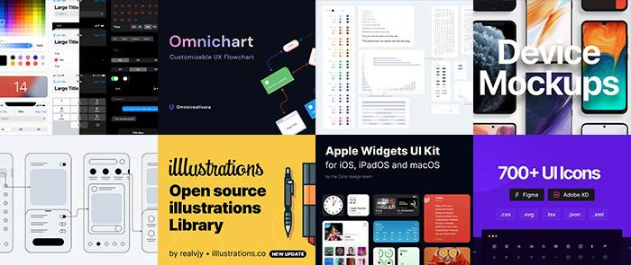

Características de Figma:

-   Fácil de usar y funcionalidad online en la nube.
-   Permite sistematizar los diseños, usar plantillas y alojarlos en la nube.
-   Colaborativo: compartición de proyectos con compañeros desde la nube.
-   Permite exportar en formatos estándar como *.pdf, .png, .jpg.*
-   Posee un editor de gráficos vectoriales integrado.
-   En su versión gratuita permite llevar a cabo 3 proyectos y 2 colaboradores por equipo.
-   Exportación de código CSS de los componentes.
-   Figma permite ampliar funcionalidades mediante sus variados **plugins**.

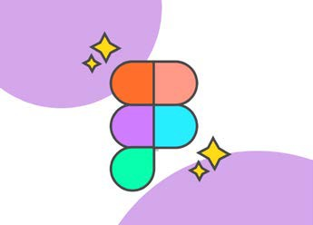

La interfaz de **Figma** es muy sencilla y trabajaremos con ella a continuación:

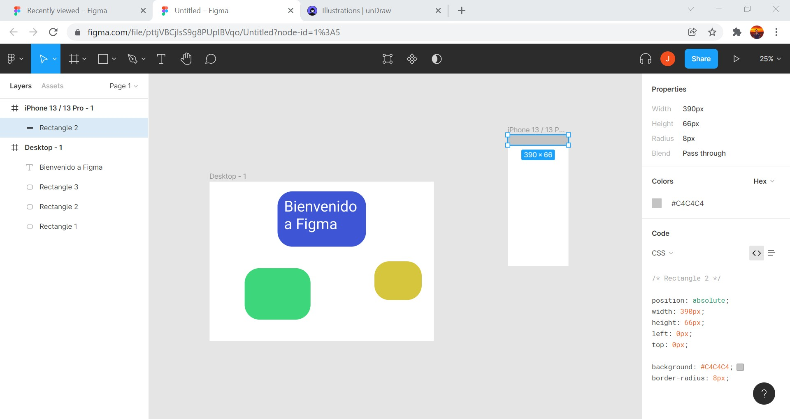

Podemos encontrar ayuda y documentación en <https://help.figma.com/hc/en-us/categories/>

### Interfaz principal

Desde la pantalla de la interfaz principal podremos acceder a nuestros proyectos así como la búsqueda de plantillas u otros elementos.

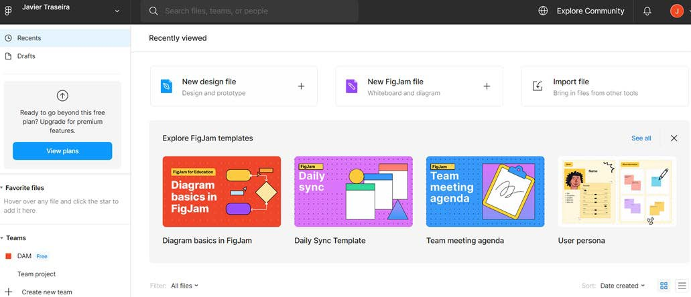

### Interfaz de diseño

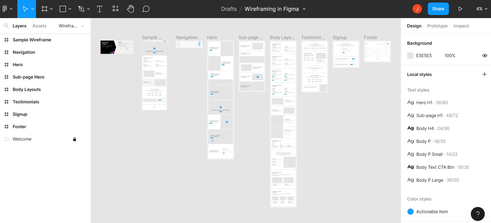 

### Tamaño nuevos frames

A la hora de crear un nuevo **frame** tenemos los siguientes tamaños predefinidos dentro de categorías: *Phone, Tablet, Desktop, Presentation, watch…*

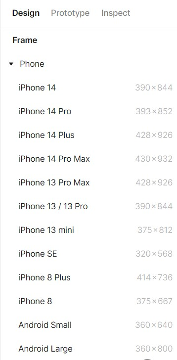
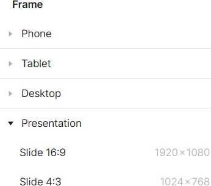

### Trabajo con guías

Por defecto las **guías** (*rules*) no vienen activadas y conviene activarlas ya que nos pueden ser útiles para alinear y ajustar los diseños. Se arrastran a continuación como líneas rojas desde la regla de pixels izquierda o desde la la superior.

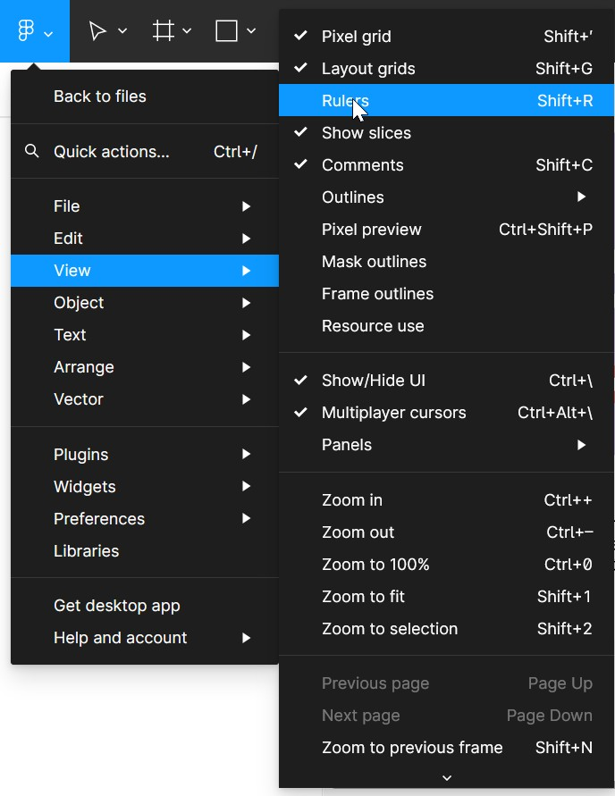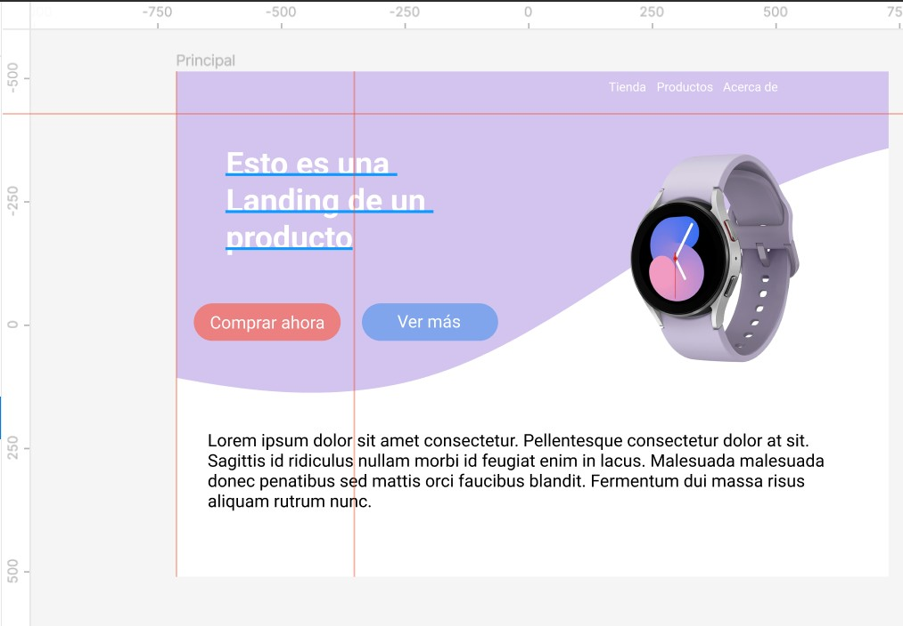

### Interactividad

Para añadir **interactividad** de navegación entre frames de un prototipo de interfaz hay que dejar marcada la pestaña **Prototype** de la derecha y *Creating a connection.* Luego deberemos hacer clic en el elemento desde el que añadir interactividad y a su derecha aparecerá un signo **+** y una flecha indicando el destino de la navegación.

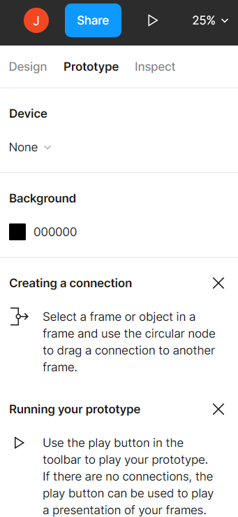
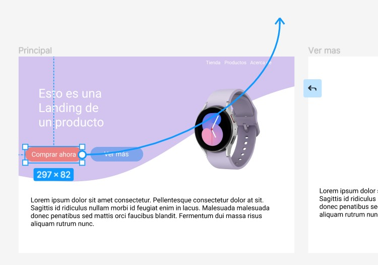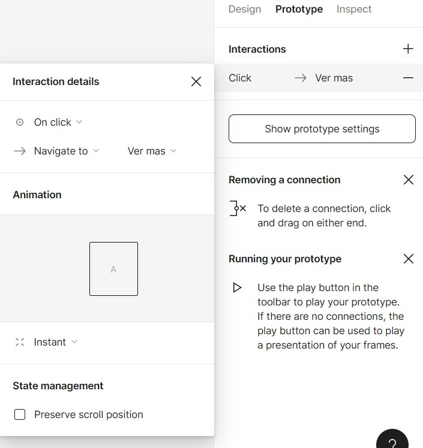

### Visualizar prototipo

Para visualizar el resultado de nuestro prototipo en el navegador o emulador de dispositivo, deberemos hacer clic en **play** en el menú de la derecha.

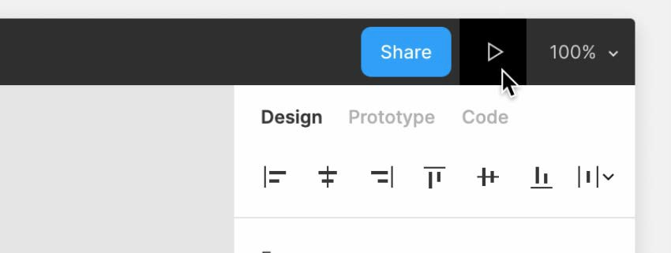

### Exportación de elementos

Los dibujos importados o gráficos vectoriales creados en Figma pueden **exportarse** a formato PNG, JPG, SVG o PNG mediante la herramienta de exportación una vez seleccionados.

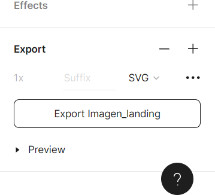

### Pluggins

Existe un amplio abanico de **plugins** disponibles para instalar desde el menú principal de Figma.

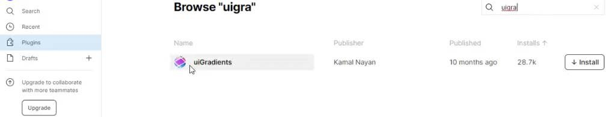Varios plugins destacables:

-   [Lorem Ipsum](https://www.figma.com/community/plugin/736000994034548392/Lorem-Ipsum)
-   [UI Gradients](https://www.figma.com/community/plugin/744909029427810418/uiGradients)
-   [Get Waves](https://www.figma.com/community/plugin/745619465174154496)
-   [Iconify](https://www.figma.com/community/plugin/735098390272716381)
-   [Unsplash](https://www.figma.com/community/plugin/738454987945972471/Unsplash)
-   [Content Reel](https://www.figma.com/community/plugin/731627216655469013/Content-Reel)
-   [Image Palette](https://www.figma.com/community/plugin/731841207668879837/Image-Palette)
-   [Figma to HTML and CSS](https://www.figma.com/community/plugin/1128731099343788397/Figma-to-HTML-and-CSS)

## Recursos web útiles

-   [**unDraw** ](https://undraw.co/)para la búsqueda de ilustraciones libres en formato *PNG* o *SVG*:

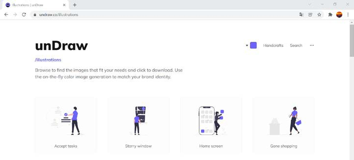 

-   [**Boxicons** ](https://boxicons.com/)para la búsqueda de iconos gratuitos:

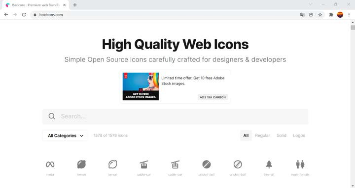 

-   [**unsplash** ](https://unsplash.com/es)para la búsqueda de imágenes libres:

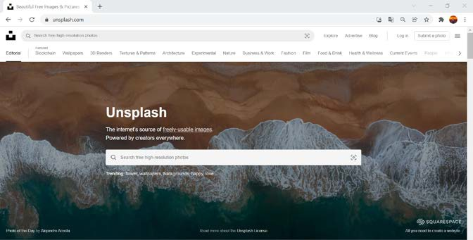 

-   [**manypixels** ](https://www.manypixels.co/)para búsqueda de ilustraciones:

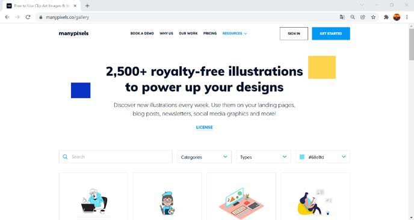 
