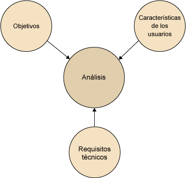

# UT5.2 Elementos y proceso del diseño de interfaces

## Proceso del diseño de interfaces

El diseño de interfaces se desarrolla a lo largo de **varias etapas**, algunas de las cuales son iterativas:


### Análisis

En esta etapa se reúne información sobre:

-   Los objetivos de la aplicación.
-   Las características de los usuarios objetivos.
-   Los requisitos técnicos del desarrollo.



El cliente suele tener un papel importante en el planteamiento del diseño de una aplicación, aunque su grado de implicación puede variar mucho de un caso a otro. Además de otras cuestiones, el diálogo con el cliente puede referirse a:

-   Usuario objetivo de la aplicación: ¿a quién quiere dirigirse?
-   Finalidad: ¿qué quiere conseguir con el producto?
-   Estilo: el cliente suele tener una idea definida de la imagen que desea mostrar. En caso de que se trate de una organización o gran empresa, pueden existir requisitos de imagen que deben respetarse. Es importante consultar si existe guía de estilo.

### Diseño

El diseño de una aplicación, tanto funcional como gráfico, ha de responder a las características definidas en un proceso de <u>análisis</u>.

1.  Los **elementos de diseño** que van a formar parte de nuestra aplicación. Debe haber un número suficiente, pero sin que haya saturación de estos.
2.  La extensión de la aplicación.
3.  **Patrones de diseño** que van a utilizarse para estandarizar el diseño de interfaces.
4.  Aspectos técnicos de **usabilidad** y **accesibilidad**. Se verán en próximas unidades.


### Prototipo

El **prototipo** es un elemento clave en el proceso de diseño, puesto que permite detectar en un primer estadio aquellas cuestiones que deben ser revisadas o corregidas, y revela si es necesario añadir algún elemento que no se ha tenido en cuenta anteriormente.

El prototipo puede ser:

-   **De baja fidelidad**. Es el que se realiza en un primer estadio y que dista del diseño final. Puede realizarse sobre papel o en ordenador, y esquematiza una propuesta de estructura de pantalla.
-   **De alta fidelidad**. Se realiza por ordenador, y representa un aspecto muy similar al del diseño final. Lo veremos también en próximas unidades.


En el proceso de creación de prototipos, se planifican interacciones clave y flujos de trabajo de los usuarios para visualizar cómo los usuarios pueden navegar por el producto. Los diseñadores pueden evaluar e iterar sobre estas interacciones y flujos a través de métodos de investigación de usuarios , como pruebas de usabilidad, donde los participantes interactúan con el prototipo.


### Evaluación

Durante esta fase se lleva a cabo una **evaluación de la usabilidad,** así como un estudio de la **accesibilidad** de la aplicación o la web. Se verá de forma más detallada en unidades posteriores.

Existen varios métodos de evaluación de la usabilidad, que pueden clasificarse en dos grupos:

-   Los que recogen datos de los usuarios reales.
-   Los que se basan en herramientas automatizadas o pruebas sintéticas.

## Etapas del diseño de interfaces

En la **etapa de diseño** de la interfaz de cualquier aplicación consta de diferentes fases que veremos a continuación:

-   Diseño conceptual de la interfaz
-   Diseño visual de la interfaz
-   Diseño de contenidos (web y multimedia)


### Diseño conceptual

```note
La fase de **diseño conceptual** se refiere a la definición de la arquitectura de información de la aplicación, es decir, al esquema de organización y navegación de los contenidos. Determina qué relaciones se establecen entre los diferentes apartados, así como las posibilidades de desplazamiento y entre las diferentes pantallas/páginas.
```

Una vez que se ha definido la estructura de la aplicación, se documenta mediante *sketching* y *wireframes o* diagramas. El diagrama debe describir la macroestructura con el detalle adecuado, para que los miembros del equipo de producción puedan compartir una visión general. El detalle específico de cada página, o microestructura, debe ser descrito en otros documentos técnicos más adelante.

El diagrama deberá indicar cómo navega el usuario a través de tareas determinadas, y qué pasos en particular conforman cada una de estas tareas. Los detalles gráficos de la interfaz no aparecen todavía representados.

#### Sketch

El sketch es un dibujo o *boceto* inicial de un sitio web. Este dibujo poco detallado puede estar realizado sobre papel, pizarra o cualquier formato que permita realizar cambios de manera rápida.

#### Wireframe

Un *wireframe* es la *representación de la estructura básica* de la web o aplicación en la que se especifican los elementos de forma esquematizada. Es un diseño a bajo nivel en el que se establece claramente la jerarquía de los elementos, los contenedores y la organización del contenido.


- *Sketch*:


- *Wireframes*:


- *Diagramas*:


### Diseño visual

```note
En la fase de **diseño visual** se definen las características gráficas de la interfaz, teniendo en cuenta la información reunida en las fases de análisis, modelado del usuario y diseño conceptual.
```

Antes de empezar a definir las cuestiones relacionadas con el diseño visual, se lleva a cabo un análisis de la documentación gráfica (fotografías, esquemas, gráficas, ilustraciones, etc.) que se integrará en la aplicación así como un **análisis del libro de estilo** aportados por el propio sistema o por el cliente si fuera el caso.

Por otra parte, se documentará acerca del tratamiento previo de contenidos similares, buscando ejemplos de aplicaciones que previamente hayan abordado el mismo tema o que se hayan dirigido al mismo tipo de usuario.

#### Diseño visual: la retícula

El **diseño de la retícula** está formando parte de la definición de los elementos principales del diseño (color y tipografía). La retícula se utiliza para establecer una estructura de diseño continua y coherente en soportes que deban alojar todo tipo de contenidos.

De la misma manera, en soporte digital, el usuario ha de poder identificar una aplicación o una web como un conjunto unitario, aunque el aspecto general sea distinto en cada pantalla. La retícula actúa de manera similar a la estructura de un edificio, preservando la relación entre todos los elementos que conforman el conjunto y garantizando su estabilidad y consistencia.


#### Diseño visual: gama cromática

A partir de los determinantes estilísticos o del tratamiento que se quiere dar a los contenidos, se define el tono cromático general de la aplicación según el tema, el tono general que se quiere transmitir y el tipo de usuario. Si existe un libro de estilo o una imagen de marca, normalmente la aplicación deberá respetar la gama de colores predeterminada.


#### Diseño visual: tipografía

Junto con la gama cromática, la tipografía determina el tono general de la aplicación. En líneas generales, se aconseja utilizar un máximo de **dos tipos de letra distintos**, ya que la mezcla de muchas variaciones puede implicar poca legibilidad y un aspecto visual caótico. En todo caso, si se utilizan dos tipos de letra distintos, es importante que sean lo suficientemente distintos como para percibirse como tales.

Para facilitar la lectura en soportes digitales, a diferencia de los soportes físicos e impresos, se recomienda usar tipografías **Sans-Serif** (sin serifa) y optar por fuentes como Open Sans, Roboto, San Francisco o incluso Helvetica.


A la hora de apostar por usar una sola tipografía, lo recomendable es no utilizar en exceso sus 3 variantes (Light, Regular, Bold, o en otras palabras Fina, Normal y Negrita). Si se usan dos tipografías diferentes, existe aún menos margen para usarlas.


#### Diseño visual: elementos principales

A partir de la división y asignación de espacios de pantalla, se concretan los principales elementos, que incluyen:

-   El tratamiento de fondos y ventanas de diálogo.
-   La definición de los bloques de texto (títulos, subtítulos, índices y menús). Se define el tipo, color y tamaño de letra de cada categoría de texto.
-   La utilización y distribución de botones o menús.
-   La integración de iconografía y logotipos (si existen)
-   Opciones. El tratamiento de las opciones de pantalla debe ser coherente con el estilo visual de la aplicación.
-   Imágenes de contenido. Se determinan los formatos y las diferentes aplicaciones de las imágenes de contenido.

**Jerarquía de los botones de una interfaz**

- La **acción principal** del botón es lo que es más probable que los usuarios seleccionen, o es la opción que el producto guía a los usuarios a seleccionar.
- **Las acciones secundarias** ofrecen una alternativa a la acción primaria, por lo que se les da menos énfasis visual. Es común que un botón secundario tenga un contenedor delineado sin relleno o sin ningún contenedor.
- **Las acciones terciarias** son acciones adicionales a las que el usuario puede necesitar acceder. Los botones terciarios tienen el menor énfasis visual.


**Patrones de diseño**

Un **selector de fechas** es un patrón de diseño común que se utiliza en muchos tipos diferentes de sitios web y aplicaciones. Este patrón de diseño debería permitir a los usuarios seleccionar fácilmente una fecha o rango de fechas específico.


Una **barra de progreso** es otro patrón de diseño de interfaces estándar, que puede ser representado de diversas formas y usado en combinación con otros:


### Diseño de contenidos

La redacción de los contenidos destinados especialmente a **aplicaciones web o multimedia** tiene una naturaleza especial, ya que debe aprovechar las posibilidades de interactividad, y tener en cuenta al mismo tiempo las limitaciones de la lectura en pantallas de diferentes características y tamaños.

Las características que deben cumplirse al diseñar contenidos para una aplicación son las siguientes (Nielsen, 2000):

-   **Brevedad**. La lectura en pantalla es más lenta que la lectura en papel, y además resulta más incómoda para el lector. Como regla general, hay que escribir un 50% menos de texto. Las páginas deben ser breves, y los contenidos sucintos y concretos, aunque no exentos de estilo.
-   **Lectura en diagonal**. Los usuarios tienden a no leer por entero el texto en pantalla, sino que suelen rastrear visualmente la página para encontrar las palabras clave y leer los fragmentos de texto relacionados.

Para facilitar el rastereo de contenidos se recomienda estructurar los contenidos en dos (o tres) niveles de titular (encabezado y sub-encabezados). Los encabezados deben ser significativos.


Utilizar preferiblemente listas con viñetas para enumerar elementos, en lugar de incluirlos en bloques de texto uniformes.

Incluir negritas y mayúsculas para destacar las palabras clave. También puede utilizarse


Las páginas han de organizarse en pirámide: lo más importante debe encontrarse al principio, de manera que el usuario no se vea forzado a leer toda la página para encontrar la conclusión. Puesto que muchos lectores sólo leen la primera frase de cada párrafo, es importante aplicar la regla de una idea, un párrafo, con frases sencillas.


Además de confeccionar correctamente los contenidos, hay que asegurar que el texto siempre sea **legible**, lo cual estudiaremos en profundidad en el tema de <u>accesibilidad</u>. Los factores que favorecen la legibilidad son:

-   Contraste entre el texto y el fondo. La legibilidad máxima se obtiene de texto negro sobre fondo blanco, aunque la opción inversa también es correcta.
-   Los fondos serán de colores claros, y si contienen imágenes, deberán ser muy sutiles.
-   La tipografía será de un tamaño relativamente grande (a partir de 11 puntos), para que sea legible incluso para personas con dificultades de visión.
-   A tamaño pequeño, se recomienda utilizar una tipografía *sans-serif.*


