# UT5.3 Imágenes y gráficos usados en interfaces

## Imágenes

El uso de imágenes es muy importante en el diseño de cualquier tipo de interfaz, puesto que estas contribuyen favorablemente a la experiencia del usuario, siempre y cuando se adecuen al contenido que se está trabajando.

Además de cumplir ciertos requisitos de calidad y formato, se debe tener en cuenta la autoría de las imágenes o derechos de autor para ciertos trabajos.

Una de las características más importantes que tener en cuenta es el formato de las imágenes, puesto que de esta forma se define la calidad visual frente al peso de las ilustraciones.


## Imágenes de mapa de bits

```note
Estas imágenes, también llamadas de **raster**, son aquellas formadas por un conjunto de puntos, llamados **píxeles**, donde cada uno de estos puntos contiene un conjunto de valores que define un color.
```

Por esta razón, son indicadas para aquellas imágenes en las que es deseable mostrar una gama de colores muy amplia y con variaciones precisas de color y luminosidad.

La calidad de estas imágenes depende de la cantidad de píxeles utilizados en su representación (PPP). Una de las desventajas principales de las imágenes bitmap es que no permiten un cambio de escala significativo, puesto que aparece el llamado **pixelado**.

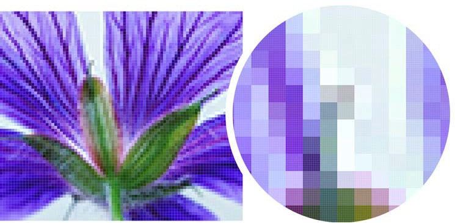

## Imágenes vectorizadas

```note
Representan, a través de **fórmulas matemáticas**, entidades geométricas simples (puntos, segmentos, rectángulos, círculos), sus parámetros principales: grosor, posición inicial, final, etc. El procesador es el encargado de traducir esta información matemática a la tarjeta gráfica.
```

Las imágenes vectoriales mantendrán su forma independientemente de cuán grande o pequeño sea su tamaño. Esto significa que no se mostrarán píxeles cuando amplíe. La calidad de estos diseños seguirá siendo la misma.

No son adecuados para describir imágenes demasiado irregulares (un paisaje de fotografía real), ya que necesitaría millones de fórmulas para ello.


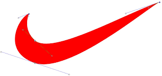 
 


## Bitmap vs vector

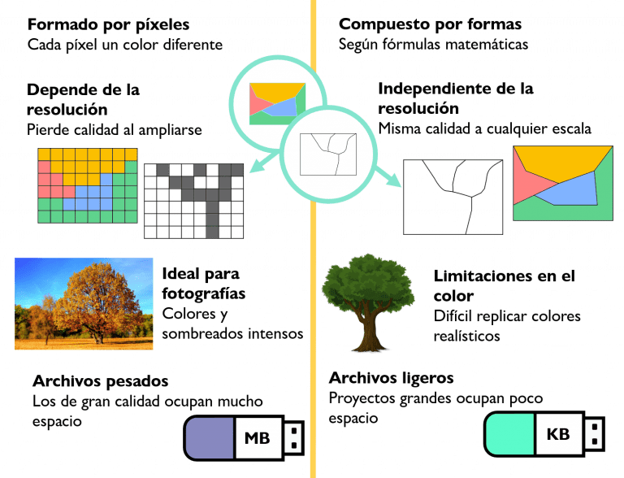

## Resolución

```note
La resolución de una imagen consiste en el grado de detalle o calidad de una imagen digital. Este valor se expresa en **ppp** (píxeles por pulgada) o en **dpi** (dots per inch).
```

Cuantos más píxeles contenga una imagen por pulgada lineal, mayor será su calidad. Por ejemplo, cuando hablamos de la resolución de un monitor, estamos haciendo referencia al número de píxeles por pulgada que es capaz de mostrar. Por otro lado, en un medio de impresión se habla del número de puntos por pulgada (ppp) que se puede imprimir.

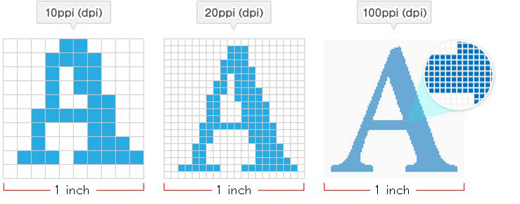

La resolución en un monitor o pantalla hace referencia al número de píxeles que éste será capaz de mostrar, expresada en función de su anchura y su altura.

Por ejemplo, si un dispositivo tiene una resolución de 1920 x 1080 píxeles, significa que tendrá 1920 píxeles de anchura y con 1080 píxeles de altura

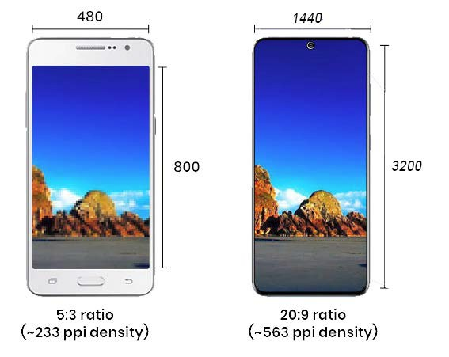

Existe una amplia gama de resoluciones estandarizadas por la industria de los monitores/pantallas y gráficas, que tienen las siguientes denominaciones:

-  VGA (SD): 640x480
-  SVGA: 800x600
-  720p (HD): 1280x720
-  1080p (FHD): 1920x1080
-  2K: 2048x1080
-  1440p (QHD): 2560x1440
-  4K (UHD): 3840x2160
-  8K

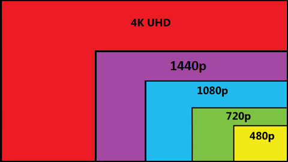

## Profundidad de color

Una imagen en mapa de bits está formada por un conjunto de píxeles, donde cada uno de ellos presenta un determinado color, el archivo donde está almacenada la imagen, también contendrá la información de color de cada uno de los píxeles.

```note
La **profundidad de color** se refiere al número de bits necesarios para codificar y guardar la información de color de cada píxel en una imagen. Un bit es una posición de memoria que puede tener el valor 0 o 1. Cuanto mayor sea la profundidad de color en bits, la imagen dispondrá de una paleta de colores más amplia.
```

| **Profundidad** | **Nº de colores** |
|-----------------|-------------------|
| 1               | 2                 |
| 4               | 16                |
| 8               | 256               |
| 16              | 65536             |
| 32              | 4294967296        |

## Modos de color

```note
Llamamos modo de color al sistema de coordenadas que nos permiten describir el color de cada píxel utilizando valores numéricos.
```

### Modo monocromático


Se corresponde con una profundidad de color de 1 bit. La imagen está formada por píxeles blancos o píxeles negros puros.

### Modo Escala de Grises

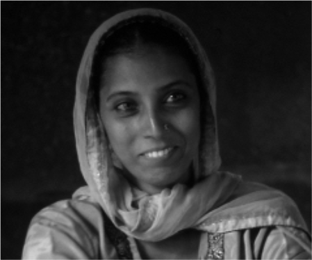

Maneja el canal negro y permite 256 tonos de gris entre el blanco y negro puros.

### Modo indexado


Utiliza un canal de color indexado de 8 bits pudiendo obtener con ello hasta un máximo de 256 colores

### Modo RGB


Cada color se forma por combinación de tres canales. Cada canal se corresponde con un color primario:

Red (rojo), Green (verde), y Blue (azul). Asigna un valor de intensidad a cada color que oscila entre 0 y 255.

De la combinación surgen hasta 16,7 millones de colores.

### Modo HSB

Cada color surge de los valores de estos tres parámetros que veremos: HSB

**H**ue (Tono) que es el valor del color: rojo, azul, verde, etc.

**S**aturation (Saturación) que se refiere a la pureza del color y va del 0% al 100%. 

**B**rightness (Brillo) referencia la intensidad de luz del color, es decir, la cantidad de negro o blanco que contiene estando su valor entre 0 (negro) y 100 (blanco).

Ejemplo: El color rojo puro tiene un código RGB como (255,0,0) y también un código HSB (0,100,100). En la mayoría de programas de tratamiento de imágenes se puede elegir un color introduciendo su RGB o su código HSB. En ambos casos la imagen maneja una paleta de colores de 24 bits.

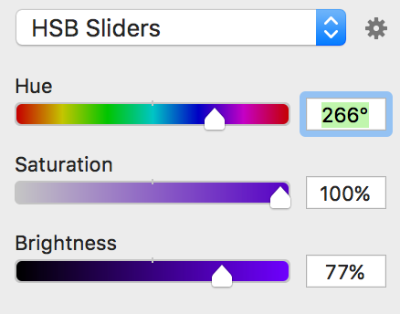

## Compresión de imágenes

Uno de los factores más importantes a la hora de escoger las imágenes que formarán parte del diseño de una interfaz, es el **tamaño** de archivo de imagen, puesto que de esto dependerá la velocidad de la transferencia.

La **compresión** de una imagen es la reducción de los datos digitales que no resultan necesarios e importantes. Esta compresión permite almacenar mayor número de imágenes al conseguir que los archivos resultantes no ocupen mucho espacio.

!(media/968e5353b17b85e1b502b015ad023dc3.jpeg)

Hay dos clases principales de compresión, la **compresión con pérdida**, conocida también como *Lossy* en inglés o la **compresión sin pérdida** o *Lossless*.

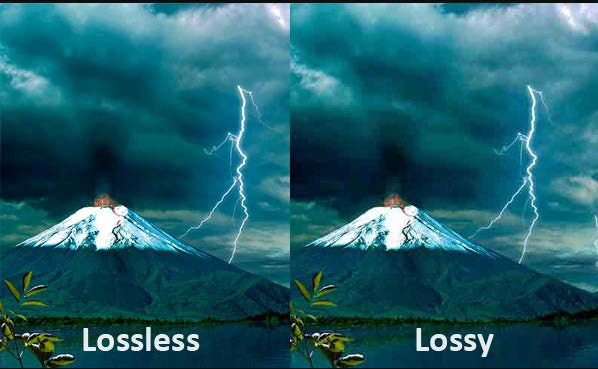

Si una imagen es demasiado pesada, es recomendable utilizar formatos con compresión que veremos próximamente, como JPEG o HEIF.

Existen otras ocasiones en las que es deseable que el tamaño de la imagen sea elevado, lo que supondrá una mejor calidad, es el caso de la impresión fotográfica.

## Formatos de imagen

Como se ha visto en el apartado anterior, existen dos tipos de imágenes digitales, las cuales presentan varias diferencias, entre ellas el **formato** en el que deben almacenarse para su posterior reproducción. Este formato aparece reflejado en la parte del nombre del fichero conocida como extensión. La elección de un tipo u otro, se puede basar en tres factores importantes:

- El contenido de la imagen (foto, dibujo, logotipo).
- La calidad que se desea obtener en función del sitio y finalidad de la publicación (publicación en web, impresión).
- El tamaño que tendrá el archivo resultante.

Una de las principales decisiones a la hora de incluir gráficos en cualquier tipo de interfaz es elegir el formato correcto para cada tipo de imagen de manera que se consiga una correcta relación entre la calidad visual y su tamaño, es decir, su peso.

### De mapa de bits

#### BMP

Formato introducido por Microsoft y usado originariamente por Windows para guardar sus imágenes sin pérdida. Al no tener compresión este formato ocupa mucho tamaño.

#### GIF (Graphic Image File Format)

Se trata realmente de un formato antiguo desarrollado por *Compuserve* con el fin de conseguir archivos de tamaño reducido. No es adecuado para imágenes fotográficas, dado que solo permite *256* colores. Permite animaciones sencillas. Si se almacena una imagen que tiene más de esos colores en formato GIF, se utiliza un algoritmo que aproxima los colores de la imagen a una paleta limitada por 256 colores.

Sus características son por tanto:

- Para imágenes de 256 colores o menos
- Compresión de imágenes sin pérdida
- Permite animaciones cortas y simples.

#### JPEG (Joint Photographic Experts Group).

Se trata de uno de los formatos más utilizados para tratar fotografías digitales, gracias al amplio abanico de colores que admite. JPEG admite distintos niveles de compresión, y de esta forma consigue modificar el tamaño en función del trabajo que se desee, presentando como contraprestación la disminución de la calidad. Cuanto menor sea la compresión de la imagen, mayor será la calidad, pero el tamaño de los archivos será mayor. Por el contrario, si se utiliza un nivel de compresión mayor, esta produce pérdidas y afecta a la calidad de imagen, para llevar a cabo esta reducción de tamaño, JPEG elimina la información que el ojo humano no es capaz de distinguir.

Las características de este formato son:

-  Número de colores: 24 bits color u 8 bits B/N.
-  Formato de compresión con pérdida.
-  No permite la animación.
-  Indicado para aquellas imágenes que sean fotografías.

#### PNG (Portable Network Graphics).

Formato creado en su momento sustituir las imágenes de formato GIF. Se trata de un sistema de compresión sin pérdida, además, permite una compresión reversible y por tanto la imagen que se recupera es exacta a la original. Este formato puede tener hasta 8 bits de información adicionales en cada píxel, lo que nos permite crear gráficos traslúcidos independientemente del color de fondo. Eso sí, hablamos de imágenes que ocupan más KB y, por lo tanto, de archivos de mayor tamaño.

Dentro de los formatos de imágenes sin compresión, este es el más utilizado hoy en día en web. Es muy útil para fondos de la web, iconos o gráficos que no son fotografías.

Las características de este formato son:

-  Color indexado hasta 256 colores y True-color hasta 48 bits por píxel.
-  Permite capas traslúcidas
-  Compresión sin pérdida.
-  No permite animación.

#### WEBP

Es un formato de imagen recién llegado y que ha venido a revolucionar el mundo de la compresión de imágenes. Desarrollado por *Google* y recomendado en su herramienta de optimización web *PageSpeed Insights*. Sus inicios datan del 2010 como una iniciativa de código abierto que consigue compresiones tanto en imágenes estáticas como animaciones del 30%. Permite compresión con y sin pérdida.

El único problema es precisamente que debido a su reciente salida no todos los navegadores lo soportan. Lo podemos encontrar en Google Chrome, Opera y Safari.

#### TIFF

TIFF es un formato de imagen de tramas versátil y flexible desarrollado en 1986 e independiente de la plataforma. Permite capas y compresión con pérdidas, aunque genera ficheros muy pesados. Es ideal para la impresión, pero en práctico desuso en la actualidad para el uso de interfaces

#### HEIF (High Efficiency Image File)

HEIF es el nuevo formato estándar que busca sustituir al tradicional JPEG y al PNG. Admite incluso secuencias de imágenes como los GIF y hasta audio. Con HEIF se almacenan las imágenes fijas codificadas con el formato de vídeo HVEC (H.265). Otra de las ventajas de HEIF es que incluye colores de 16 bits, mientras el JPG solo soporta 8.

Los archivos generados son también más pequeños que los JPEG, sin sacrificar calidad de imagen, por lo que en muchos casos, ofrecen una calidad ligeramente superior. Es un formato reciente que se está abriendo paso, y en el que todavía persisten dispositivos poco potentes no compatibles.

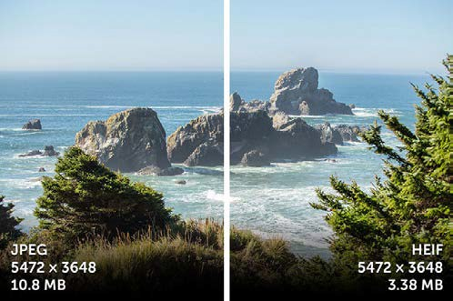

| **Formato** | **Tamaño**    | **Colores** | **Compresión** | **Compatibilidad** | **Ideal Para**       | **Optimo en web** |
|-------------|---------------|-------------|----------------|--------------------|----------------------|-------------------|
| **JPEG**    | Pequeño/medio | Muy bueno   | Pérdida        | Alta               | Fotografías          | 🟢🟢              |
| **GIF**     | Muy pequeño   | Pobre       | Pérdida        | Alta               | Gráficos/animaciones | 🟢🟢              |
| **PNG**     | Grande        | Muy bueno   | Sin pérdida    | Alta               | Todo                 | 🟢🟢              |
| **BMP**     | El más grande | Muy bueno   | Sin pérdida    | Alta               | Fotografías          | 🔴🔴              |
| **TIFF**    | Muy grande    | Muy bueno   | Pérdida        | Alta               | Fotografías          | 🔴🔴              |
| **HEIF**    | Pequeño       | Excepcional | Pérdida        | Media              | Todo                 | 🟢🟢              |
| **WEBP**    | Pequeño/medio | Muy bueno   | Ambas          | Baja               | Gráficos/animaciones | 🟢🟢              |


### Vectoriales

#### AI

Es uno de los formatos vectoriales más usados y la opción por defecto del programa Adobe Illustrator. Permite escalado sin pérdida y guardado de transparencias en los diseños.

#### EPS

Formato antiguo de archivos vectoriales. A diferencia del formato AI no permite transparencias.

#### SVG

Es un formato basado en XML muy extendido en el diseño web ya que está optimizado como lenguaje de programación y puede ser indexado, por eso suele utilizarse para logotipos, botones y otros elementos web.

#### PDF

Aunque no es el formato vectorial por excelencia, un archivo .PDF también puede usarse como vectorial. La gran ventaja es que se trata del formato más universal y puede abrirse con software específico de edición, así como con programas de solo lectura o en cualquier navegador web. Además, es muy útil a la hora de enviar archivos a imprimir, ya que contiene toda la información necesaria del diseño y no suele provocar problemas de compatibilidad.


## Licencias de imágenes

Las imágenes que se utilizan en cualquier tipo de diseño deben ser correctamente obtenidas, es decir, o bien son de elaboración propia y tenemos sus derechos de uso, o si utilizamos otras deberán de estar correctamente referenciadas.

Los **derechos de autor** defienden la propiedad intelectual, es decir, cualquier creación (música, películas, imágenes) realizada por la mente humana.

Existen tres tipos de **licencias** de imágenes que podemos encontrar en Internet:

-  Imágenes con derechos de autor (**copyright**)
-  Imágenes Creative Commons (**CC**)
-  Imágenes de **Dominio público**

#### Con derechos de autor (copyright)

Protege el contenido en su totalidad, que pertenece al autor o al cesionario (al que se le ha cedido su explotación).

Los derechos de autor surgen al crear una obra. No requieren ningún tipo de registro previo. Por ejemplo, si un diseñador gráfico crea una imagen y la sube a su web, puede distinguir su imagen mediante una ©.

#### Creative Commons (CC)

Es un tipo de licencia creada especialmente para Internet. Es compatible con los derechos de autor, pero ofrece ciertos derechos a terceras personas, que varían en función de las condiciones de cada imagen.

Las licencias Creative Commons no se generan por sí mismas, sino que requieren la intervención del autor.

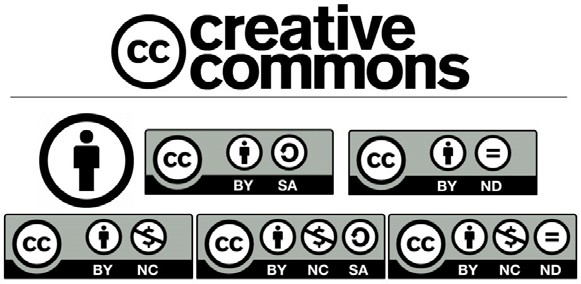

La licencias CC posibilitan un modelo legal de distribución y uso de contenidos basada en 4 condiciones principales que pueden ser combinadas para hacer licencias mixtas según las características:

-  **Atribución (BY)** - Se conceden derechos de copia, distribución, exhibición y derivación siempre y cuando se reconozca y cite la obra de la forma especificada por el autor o el licenciante.
-  **No Comercial (NC)** - Se puede copiar, distribuir, exhibir y representar la obra y hacer obras derivadas pero sin fines comerciales.
-  **No Derivadas (ND)** - En este caso podemos copiar, distribuir, exhibir y representar copias literales de la obra pero no producir obras derivadas.
-  **Compartir Igual (SA) -** El usuario tiene el derecho de distribuir obras derivadas pero siempre con una licencia idéntica a la de la obra original.
-  **Dominio público (CC0) -** Liberar una obra renunciando a todos sus derechos.

#### De dominio público

Por último, quedan en este estado todas aquellas creaciones e imágenes cuyo periodo de protección de derechos de autor ha expirado o cuyo autor las libera de dicha forma para su utilización general.

No se requiere ningún permiso o licencia para usar trabajos del dominio público, así como aquellos con un copyright expirado.


