# UT5.4 Introducción a JavaScript

## Introducción a JavaScript

```note
**Javascript** es un lenguaje de programación de scripts ligero y orientado a objetos, diseñado en un principio para añadir interactividad a las páginas webs y crear aplicaciones web.
```

Javascript es la última capa de funcionalidad en los sitios web interactivos; la capa de contenido la forma el HTML, el diseño el CSS, mientras que la interactividad Javascript.

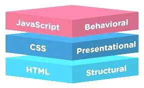

Hoy en día, JavaScript cuenta con multitud de frameworks y librerías para simplificar proyectos complejos, como **AngularJS**, **jQuery** y **ReactJS**.

Aunque originalmente se ejecutaba en el lado del cliente, la implementación de JavaScript se ha extendido al lado del servidor tras el desarrollo de **Node.js**, un entorno de servidor multiplataforma construido sobre el motor V8 de JavaScript de Google Chrome.


### Java vs JavaScript

Java y JavaScript no están relacionados, a pesar de compartir el término «Java». Sin embargo, tienen claras diferencias, entre ellas:

-   **Programación orientada a objetos**: Java es un lenguaje de programación orientado a objetos. JavaScript es un lenguaje de programación de scripts orientado a objetos.
-   **Sintaxis**: La sintaxis de JavaScript no es tan formal o estructurada como la de Java. Por lo tanto, es más sencilla para la mayoría de los usuarios.
-   **Compilación**: Java es un lenguaje compilado, mientras que JavaScript es un lenguaje interpretado que se interpreta línea por línea en tiempo de ejecución; los lenguajes compilados suelen ser más rápidos, pero los interpretados suelen ser más flexibles.
-   **Entorno**: Las aplicaciones Java se pueden utilizar básicamente en cualquier entorno, ejecutándose en máquinas virtuales o en navegadores; JavaScript en principio es solo para navegadores (aunque existen versiones backend).
-   **Uso de memoria**: Java consume más memoria que JavaScript, por lo que este último es preferible para las páginas y aplicaciones web.

## Características de JavaScript

El núcleo del lenguaje JavaScript de lado del cliente consta de algunas características de programación comunes que permiten hacer cosas como:
-   Almacenar valores útiles dentro de variables. Por ejemplo, pedir que se ingrese un nombre y almacenarlo en una variable llamada *name*.
-   Operaciones sobre fragmentos de texto (*Strings*). Cortar y pegar la información de distintos formularios web para hacer una petición al servidor.
-   Ejecutar código en respuesta a ciertos eventos que ocurren en una página web. Usar el evento clic para detectar cuándo se hace clic en el botón y luego ejecutar el código que actualiza una etiqueta de texto.

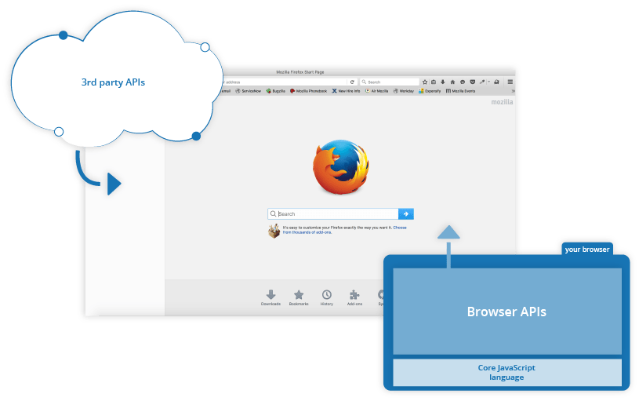

Lo más interesante de JavaScript es la posibilidad de utilizar diversas **API** que proporcionan funcionales muy interesantes para utilizar en el código JavaScript. Existen dos tipos de API, de navegador y externas. Veremos API más detalladamente en la siguiente unidad.

**APIs del navegador de JavaScript**

Los navegadores ofrecen una API con funcionalidades para crear dinámicamente contenido HTML y establecer estilos CSS, hasta capturar y manipular un vídeo desde la cámara web del usuario, o generar gráficos 3D y muestras de sonido.

**APIs de terceros**

Permiten a los desarrolladores incorporar funcionalidades en sus sitios de otros proveedores de contenidos o servicios como Meta, Google, etc.

**Librerías de terceros**

Permiten construir y añadir funcionalidades para construir rápidamente sitios y aplicaciones. Las más conocidas son *React* o *jQuery*

**Frameworks completos**

Los frameworks o marcos de trabajo podrían definirse como una especie de plantilla, a partir de la cual el desarrollador genera su aplicación web. Los más conocidos son *Angular* o *Node JS*.


### Ubicación del código JavaScript

El código en JavaScript se puede indicar con la etiqueta \<script\> en el mismo código HTML, pero lo habitual es incluirlo en un **fichero externo** usando el siguiente formato:

```javascript
<script src="fichero.js" type="text/JavaScript">
...
</script>
```

La **ubicación de la etiqueta script** es **muy importante** ya que tiene distinto efecto sobre la interacción en ésta:

| **Ubicación**      | **Ejecución del archivo Javascript**      | **Estado de la página**                           |
|--------------------|-------------------------------------------|---------------------------------------------------|
| En \<head\>        | **ANTES** de empezar a dibujar la página. | Página aún no dibujada.                           |
| En \<body\>        | **DURANTE** el dibujado de la página.     | Dibujada hasta donde está la etiqueta \<script\>. |
| Antes de \</body\> | **DESPUÉS** de dibujar la página.         | Cuando la página ya está dibujada al 100%.        |

## Variables, operadores y datos

### Tipos de datos

```note
En JavaScript todo es un **objeto** y puede ser almacenado en una variable.
```

En JavaScript, los tipos de datos se dividen en **primitivos** y **objetos**.

Los **tipos de datos primitivos** son los principales:

| **Tipo de dato** | **Descripción**                                       | **Ejemplo básico**   |
|------------------|-------------------------------------------------------|----------------------|
| *Number*         | Valor numérico (enteros, decimales, etc...)           | 42                   |
| *BigInt*         | Valor numérico grande                                 | 1234567890123456789n |
| *String*         | Valor de texto (cadenas de texto, carácteres, etc...) | 'MZ'                 |
| *Boolean*        | Valor booleano (valores verdadero o falso)            | true                 |
| *undefined*      | Valor sin definir (variable sin inicializar)          | undefined            |
| *Function*       | Función (función guardada en una variable)            | function() {}        |
| *Symbol*         | Símbolo (valor único)                                 | Symbol(1)            |
| *Object*         | Objeto (estructura más compleja)                      | {}                   |

-   Las variables pueden definirse mediante las palabras clave *var* o *let*:

    Las declaraciones var tienen un **ámbito global** o un ámbito función/local y pueden ser modificadas y redeclaradas, mientras que let tiene un **ámbito de bloque** y no pueden ser redeclaradas.

    ```javascript
    var text = "Hola, me llamo Javier";
    ``` 

-   Las constantes se definen mediante *const*:
    ```javascript
    const constate = 42;
    ``` 
    >Las constantes no pueden ser redeclaradas una vez asignadas.

-   Se pueden declarar varias variables a la vez:
    ```javascript
    let person = "Jose", carName = "Volvo", precio = 100;
    ``` 
-   Los **comentarios** en javascript se indican usando // y para multilíneas usando */\* y \*/*

### Hoisting

El **hoisting** en JavaScript es un concepto confuso de entender al principio y se refiere al hecho de que las declaraciones de variables se mueven al principio del ámbito en el que están definidas, sin importar dónde aparezcan en el código.

Esto permite que las variables sean utilizadas antes de su declaración, aunque no se recomienda por motivos de claridad y mantenibilidad del código. No obstante, esto sólo aplica a las variables que hayan sido declaradas usando la palabra clave var.

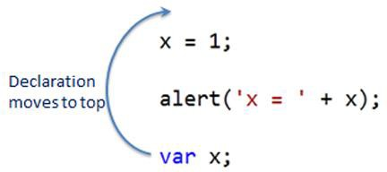

### Operadores

Los principales **operadores** en Javascript se parecen a los que ya conocemos:

| **Operación**                    | **Descripción**                                                                | **Símbolo**   | **Ejemplo**                       |
|----------------------------------|--------------------------------------------------------------------------------|---------------|-----------------------------------|
| Suma/concatenación               | Se usa para sumar dos números, o juntar dos cadenas en una.                    | +             | 6 + 9; "Hola " + "mundo!";        |
|  Resta, multiplicación, división | Operaciones matemáticas básicas de resta, multiplicación y división            | - \* /        | 9 - 3; 8 \* 2; 9 / 3;             |
| Operador de asignación           | Vistos anteriormente: asignan un valor a una variable.                         | =             |  let miVariable = 'Bob';          |
|  Igualdad                        | Comprueba si dos valores son iguales entre sí                                  |  ==           |  2 == "2" (true)                  |
|  Igualdad estricta               | Comprueba si dos valores son iguales entre sí y si son el mismo tipo de dato   |  ===          |  2 === "2" (false)                |
| Desigualdad/desigualdad estricta | Funciona de la misma forma que la igualdad o la igualdad estricta, pero negada | != !==        | 2 != "2" (false) 2 !== "2" (true) |
| Mayor/Menor o igual que          | Para establecer cmparaciones mayor o igual que, menor o igual que              | \< \> \<= \>= |  'Z’ \>= 'A'                      |

Ciertos operadores pueden **simplificarse** como **operadores de asignación**:

| **Operador** | **Ejemplo** | **Igual que** |
|--------------|-------------|---------------|
| =            | x = y       | x = y         |
| +=           | x += y      | x = x + y     |
| -=           | x -= y      | x = x - y     |
| \*=          | x \*= y     | x = x \* y    |
| /=           | x /= y      | x = x / y     |

Por último, los **operadores lógicos** son:

| **Operador** | **Descripcion** |
|--------------|-----------------|
| &&           | logical and     |
| \|\|         | logical or      |
| !            | logical not     |

### Cadenas

En JavaScript, las cadenas (*strings*) son un tipo de dato primitivo utilizado para representar texto.

Se pueden definir utilizando comillas simples ' ', comillas dobles " " o template literals **\`** **\`** (que permiten incluir variables o expresiones).

```javascript
let saludo = 'Hola'; // comillas simples 
let nombre = "Carlos"; // comillas dobles 
let mensaje = `Hola, ${nombre}!`; // Los template literals permiten incluir variables usando el referenciador $
```

Los siguientes métodos son útiles para el manejo y manipulación de cadenas:

| **Método**             | **Descripción**                                            | **Ejemplo**                        | **Resultado**                  |
|------------------------|------------------------------------------------------------|------------------------------------|--------------------------------|
| length                 | Devuelve la longitud de la cadena.                         | "Hola".length                      | 4                              |
| toUpperCase()          | Convierte la cadena a mayúsculas.                          |  "Hola".toUpperCase()              | "HOLA"                         |
| toLowerCase()          | Convierte la cadena a minúsculas.                          |  "Hola".toLowerCase()              | "hola"                         |
| trim()                 | Elimina espacios al inicio y al final.                     |  " Hola ".trim()                   | "Hola"                         |
| substring(inicio, fin) | Extrae una parte de la cadena (sin incluir fin).           |  "JavaScript".substring(0, 4)      | "Java"                         |
|  slice(inicio, fin)    | Extrae una parte de la cadena (permite índices negativos). |  "JavaScript".slice(-6)            |  "Script"                      |
| split(separador)       | Divide la cadena en un array según un separador.           |  "manzana,pera,plátano".split(",") | ["manzana", "pera", "plátano"] |

La **comparación de cadenas** en JavaScript puede ser problemática porque el lenguaje admite diferentes formas de evaluar la igualdad, y los resultados pueden variar según los **operadores** que se utilicen:

```javascript
let cadena = "123"; 
let numero = 123; 

console.log(cadena === numero); // false (diferentes tipos) 
console.log(cadena == numero); // true (convierte "123" en número antes de comparar)
```

Además, las **cadenas vacías** o los valores *null* pueden provocar resultados inesperados.

```javascript
console.log("" == null); // false (no son iguales) 
console.log("" === null); // false (diferente tipo y valor)
```

## Condicionales y bucles

### Condicionales

La forma de condicional más común en Javascript, como en la mayoría de lenguajes, es el **if... else.**

Así, por ejemplo:

```javascript
let helado = "chocolate"; 
if (helado === "chocolate") { 
    alert("Me gusta el helado de chocolate"); 
} 
else { 
alert("No es helado de chocolate, pero esta bien");
} 
```

También podemos utilizar el **switch**:

```javascript
switch (expresion) {
  case label1:
    (..sentencias..);
    break;
 case label2:
    (..sentencias..);
    break;
 default:
    (..sentencias..);
..  }
```

### Bucles

**Bucle for**

```javascript
for (let i = 0; i < 5; i++) { 
    console.log(i); 
}
```

**Bucle for in**

```javascript
const obj = { a: 1, b: 2, c: 3 }; // initiating a a const object 

for (let key in obj) { 
console.log(`${key}: ${obj[key]}`); 
} 
```

**Bucle for each**

```javascript
miArray.forEach(function (value) { 
console.log(value); 
});
```

**Bucle while**

```javascript
while (i < 5) { 
console.log(i); 
i++; 
}
```

**Do while**

```javascript
var i = 0; 
do { 
i = i + 1; 
console.log(i); 
} 
while (i < 5); 
```

## Funciones

En Javascript, las **funciones** son uno de los tipos de datos más importantes, ya que se utilizan continuamente. Además, se pueden considerar también como un tipo de datos.

Existen los siguientes tipos de funciones, según las definamos:

| **Constructor**                      | **Descripción**                            |
|--------------------------------------|--------------------------------------------|
| function nombre(p1, p2...) { }       | Crea una función mediante **declaración**. |
| var nombre = function(p1, p2...) { } | Crea una función mediante **expresión**.   |

Definición de una **función** normal mediante **declaración**:

```javascript
function suma(a, b) {
    return a + b;
}

// Llamada a la función
console.log(suma(5, 3)); // 8
```
> Las funciones podrán ser llamadas antes de su declaración debido al **hoisting**.

### Funciones expresadas

Las funciones expresadas son funciones asignadas a una variable. No están sujetas al **hoisting**, por lo que deben ser declaradas antes de usarse.

En estas funciones los programadores *guardan funciones* dentro de variables, para posteriormente *ejecutar dichas variables.* Por ejemplo:

```javascript
const saludo = function saludar() {
 return "Hola"; 
}; 
…
saludo(); // 'Hola'
```

### Funciones flecha (arrow function)

En las versiones más recientes de JavaScript podemos utilizar el **arrow function** que es una forma más concisa de escribir funciones.

Así, por ejemplo:

```javascript
const multiplicar = (a, b) => a * b;

// Llamada a la función
console.log(multiplicar(4, 5)); // 20
```
> Si hubiera un solo parámetro, los paréntesis serían opcionales.

### Funciones anónimas

En JavaScript se pueden declarar **funciones anónimas**. Son todas aquellas que no han sido declaradas con un nombre, lo que significa que no se pueden referenciar directamente fuera del contexto donde están definidas. Son útiles si no van a reutilizarse, como en el caso de los *eventos*.

```javascript
const saludar = function () { 
    return "Hola!"; 
}; 
console.log(saludar()); // "Hola!"
```

En este caso, aunque la función no tiene un nombre explícito, puede ser referenciada a través de la variable *saludar*.

También podemos usar el **arrow function**, para tener una sintaxis más compacta (**=\>)**

```javascript
const saludar = (nombre) => `Hola, ${nombre}`;
console.log(saludar("Ana")); // "Hola, Javi"
```

## Objetos

Un **objeto** es una colección de pares *clave-valor* que representan una entidad del mundo real con sus propiedades y comportamientos. En JavaScript, tal y como ya hemos comentado, los objetos son muy flexibles y se pueden crear de varias maneras:

```javascript
const persona = { 
    nombre: "Juan", 
    edad: 30, saludar: function () { 
       console.log(`Hola, me llamo ${this.nombre} y tengo ${this.edad} años.`); } }; 

// Acceso a propiedades 
console.log(persona.nombre); // "Juan" 
console.log(persona['edad']); // 30 

// Llamada a un método 
persona.saludar(); // "Hola, me llamo Juan y tengo 30 años."
```

Para **iterar** propiedades de un objeto:

```javascript
for (let clave in persona) { 
console.log(`${clave}: ${persona[clave]}`); 
}
```

Para obtener claves, valores o entradas:

```javascript
console.log(Object.keys(persona)); // ["nombre", "apellido", "saludar“..] 
console.log(Object.values(persona)); // ["Juan", "Pérez", ƒ, ƒ] 
console.log(Object.entries(persona)); // [["nombre", "Juan"], ["apellido", "Ruiz"], ...]
```

## JavaScript asíncrono

JavaScript es un lenguaje que utiliza un **único hilo de ejecución** para procesar las tareas. Este diseño puede generar problemas cuando se ejecutan tareas que requieren mucho tiempo, como operaciones de red, acceso a bases de datos o cálculos intensivos. Si estas tareas se ejecutaran de manera síncrona (es decir, una después de la otra), el programa se bloquearía hasta que cada tarea termine, causando una mala experiencia para el usuario.

La **programación asíncrona** en JavaScript es fundamental para manejar tareas que no se completan de inmediato, como llamadas a APIs, temporizadores o operaciones de lectura/escritura en archivos.

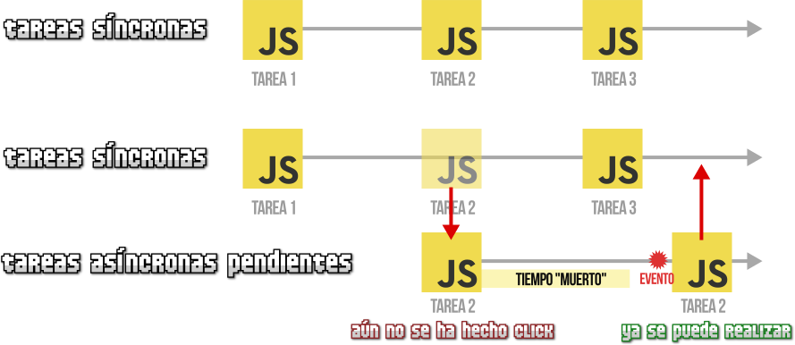

Para resolver este problema, JavaScript utiliza un modelo asincrónico, apoyado por:

-   El **Event Loop** (bucle de eventos).
-   Cola de tareas y cola de microtareas.
-   Herramientas como **callbacks**, **promesas**, y **async/await**.

En el modelo asincrónico:

-   El programa no espera a que una tarea termine para pasar a la siguiente.
-   Las operaciones que toman tiempo se delegan (por ejemplo, al navegador o al sistema operativo) y se procesan en segundo plano.
-   Cuando están listas, el resultado de esas tareas vuelve al hilo principal mediante el **Event Loop**, sin bloquear el flujo principal del programa.

### Callback

Un **callback** es una función que se pasa como argumento y se ejecuta después de que una operación asincrónica se complete.

```javascript
function procesarDato(dato, callback) { 
    console.log("Procesando:", dato); 
    setTimeout(() => { 
        callback(`Dato procesado: ${dato}`); }, 2000); 
} 

procesarDato("Ejemplo", (resultado) => { 
    console.log(resultado); 
});
```

### Promesas y async/await

Las promesas (palabra clave *Promise*) facilitan el manejo de tareas asincrónicas y reducen los problemas del **callback**.

```javascript
const tareaAsincrona = new Promise((resolve, reject) => { 
    setTimeout(() => resolve("Promesa completada"), 2000);
});
```

Mediante *async/await* se simplifica el código asincrónico, haciéndolo más legible:

```javascript
const tareaConAwait = async () => {
    try {
        const resultado = await new Promise((resolve) =>
            setTimeout(() => resolve("Resultado con await"), 2000)
        );
        console.log(resultado);
    } catch (error) {
        console.error(error);
    }
};
tareaConAwait();
```

## El árbol DOM

El **DOM** (*Document of Object Model*) de una web es la estructura del documento HTML. Una página HTML está formada por múltiples etiquetas HTML, anidadas una dentro de otra, formando un árbol de etiquetas relacionadas entre sí.

En Javascript, la forma de acceder al DOM es a través de un objeto llamado document, que representa el árbol DOM de la página.

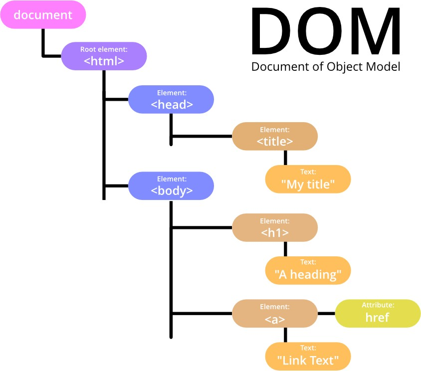


En su interior pueden existir varios tipos de elementos, pero principalmente serán:

-   **document:** el documento HTML cargado que ya comentamos.
-   Cada etiqueta *HTML* es un **nodo**.
    -   Los textos dentro de las etiquetas son **nodos de texto.**
    -   Los atributos son **nodos de atributo.**

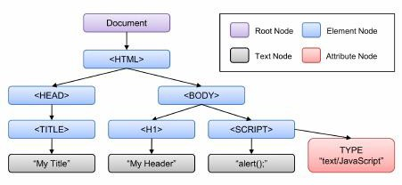

### Interfaces del DOM

JavaScript permite acceder a los elementos del DOM para recuperar su información, agregar nueva o modificarlos, haciendo uso para ello de varias interfaces de su API.

Veremos para ellos los métodos más usados según su uso:

#### Seleccionar elementos HTML del document

| **Método**                            | **Descripción**                                        |
|---------------------------------------|--------------------------------------------------------|
| document.getElementById(id)           | Buscar a un elemento HTML mediante su **id**           |
| document.getElementsByClassName(name) | Buscar a un elemento HTML mediante su **clase**        |
| document.querySelector(name)          | Buscar a un elemento HTML por su *selector CSS*        |
| document.getElementsByTagName()       | Selecciona todos los elementos de un tipo de etiqueta. |

#### Modificar elementos HTML (nodos)

| **Método**                                   | **Descripción**                                  |
|----------------------------------------------|--------------------------------------------------|
| element.**innerHTML** = nuevo contenido html | Modifica el HTML interno del elemento            |
| element.textContent = nuevo valor            | Modifica el texto contenido dentro de un elemento|
| element.attribute = nuevo valor              | Modifica el valor del atributo del elemento HTML |
| element.style.property = new style           | Modifica el valor del estilo del elemento HTML   |
| element.setAttribute()                       | Modificar atributos                              |

#### Agregar o eliminar nodos del document

| **Método**                      | **Descripción**           |
|---------------------------------|---------------------------|
| document.createElement(element) | Crear un elemento HTML    |
| document.removeChild(element)   | Eliminar un elemento HTML |
| document.appendChild(element)   | Agregar un elemento HTML  |

#### Navegar por el DOM

| **Método**            | **Descripción**                             |
|-----------------------|---------------------------------------------|
| parentNode            | Obtiene el nodo padre.                      |
| childNodes            | Obtiene una lista de todos los nodos hijos. |
| firstChild, lastChild | Obtiene el primer/último hijo.              |

Así por ejemplo para recuperar en una variable la información del elemento que tiene por id *demo*:

```javascript
<body> 
<h2>Mi primera página</h2> 
<p id="demo">Hola</p> 
<script> var elememento = document.getElementById("demo"); </script> 
</body> 
```

O para buscarlo por la clase principal:

```javascript
let elemento = document.getElementsByClassName("principal"); 
```
Si luego queremos modificar su valor usaremos *innerHTML*:

```javascript
elemento.innerHTML = "<p>Nuevo párrafo</p>"; 
```

> En este caso se sustituye completamente el valor del id o *clase* ya que usamos el operador **=**. Para añadir a lo que ya tentemos deberíamos usar el +=

## Eventos

A la hora de navegar por una página, el usuario genera **eventos** que son capturados por JavaScript. Algunos de dichos eventos pueden ser los siguientes:

-   Click de ratón sobre un elemento de la página.
-   Pulsación de una tecla específica del teclado.
-   Reproducción de un archivo de audio/video.
-   Scroll de ratón sobre un elemento de la página.
-   Se envía un formulario.

 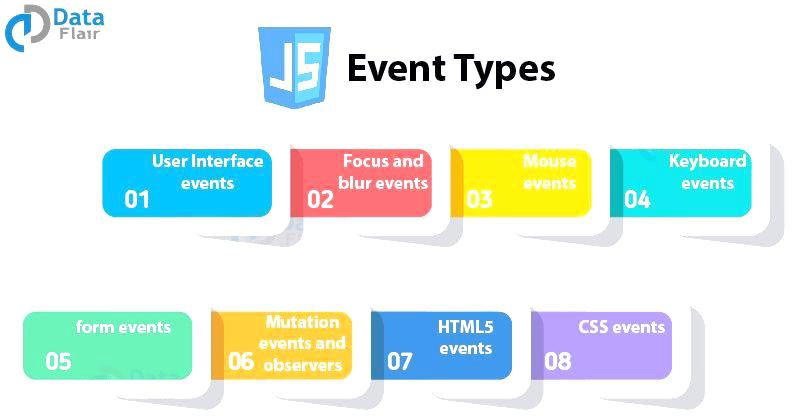

Un evento de JavaScript por sí mismo carece de utilidad. Para que los eventos resulten útiles, se deben asociar funciones o código JavaScript a cada evento. El ejemplo más obvio es un clic (*onclick*), que se activa al hacer clic sobre algo.

```javascript
document.querySelector("html").onclick = function () { 
 alert("has hecho clic en mi"); 
};
```

Listado de **eventos** importantes:

| **Evento** | **Tipo**   | **Descripción**                                     |
|------------|------------|-----------------------------------------------------|
| click      | Ratón      | Ocurre cuando se hace clic en un elemento           |
| dblclick   | Ratón      | Ocurre cuando se hace doble clic en un elemento.    |
| mousedown  | Ratón      | Ocurre cuando se presiona un botón del ratón.       |
| mouseenter | Ratón      | Ocurre cuando el puntero entra en un elemento.      |
| keydown    | Teclado    | Ocurre cuando se presiona una tecla.                |
| keyup      | Teclado    | Ocurre cuando se suelta una tecla.                  |
| submit     | Formulario | Ocurre cuando se envía un formulario.               |
| change     | Formulario | Ocurre cuando el valor de un campo cambia.          |
| focus      | Formulario | Ocurre cuando un campo obtiene el foco.             |
| load       | Ventana    | Ocurre cuando la página y sus recursos han cargado. |
| resize     | Ventana    | Ocurre cuando se cambia el tamaño de la ventana.    |

### addEventListener

La forma más moderna y flexible de agregar eventos es usando el *addEventListener* ya que permite añadir varios manejadores al mismo evento.

A continuación, un ejemplo en el que se utiliza *addEventListener* para hacer que al hacer clic sobre un botón se imprima un mensaje por la consola de JavaScript:

```javascript
<input id="boton" type="button" value="Aprétame"> 

<script> 
// Capturamos el boton 
const boton = document.querySelector('#boton'); 

// Escuchamos del boton, el evento 'click’ y ejecutaremos la función 
boton.addEventListener('click', function(evento) { 
   console.log('funcionó'); }, false);</script>
```
## JSON

**JSON** (JavaScript Object Notation) es un formato de texto basado en una sintaxis similar a la de los objetos de JavaScript.  

En JavaScript, **JSON** se utiliza comúnmente para enviar y recibir datos en aplicaciones web, especialmente cuando se trabaja con **APIs**.

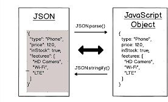

Algunos **métodos** útiles a la hora de trabajar con *JSON*:

| **Método**                      | **Descripción**                                                                                            | **Entrada**                     | **Salida**                    | **Ejemplo**                                                                      |
|---------------------------------|------------------------------------------------------------------------------------------------------------|---------------------------------|-------------------------------|----------------------------------------------------------------------------------|
|  **JSON.stringify**             |  Convierte un objeto o valor de JavaScript en una cadena JSON.                                             |  Objeto o valor de JavaScript   |  Cadena JSON                  |  JSON.stringify({ nombre: "Ana" }); // '{"nombre":"Ana"}'                        |
|  **JSON.parse**                 | Convierte una cadena JSON válida en un objeto o valor de JavaScript.                                       |  Cadena JSON                    |  Objeto o valor de JavaScript |  JSON.parse('{"nombre":"Carlos"}'); // { nombre: "Carlos" }                      |
|  **JSON.parse()** con funciones | Permite un segundo argumento, una función reviver, para modificar los valores al convertirlos a un objeto. |  Cadena JSON + función opcional |  Objeto o valor transformado  |  JSON.parse('{"edad":30}', (k, v) =\> k === 'edad' ? v + 1 : v); // { edad: 31 } |

## Debugging

La **depuración** del código o *debugging* es uno de los procesos fundamentales que debe llevar a cabo cualquier programador. Todos los navegadores modernos tienen una herramienta de depuración integrada llamada *Developer Tools* o *DevTools*, según el navegador, y que se invoca pulsando la tecla *F12*.

Otra forma más tosca y no recomendable para debugear código es utilizando los métodos console.log() o console.error() para mostrar mensajes en la consola del navegador.

```javascript
let datos = [{ nombre: "Ana", edad: 25 }, { nombre: "Luis", edad: 30 }]; console.table(datos);
``` 

### Panel de Developer Tools

En la **consola** podemos escribir los comandos y presionar *Enter* para ejecutar. Después de que se ejecuta una sentencia, el resultado se muestra debajo.

Por ejemplo, aquí 1+2 da el resultado 3, mientras que la llamada a función hello("debugger") no devuelve nada, con lo que el resultado será undefined:

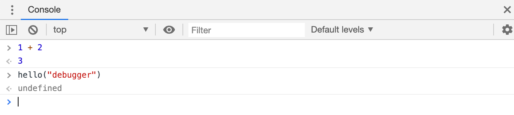

Al abrir el panel de depuración deberemos de acceder a la pestaña *Sources* y seleccionar nuestro fichero *js* para ver el código a debugear incluida la consola. Al hacer clic en la línea podemos poner breakpoints al igual que hacíamos en Netbeans.

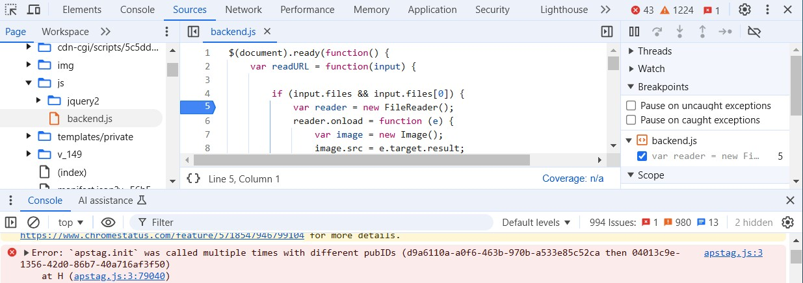

Una vez llegado al breakpoint o pausando el código podemos utilizar los botones para debugear al igual que hacíamos en Netbeans llamados: *Step into next function call* y *Step out of current function*.

-   El primero lo que nos permite es ingresar al código de una función que usamos en tiempo de ejecución.
-   El segundo permite salir de la función en la que nos encontramos depurando.

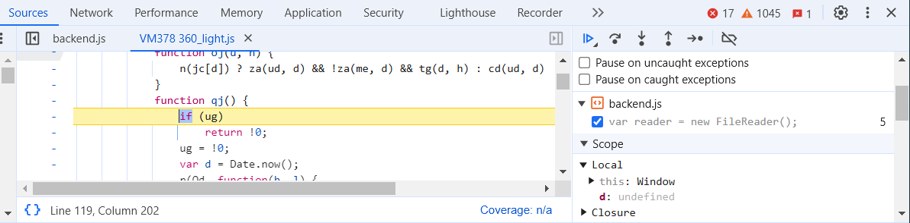

También podemos pausar el código utilizando el comando **debugger**, así:

```javascript
function hello(name) { 
let phrase = `Hello, ${name}!`; 
    
debugger; // <-- El debugger parará aquí 

say(phrase); 
}
```

> Este comando solo funciona cuando el panel de depuración esté abierto, de otro modo el navegador lo ignorará.
