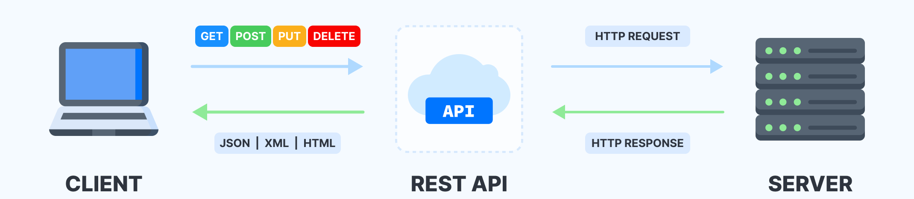
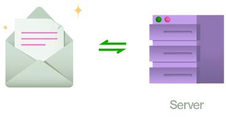
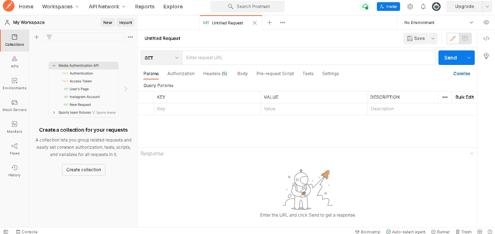
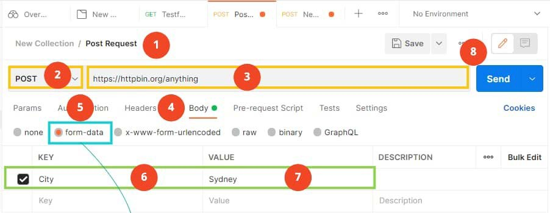
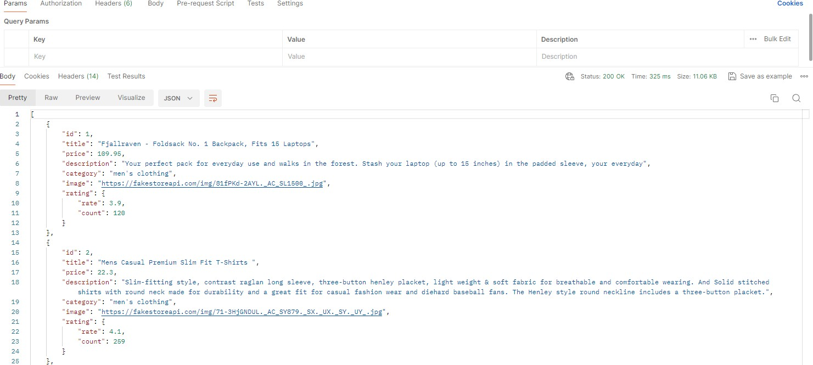
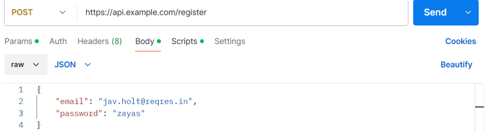

# UT5.5 - Testeo y operaciones sobre APIS

## Introducción a las API

```note
Una **API** (*Application Programming Interfaces*) es un conjunto de definiciones y protocolos que se utiliza para desarrollar e integrar el software de las aplicaciones, permitiendo la comunicación entre dos aplicaciones de software a través de un conjunto de reglas definidas generalmente en su documentación.
```

Una API es por tanto un intermediario entre dos sistemas, que permite que una aplicación se comunique con otra y pida datos o acciones específicas.

Las API son ampliamente utilizadas en la industria de desarrollo de software. La API establece cómo un módulo de un software se comunica o interactúa con otro para cumplir una o muchas funciones. Todo dependiendo de las aplicaciones que las vayan a utilizar, y de los permisos que les de el propietario de la API a los desarrolladores de terceros.


Ejemplos de APIs conocidas:


## API REST

En la actualidad la mayoría de **APIs** son de tipo **RESTful.**

```note
**REST** (Representational State Transfer) es una interfaz para conectar varios sistemas basándose en el protocolo HTTP y que sirve para obtener o generar datos y operaciones.
```

Un **protocolo** es un conjunto de reglas que determina qué mensajes se pueden intercambiar y qué mensajes son respuestas apropiadas a otros.

**HTTP** es el protocolo que permite enviar documentos de un lado a otro en la web. Los datos en envían o se devuelven en un formato conocidos, como son el **XML** o **JSON**.



### API no RESTful

Existen otras API no RESTful que utilizan convenciones más complejas, por encima de HTTP y que se apoyan en lenguajes enteros basados en *XML* como **SOAP**.

-  Si tuviésemos que hacer una analogía podríamos decir que **SOAP** sería como enviar un sobre en el que sería necesario mayor ancho de banda y trabajo adicional de tratamiento para preparar el sobre antes de enviarlo y luego al abrirlo en destino.
-  En el caso de **REST** sería como si mandaríamos directamente una postal sin más.



### Operaciones

Las **API REST** se apoyan como hemos visto en el protocolo **HTTP**.

Hay diferentes tipos de **REQUEST** u <u>operaciones</u> que una API REST puede manejar, y estos son los más utilizados:

| **Request** | **Descripción**                                                                                       |
|-------------|-------------------------------------------------------------------------------------------------------|
| GET         | Para devolver datos del servidor; un listado o recurso concreto.                                      |
| POST        | Para agrega nuevos datos en el servidor. A menudo, este tipo se usa para registrar o cargar archivos. |
| PUT/PATCH   | Para actualizar datos ya existentes en el servidor.                                                   |
| DELETE      | No autorizado                                                                                         |


Las API tienen un conjunto predefinido de puntos finales: direcciones únicas dentro de la **URL** del host, responsables de su funcionalidad.

Todas las API tienen una **documentación** pública donde se explica todos los puntos finales, tipos de valores devueltos, etc.

### Propiedades

Propiedades API REST:

-   Todo es un **recurso** y debe tener un identificador único (llamado **URL**)
-   Al recurso deben de aplicársele una **operación** específica permitida.
-   Los datos de la API estarán representados por un formato (*XML*, *JSON*, etc.)
-   La API devolverá un estado o **código de respuesta**.


### Documentación API


[https://petstore.swagger.io](https://petstore.swagger.io/)

### Códigos de respuesta HTTP

Al solicitar un servicio de una API REST, esta responderá con **códigos de respuesta:**


| Código | Tipo de Respuesta             | Descripción |
|--------|------------------------------|-------------|
| **100** | Respuesta informativa        | Continue (todo bien) |
| **101** | Respuesta informativa        | Switching Protocol (el servidor acepta cambio de protocolo) |
| **200** | Respuesta satisfactoria      | OK (solicitud con éxito) |
| **201** | Respuesta satisfactoria      | Created (solicitud exitosa que crea un recurso) |
| **202** | Respuesta satisfactoria      | Accepted (solicitud recibida pero se ha actuado aún) |
| **206** | Respuesta satisfactoria      | Partial Content (se servirá el contenido parcialmente) |
| **400** | Error del cliente            | Bad request (sintaxis es inválida) |
| **401** | Error del cliente            | Unauthorised (hace falta autenticación) |
| **403** | Error del cliente            | Forbidden (el cliente no tiene los permisos necesarios) |
| **404** | Error del cliente            | Not found (no se encuentra el recurso solicitado) |
| **429** | Error del cliente            | Too many requests (demasiadas peticiones en un corto tiempo) |
| **500** | Error del servidor           | Internal Server Error (situación que no se puede/sabe manejar) |
| **503** | Error del servidor           | Service Unavailable (servidor caído o sobrecargado) |


## Postman

```note
**Postman** es una aplicación que permite realizar peticiones de una manera simple para **testear APIs** de tipo **REST** propias o de terceros, entre otras múltiples funciones. 
```

Cuenta con una versión libre y con planes de pago para su uso (para equipos de desarrollo completos).



Algunas de las funciones principales de Postman:

-   **Envío de Solicitudes**: Postman permite enviar solicitudes HTTP (GET, POST, PUT, DELETE, etc.) a cualquier API directamente desde su interfaz de usuario. Esto facilita la prueba y el desarrollo de las funciones de la API sin necesidad de escribir código.
-   **Pruebas Automatizadas**: Postman permite escribir y ejecutar pruebas automatizadas para verificar la respuesta de la API. Puedes establecer condiciones y expectativas sobre los datos devueltos por la API y recibir informes detallados sobre si las pruebas han pasado o fallado.
-   **Entorno Colaborativo**: Postman proporciona funcionalidades colaborativas que permiten a los equipos compartir y colaborar en el desarrollo y prueba de APIs. Esto facilita el trabajo conjunto en proyectos que involucran APIs.
-   **Generación de Documentación**: Se puede utilizar Postman para generar automáticamente documentación para tu API basada en las solicitudes definidas.
-   **Monitorización de APIs**: Postman ofrece una función llamada "Monitores" que permite automatizar la ejecución de colecciones de solicitudes a intervalos regulares.

### Interfaz principal



1.  Crear una nueva colección y dentro una nueva solicitud
2.  Establecer el método HTTP del menú desplegable (*GET,POST, PUT, DELETE..)*
3.  Establecer la API a utilizar en el campo URL.
4.  Para establecer el cuerpo de la solicitud hacer clic en la pestaña *Headers*
5.  Pestaña de envío de datos *form-data.*
6.  Columna con campos Clave (key) de la API.
7.  Columna con los valores del campo seleccionado.
8.  Botón de envío.

Podemos crear colecciones con las consultas/operaciones de APIs que hayamos hecho que se guardarán en el apartado Collections. Las consultas se pueden renombrar, volver a guardar su estado y se sincronizarán desde nuestra cuenta en cualquier dispositivo.


Los datos devueltos por la API en formato *JSON* aparecerán en el campo *Body*:



Tendremos también acceso a la habitual **consola** de JavaScript desde la pestaña inferior denominada Console.

### Pestaña Params

Si se utiliza la pestaña *Params* en Postman, los valores se agregarán a la URL de la solicitud como parámetros. 

Por ejemplo:


Enviará:

  POST https://api.example.com/register?email=eve.holt@reqres.in&password=pistol
  
Los datos quedarán visibles en la URL, lo que no es seguro para datos sensibles como contraseñas o información personal.

### Pestaña Body

Si se utiliza la pestaña *Body* los valores se envían como parte del body de la solicitud. 

Por ejemplo, podemos seleccionar que se envíen en formato JSON:



Enviará:

```json
{
    "email": "jav.holt@reqres.in",
    "password": "zayas"
}
```

> Compatible con los estándares *RESTful*; muchas APIs modernas esperan los datos en el *body* para operaciones como registro o la autenticación.

### Testeo de APIs

Para realizar pruebas (testing) de APIs en Postman lo haremos desde el apartado *Test*, en código Javascript. Ya existe una batería de pruebas preestablecida que nos puede ayudar a crear los distintos test que necesitemos.


En Postman, *pm.expect()* es parte de *Chai.js*, una biblioteca de aserciones que se usa para escribir pruebas en Postman. Funciona evaluando una expresión y comparándola con un valor esperado.

Su sintaxis básica es la siguiente:

```javascript
    pm.expect(evaluar).to.eql(expected);
```

Y donde:
- *evaluar*: Es el valor que queremos evaluar.
- *.to.eql(expected)*: Compara actual con expected.

Así, por ejemplo:

```javascript
pm.expect(5).to.equal(5);  // Pasa porque 5 es igual a 5
pm.expect("hello").to.eql("hello");  // Pasa porque las cadenas son iguales
pm.expect(123).to.be.a("number");  // Pasa porque 123 es un número
pm.expect("hola").to.be.a("string");  // Pasa porque es un string
pm.expect(true).to.be.true;  //  Pasa porque es `true`
```

> Para una guía completa de referencia: [https://learning.postman.com/docs/writing-scripts/script-references/test-examples/](https://learning.postman.com/docs/writing-scripts/script-references/test-examples/) 


### Creación de variables

En Postman es posible crear los siguientes tipos de variables:
 - **Globales**: Disponibles en todo el espacio de trabajo.
 - **De entorno**: Asociadas a un entorno específico (p. ej., desarrollo, producción, pruebas).
 - **De colección**: Solo están disponibles para las solicitudes de una colección específica.
 - **Locales**: Usadas únicamente dentro de la ejecución de una solicitud.  No persisten más allá de la solicitud o iteración en un test.
 - **De datos**: Utilizadas al ejecutar colecciones con datos externos (archivos .json o .csv).

Podemos crear **variables de ambiente globales** desde el apartado *Enviroment*.

Este tipo de variables globales, asociadas a un determinado entorno, estarán disponibles para todo el espacio de trabajo.


En Postman, las variables se **referencian** usando la sintaxis *{{variable_name}}*

Así por ejemplo para referenciar una URL seleccionaremos el entorno (en este caso desarrollo) y lo referenciamos como sigue en Postman:


## APIs en Javascript

### fetch: recuperar datos  

Las APIs interactúan con el código usando uno o más objetos JavaScript, que sirven como contenedores para los datos que usa la API (contenidos en las propiedades del objeto), y la funcionalidad que la API provee (contenida en los métodos del objeto).

La primera forma de obtener dichos datos, y la más sencilla, es utilizando *fetch*, que es una nueva implementación de Javascript para ello. 
El único parámetro requerido de *fetch()* es una url. El método por defecto en este caso es **GET**, cuando no se indica ningún otro por omisión.

```javascript
fetch('http://example.com/movies.json') 
```

Así, por ejemplo:

```javascript
fetch('https://api.example.com/data')
  .then(response => {
    if (!response.ok) throw new Error('Error en la respuesta');
    return response();
  })
  .then(data => console.log(data))
  .catch(error => console.error('Error:', error));
```

### fetch: envío de datos 

El segundo parámetro de *fetch* es opcional, y recibe parámetros extras acerca del tipo de petición que vamos hacer, si queremos enviar datos, bajo qué tipo va a ir o si se va a enviar algún tipo de headers:

- El método **POST** se utiliza para **enviar datos** al servidor y crear un nuevo recurso.
- El método **PUT** se usa para enviar datos y **actualizar** información existente.


```javascript
fetch(url, { 
method: 'POST’,
headers:{ 
	'Content-Type': 'application/json’ 
	} 
body: JSON.stringify({ 
	name: "Taylor", 
	surname: "Swift" 
	}), 
})
```
> Reparemos más adelante el tratamiento de datos mediante *JSON.stringify*

###  Solicitudes XMLHttpRequest 

Para recuperar datos de una API en JavaScript de forma clásica se ha utilizado siempre *XMLHttpRequest*, que es un estándar de la W3C y basado en AJAX. AJAX es una tecnología que hace las páginas dinámicas sin necesidad de recargarlas.

```javascript
var xhttp = new XMLHttpRequest(); // Crear un nuevo XMLHttpRequest 

xhttp.onreadystatechange = function() 
{ // Si nada da error
 if (this.readyState == 4 && this.status == 200) { 	
  // La respuesta viene en formato texto, hay que hacer un run parse
  console.log(JSON.parse(this.responseText)); } 
}; 
// Endpoint de la API y método que se va a usar para llamar 
xhttp.open("GET", "https://pokeapi.co/api/v2/pokemon", true);
xhttp.setRequestHeader("Content-type", "application/json"); 
// Para mandar parámetros a la API, podríamos hacerlo desde el método send()
xhttp.send(null); 
```

###  Solicitudes mediante Axios 

Tanto *XMLHttpRequest* como *fetch* son nativas de JavaScript, pero *Axios* es una librería externa que tendremos que importar en nuestro proyecto antes de usarla.

```javascript
axios.get('https://pokeapi.co/api/v2/pokemon').then(function (response) 
{ 
// función que se ejecutará al recibir una respuesta 
console.log(response); 
}).catch(function (error) { 
// función para capturar errores 
console.log(error); }).then(function () { 
// función que siempre se ejecuta 
});
```

Axios tiene algunas ventajas adicionales como el parsear automáticamente las respuestas JSON y el poder usar tokens.

###  Conversión de los datos

A la hora de tratar con APIs ya hemos visto que se trabaja habitualmente con el formato JSON nativo y con las funciones *stringify* y *parse* (salvo en Axios)

#### JSON.stringify()

Convierte un objeto o array de JavaScript a una cadena JSON. Esto es útil cuando necesitas enviar datos a una API o almacenarlos en un formato que no acepta objetos de JavaScript .

```javascript
const usuario = {
  nombre: 'Juan',
  edad: 25,
  habilidades: ['JavaScript', 'Node.js']
};

const jsonString = JSON.stringify(usuario);
console.log(jsonString);
```

#### JSON.parse()

Convierte una cadena JSON a un objeto o array de JavaScript. Esto es útil para trabajar con datos recibidos de una API o recuperados de localStorage u otros almacenes persistentes. 

```javascript
const jsonString = '{"nombre":"Juan","edad":25,"habilidades":["JavaScript","Node.js"]}';

const usuario = JSON.parse(jsonString);

console.log(usuario.nombre); // Resultado: 'Juan'
console.log(usuario.habilidades[0]); // Resultado: 'JavaScript'
```

###  Asincronismo

Para asegurarnos que una operación ha terminado antes de que empiece otra, utilizaremos las **operaciones asíncronas**. Cuando trabajamos con *fetch* podemos crear crear función asíncrona cambiando su definición de la siguiente forma:

```javascript
async function fetchData() { 
try { 
	let response = await fetch("https://api.ejemplo.com/data"); 
	let data = await response.json(); // Trabajar con los datos obtenidos 
} catch (error) { 
console.error("Error:", error); } 
}
```

- *async* se utiliza para definir una función asíncrona.
- *await* se utiliza para esperar a que la respuesta se resuelva antes de continuar con el código.

Se deben utilizar bloques *try-catch* para el manejo de errores a la hora de trabajar en funciones asíncronas:

```javascript
async function fetchData() {
  try {
    const response = await fetch('https://api.example.com/data');
    if (!response.ok) throw new Error(`Error ${response.status}`);
    const data = await response.json();
    console.log(data);
  } catch (error) {
    console.error('Error al recuperar los datos:', error);
  }
}
fetchData();
```

### Autenticación (opcional)

Algunas APIs requieren autenticación para poder ser utilizadas. En dichos casos es necesario incluir un token en los encabezados:

```javascript
fetch('https://api.example.com/secure-data', {
  headers: {
    'Authorization': 'tu_token'
  }
});
```

### Modelo de datos en una web

El método *fetch()* devuelve lo que se denomina *promesa*. Después del método fetch() se debe incluir un then() a una **función** anónima para manejar la respuesta:

```javascript
fetch(url) 
   .then(function() {
   // Manejar la respuesta
})
```

Si la promesa devuelve *resolve*, la función anónima dentro del then será ejecutada. En caso contrario devolverá un *reject* y por tanto habrá que añadir un catch para capturar dicho error:

```javascript
fetch(url) 
   .then(function() { 
    // Manejar la respuesta
     }) 
    .catch(function() {
    // Manejar el error
    })
```

Habrá que utilizar el método *json()* visto para convertir los datos de la respuesta a JSON:

```javascript
fetch(url) 
 .then((response) => {  
    return response.json(); 
   })
```
Como los datos JSON aún deben procesarse, debe agregarse otro *then()* a la declaración con otra función que tenga un argumento llamado, por ejemplo, *data*:

```javascript
fetch(url) 
 .then((response) => {
   return response.json(); 
  }) 
 .then((data) => { 
  // Tratamiento de los datos JSON
   })
 ``` 
Dentro de la función definida anteriormente podemos crear una variable para almacenar los datos completos devueltos en formato JSON.

Después cada elemento podrá iterarse usando el método *map* y otra **función** para construir una estructura en *HTLM* que añadieremos posteriormente con *innerHTML*.

```javascript
fetch(url).then((response) => { 
 return response.json(); 
}).then((data) => { 
 let tableData = ""; 
 data.map((valores) => { 
 tableData += `<tr> 
  <td>${valores.nombre}</td> 
  <td>${valores.apellidos}</td> 
  </tr>`; 
  }); 
 }) 
document.getElementById("fila").innerHTML = tableData;
```

## APIs en Java

### Solicitar peticiones mediante URL 

Primeramente se crea un objeto de tipo *URL* con la dirección de servicio de petición a dicha API y a continuación nos conectaremos con un objeto de conexión *HttpURLConnection* y se le establecerá que el método de conexión sea **GET** para a continuación proceder con la conexión.

```java
try {
URL url = new URL(“https://weather.com/api/location“);
HttpURLConnection conn = (HttpURLConnection) url.openConnection();
conn.setRequestMethod(“GET”);
conn.connect();

} catch(Exception e)
```

### Verificar código devuelto

Para verificar si la petición es válida, se habrá de obtener el código **200** tal y como hemos visto ya.

Para ello recuperaremos del objeto de conexión dicho código mediante el método getResponseCode() 
Si no se devuelve un código 200 se generará una excepción y sino se continuará con el siguiente paso 3 para leer el flujo de datos devuelto (JSON o XML).

```java
...
HttpURLConnection conn = (HttpURLConnection) url.openConnection();
conn.setRequestMethod(“GET”);
conn.connect();

int responsecod = con.getResponseCode();

if (responsecod != 200 ) {
         throw new RuntimeException(“”);
} else {


}
```

### Leer el flujo de datos devuelto 

En este paso se leerá el flujo de datos devuelto (que podría ser JSON o XML).
Usaremos un objeto *StringBuilder* y un *Scanner* que leerá del url mediante el método *openStream()*.

```java
...
} else {
  StringBuilder cadenaDevuelta = new StringBuilder();
  Scanner sc = new Scanner(url.openStream());
  while (sc.hasNext()) {
   cadenaDevuelta.append(sc.nextLine());
  }  sc.close();

  System.out.println(CadenaDevuelta);
}
```

### Conversión de los datos

El trabajo con objetos JSON en Java no es nativo, como en JavaScript. No obstante, existen librerías como son Jackson, Gson y org.json que permiten el manejo de objetos JSON.  Para trabajar con dichas librerías deberíamos agregarlas como librerías o dependencias en Maven
Agregar dependencias en Jackson

Agregaríamos la dependencia Maven en el pom.xml del proyecto:

```xml
<dependency>
    <groupId>com.fasterxml.jackson.core</groupId>
    <artifactId>jackson-databind</artifactId>
    <version>2.15.2</version> <!-- Cambia la versión según sea necesario -->
</dependency>}
``` 