# UT6.1 Accesibilidad

## Accesibilidad

El concepto de **accesibilidad** está relacionado de forma directa con el de **usabilidad**.

La **accesibilidad** se puede definir como la posibilidad de acceso a una determinada aplicación, frente a la **usabilidad** que se refiere a la facilidad de uso. Por tanto, es evidente que una aplicación debe ser accesible antes que usable.

Además la legislación es clara en cuanto a la necesidad y obligatoriedad de su implantación, tal y como estudiaremos más adelante.


El acceso a una determinada aplicación debe facilitarse para todos los usuarios potenciales, más allá de las <u>limitaciones técnicas</u> de cada usuario (software, hardware, etc.) o de las <u>limitaciones individuales</u> de cada uno (discapacidades, dominio de un determinado idioma..).

De esta forma, cualquier aplicación accesible debe tener en cuenta la gran diversidad de potenciales usuarios que puede llegar a tener.

La accesibilidad realmente beneficia a todas las personas ante cualquier circunstancia o situación, incluso sin necesidad especial.

```note
El **diseño universal** es un término de diseño definido por Ronald L. Mace y hace referencia al diseño de productos y entornos para las necesidades de las personas, independientemente de su edad, capacidad o estado.
```

Un ejemplo de aplicación muy común de diseño universal es el ámbito automovilístico, que se esfuerza en ofrecer vehículos que se adaptan a todo tipo de personas a través de características como el ajuste del volante, pedales, asiento, retrovisores, etc.

El **diseño accesible** se define como el «diseño centrado en los principios de diseño estándar para personas con algún tipo de limitación para maximizar el número de potenciales consumidores que pueden usar un producto, edificio o servicio:

-   Diseñando productos, servicios y entornos que sean fácilmente utilizables por la     mayoría de los usuarios sin ninguna modificación.
-   Haciendo que los productos o servicios se adapten a diferentes usuarios.
-   Teniendo interfaces estandarizadas para ser compatibles con productos especiales para personas con discapacidades.

En el mundo real resulta casi imposible crear aplicaciones que sean universalmente accesibles, ya que tanto el contexto de uso como las posibles discapacidades de los usuarios pueden ser muy variables, y siempre existirá algún caso no previsto.

Aun así, diseñadores y programadores deben ser conscientes de la necesidad de adaptarse a las pautas de accesibilidad, para que la aplicación sea usable por el mayor número de usuarios posible.

### Objetivos de la accesibilidad

Existen cuatro objetivos clave que deben tenerse siempre presentes:

-  Garantizar que toda la información presentada en el dispositivo pueda ser percibida.
-  Asegurar que el usuario puede operar con el dispositivo, incluso si está usándolo en condiciones con limitaciones.
-  Facilitar la capacidad del usuario de navegar a través de la información y controles, incluso si está usándolo con limitaciones.
-  Favorecer su capacidad para entender el contenido. Es importante favorecer la capacidad del usuario para entender el contenido presentado en el dispositivo.

### Mitos de la accesibilidad

-   Las personas con discapacidad no utilizan la web: Más bien es todo lo contrario, ya que las nuevas tecnologías e Internet ha permitido a un gran numero de personas con discapacidad llevar una vida autónoma e independiente.
-   Las páginas web con <u>solo texto</u> son accesibles: No es cierto, ya que las páginas web que sólo contienen texto pueden ser difíciles de entender por personas con discapacidad cognitiva o con dificultades con el lenguaje como las personas sordas.
-   La accesibilidad es cara : Lo es como cualquier adaptación a una nueva tecnología.
-   La accesibilidad es sólo para ciegos: Falso ya que existen usuarios con diferentes tipos
    de discapacidad que pueden experimentar distintos problemas de acceso.
-   La accesibilidad es sólo para las personas con discapacidad: En realidad se beneficia todo el mundo, ya que ayuda a cualquier usuario que se encuentre en circunstancias especiales como puede ser entornos con baja iluminación, ambientes ruidosos, acceso a Internet con conexiones y equipos con capacidades limitadas, etc.

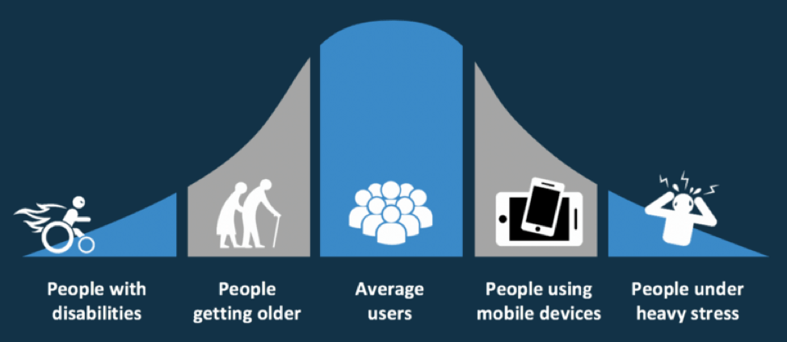

### Ventajas de la accesibilidad

Una **ventaja** importante de la accesibilidad es el potencial de ganancia financiera directas e indirectas por un mayor uso del sitio o aplicación. En el caso de la accesibilidad web puede hacer que sea más fácil para las personas encontrar un sitio web, acceder a él y utilizarlo con éxito, lo que resulta en una mayor audiencia (más usuarios) y una mayor eficacia (mayor uso).

Otra ventaja es que las técnicas para mejorar la accesibilidad aumentan las posibilidades de encontrar las páginas web (SEO) al exponer más contenido a los motores de búsqueda, tanto a nivel interno (dentro de la página) como a nivel externo (la WWW).

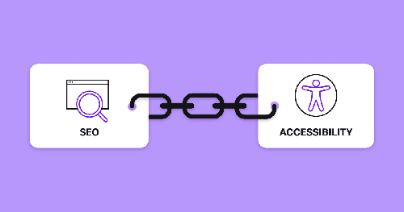

## Discapacidades de los usuarios

### Discapacidades visuales

Se trata de discapacidades que generalmente resultan muy limitadoras:

- **Ceguera**.
- **Baja visión**. Las personas con baja visión tienen una capacidad suficiente para la planificación y ejecución de tareas. Existen muchos tipos de baja visión como la falta de agudeza visual, la distrofia macular (solo se ve una parte del campo visual) o la visión borrosa.
-   **Daltonismo**. Supone una incapacidad para distinguir ciertos colores. Los casos más comunes se refieren a la distinción entre rojo y verde, o entre amarillo y azul.

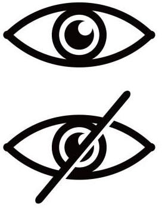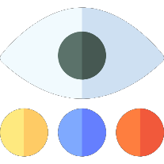

#### Barreras de acceso

Hay barreras técnicas que impiden el acceso a personas ciegas mediante dispositivos de lectura como por ejemplo el uso de **imágenes** sin texto alternativo que describa su contenido o **imágenes complejas** como gráficos de barras o estadísticos sin una descripción detallada.

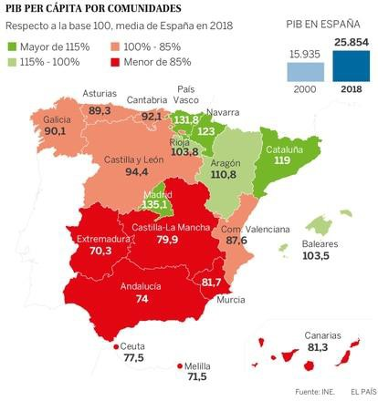

Para personas con **baja visión** el <u>tamaño de las letras</u> suele ser una barrera importante así como el **diseño** en el que al modificar el tamaño de sus fuentes se estropea su maquetación haciendo difícil la navegación.

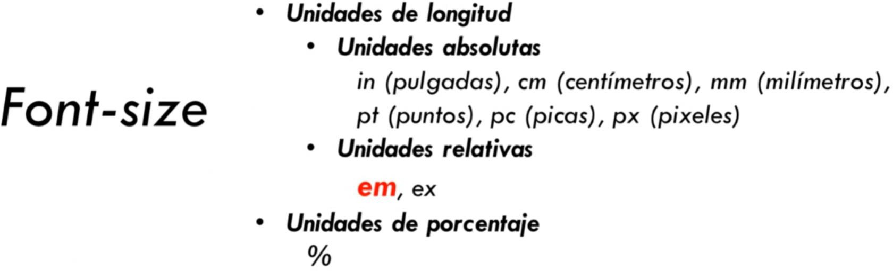

Para personas con **daltonismo** el uso del **color** para resaltar sin usar otro elemento de formato adicional como la negrita, cursiva o subrayado.

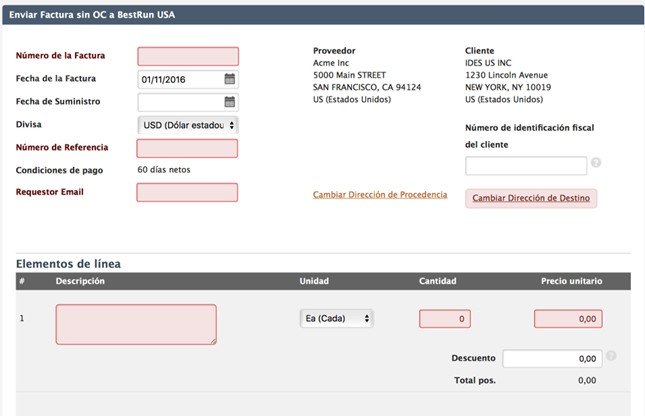

#### Productos de apoyo

Los **productos de apoyo** que utilizan las personas con **ceguera** suelen ser:

-   **Lectores de pantalla**: son aplicaciones que interpretan el texto de la pantalla y lo transmiten mediante un sintetizador de voz (*como JAWS, Linux Screen Reader, Microsoft Narrator, Talkback, VoiceOver*) o lo envían a una **línea braille** para que el usuario lo pueda leer con los dedos.
-   **Navegadores de voz**: leen el contenido de las páginas web con un sintetizador de voz incorporado.
-   **Teclado como dispositivo de entrada**: mediante el teclado utilizan el tabulador para recorrer los enlaces y controles de formulario en la web o usando las teclas de acceso rápido para ir a una zona determinada de contenido directamente, en vez de secuencialmente.

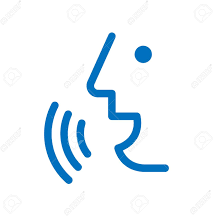

En cuanto a las personas con **baja visión** suelen utilizar las siguientes estrategias:

-   **Pantallas grandes**: Además aumentan el tamaño de texto e imágenes en dichas pantallas.
-   **Ampliadores o magnificadores de pantalla:** son programas software o incluidos por los propios Sistemas Operativos que actúan como lupas.
-  **Uso de combinaciones específicas** de colores de texto y fondo.
-   Uso de **tipos de letra** más grandes y legibles.

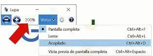  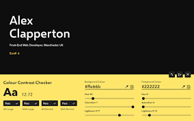

Las personas con **daltonismo** pueden emplear sus propias hojas de estilo para modificar los colores de las fuentes y de fondo de las páginas, en vez de los definidos por el desarrollador.

En ciertos productos como además existen ajustes de software destinados a paliar las diferencias en los colores de los menús o incluso en pantallas o mundos de videojuegos resaltando la gama cromática de estos.

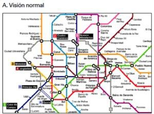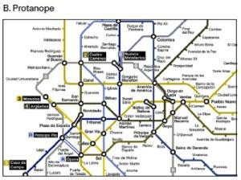

### Discapacidades auditivas

Aunque son menos limitadoras que las visuales, las deficiencias auditivas también deben tenerse en cuenta:

-   **Sordera**. Imposibilita la percepción vía auditiva. Se suple mediante lengua de signos y es posible que no hablen o lean con fluidez otro idioma.
-   **Sordera moderada**. También denominada hipoacusia es la disminución de la capacidad auditiva que aún permite recibir el lenguaje oral vía auditiva. Puede darse una sordera ligera o moderada.

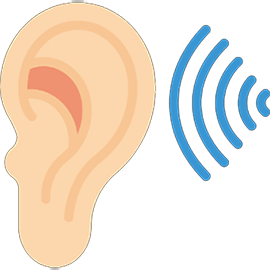

#### Barreras de acceso

Actúan como barreras de acceso en las personas con sordera o hipoacusia:

-   La falta de **subtítulos** o **transcripciones** en los contenidos sonoros hablados.
-   La falta de **imágenes** que ayuden en la comprensión del contenido de las páginas.
-   La necesidad de uso de la **entrada de voz** en ciertas aplicaciones.

#### Productos de apoyo

Este tipo de usuarios no suele utilizar productos de apoyo específicos (salvo los **audífonos** pero son dispositivos de uso general) y dependerán en todo caso en gran parte del diseño del sitio web o de la aplicación usada.

### Discapacidades motoras/físicas

Podemos tener en cuenta diversos tipos de discapacidades físicas:

-   **Discapacidades motrices**. Se refieren a limitaciones en la movilidad del usuario, que suelen implicar la incapacidad de interactuar con los dispositivos tradicionales. Pueden corresponder a debilidad, limitaciones de control muscular, enfermedad de Parkinson, esclerosis, limitaciones de sensibilidad, problemas con las articulaciones, o falta de miembros. Pueden afectar a las manos, los brazos y otras partes del cuerpo.
-   **Deficiencias en el habla**. Implican dificultad para pronunciar de manera reconocible por aplicaciones de reconocimiento de voz.

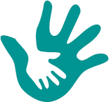

#### Barreras de acceso

Las barreras de acceso que impiden el acceso de personas con discapacidad motriz suelen ser las siguientes:

-   Iconos, botones, enlaces y otros **elementos de interacción** demasiado pequeños, lo cual dificulta su uso a personas con poca destreza motriz en sus movimientos.
-   Falta de **independencia del dispositivo** que impida utilizar la web o la aplicación con el teclado en vez de con el ratón o la pantalla táctil exclusivamente.
-   **Tiempos de respuesta** limitados para interactuar con una página o aplicación.

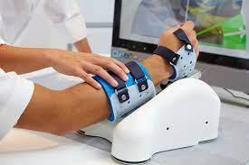

#### Productos de apoyo

Las personas con dificultades motoras o físicas pueden utilizar alguno de los siguientes dispositivos:

-   Ratones especiales o apuntadores de boca
-   Teclados alternativos
-   Software de reconocimiento de voz.
-   Sistemas de seguimiento de ojos o de reconocimiento facial.

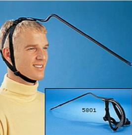

### Discapacidades cognitivas

Las discapacidades cognitivas y neurológicas incluyen los siguientes tipos:

-   **Dislexia, discalculia**. Dificultades en la comprensión de lenguaje escrito o     hablado, y en la lectura de imágenes o de cifras.
-   **Trastorno de déficit de atención**. Dificultades para concentrarse en la información. La existencia de elementos que puedan distraer (por ejemplo, animaciones en una página) puede resultar muy molesta para usuarios de este tipo.
-   **Discapacidad cognitiva**. Lentitud en el ritmo de aprendizaje, y dificultades para comprender conceptos complejos. Los usuarios de este tipo precisan un lenguaje claro y sencillo. La inclusión de gráficos explicativos puede resultar positiva.
-   **Falta de memoria**. Problemas de memoria a corto o largo plazo. Estos usuarios necesitan una estructura de navegación coherente a lo largo de toda la aplicación.
-   **Epilepsia**: Los usuarios de este tipo pueden necesitar desactivar las animaciones y los elementos parpadeantes para evitar ataques.

#### Barreras de acceso

Las barreras de acceso a personas con **discapacidades cognitivas** son:

-   Elementos visuales o sonoros que no se puedan deshabilitar ya que pueden afectar a las personas con déficit de atención.
-   La falta de una organización clara y coherente de la información que ayude a personas con problemas de memoria o escasa capacidad cognitiva.
-   Ausencia de **gráficos** que complementen a la información textual dado el caso.
-   Tamaño de letras fijo que no se puedan modificar.


#### Productos de apoyo

Las personas con dificultades cognitivas puede usar alguna de las siguientes estrategias:

-   Uso de **lectores de pantalla** o **narradores** para facilitar la compresión a personas con dificultades para la lectura.
-   Uso de **subtítulos** para la compresión del contenido sonoro.
-   **Desactivación de los elementos multimedia** para concentrarse en el contenido o evitar ataques de epilepsia.
-   Utilización de **fuentes** específicas en el sistema o navegador para personas con
    dislexia.

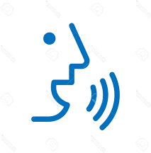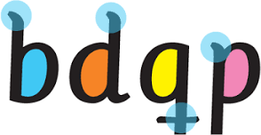

### Discapacidad tecnológica

La **discapacidad tecnológica** <u>no puede considerarse una discapacidad</u> en sentido estricto. La padecen aquellas personas que por diversas razones, no cuentan con la tecnología adecuada. Se refiere por tanto a Sistemas Operativos antiguos, navegadores web alternativos, bajo ancho de banda, hardware antiguo o la ausencia de un plugin o lenguaje de programación habilitado (pj java script) para reproducir contenidos o realizar ciertas acciones en la interfaz. También puede deberse a dispositivos de visualización de pequeño tamaño (como wereables o pantallas reducidas).

El **desconocimiento de la tecnología** se puede también englobar en este tipo de discapacidad no oficial. Es el que sufren las personas que no consiguen integrarse en el mundo de las tecnologías modernas. Dentro de este grupo podríamos incluir a personas mayores, personas del medio rural o incluso países en vías de desarrollo…

En este apartado también podríamos englobar a las **limitaciones derivadas del entorno** como ambientes con mala iluminación, entornos de trabajo que no permiten captar contenido sonoro o falta de ratón y/o pantalla táctil.

### Envejecimiento

Además de las discapacidades descritas anteriormente, un factor que cabe tener muy en cuenta es la edad del usuario: cada vez son más los usuarios de edad avanzada que utilizan cotidianamente aplicaciones interactivas, o que empiezan a utilizarlas por primera vez.

En edades avanzadas, puede existir pérdida de algunas de las capacidades asociadas a la visión, oído, habilidades motrices y memoria, o una combinación de varias discapacidades (multifactorial).

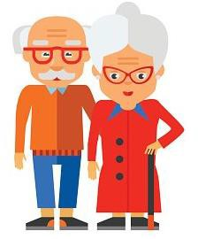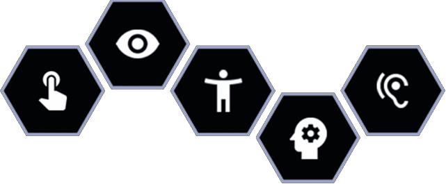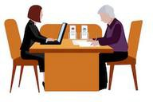

## Legislación en España y en Europa

```note
Todas las Administraciones Públicas tienen obligación de dar cumplimiento a los requisitos de accesibilidad impuestos por el **Real Decreto 1112/2018** de 7 de septiembre (y la **Directiva 2016/2102**), sobre accesibilidad de los sitios web y aplicaciones para dispositivos móviles del sector público o que trabajen para este.
```

Esto se traduce en que todos los sitios web y aplicaciones de las administraciones públicas deben cumplir la norma **UNE-EN 301549:2022** de "Requisitos de accesibilidad para productos y servicios TIC" alineada a los Criterios de Conformidad de nivel A y AA de la [**WCAG 2.1** ](https://www.w3.org/WAI/WCAG21/quickref/)mas un conjunto de requisitos propio de la **UNE-EN 301549** que veremos más adelante.

📌Se puede encontrar esta información detallada en la web del Portal para la Administración Electrónica [https://administracionelectronica.gob.es/pae_Home/pae_Estrategias/pae_Accesibilidad/pae_Comunidad_Accesibili](https://administracionelectronica.gob.es/pae_Home/pae_Estrategias/pae_Accesibilidad/pae_Comunidad_Accesibilidad.html) [dad.html](https://administracionelectronica.gob.es/pae_Home/pae_Estrategias/pae_Accesibilidad/pae_Comunidad_Accesibilidad.html)

A finales del año 2007 también se publicó la **Ley 49/2007**, de 26 de diciembre, por la que se establece el *régimen de infracciones y sanciones en materia de igualdad de oportunidades, no discriminación y accesibilidad universal de las personas con discapacidad*.

**Sanciones** recogidas en el artículo 4:

1.  Las infracciones serán sancionadas con multas que irán desde un mínimo de 301euros hasta un máximo de 1.000.000 de euros.
2.  Para las infracciones leves, la sanción no excederá en ningún caso de los 30.000 euros.
3.  Para las infracciones graves, la sanción no excederá en ningún caso de los 90.000 euros.

Además, la legislación anterior también establece que las páginas de Internet de las empresas que presten servicios al público en general de **especial trascendencia económica**, así como las **redes sociales**, deberán satisfacer como mínimo, el nivel medio de los criterios de accesibilidad al contenido generalmente reconocidos.

## Empresas de especial trascendencia económica

Para que una empresa tenga esta consideración, debe tener más de cien trabajadores, o su volumen anual de operaciones deberá exceder los 6 millones de euros. Además, deberá operar en alguno de los siguientes sectores:
-   Servicios de comunicaciones electrónicas a consumidores.
-   Servicios financieros destinados a consumidores.
-   Servicios de suministro de agua a consumidores.
-   Servicios de suministro de gas al por menor.
-   Servicios de suministro eléctrico a consumidores finales.
-   Servicios de transporte de viajeros por carretera, ferrocarril, vía marítima o aérea.
-   Actividades de comercio al por menor.

## Pautas de accesibilidad WCAG

Desde hace años existen numerosas pautas que ayudan a los desarrolladores a crear sitios y aplicaciones accesibles. Las más famosas son las Pautas de Accesibilidad al Contenido Web (**Web Content Accessibility Guidelines**) desarrolladas por el grupo *Web Accessibility Initiative* del **W3C**.

Sin embargo, estas pautas no son las únicas. Otros organismos y empresas, como IBM (**Web Accessibility Checklist**) o Microsoft (**Accessibility Design Guidelines**) han desarrollado las suyas propias, inspiradas en muchos casos en las pautas del W3C.

Las pautas del W3C son consideradas como estándares internacionales de accesibilidad web. En muchos países, la legislación sobre accesibilidad web emplea las pautas del W3C como marco de referencia.

No obstante, aunque las pautas ayudan a detectar posibles errores, su uso no garantiza completamente que un sitio web sea totalmente accesible.

Para optimizar la accesibilidad del contenido de los sitios web, el Consorcio World Wide
Web (**W3C**) ha desarrollado las **Pautas de accesibilidad al contenido en la web**.

Las pautas WCAG (*WCAG 1.0 y WCAG 2.x*) contienen una serie de puntos de verificación que permiten detectar errores que veremos a continuación.

Cada uno de los puntos de verificación está asignado a uno de los 3 **niveles de**
**prioridad**, basado en su impacto en la accesibilidad:

- **Prioridad 1 básica**: Garantiza un nivel mínimo de accesibilidad. Puede aplicarse a todo el contenido del sitio web.
- **Prioridad 2 intermedia/recomendada**: Garantiza un nivel óptimo de accesibilidad. Puede aplicarse a todo el contenido del sitio web.
- **Prioridad 3 avanzado/opcional**: Garantiza un nivel avanzado de accesibilidad. No es necesario aplicarlo a todo el sitio web.

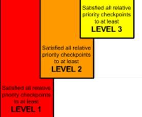

### WCAG 1.0

En la **WCGA 1.0** (ya desactualizado) se identificaron catorce pautas de diseño accesible a seguir:

1.  Proporcionar alternativas equivalentes para contenido visual y auditivo.
2.  No basarse solo en el color.
3.  Usar marcadores y hojas de estilo y hacerlo de forma correcta.
4.  Especificar el lenguaje utilizado.
5.  Crear tablas que se transformen correctamente.
6.  Asegurarse de que las páginas que usen nuevas tecnologías se transformen correctamente.
7.  Asegurar al usuario el control de los contenidos que cambian con el tiempo.
8.  Asegurar la accesibilidad directa de las interfaces incrustadas.
9.  Diseñar para la independencia del dispositivo.
10. Usar soluciones provisionales.
11. Usar las tecnologías y pautas de la W3C.
12. Proporcionar información de contexto y orientación.
13. Proporcionar mecanismos claros de navegación.
14. Asegurar documentos claros y simples.

### WCAG 2.0 y 2.1

Posteriormente, en el año 2009, estas catorce pautas fueron revisadas en la versión

2.0 de las Guías de Accesibilidad de los Contenidos para la Web **WCAG 2.0** y en 2018 con la [**WCAG 2.1**](https://www.w3.org/WAI/WCAG21/quickref/)**.** Se espera que en 2023 se publiquen las **WCAG 2.2** (todas son compatibles hacia atrás)

En esta revisión, las catorce pautas se redujeron a cuatro principios fundamentales que veremos a continuación desarrollados:

1.  **Perceptibilidad** (*Perceivable*)
2.  **Operatividad** (*Operable*)
3.  **Comprensibilidad** (*Understandable*)
4.  **Robustez** (*Robust*)

📌 Se puede encontrar la información en la web del *W3C* <http://accesibilidadweb.dlsi.ua.es/?menu=principios-2.0> y descripciones detalladas en [http://www.sidar.org/traducciones/wcag20/es/comprender-](http://www.sidar.org/traducciones/wcag20/es/comprender-wcag20/Overview.html#contents) [wcag20/Overview.html\#contents](http://www.sidar.org/traducciones/wcag20/es/comprender-wcag20/Overview.html#contents)

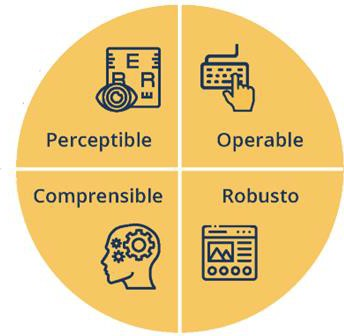

#### Principio 1: Perceptibilidad

La información y los componentes de la interfaz de usuario deben ser mostrados a los
usuarios en formas que ellos puedan entender.
-   *Directriz 1.1.* **Texto alternativo**: Proporciona texto alternativo para el contenido que no sea textual, así podrá ser transformado en otros formatos que la gente necesite, como caracteres grandes, lenguaje braille, lenguaje oral, símbolos o lenguaje más simple.
-   *Directriz 1.2.* **Contenido multimedia dependiente del tiempo**: Proporciona acceso a los elementos multimedia (audio o video) a través de subtítulos y otras alternativas.
-   *Directriz 1.3.* **Adaptable**: Crear contenido que pueda ser presentado de diferentes
    formas sin perder ni información ni estructura.
-   *Directriz 1.4.* **Distinguible**: Facilitar a los usuarios ver y escuchar el contenido
    incluyendo la distinción entre lo más y menos importante.

#### Principio 2: Operatividad

Los componentes de la interfaz de usuario y la navegación debe ser manejable.
-   *Directriz 2.1*: **Teclado accesible**: Poder controlar todas las funciones desde el teclado.
-   *Directriz 2.2* **Tiempo suficiente**: Proporciona tiempo suficiente a los usuarios para leer y utilizar el contenido.
-   *Directriz 2.3*: **Ataques epilépticos**: No diseñar contenido que pueda causar ataques
    epilépticos.
-   *Directriz 2.4*: **Navegación**: Proporciona formas para ayudar a los usuarios a navegar, a buscar contenido y a determinar donde están estos.

#### Principio 3: Comprensibilidad

La información y las operaciones de usuarios deben ser comprensibles.
-   *Directriz 3.1*. **Legible**. Hacer contenido de texto legible y comprensible.
-   *Directriz 3.2.* **Previsible**: Hacer la apariencia y la forma de usar las páginas web previsibles.
-   *Directriz 3.3.* **Asistencia a la entrada de datos**: facilitar a las personas que tengan dificultades de compresión para ingresar datos sin cometer errores y ayudarles a advertirlos y entenderlos.

#### Principio 4: Robustez

El contenido deber ser suficientemente robusto para que pueda ser bien interpretado por una gran variedad de agentes de usuario, incluyendo tecnologías de asistencia.

-   *Directriz 4.1.* **Compatible**: Maximizar la compatibilidad de los contenidos con las
    tecnologías actuales y futuras, incluyendo tecnologías de asistencia.

### Niveles de conformidad WCAG

Para comprobar el nivel de accesibilidad de un sitio web, se establecen los **niveles de conformidad**, que corresponden a la medida en que se satisfacen los puntos de verificación WCAG (WCAG 1.0 y 2.0), teniendo en cuenta los niveles de prioridad.

Los **niveles de conformidad** son tres:
-   Nivel de conformidad **A**. Corresponde al nivel en que se satisfacen todos los puntos de verificación de **prioridad 1**.
-   Nivel de conformidad **AA**. Corresponde al nivel en que se satisfacen todos los puntos de verificación de **prioridad 1 y 2**.
-   Nivel de conformidad **AAA**. Corresponde al nivel en que se satisfacen todos los puntos de verificación de **prioridad 1 y 2**, y al menos el **50%** del nivel de **prioridad 3**.


| Nivel de Prioridad         | Descripción                                                                 | Ejemplos de Requisitos                                               | Recomendado para                                                           |
|----------------------------|---------------------------------------------------------------------------|----------------------------------------------------------------------|----------------------------------------------------------------------------|
| **A (Básico - Obligatorio)**  | Requisitos mínimos para garantizar que algunas personas con discapacidad puedan acceder al contenido. | - Texto alternativo en imágenes.  <br> - No depender solo del color para transmitir información.  <br> - Navegación accesible con teclado. | Todos los sitios web para evitar barreras básicas de accesibilidad.       |
| **AA (Intermedio - Recomendado)** | Mejora la accesibilidad para un mayor grupo de personas con discapacidad. Es el nivel más recomendado por las normativas legales. | - Contraste adecuado (4.5:1).  <br> - Formularios con etiquetas claras.  <br> - Compatibilidad con orientación vertical y horizontal. | Sitios web gubernamentales, corporativos, de comercio electrónico y cualquier web con estándares de accesibilidad. |
| **AAA (Avanzado - Opcional)** | El más alto nivel de accesibilidad, pensado para personas con discapacidades severas. No suele ser obligatorio. | - Contraste mejorado (7:1).  <br> - Descripciones de audio en videos.  <br> - Evitar bloques largos de texto. | Webs de servicios esenciales como sanidad, educación y accesibilidad gubernamental. |


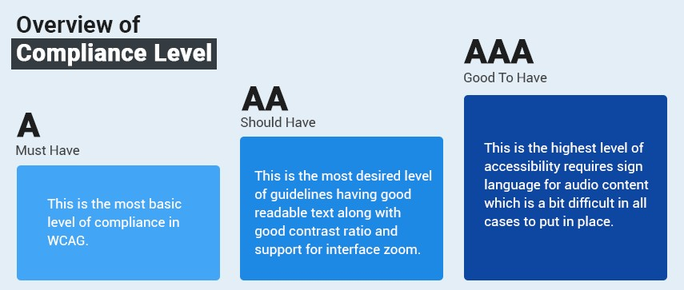


### Iniciativa WAI

El máximo organismo dentro de la jerarquía de Internet que se encarga de promover la accesibilidad es el **W3C**, en especial su grupo de trabajo **WAI**.

La **WAI** (*Web Accessibility Initiative*) es una iniciativa (menos específica que el WCAG) desarrollada por el W3C con los siguientes objetivos:

1.  Facilitar el acceso de las personas con discapacidad.
2.  Desarrollar pautas de accesibilidad.
3.  Mejorar herramientas para la evaluación y reparación de accesibilidad Web.
4.  Llevar a cabo una labor educativa y de concienciación en relación a la importancia del diseño accesible de páginas Web.
5.  Abrir nuevos campos en accesibilidad a través de la investigación en esta área.

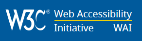

## Estándares de accesibilidad

### UNE 139803:2004

Bajo el título de “*Aplicaciones informáticas para personas con discapacidad. Requisitos de accesibilidad para contenidos en la web*”, es una norma española (**UNE**), publicada en diciembre de 2004, que contempla las especificaciones que han de cumplir los contenidos web para que puedan ser accesibles.

Se trata de una transposición de las Pautas de accesibilidad al contenido en la web (WCAG 1.0) desarrolladas por la iniciativa WAI, pero estructuradas de forma diferente.

### UNE 139803:2012

Dadas las diferencias entre las WCAG 2.0 y las WCAG 1.0 surgió la necesidad de actualizar el contenido de esta norma UNE para que sus requisitos sean acordes con el contenido de las **WCAG 2.0**.

Así, en 2012 se actualizó esta norma UNE para adoptar directamente las WCAG 2.0. Esta norma UNE señala directamente qué partes de WCAG 2.0 se consideran requisitos y con qué nivel de prioridad.

### UNE 153101:2018

Esta normativa experimental especifica las pautas y recomendaciones para la adaptación, creación y validación de documentos en **Lectura Fácil**.

Esta norma experimental se aplica a textos y documentos escritos, independientemente del soporte en el que se presenten.

La Lectura Fácil trata de favorecer la adaptación y accesibilidad de contenidos (textos e
imágenes) para que llegue la misma información a las personas.

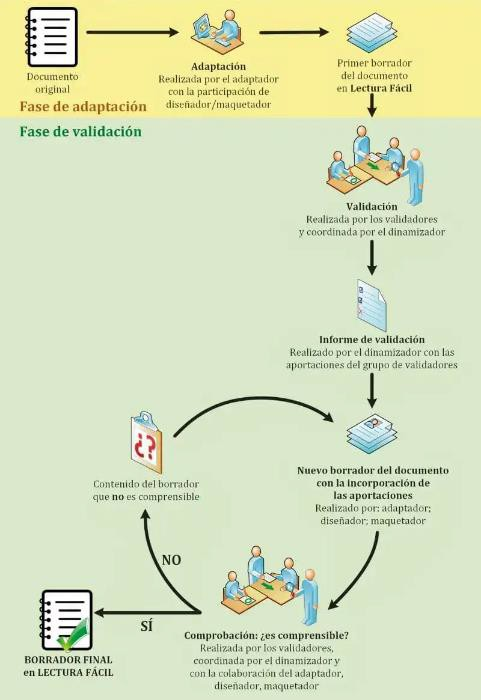

### UNE-EN 301549:2015

Esta normativa Española (UNE), **establece los condicionantes, con respecto a su accesibilidad, que deberán cumplir todos los sitios web y aplicaciones móviles del sector público** (estatal, regional, local, universitario, etc.), junto con una descripción de los procedimientos de prueba y la metodología de evaluación para cada requisito de accesibilidad. Este documento podría ser útil para otros fines, tales como la contratación en el sector privado.

### UNE-EN 301549:2022

Se trata de la versión más reciente de la norma, que a su vez sustituye a las anteriores UNE-EN 301549:2015 y UNE-EN 301549:2020

## Accesibilidad en las plataformas

A continuación se referencian las capas de **accesibilidad** presentes en algunas de las principales **plataformas** y que no tienen herramientas de validación online como el WCAG 2.x pero sí protocolos específicos para cumplirla:

- **Android**: <https://developer.android.com/guide/topics/ui/accessibility/index.html>
-  **iOS**[ https://developer.apple.com/library/content/documentation/UserExperience/Conc](https://developer.apple.com/library/content/documentation/UserExperience/Concept%20ual/iPhoneAccessibility/Accessibility_on_iPhone/Accessibility_on_iPhone.html) [ept ual/iPhoneAccessibility/Accessibility_on_iPhone/Accessibility_on_iPhone.html](https://developer.apple.com/library/content/documentation/UserExperience/Concept%20ual/iPhoneAccessibility/Accessibility_on_iPhone/Accessibility_on_iPhone.html)
- **Windows**: <https://developer.microsoft.com/en-us/windows/accessible-apps>


## Herramientas de evaluación accesibilidad web

El proceso de **evaluación de la accesibilidad** de un sitio web se divide en dos fases: en primer lugar, se debe realizar un análisis automático que detecte los problemas de accesibilidad y, en segundo lugar, debe llevarse a cabo una evaluación manual para identificar todos aquellos problemas que no pueden ser comprobados en esta fase.

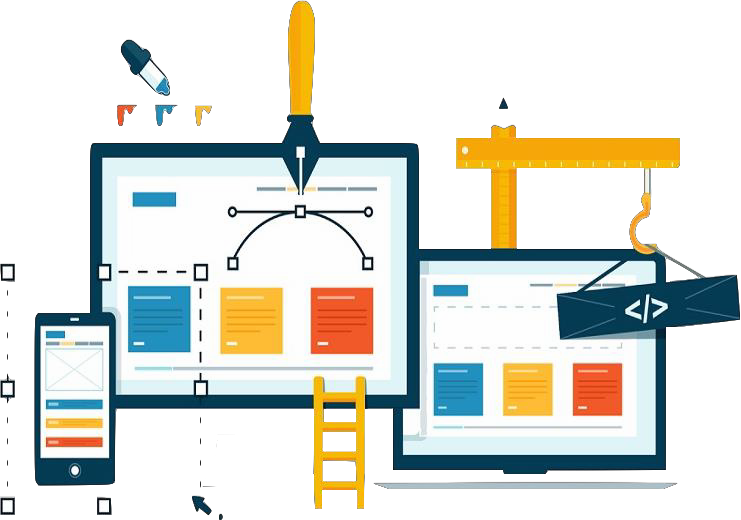


**TAW**

Valida gratis por URL de acuerdo a las WCAG 2.x. Se puede seleccionar nivel A, AA, AAA y las tecnologías soportadas (HTML, CSS, JS) 

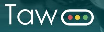

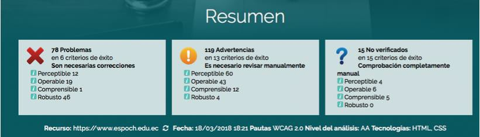

**WAV**

Valida gratis por URL, también disponible como extensión para Chrome. El detalle del informe se muestra junto a la página, en el lateral izquierdo, y los resultados se pueden filtrar por WCAG 2.0 (A, AA, no admite AAA).

En base al análisis automático de accesibilidad de las herramientas anteriores, se hace
necesaria una **revisión manual de accesibilidad**.

La revisión manual se basa en revisar en todas las páginas, o en la muestra de páginas seleccionadas, el cumplimiento de las pautas de accesibilidad hasta el nivel de prioridad establecido de las WCAG 2.1.

Se considera que una revisión manual es siempre imprescindible para comprobar realmente si una página es accesible. Para poder llevar a cabo esta verificación manual es necesario conocer las directrices de accesibilidad, saber cómo utilizan los usuarios las ayudas técnicas (magnificador, lector de pantalla,...) ya vistas en esta unidad.

## Accesibilidad y usabilidad

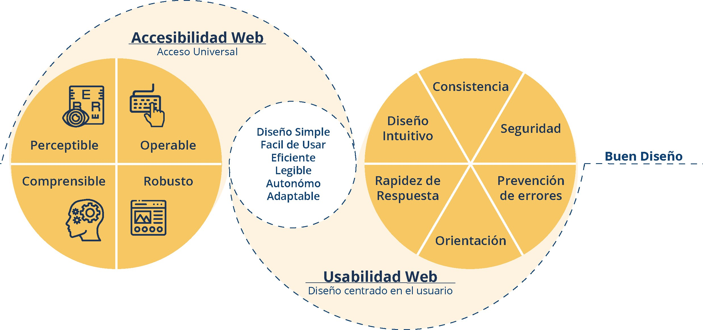
