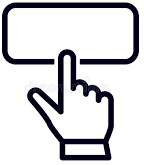
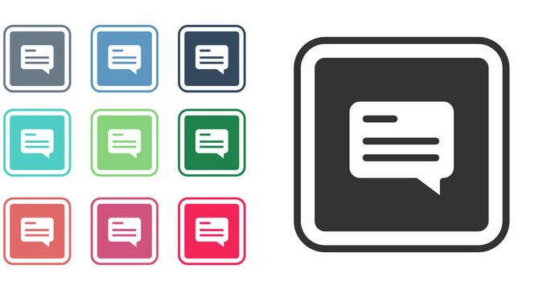

# UT6.2 Aplicaciones para la acesibilidad web

## Contenido accesible

El **contenido** hace referencia a la información contenida en una página o en una aplicación, incluyendo texto, imágenes, formularios, sonido, etc.

En las directrices de Accesibilidad para el Contenido (WCAG 2.x) hay varias de ellas que nombran directamente al **contenido**:

1.1 Proporciona alternativas textuales para todo contenido no textual de modo que se pueda convertir a otros formatos que las personas necesiten, tales como textos ampliados, braille, voz, símbolos o en un lenguaje más simple.
1.3 Crea contenido que pueda presentarse de diferentes formas (por ejemplo, con una disposición más simple) sin perder información o estructura.
1.4 Facilita a los usuarios ver y oír el contenido.
2.2 Proporciona a los usuarios el tiempo suficiente para leer y usar el contenido.
2.3. No diseñar contenido que se sepa podría provocar ataques o convulsiones.
2.4. Proporcionar medios para ayudar a los usuarios a navegar, encontrar contenido y determinar dónde se encuentran.
3.1 Hacer que los contenidos textuales resulten legibles y comprensibles.

En el siguiente gráfico se puede comprobar que el tiempo necesario para la **comprobación** de algunas de las directrices o criterios de conformidad del primer principio son muy superiores al resto de criterios, consumiendo 4 de ellos el 25% del tiempo de análisis:

-   El criterio 1.3.1 consumirá el 9,71% del tiempo total (48 minutos de media)
-   El criterio 1.1.1 consumirá el 5,90% del tiempo total (29 minutos de media)
-   El criterio 1.4.3 consumirá el 5,11% del tiempo total
-   El criterio 1.4.1 consumirá el 4,28% del tiempo total
-   El resto de criterios (46 criterios) consumirán el tiempo total restante


### Captchas

Los **CAPTCHA** (*Completely Automated Public Turing test to tell Computers and Humans Apart*) se utilizan para definir un sistema de seguridad de tipo pregunta-respuesta que demuestra que la persona que está interactuando con la web es un humano, excluyendo y no un bot o scripts automatizados.

Existen diversos tipos y evoluciones: visuales, lógicos, auditivos, matemáticos, recaptchas..


Para programar un CAPTCHA de forma accesible se le debe se ha de proporcionar una alternativa textual que describa su propósito.

```html

```

Además tenemos que proporcionar otro CAPTCHA, con el mismo propósito, pero en una modalidad sensorial diferente:


### Enlaces o botones sin contexto

Una de las estrategias de interacción de las personas que usan lectores de pantalla es el uso del **tabulador** para recorrer los enlaces del sitio web tal y como hemos visto.

Si se realizan enlaces como el del siguiente ejemplo:

[**Pinche aquí** ](#_bookmark0)**para obtener más información sobre accesibilidad general**

Al navegar con el tabulador, el lector de pantalla leerá **pinche aquí**. Con esta información no podemos saber que en el destino del enlace hay más *información sobre accesibilidad general*.

Para crear enlaces accesibles se deben seguir los siguientes criterios:

- Usar el texto del enlace para describir su propósito.

    Ejemplo: **Existen prototipos de chats de Inteligencia Artificial generales como el** [**Prototipo Chat-GPT**](https://chat.openai.com/)
    -  ✔ El texto Chat-GPT describe el enlace y su propósito.
-  Proporcionar una descripción adicional al texto del enlace (*title*). 

    Ejemplo: Una web que contiene una colección de artículos:
    -   **Título artículo 1**
        *Resumen de la noticia 1* ([Leer más](#_bookmark1))

    -   **Título artículo 2**
        *Resumen de la notica 2* ([Leer más](#_bookmark1))

    Los enlaces de acceso al contenido de la noticia son todos iguales, *Leer más*.

    Para hacerlos distinguibles a una persona que utilice un lector de pantalla hemos de proporcionar una descripción adicional al texto del enlace, usando el atributo **title**:

    ```html
    <a href="" title="Título noticia 1" >Leer más</a>
    <a href="" title="Título noticia 2" >Leer más</a>
    ```

    Hay que tener en cuenta que enlaces con el <u>mismo destino</u> tienen que tener la misma descripción, es decir, el mismo texto del enlace y los enlaces a diferentes destinos deberán de tener diferentes descripciones.

- Información de contexto previa al enlace. 

    Si el texto del enlace no es suficientemente descriptivo pero sí que lo es la frase en la que se encuentra, hemos de proporcionar el enlace al final de la misma ya que mediante una combinación de teclas con el lector de pantalla, los usuarios son capaces de leer el párrafo actual.

    **Más información sobre el avance de las tropas Rusas y la defensa del ejército Ucraniano en** [**Guerra de Ucrania**](#_bookmark2)

### Imágenes con texto alternativo (alt)

Añadir un texto alternativo a una imagen <u>no es siempre lo correcto</u>. Si la imagen no proporciona ninguna información, solamente molestará al usuario. Por tanto primero es importante distinguir entre **imágenes decorativas** y aquellas con información **relevante**.


En este ejemplo, las imágenes anteriores que acompañan a los videos **son imágenes decorativas** ya que no aportan información relevante a su contenido.

Todas ellas incluyen además un texto alternativo redundante usando el atributo **alt** respecto al título del video, que se muestra después de dichas imágenes.


- **Imágenes decorativas:**
    
    Tal y como hemos comentado no aportan información y por lo tanto hemos de incluir un texto alternativo vacío.

    ```html
      <!-- Bien -->
     <!-- Mal -->
    ```

- **Imágenes con contenido necesario:**

    Las imágenes necesarias por el contrario sí que aportan información a nuestro documento y por tanto hemos de incluir **una alternativa textual**. Este texto alternativo no ha de superar los **150** caracteres.

    

    ```html
    
    ```

 

A nivel de posicionamiento **SEO**, la utilización de atributo **alt** es realmente importante para mejorar la relevancia temática de ésta:


### Atributo title

Mientras que el atributo **alt** solamente puede aplicarse a las etiquetas *\,* **title** es un atributo universal compatible con la mayoría de los elementos HTML. Su finalidad es añadir comentarios, explicaciones breves o información adicional al título.


Los navegadores muestran el **title** como un *tooltip* o globo cuando el puntero del ratón está sobre él. Debido a su importancia para la accesibilidad y la usabilidad, los textos alternativos son más importantes para el **SEO** que el título de la imagen.

Por ello mientras que **alt** es una especificación obligatoria, **title** suele utilizarse en menor medida.

### Visibilidad del foco

En una página el indicador del **foco del teclado** debe resultar visible.

Un ejemplo de aplicación de este criterio sería que cuando los campos de texto reciben el foco, una barra vertical se muestre en el campo indicando que el usuario puede insertar texto, o todo el texto en el campo es resaltado para indicar que el usuario puede escribir sobre el texto. Otro ejemplo es cuando un control recibe el foco, conseguir que se muestre un borde visible alrededor del control o que se destaque del resto con un fondo diferente.


Igualmente, se puede utilizar la pseudoclase *hover* para que, al pasar sobre un botón o un elemento concreto, el **puntero** cambie a otro que denote interactividad sobre dicho elemento:

```css
.botón_reset:hover {
  cursor: pointer;
}
```



También sería útil utilizar la propiedad border-color de los inputs de los formularios para que cambiase al seleccionarlos (*focus*):

```css
input[type="text"]:focus {
  border-color: green;
}
```


### Atributo aria-label

Aunque lo adecuado es siempre emplear elementos de HTML nativos que tengan un comportamiento definido como:

    \<menu\>
    \<article\>
    \<button\>
    …

No siempre es posible, ya sea por diseño, desarrollo o por ambas. Es por ello que es necesario indicarle a las aplicaciones de asistencia la funcionalidad que tiene ese elemento definido.

Es por ello que se creó el atributo **aria-label** que a veces aparece en el código *HTML* de determinados elementos en una web.

El atributo **aria-label** se utiliza para definir una cadena que etiqueta el elemento actual. Se utiliza en los casos en que no haya una etiqueta de texto visible en pantalla.

En el siguiente ejemplo se aplica estilo a un botón para que parezca un típico botón "cerrar", con una X en medio. Al no haber nada que indique que el propósito del botón es cerrar el diálogo, se usa el atributo aria-label para proporcionar una etiqueta a cualquier tecnología de asistencia.

```html
<button **aria-label**="Cerrar" onclick="myDialog.close()">X\</button>
```

En este otro ejemplo habría que indicarle al navegador cuales son las acciones de los botones que tienen las flechas:


```html
<div class="arrow arrow-left" aria-label="backward button"> </div>
…
<div class="arrow arrow-right" aria-label="forward button"> </div>
```

### Subtítulos multimedia

Los principios de Accesibilidad al Contenido tienen dos pautas de conformidad que hacen referencia a los **subtítulos** del contenido multimedia.

-   **1.2.2 Subtítulos** (que se aplica al contenido multimedia grabado) [**Nivel A**]

    Se proporcionan subtítulos para el contenido de audio grabado dentro de contenido multimedia sincronizado, excepto cuando la presentación es un contenido multimedia alternativo al texto y está claramente identificado como tal. Este criterio tiene nivel A.

-  **1.2.4 Subtítulos se aplica al contenido multimedia en directo** [**Nivel AA**]

    Se proporcionan subtítulos para todo el contenido de audio en directo de los multimedia sincronizados.

Los subtítulos no benefician sólo a las personas con discapacidad, principalmente las personas con problemas auditivos. Los subtítulos nos pueden ayudar a todos en ciertas situaciones.

Es importante diferenciar entre **subtítulos normales**, que sólo incluyen el diálogo que se dice en el audio, y **subtítulos para sordos**, que además del diálogo incluyen equivalentes para que la información sonora se pueda entender sin problemas.

Los subtítulos para sordos por tanto transmiten no sólo el contenido de los diálogos sino también equivalentes para la información sonora que no es diálogo y que es necesaria para comprender el contenido del programa, incluyendo efectos sonoros, música, risas, identificación del hablante y localización.



Algunos consejos relativos a la utilización de subtítulos multimedia de vídeo extraídos de los criterios de conformidad:

-   Los subtítulos deben estar centrados en la parte inferior, excepto los subtítulos que representen efectos sonoros que se sitúan en la parte superior.
-   Los subtítulos deben aparecer en pantalla el tiempo suficiente para ser leídos.
-   Es preferible que los subtítulos no ocupen más de dos líneas en pantalla.
-   Cada línea de texto no debe superar los 35-40 caracteres.
-   El interlineado debe ser sencillo y se debe utilizar una tipografía legible.
-   Los subtítulos deben estar sincronizados con las palabras habladas.
-   La persona que habla debe ser identificada cuando hay más de dos personas en pantalla o cuando la persona que habla no está visible.
-   Todo lo que se dice se debe subtitular, independientemente del idioma o dialecto.

### Contenido Multimedia

En las **WCAG 2** hay otros criterios de conformidad relacionados con el audio y multimedia en la **pauta 1.4**, y que detallaremos a continuación:

- **1.4.2 Control del audio.** [Nivel A]

    Si el audio de una página web suena automáticamente durante más de 3 segundos, se proporciona ya sea un mecanismo para pausar o detener el audio, o un mecanismo para controlar el volumen del sonido que es independiente del nivel de volumen global del sistema.

- **2.3.1 Umbral de tres destellos o menos.** [Nivel A]

    Las páginas web no contienen nada que destelle más de tres veces en un segundo, o el destello está por debajo del umbral de destello general y de destello rojo.

- **Pauta 2.2.1 Tiempo ajustable.** [Nivel A]

    Para cada límite de tiempo impuesto por el contenido, se cumple al menos uno de los siguientes casos:

    -   **Apagar:** El usuario puede detener el límite de tiempo antes de alcanzar el límite de tiempo.
    -   **Ajustar:** El usuario puede ajustar el límite de tiempo antes de alcanzar dicho límite en un rango amplio que es, al menos, diez veces mayor al tiempo original.
    -   **Extender:** Se advierte al usuario antes de que el tiempo expire y se le conceden al menos 20 segundos para extender el límite temporal con una acción y el usuario puede extender ese límite de tiempo al menos diez veces.
    -   **Excepción de tiempo real o esencial:** El límite de tiempo es un requisito que forma parte de un evento en tiempo real (por ejemplo, una subasta) y no resulta posible ofrecer una alternativa al límite de tiempo; o el límite de tiempo es esencial y, si se extendiera, invalidaría la actividad.

### Encabezados

Una forma de obtener un resumen de las ideas principales de la página y saltar entre contenidos para leer las partes que más interesa es la **navegación a través de los encabezados**. Muchas páginas carecen de encabezados, y sin ellos este método de ojear el contenido es completamente inútil.

Los lectores de pantalla muestran una navegación por encabezados como la siguiente:


Los encabezados se especifican en las **WCAG 2.x** en las directivas **2.4** y en la **1.3** y sus pautas o directrices de conformidad son:

- **Pauta 2.4.6 Encabezados y etiquetas.** [Nivel AA]

    Los encabezados y etiquetas describen el tema o propósito. La intención de esta pauta o criterio de Conformidad es ayudar a los usuarios a entender qué información contienen las páginas web y cómo está organizada.

- **Pauta 1.3.1 Información y relaciones** [Nivel A]

    La información estructura y relaciones comunicadas a través de la presentación pueden ser determinadas por software o están disponibles como texto.

Para conseguir todos los criterios de accesibilidad es por tanto crucial usar los elementos **semánticos** adecuados para marcar la estructura; en el caso del *HTML* usando H1, H2, H3, H4, H5 y H6 y no estilos propios en CSS que simulen ser encabezados. Además es crítico el **anidarlos** correctamente.

 

### Párrafos y énfasis

Los **párrafos** son otro elemento estructural básico en HTML: \<p\>\</p\>

- Se deben limitar los párrafos a única idea principal.
- No utilizar párrafos vacíos para separar contenidos ya que algunos lectores de pantalla leerán, "en blanco, en blanco, en blanco.." por cada párrafo vacío, generando ruido al usuario.
- En cuanto a las **énfasis en textos** (negrita y cursiva) utilizar los elementos del HTML \<em\> y \<strong\> en lugar de propiedades de hojas de estilo CSS (como *font-style*)

### Tablas

Las **tablas** sirven exclusivamente para mostrar información tabular, aunque antiguamente se han llegado a utilizar como elemento para el diseño.

-  Ejemplo de tabla **no accesible**:

 


-  Ejemplo de **tabla accesible**:

|  **Mes** | **España**         | **México**            | **USA**            |                       |                    |                       |
|----------|--------------------|-----------------------|--------------------|-----------------------|--------------------|-----------------------|
|          | **Hablan Español** | **No hablan Español** | **Hablan Español** | **No hablan Español** | **Hablan Español** | **No hablan Español** |
| Enero    | 10                 | 0                     | 15                 | 5                     | 5                  | 25                    |
| Febrero  | 11                 | 0                     | 20                 | 2                     | 3                  | 30                    |

    - Caption: visitantes por países.
    - Summary: visitantes que hemos tenido clasificados por países y meses. De cada país se indica el número de usuarios que hablan español y cuáles no.
    - España, Si, Enero=10 España, No, Enero=0 México, Si, Enero=15 México, No, Enero=5 USA, Si, Enero=5 USA, No, Enero=25
    …

En las **WCAG 2** en el **criterio de Conformidad 1.3.1** Información y relaciones visto anteriormente, hay una serie de técnicas que tenemos que tener en cuenta cuando tengamos que insertar en nuestros contenidos una tabla de datos:

-   **H51** Usar tablas para presentar información tabular.
-   **H39** Usar elementos caption para asociar títulos de tabla con las tablas de datos.
-   **H73** Usar al atributo summary del elemento table para proporcionar un resumen a la tabla de datos.
-   **H63** Usar el atributo scope para asociar celdas de encabezado y celdas de datos en las tablas de datos.
-   **H43** Usar atributos id y headers para asociar las celdas de datos con las celdas de encabezado en las tablas de datos.

    Consulta en [https://www.w3.org/TR/WCAG20-TECHS/Overview.html\#contents](https://www.w3.org/TR/WCAG20-TECHS/Overview.html#contents)

#### H51 Usar tablas para presentar información tabular.

Las tablas de datos estructuran la información en filas y columnas describiendo una relación entre cada celda de datos con otras celdas en su misma fila y/o columna. Por ello, a la hora de construir una tabla de datos se deben identificar adecuadamente las celdas de cada fila y/o columna.

Para construir una tabla se usarán elementos HTML básicos: **table, tr, th** y **td**

```html
<table>
 <tr>
  <th>Curso</th>
  <th>Horas</th>
 </tr>
 <tr>
  <td>CSS</td>
  <td>20</td>
 </tr>
 <tr>
  <td>HTML</td>
  <td>15</td>
 </tr>
</table>
```

#### H39 Usar elementos caption para asociar títulos de tabla con las tablas de datos.

Si la tabla contiene datos, el elemento **caption** permitirá a los lectores de pantalla saltar directamente a los títulos de las tablas y de esta forma poder ojear el documento más fácilmente.

```html
<table>
<caption> Horas curso de formación </caption>
 <tr>
  <td> </td>
  <th>Curso</th>
  <th>Horas</th>
 </tr>
 <tr>
  <th>9:30-10:30</th>
  <td>HTML</td>
  <td>15</td>
 </tr>
 <tr>
  <th>11:00-13:30</th>
  <td>CSS</td>
  <td>20</td>
 </tr>
</table>
```


#### H73 Usar al atributo summary del elemento table para proporcionar un resumen a la tabla de datos.

La propiedad **summary** proporciona una breve descripción de cómo se organizan los datos de la tabla. Es útil para tablas con muchos datos y una estructura compleja.

```html
<table summary="El curso de CSS dura 20 horas de 9:30 a 10:30 y el curso de HTML de 11 a 13:30 tiene una duración de 15 horas">
<caption> Horario curso de formación </caption>
<tr>
  <td> </td>
  <th>Curso</th>
  <th>Horas</th>
 </tr>
 <tr>
  <th>9:30-10:30</th>
  <td>HTML</td>
  <td>15</td>
 </tr>
 <tr>
  <th>11:00-13:30</th>
  <td>CSS</td>
  <td>20</td>
 </tr>
</table>
```


#### H63 Usar el atributo scope para asociar celdas de encabezado y celdas de datos en las tablas de datos.

El valor **col** se indica el valor para encabezados de columna:

```html
<table>
<tr>
  <td> </td>
  <th scope="col">Curso</th>
  <th scope="col">Horas</th>
 </tr>
 <tr>
  <th>9:30-10:30</th>
  <td>HTML</td>
  <td>15</td>
 </tr>
 <tr>
  <th>11:00-13:30</th>
  <td>CSS</td>
  <td>20</td>
 </tr>
</table>
```


La columna *Curso* provee información de encabezado para las celdas HTML y CSS, y la columna *Horas* para las celdas 15 y 20.

#### H63 Usar el atributo scope para asociar celdas de encabezado y celdas de datos en las tablas de datos.

El valor **row** indica el valor para los encabezados de fila:

```html
<table>
<tr>
  <td> </td>
  <th scope="col">Curso</th>
  <th scope="col">Horas</th>
 </tr>
 <tr>
  <th scope="row">9:30-10:30</th>
  <td>HTML</td>
  <td>15</td>
 </tr>
 <tr>
  <th scope="row">11:00-13:30</th>
  <td>CSS</td>
  <td>20</td>
 </tr>
</table>
```


La fila *9:30-10:30* provee información de encabezado horizontal para las celdas HTML y 15, y la columna *11:00-13:30* para las celdas CSS y 20.

## H43 Usar atributos id y headers para asociar las celdas de datos con las celdas de encabezado en las tablas de datos.

Se trata de otra forma de asociar celdas de encabezado a celdas:
-   **id** se usa en las celdas de encabezado \<th\> para proporcionar un identificador único
-   **headers** se usa en las celdas de datos \<td\> con el valor de los id correspondientes.

```html
<table>
<tr>
  <td> </td>
  <th id="c">Curso</th>
  <th id="h">Horas</th>
 </tr>
 <tr>
  <th id="h_1">9:30-10:30</th>
  <td headers="h_1 c">HTML</td>
  <td headers="h_1 h">15</td>
 </tr>
 <tr>
  <th id="h_2"> 11:00-13:30</th>
  <td headers="h_2 c">CSS</td>
  <td headers="h_2 h">20</td>
 </tr>
</table>
```


### Formularios

Cuando se utilizan formularios se debe asociar la etiqueta **label** y el atributo **for** con los inputs del formulario asociando su **id**. Hay que recordar que los **id** de cada label y su etiqueta asociada han ser únicos por cada página.

Además, deberá de usarse la etiqueta **legend** para describir la naturaleza o función de dicho formulario:

```html
<fieldset>
    <legend>Datos personales</legend>
        <label for="nombre">Nombre</label>
        <input name="nombre" id="nombre" >
        <label for="apellido">Apellidos</label>
        <input name="apellido" id="apellido" >
</fieldset>
```

Para los botones de formulario, **enviar** y **restablecer** los elementos de entrada y los elementos de botón, no es necesaria información de accesibilidad extra.

De forma parecida se debería actuar con los **radio buttons**:

```html
<fieldset>
<legend>Elija un método de envío:</legend>
<input id="overnight" type="radio" name="shipping" value="overnight" />
<label for="overnight">Durante la noche</label><br />
<input id="twoday" type="radio" name="shipping" value="twoday" />
<label for="twoday">Dos días</label><br />
<input id="ground" type="radio" name="shipping" value="ground" />
<label for="ground">Tierra</label>
</fieldset>
```


### Documentos electrónicos adjuntos

Cuando hablamos de hacer sitios web accesibles, se entiende que debemos hacer las páginas HTML y sus contenidos accesibles, y eso incluye a los documentos electrónicos como los **documentos PDF** que puedan enlazar.

Algunos ejemplos de cómo crear archivos PDF accesibles:
-   Define el idioma en el que el documento está publicado.
-   Proporciona un título descriptivo a cada documento.
-   Utiliza características incorporadas dentro de la herramienta para definir encabezados, párrafos, listas, tablas, textos alternativos para imágenes, etc.
-   Asegúrate que el documento tenga un orden de lectura apropiado, de forma que los usuarios con tecnologías asistivas puedan acceder al documento.
-   Revisa cada PDF después de convertirlo utilizando comprobadores de accesibilidad como *Siteimprove Accessibility*.


## Navegación accesible

La **navegación** hace referencia a la forma de moverse por el documento o aplicación.

La **pauta 2.4** de las WCAG 2.x es la que se refiere a que sea **navegable:** proporcionar medios para ayudar a los usuarios a navegar, encontrar contenido y determinar dónde se encuentran.

Una navegación más accesible tiene por tanto como objetivo:

-   Que el usuario encuentre lo que necesita.
-   Que el usuario en todo momento pueda contestar a las preguntas:
    - ¿Dónde estoy? (ubicación y orientación)
    - ¿A dónde puedo ir? (navegación)

Una navegación más accesible mejorará no solo la accesibilidad de la página sino también su usabilidad.


### Título de una web

Aunque parece una obviedad muchas webs tienen un título de página erróneo o no significativo. El elemento **title** es obligatorio y todas las páginas web lo deben tener.


A los usuarios con discapacidad visual, que utilizan un lector de pantallas, el título les ayudará a diferenciar múltiples ventanas o pestañas que puedan estar abiertas en el navegador.

A los usuarios con discapacidad cognitiva, como memoria limitada a corto plazo, les ayudará a identificar el contenido de una página web.

Debido a que los usuarios a menudo consultan documentos fuera de contexto, los autores deberían proporcionar títulos ricos en contexto.


Cuando se realiza una búsqueda en un buscador como Google, el título de la página se empleará para identificar los resultados. Un buen título puede ayudar por tanto a mejorar el posicionamiento, el SEO de una página web.

Además, dicho título de la página web también se podría emplear para definir el nombre por defecto de un marcador o favorito en un navegador.

### Enlaces accesibles

Los **enlaces** son la base de la navegabilidad en cualquier web o aplicación y por tanto es fundamental asegurarse que sean <u>perceptibles</u>, <u>operables</u> y <u>comprensibles</u> por todos los usuarios.

Un enlace en HTML se incluye con la etiqueta **\<a\>**. El destino del vínculo, es decir, la localización del recurso al que enlaza, se indica con el atributo href. Puede ser a otra página diferente del sitio, otra parte de la página (con almohadilla y el id del elemento al que enlaza), otra página de un sitio web diferente, un fichero PDF, etc.

```html
<a href="indice.php" 
   target="_blank"
   title="Se abre en ventana nueva">
   Indice de términos de accesibilidad
</a>
```

En la mayoría de los navegadores el contenido del atributo title se visualiza como un tooltip al colocar el cursor sobre el enlace, pero no se visualiza al coger el foco con el teclado.

#### Enlaces accesibles: perceptibles

Para que los enlaces (incluidos botones) se puedan percibir tienen que cumplir dos requisitos:

-   Tener un color de texto que ofrezca suficiente contraste con el color del fondo;
-   La información de que es un enlace no debe depender únicamente del color.

Puede ser importante diferenciar visualmente los enlaces o botones visitados de los no visitados, definiendo un estilo diferente en la CSS, para facilitar la navegación


#### Enlaces accesibles: operables

Para asegurar la correcta interacción con el teclado y los productos de apoyo es importante utilizar el elemento estándar, nativo de HTML, \<a\>.

Los enlaces incluidos con el elemento nativo \<a\> pueden recibir el foco por teclado, es decir, puedes llegar hasta ellos tabulando con el teclado sin necesidad de usar el ratón.

Otro requisito para que sean operables por todos los usuarios en todos los contextos es que los enlaces no dependan de *javascript*.

Un ejemplo incorrecto de enlace, porque depende innecesariamente de javascript:

```html
<a href="javascript:;" onclick="document.location.href='mapa.html'"> 
Mapa web</a>
```

#### Enlaces accesibles: comprensibles

Para que un usuario comprenda un enlace, es decir, el contenido o información que se encuentra en el documento de destino, o la acción o funcionalidad que invoca, y en base a ello pueda decidir si desea pulsarlo o no, el propósito del enlace debe quedar claro, preferiblemente por su propio texto de enlace, sin depender del contexto en el cual se inserta.

En las WCAG 2.x encontramos dos pautas de conformidad que hacen referencia al propósito de los enlaces:

-   El **2.4.4** [nivel A] que indica que el propósito del enlace debe quedar claro mediante el propio texto del enlace o bien por medio del texto del enlace sumado a su contexto determinado por software.
-   El **2.4.9** [nivel AAA] en el cual ya no se admite que el propósito del enlace pueda ser determinado por su contexto, pues como hemos dicho, nuestro objetivo debería ser siempre que el texto del enlace fuera suficientemente descriptivo por sí mismo.

Por tanto, un texto de enlace descriptivo fuera de contexto:

-   Debe identificar claramente el contenido o información que se encuentra en el documento de destino o la acción o funcionalidad que invoca. Textos de enlace como "*más información*" o "*pulsar aquí*" no cumplen este requisito.
-   Los enlaces que tienen el mismo texto de enlace deben tener el mismo destino; dos enlaces que navegan a la misma página no pueden tener un texto de enlace distinto.
-   El texto de enlace descriptivo deberá indicar:
-   El formato y tamaño del recurso al que enlaza, cuando este no es una web (por ejemplo un archivo PDF).
-   Si se abre en ventana nueva (porque incluye el atributo target="blank");
-   Si se navega a un sitio web diferente.
-   Si abre otro programa, por ejemplo el gestor de correo del usuario cuando el destino del enlace es un correo.

## Diseño accesible

La Pautas de Accesibilidad para el Contenido Web (WCAG) se centran principalmente en el contenido, la navegación y la interacción.

Respecto el **diseño accesible**, lo más importante aparece en la **Pauta 1.4 Distinguible**: Facilitar a los usuarios ver y oír el contenido, incluyendo la separación entre el primer plano y el fondo en la que se proporcionan algunos consejos sobre el uso del color, del contraste y del tamaño del texto.


### Color

Los principios de Accesibilidad tienen las siguientes pautas de conformidad que hacen referencia al uso del color.

-   **1.3** Adaptable

    Crear contenido que pueda presentarse de diferentes formas (por ejemplo, con una disposición más simple) sin perder información o estructura.

-   **1.3.3** Características sensoriales que podría hacer referencia al uso del color.
-   **1.4.1** Uso del color

    No se debe usar el color como el único medio visual para transmitir la información.

-   **1.4.8** Presentación visual

    En la presentación visual de bloques de texto, se proporcionará algún mecanismo para lograr que los colores de fondo y primer plano puedan ser elegidos por el usuario.

-   **1.4.3** Contraste del color

    El contraste de color entre el fondo y el contenido del primer plano debe tener un nivel mínimo para garantizar la legibilidad. El texto y el fondo deben tener una relación de contraste de al menos 4.5:1. Los encabezados deben tener una relación de contraste de al menos 3:1.
    

    <https://accessibleweb.com/color-contrast-checker>

### Tipografías

En las tipografías normales suele primar el carácter estético antes que el funcional o práctico, aunque esto último también se tiene en cuenta en muchas ocasiones con el fin de mejorar la legibilidad de los textos.

La elección de una mala tipografía puede ser fuente de problemas para las personas con **dislexia**. La Federación Mundial de Neurología define la dislexia como "un trastorno que se manifiesta por la dificultad en aprender a leer (y escribir) a pesar de recibir una enseñanza correcta, mostrar una inteligencia adecuada y capacidades socioculturales"


Existen otros efectos que pueden sufrir las personas con dislexia tales como:

-   El efecto rio: se produce cuando existen grandes huecos vacíos en el texto en líneas consecutivas al usar texto justificado.
-   Efecto borroso: Al usar bloques de texto muy grandes
-   Efecto lavado: Al usar tipos de letra serif.


### Responsive design

El diseño web adaptable o adaptativo, conocido en inglés como responsive web design (RWD), tiene como objetivo realizar un diseño de una página web que sea capaz de adaptar la apariencia de la página web al dispositivo que se esté utilizando para visualizarla.

El diseño web adaptable indudablemente puede ayudar a mejorar la accesibilidad de cualquier página web o aplicación.


