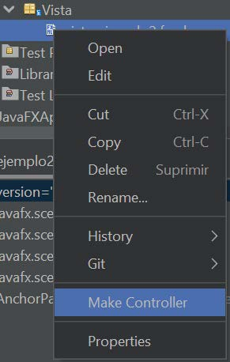

# UT7.1 Programación de interfaces JavaFX y Scene Builder

## JavaFX

**JavaFX** es una plataforma con un conjunto de paquetes de gráficos que permite a los desarrolladores diseñar, crear, probar, depurar e implementar aplicaciones de cliente enriquecido (integrando gráficos vectoriales, animación y sonido) que operen en diversas plataformas.

JavaFX amplía la potencia de Java permitiendo a los desarrolladores utilizar cualquier biblioteca de Java en aplicaciones JavaFX.


### Características

Características de JavaFX:

-   Acceso a la API de Java.
-   Diseñador de interfaces con Scene Builder (*FXML*)
-   Interoperabilidad con Java Swing.
-   Compatibilidad con CSS 3 (Controles de UI)
-   Aplicación del patrón *MVC* (Modelo Vista Controlador)
-   Se puede integrar un módulo con compatibilidad web (*webview*)
-   Proporciona un motor de Javascript.
-   Incluido hasta la versión del Java JDK 8 (A partir de entonces, se debe integrar como una librería aparte)
na versión del Java JDK que mantenga la compatibilidad con JavaFX.
d.educa.madrid.org/index.php/s/QcezPFVTPKdejsC)
ichero *netbeans.conf* en la carpeta etc de la instalación de Netbeans.


### OpenJFX

En la actualidad existe un proyecto Open Source llamado **OpenJFX** destinado a continuar el desarrollo iniciado por Oracle que fue descontinuado.


## Estructura aplicación JavaFX

Las aplicaciones *JavaFX* poseen tres componentes esenciales, los cuales son:

-   **Stage** (escenario)
-   **Scene** (escena)
-   **Node** (nodo)


### Clase Stage

La clase **Stage** (escenario) nos provee de un marco de trabajo o escenario, es una ventana la cual servirá para agregar los contenedores y elementos de nuestra interfaz gráfica, esta actuará como **Ventana Principal** (similar a la clase *JFrame* de Java Swing).

Es obligatorio tener un Ventana o Etapa Principal, por lo tanto el primer objeto de tipo Stage es construido al crear nuestra Aplicación JavaFX. Este objeto se pasará como argumento en el método **start()** de la clase *Application*.


### Clase Scene

La clase **Scene** (escena) hace referencia al **contenedor,** el cual tendrá todos los elementos que se visualizaran en la interfaz gráfica. La clase **Scene** perteneciente al paquete **javafx.scene** proporciona los métodos necesarios para poder agregar un **Nodo Raíz**, el cual será el Contenedor principal de nuestra **Escena.**


### Nodos (scene graph)

Un **nodo** o **scene graph** podemos compararlo con una estructura de orden jerárquico (Árbol). Hacen referencia al contenido o elementos que se visualizaran en la **Escena**, los **Nodos** serian esas ramas o hojas de dicha estructura, los cuales serán los elementos de interfaz gráfica que podremos visualizar en nuestra aplicaciones.

La Clase **Node**, es la clase base de todos los gráficos de la escena; de esta manera todos los elementos de interfaz gráfica (*Contenedores, Botones, Etiquetas*) heredaran de dicha clase Node.


Cada nodo en el grafo de escena tiene un identificador, otros atributos y una serie de métodos para manejarlo.


Hay dos tipos de nodos:

-   *Contenedores*: de tipo Parent (del que derivan Group, Region y Control, y otros), y que pueden contener 0 o más hijos.
-   *Hoja*: que pueden ser primitivas gráficas como rectángulos, o texto y componentes como imágenes o medios.

## Clase Application

La clase **Application** perteneciente al paquete javafx.application, es el punto de partida de **JavaFX** ya que extenderá su clase principal.

Por lo tanto, para crear una aplicación con *JavaFX* la clase principal deberá **heredar** de la clase *Application* y sobrescribir su método abstracto **start ()**, que es el método que permitirá inicializar la interfaz gráfica.

La clase *Application* posee tres métodos abstractos, referentes al ciclo de **ciclo de Vida** de una aplicación **JAVAFX: init**(), **start**() y **stop**() que veremos a continuación.

```java
publicclassIntroduccionextendsApplication{

@Override
publicvoidinit() throwsException{ }

@Override
publicvoidstart(StageprimaryStage) throwsException{ }

@Override
publicvoidstop() throwsException{ }

```

### Método init

El método **init** () es llamado justo después de crear una instancia de la clase Application, esto quiere decir que el método init será lanzado justo después de ser ejecutado el método constructor y puede usarse para inicializaciones específicas de la aplicación.

Sin embargo, las operaciones de la GUI o Interfaz Gráfica, como la creación de escenarios(Stage) o escenas(Scene), no se pueden realizar desde este método, debido a que en el momento de lanzar este método el hilo encargado de manejar la GUI aún no está lista para ser ejecutada.

### Método start

Desde el método **start()** inicializamos los componentes de nuestra interfaz gráfica y en general toda la lógica de nuestra aplicación, para efectos de nuestro ejemplo pasamos un mensaje por consola.

### Método stop

El método **stop()** se ejecutará cuando los procesos de la aplicación estén por finalizar, como por ejemplo cuando el usuario oprime el botón cerrar. En dicho caso se ejecutarán sus líneas de código, generalmente dedicadas a cerrar tareas como por ejemplo cerrar todas las conexiones con la base de datos. Para cerrar una aplicación en JavaFX se recomienda utilizar el método **Platform.exit()**

### Método launch

Permite lanzar nuestra aplicación JavaFX. Aunque una aplicación JavaFX no requiere del método **main()** para iniciarse, suele ser requerido por algunos IDEs para identificar el punto de partida de la aplicación. Si deseamos iniciar la aplicación desde el método main() es necesario llamar al método **Application.launch()** .


-   Ejemplo de aplicación en JavaFX de la clase *Hola*:

    ```java
    publicclassHola extendsApplication {

    @Override
    publicvoidstart(StageprimaryStage) { // ventana principal
        Text texto= new Text("Hola a TODOS!!!"); // Nodode tipo Text
        StackPane raizp= new StackPane(); // Nodode tipo StackPane, RAIZ
        raizp.getChildren().add(texto); // texto es ahora hijo de raizp
        Scenes cene= new Scene(raizp, 300, 250); // Escenapara asignar raizpde 300x250
        primaryStage.setScene(scene); // Asignar la escena a la ventana(stage)
        primaryStage.show(); // Mostramos la escena en la ventana
    }

    publicstaticvoidmain(String[] args) {
        launch(args);
        }
    }
    ```

## Modelo Vista Controlador (MVC)

Desde la perspectiva del Modelo Vista Controlador (**MVC**) con la que ya trabajamos:

-   El archivo *FXML* contendrá la descripción de la interfaz de usuario, es decir la **vista**.
-   El **controlador** es una clase Java, que **implementa la clase Initializable**, que se declara como el controlador para el archivo FXML.
-   El **modelo** consta de objetos de dominio, definidos en el lado de Java, que se pueden conectar a la vista a través del controlador.


En Java, para enviar datos entre ventanas en una GUI y mantener su **persistencia**, se pueden considerar varias opciones:

-   Enviar los datos a través del **constructor de clases** de ventana: es con el método que hemos trabajado hasta ahora.
-   Utilización de métodos **setter**: Se crean métodos en las ventanas secundarias para actualizar sus atributos internos.
-   Utilización de un patrón de diseño **Observer**: el patrón observer permite notificar a una ventana secundaria cuandos los datos cambian en una ventana principal a través de eventos.
-   Utilización de bases de datos y ficheros: para la persistencia de datos a largo plazo es indispensable el uso de estos sistemas.


## Scene Builder (vista)

La aplicación **Scene Builder** permite diseñar, mediante un interfaz gráfico, las estructuras de las ventanas de las aplicaciones que queramos desarrollar usando JavaFX.

Se trata de un componente separado del IDE que utilicemos para el diseño y que genera un fichero FXML. El *FXML* se combinará con un proyecto Java vinculando la interfaz de usuario a la lógica de la aplicación.

En la aplicación *JavaFX Scene Builder* disponemos de una amplia paleta de controles que podemos usar arrastrando y soltando para construir la interfaz, botones, *checkbox*, *radio buttons*, paneles, rejillas, menús, contenedores, miscelánea, formas, 3D, etc.


<https://gluonhq.com/products/scene-builder/>


### Partes de Scene Builder


1. Contenedores, controles, menus..
2. Jerarquía de componentes
3. Controlador: El campo Controller Class hace referencia a la clase controladora que se debe autogenerar una vez guardados los cambios en IntelliJ o Netbeans.
4. Propiedades del diseño de componentes y código JavaFX CSS: En este campo se pueden aplicar las propiedades de JavaFX CSS o adjuntar una hoja de estilos externa.
5. Code: Se debe de dar un nombre interno o fx:id a cada componente para luego poder referenciarlo en la clase controladora.

### Actualizar controlador en IntelliJ

Una vez se han hecho cambios en la vista es necesario que dicho código se actualice en el controlador de nuestro proyecto en IntelliJ IDEA.

Para hacerlo de forma automática deberemos de instalar la extensión llamada FXMLManager desde el apartado *Settings>Plugins*.

Una vez instalada, usaremos la opción contextual Update controller from XML para actualizar el código del controlador.

### Contenedores (layouts)

| **Layout**   | **Forma y descripción**                                                                                                                                                                         |
|--------------|-------------------------------------------------------------------------------------------------------------------------------------------------------------------------------------------------|
| *Hbox*       | HBox organiza todos los nodos de nuestra aplicación en una sola fila horizontal.                                                                                                                |
| *Vbox*       | VBox organiza todos los nodos de nuestra aplicación en una sola columna vertical.                                                                                                               |
| *BordePane*  | Organiza los nodos de nuestra aplicación en las posiciones superior, izquierda, derecha, inferior y central.                                                                                    |
| *StackPane*  | El StackPane organiza los nodos en nuestra aplicación encima de otro como en una pila. El nodo agregado primero se coloca en la parte inferior de la pila y el siguiente nodo se coloca encima. |
| *TextFlow*   | El diseño de flujo de texto organiza varios nodos de texto en un solo flujo.                                                                                                                    |
| *AnchorPane* | El diseño del AnchorPane ancla los nodos en nuestra aplicación a una distancia particular del panel.                                                                                            |
| *GridPane*   | El diseño del Panel de cuadrícula organiza los nodos en nuestra aplicación como una cuadrícula de filas y columnas. Este diseño es útil al crear formularios con JavaFX.                        |
| *FlowPane*   | Envuelve todos los nodos en un flujo. Un panel de flujo horizontal envuelve los elementos del panel en su altura, mientras que un panel de flujo vertical los envuelve en su ancho.             |


### Controles

| **Component**   | **Forma y descripción**                                                                                                  |
|-----------------|--------------------------------------------------------------------------------------------------------------------------|
| *Label*         | Un objeto *Label* (etiqueta) es un componente para colocar texto.                                                        |
| *Button*        | Esta clase crea un botón etiquetado.                                                                                     |
| *ColorPicker*   | Un *ColorPicker* proporciona un panel de controles diseñado para permitir que un usuario manipule y seleccione un color. |
| *CheckBox*      | Componente gráfico simple que puede estar en estado activado (ON) o desactivado (OFF).                                   |
| *RadioButton*   | Componente gráfico, que funciona en grupo, que también puede estar en estado *ON* (verdadero) u *OFF* (falso).           |
| *ListView*      | Un componente *ListView* presenta al usuario una lista desplegable de elementos de texto.                                |
| *TextField*     | Un objeto *TextField* es un componente de texto que permite la edición de una sola línea de texto.                       |
| *PasswordField* | Un objeto *PasswordField* es un componente de texto especializado para la entrada de contraseñas.                        |

| **Component** | **Forma y descripción**                                                                                                                                   |
|---------------|-----------------------------------------------------------------------------------------------------------------------------------------------------------|
| *Scrollbar*   | Un control de barra de desplazamiento representa un componente de barra de desplazamiento para permitir al usuario seleccionar entre un rango de valores. |
| *FileChooser* | Un control *FileChooser* representa una ventana de diálogo desde la que el usuario puede seleccionar un archivo.                                          |
| *ProgressBar* | A medida que la tarea avanza hacia su finalización, la barra de progreso muestra el porcentaje de finalización de la tarea.                               |
| *Slider*      | Un control deslizante permite al usuario seleccionar gráficamente un valor deslizando una perilla dentro de un intervalo acotado.                         |

### Controlador en el diseñador

Hay que asegurarse de dar siempre **id** a los campos usados en el editor (**fx:id**) y a los **eventos** utilizados (por ejemplo *On Action*) para que dicho código se traslade al controlador asociado en el IDE que usemos. Luego deberá de usarse en el menú contextual del fichero *fxml* **Make Controller** para generar los cambios en el código de Netbeans.




### Modelo completo

**Ejemplo**

Ejemplo de aplicación en JavaFX de una **clase principal modelo** habiendo creado el *controlador* y un *FXML* (vista) en Scene Builder:

```java
public class MainApp extends Application {

@Override
public void start(Stage stage) throws IOException{     // ventana principal
   FXMLLoader loader = new FXMLLoader();
   loader.setLocation(MainApp.class.getResource("/vista/Ventana.fxml")); //FXML con el diseño
   Pane raiz= (Pane) loader.load();                                      //Nodo de tipo Pane, RAIZ
        
   Scene scene = new Scene(raiz, 500, 250);                  //Escena para asignar raiz 
   stage.setTitle("TituloVentana");                          //Título de la ventana
   stage.setScene(scene);                                    //Asignar escena al stage(window)
   stage.show();                                             //Mostrar escena en stage}

public static void main(String[] args) {
    launch(args);
 }
}
```

Ejemplo en JavaFX de una **clase modelo controlador** que implementa la clase *Initializable* y que se carga desde la clase modelo anterior:


```java
public class ControladorVentana implements Initializable {

    @FXML
    private Label label_prueba1;  //Se crean automáticamente al hacer Make Controller
    @FXML
    private Button btn_salir;

    @Override
    public void initialize(URL url, ResourceBundle rb) {
        
    }    

    @FXML
    private void click(ActionEvent event) {    //Manejo de uno los eventos
        Button btn_salir = (javafx.scene.control.Button) event.getSource();
        Stage stage = (javafx.stage.Stage) btn_salir.getScene().getWindow();
        stage.close();
    }
}
```

Los <u>>elementos</u> por tanto que utilizaremos para crear aplicaciones en JavaFX y sus funciones se resumen en la siguiente tabla:

| **Elemento** | **Función**                                                                                                                            |
|--------------|----------------------------------------------------------------------------------------------------------------------------------------|
|  Java        | - Clase principal que extiende Application - Crear el *Scene* y asociarle sus nodos - Mostrar la ventana o Stage - Definir eventos en el controlador (implementa clase *initializable*) |
| FXML         | Define el diseño de la vista (nodos de la vista)                                                                                       |
| CSS          | Define el estilo adicional de la vista                                                                                                 |

## Cuadros de diálogo adicionales en JavaFX

### Clase Alert

En **JavaFX**, los cuadros de diálogo de error, se muestran con una clase llamada **Alert**. Los tipos de alertas que hay son:

-   *ERROR*
-   *INFORMATION*
-   *WARNING*
-   *CONFIRMATION*

```java
@FXML
private void mostrarAlertError(ActionEvent event) {
 Alert alert = new Alert(Alert.AlertType.ERROR);
 alert.setHeaderText(null);
 alert.setTitle("Error");
 alert.setContentText("Error en la aplicacion");
 alert.showAndWait();
}
```


```java
@FXML
private void mostrarAlertInfo(ActionEvent event) {
 Alert alert = new Alert(Alert.AlertType.INFORMATION);
 alert.setHeaderText(null);
 alert.setTitle("Info");
 alert.setContentText("Informacion de texto");
 alert.showAndWait();
}
```


### FileChooser

El selector de ficheros *FileChooser* funciona como su homólogo en Java Swing, con lo que podremos utilizarlo de forma similar a cómo lo hacíamos:

```java
public void initialize(URL url, ResourceBundle rb) {
        FileChooser fileChooser = new FileChooser();
        fileChooser.setTitle("Buscar Imagen");

         fileChooser.getExtensionFilters().addAll(
                new FileChooser.ExtensionFilter("All Images", "*.*"),
                new FileChooser.ExtensionFilter("JPG", "*.jpg"),
                new FileChooser.ExtensionFilter("PNG", "*.png")     );
}
```

Si quisiéramos utilizarlo para abrir varias imágenes usaríamos el siguiente código:

```java
File imgFile = fileChooser.showOpenDialog(stage) 
List<File> list = fileChooser.showOpenMultipleDialog(stage);
```

 **Función**                     | **Método**                        | **Descripción**                                      | **Ejemplo de uso** |
|----------------------------------|----------------------------------|------------------------------------------------------|--------------------|
| **Abrir un archivo**            | `showOpenDialog(Stage owner)`   | Muestra un cuadro de diálogo para seleccionar un archivo. | `File file = fileChooser.showOpenDialog(new Stage());` |
| **Abrir múltiples archivos**     | `showOpenMultipleDialog(Stage owner)` | Permite seleccionar varios archivos. | `List<File> files = fileChooser.showOpenMultipleDialog(new Stage());` |
| **Guardar un archivo**          | `showSaveDialog(Stage owner)`   | Muestra un cuadro de diálogo para guardar un archivo. | `File file = fileChooser.showSaveDialog(new Stage());` |
| **Configurar filtros**          | `setExtensionFilters(List<FileChooser.ExtensionFilter>)` | Restringe los tipos de archivos visibles en el cuadro de diálogo. | `fileChooser.getExtensionFilters().add(new FileChooser.ExtensionFilter("Archivos de texto", "*.txt"));` |
| **Seleccionar un directorio**   | `DirectoryChooser().showDialog(Stage owner)` | Permite elegir una carpeta en lugar de un archivo. | `File dir = new DirectoryChooser().showDialog(new Stage());` |

Usar cuadros de diálogo, o una ventana Stage más compleja, dependerá de la información que queramos mostrar al usuario y el desarrollo de nuestra aplicación:


