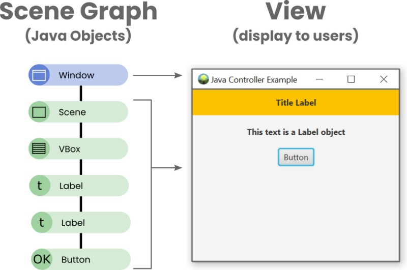
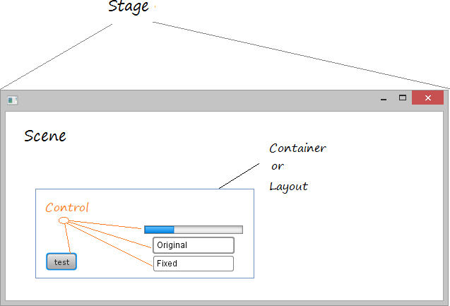
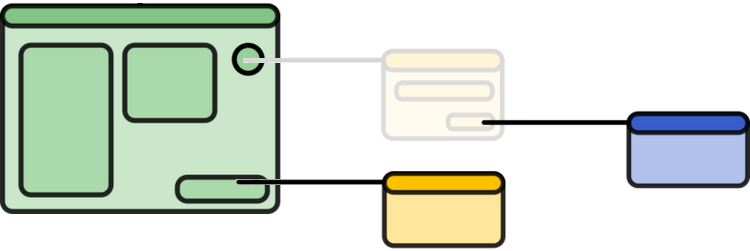

# UT7.2 Manejo de ventanas y Observable Collections en JavaFX

## Uso MVC entre ventanas

Recuerda que para aplicar el MVC en JavaFX, necesitaremos aplicar tres principios :

1.  La lógica de vista debe incluirse en el **controlador** y define cómo se *muestra la información y se interactúa con ella.*
2.  La lógica empresarial debe incluirse en el **modelo** y define cómo se puede *acceder, crear, almacenar y modificar los datos.*
3.  Cada **Vista** debe tener una narrativa o propósito simple y consistente. Puede haber múltiples vistas dentro de una ventana.


Tal y como sabemos en el MVC, usando FXML, los nodos definidos en un documento FXML se estructurarán de la siguiente forma:



## Cambiar contenido del Scene

Recordemos que JavaFX, para crear una ventana, se usaba la clase *Stage*.

Dentro del Stage se cargaba un Scene que a su vez tenía los nodos (scene graph).

Se puede querer cargar dentro de un mismo *Stage* (ventana) otro **FXML** o *Scene,* por ejemplo, ante cierta acción.

 

Para cambiar el contenido del Scene no debemos olvidar <u>nombrar el elemento raíz</u> de nuestra ventana en Scene Builder. Por ejemplo, *rootPane.*


A continuación, dentro del evento desde donde queremos cambiar el *Scene*, cargaremos el nuevo fichero FXML, lo asignaremos aun objeto *AnchorPane* y a continuación lo asignaremos al contenedor *rootPaneanterior*:

```java
FXMLLoader loader = new FXMLLoader(getClass().getResource("/vista/VentanaNueva.fxml"));
AnchorPane panel = loader.load();
rootPane.getChildren().setAll(panel);
```

## Ventanas adicionales

Para agregar nuevas ventanas existen los siguientes tres modelos que puede aplicar al escenario a través del método *stage.initModality(Modelity)* que generan un nuevo Stage:

-   Ventana sin modelo
-   Ventana modal
-   Aplicación modal


### Ventana sin modelo (none)

Cuando abre una nueva ventana con este modelo, la nueva ventana será **independiente** de la ventana principal. Puede interactuar con la ventana principal o cerrarla sin afectar la nueva ventana.

```java
private void clickShow(ActionEvent event) {
   FXMLLoader loader = new FXMLLoader(getClass().getResource("tuVista.fxml"));
    Pane root = (Pane) loader.load();
    Stage stage = new Stage();
    stage.setTitle("Ventana sin modelo");
    stage.setScene(new Scene(root));
    stage.show();
}
```



### Ventana modal

Cuando se abre una nueva ventana con este modelo, **bloqueará la ventana principal**. No puede interactuar con la ventana principal hasta que se cierre esta ventana.

```java
private void clickShow(ActionEvent event) {
   FXMLLoader loader = new FXMLLoader(getClass().getResource("tuVista.fxml"));
    Pane root = (Pane) loader.load();
    Stage stage = new Stage();
    stage.setTitle("Ventana Modal");
    stage.setScene(new Scene(root));
    stage.initModality(Modality.WINDOW_MODAL);
    stage.show();
}
```


### Aplicación modal

Cuando abre una nueva ventana con este modelo, **bloqueará cualquier otra ventana de la aplicación**. No puede interactuar con ninguna otra ventana hasta que se cierre esta ventana.

```java
private void clickShow(ActionEvent event) {
   FXMLLoader loader = new FXMLLoader(getClass().getResource("tuVista.fxml"));
    Pane root = (Pane) loader.load();
    Stage stage = new Stage();
    stage.setTitle("Ventana Modal");
    stage.setScene(new Scene(root));
    stage.initModality(Modality.APPLICATION_MODAL);
    stage.show();
}
```


| Modalidad                     | Descripción                                                                                                                                                                                     |
|-------------------------------|-------------------------------------------------------------------------------------------------------------------------------------------------------------------------------------------------|
|  *Modality.NONE*              | Cuando abre una nueva ventana con este modelo, la nueva ventana será independiente de la ventana principal. Puede interactuar con la ventana principal o cerrarla sin afectar la nueva ventana. |
| *Modality.WINDOW_MODAL*       | Cuando abre una nueva ventana con este modelo, bloqueará la ventana principal. No puede interactuar con la ventana principal hasta que se cierre esta ventana.                                  |
|  *Modality.APPLICATION_MODAL* | Cuando abre una nueva ventana con este modelo, bloqueará cualquier otra ventana de la aplicación. No puede interactuar con ninguna otra ventana hasta que se cierre esta ventana.               |

Repaso de los métodos de la clase *Stage*:

| **Método**              | **Descripción y valores**                                                                              |
|-------------------------|--------------------------------------------------------------------------------------------------------|
| *show()*                | Muestra la ventana (Stage)                                                                             |
| *setScene(scene)*       | Método para establecer el objeto Scene                                                                 |
| *setTitle()*            | Título de la aplicación                                                                                |
| *setX(int value)*       | Posicionamiento en el eje X                                                                            |
| *setY(int value)*       | Posicionamiento en el eje Y                                                                            |
| *setWidth(int width)*   | Establece el ancho del Stage de la ventana                                                             |
| *setHeight(int height)* | Establece el alto del Stage de la ventana                                                              |
| **showAndWait()**       | El método showAndWait() mostrará la ventana, pero el objeto seguirá vivo hasta que se cierre la etapa. |
| *initModality()*        | **None** \| WINDOW_MODAL \| APPLICATION_MODAL                                                          |
| *initOwner()*           | Establece el dueño de la aplicación                                                                    |
| *initStyle()*           | Undecorated \| Transparent \| Unified \| Utility                                                       |

## Modelo de datos entre ventanas

Queremos construir un modelo en el cual una ventana padre llama a una ventana hija con información de ésta, con lo cual se deberán de actualizar entre ambas ventanas y recuperarlos al cerrar la ventana hija.

Para ello necesitaremos:

-   Un **modelo** con métodos *set* y *get*.
-   El **controlador** de la ventana padre que le enviará los datos a la ventana hija a la hora de crearse (\* Opcionalmente recibirá datos de vuelta de la ventana hija desde el modelo).
-   El **controlador** de la ventana hija que recibirá los datos a través de un método *set* que actualizará los datos del modelo a la vista.

### Modelo 

Ejemplo de una clase **modelo** sencilla:

```java
public class ModeloPersona {
    private final StringProperty nombre;
    private final StringProperty apellidos;

//constructor
public ModeloPersona(String nombre, String apellidos) {
        this.nombre = new SimpleStringProperty(nombre);
        this.apellidos = new SimpleStringProperty(apellidos); 
}

public String getNombre() {
        return nombre.get();    
}

public void setNombre(String nombre) {
        this.nombre.set(nombre);    
}

public String getApellidos() {
        return apellidos.get();    
}

public void setApellidos(String apellidos) {
        this.apellidos.set(apellidos);    
}
```

### Controlador ventana padre <-> hija

Al abrir una nueva ventana se genera un evento llamado *nueva_ventana* que le pasará los datos del **modelo** al **controlador** de dicha ventana, mediante el siguiente código:

```java
public class Ventana_Padre implements Initializable {
private void nueva_ventana(ActionEvent event) throws IOException {
     //carga una nueva vista llamada ventana_secundaria y la carga la asigna al panel raiz
     FXMLLoader loader = new FXMLLoader(getClass().getResource("/Vista/ventana_secundaria.fxml"));
     Pane root = (Pane) loader.load();
     //los datos se pasan a la ventana a través de la clase Modelo obteniendo el controlador  
     VentanaSecundariaControlador controlador = loader.getController();
     controlador.setModelo(modelo);   
     Scene scene = new Scene(root);
     //Se crea un nuevo Stage
     Stage stageWindow = new Stage();
     stageWindow.setTitle("Ventana Secundaria");
     stageWindow.initModality(Modality.APPLICATION_MODAL);
     stageWindow.setScene(scene);
     stageWindow.showandwait(); //espera hasta que se cierre el hilo de la ventana secundaria
     //si hubiera que recuperar datos de la ventana hija a la ventana padre, irían aquí
```
El método *showandwait()* espera hasta que se cierre la ventana secundaria y se continúe con el hilo de la llamada, por si hubiera que actualizar datos devueltos.

### Método en controlador ventana hija

En el **controlador de la ventana hija** crearemos un nuevo **método** llamado en este caso *setModeloPersonas(Modelo modelo)* que recibirá los datos del modelo y los actualizará en la vista de la ventana:

```java
public class Ventana_hija implements Initializable {

public void setModelo (Modelo modelo) {
        this.modelo = modelo;
        VistaLista.setItems(modelo.getElements());       
    }
```

## Controles de datos tabulares en JavaFx

### ListView

El elemento *ListView* de JavaFX muestra una lista de elementos en una ventana. Los elementos que puede contener podrían ser más complejos que solo texto, como imágenes o cualquier otro nodo JavaFX.

ListView se compone de una lista de elementos que se pueden seleccionar y, opcionalmente, mostrar información adicional sobre ellos.

ListView también ofrece funcionalidades como la selección múltiple, el filtrado así como la reordenación de elementos mediante la funcionalidad de arrastrar y soltar. Además, es posible personalizar la apariencia de los elementos de la lista usando celdas personalizadas.


### TableView

El elemento *TableView* de JavaFX muestra datos en una tabla con filas y columnas. Se utiliza para presentar información en un formato tabular y permite a los usuarios interactuar con los datos, como agregar, eliminar y editar filas.

El *TableView* se compone de una serie de columnas de tipo *TableColumn*, cada una de las cuales puede mostrar un tipo de dato diferente. Las celdas de la tabla pueden ser editables o no, y los usuarios pueden ordenar la tabla por cualquier columna haciendo clic en el encabezado de la columna correspondiente. 


## JavaFX Observable Collections

El lenguaje de programación Java cuenta con colecciones como: List, Set, Map. La API de JavaFX extiende estas colecciones con las interfaces: **ObservableList**, **ObservableSet**, **ObservableMap**, con el objetivo de proporcionarle a las colecciones el soporte para la notificación de cambios e invalidación como lo hacen las Propiedades JavaFX.

Estas colecciones se encuentran en el paquete *javafx.collections* y para crearlas debemos usar la clase *FXCollections* que nos provee de distintos métodos estáticos para crear la colección que deseemos, veamos un par de ejemplos:

```java
// crear una colección vacia
ObservableList<String> textList = FXCollections.observableArrayList();

// crea la colección a partir de una lista de elementos
ObservableList<Long> numberList = FXCollections.observableArrayList(1L, 2L, 3L)
```

| **Interfaz**       | **Descripción**                                                            |
|--------------------|----------------------------------------------------------------------------|
| ObservableList     | Una lista que nos permite seguir los cambios                               |
| ListChangeListener | Una interfaz que recibe las notificaciones de cambios de un ObservableList |
| ObservableMap      | Un mapa que nos permite seguir los cambios                                 |
| MapChangeListener  | Una interfaz que recibe las notificaciones de cambios de un ObservableMap  |

| **Clase**                 | **Descripción**                                            |
|---------------------------|------------------------------------------------------------|
| FXCollections             | Una clase de utilidades asignada a *java.util.Collections* |
| ListChangeListener.Change | Representa los cambios realizados a un ObservableList      |
| MapChangeListener.Change  | Representa los cambios realizados a un ObservableMap       |
| StringProperty            | Cambios realizados en variables de tipo String             |
| IntegerProperty           | Cambios realizados en variables de tipo Integer            |


### ListView

Un ejemplo sencillo usando el elemento *ListView* y su correspondiente *ObservableList* asociado:

```java
public class main extends Application {
    ObservableList<String> items = FXCollections.observableArrayList(
            "Elemento 1",
            "Elemento 2",
            "Elemento 3",
            "Elemento 4" );
    ListView<String> listView = new ListView<>(items);
}
```

### TableView

El caso de un TableView es más complejo ya que se debe de tratar de forma individual con cada una de sus columnas, de tipo TableColumn.
El método setCellValueFactory se utilizará para establecer cómo se deben obtener los valores que se mostrarán en las celdas de una columna en un TableView. Este método es crucial para <u>vincular</u> los datos del modelo con las celdas de la tabla.
Usaremos una expresión Lambda para asignar las variables a cada columna usando la propiedad *StringProperty* que veremos posteriormente:


```java
@FXML
private void initialize() {
// Initialize la tabla personas con dos columnas.
firstNameColumn.setCellValueFactory(cellData -> cellData.getValue().firstNameProperty());
lastNameColumn.setCellValueFactory(cellData -> cellData.getValue().lastNameProperty());
}
```

Posteriormente agregaremos los **datos** al TableView usando sus métodos concretos.

En la clase <u>Modelo</u> que utilicemos es necesario utilizar la clase **StringProperty** para hacer un seguimiento en los cambios de las variables de cadena de texto que hayamos definido para utilizar en nuestra tabla:

```java
public Persona(String nombre, String apellidos) {
       this.nombre = new SimpleStringProperty(nombre);
}

…

public StringProperty nombreProperty() {
        return nombre;
}
```