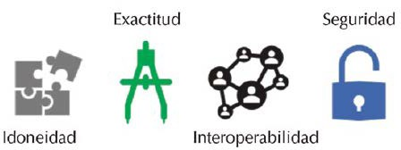

# UT8.1 Realización de pruebas (testing)

## Proyectos

En cualquier proyecto de desarrollo (también, lógicamente, en el desarrollo de aplicaciones) existe una serie de fases típicas que pueden distinguirse, según se indica en el siguiente gráfico:

En el desarrollo de estas fases es importante considerar un **protocolo de pruebas** en cada una que ayude a detectar posibles problemas e inconvenientes, antes del paso a la siguiente fase. Es un proceso de especial relevancia en cualquier proyecto, pero especialmente delicado en el ámbito del desarrollo de aplicaciones.

La razón es sencilla: detectar un problema de planificación o diseño en la fase de evaluación o producción puede suponer un aumento de costes considerable, en comparación a su detección en fases más tempranas.

## Pruebas

Prácticamente la totalidad de los desarrollos de aplicaciones software se basan en dos grupos de pruebas con diferentes características entre sí:

1.  **Pruebas de caja negra**: en las que se evalúa la aplicación desde un punto de vista externo, es decir, sin preocuparnos del “interior”. Son las habituales para la <u>prueba de interfaces</u>.
2.  **Pruebas de caja blanca**: se basan en la evaluación del código interno del software. Un buen diseño para estas pruebas implica la evaluación de todos los posibles caminos que se han implementado en el diseño de un programa.

## Depuración de código

Como resultado de realizar pruebas sobre un desarrollo software, será necesario en muchos casos depurar el código, en función de los resultados de dichas pruebas y del objetivo final de la aplicación.

En el caso de la depuración de código, el objetivo principal es detectar y corregir errores en el mismo, en muchos casos a partir de las pruebas realizadas en cada una de las fases del proyecto.

Con relación al desarrollo de código, pueden aparecer básicamente tres tipos de errores:

-   Errores de compilación.
-   Errores de ejecución.
-   Errores de lógica.

## Tipos de pruebas

### Pruebas unitarias

Este primer tipo de pruebas. Las **pruebas unitarias**, son las utilizadas para evaluar funcionalidades concretas, examinando todos los caminos posibles implementados en el desarrollo de un algoritmo, función o clase.

Por lo tanto, podemos decir que una prueba unitaria es aquella que permite comprobar el funcionamiento de uno de los módulos que forman el programa.

Tras evaluar el funcionamiento unitario de la aplicación, se procede con las pruebas en las que se engloban el resto de módulos.

### Pruebas de integración

Las llamadas **pruebas de integración** se utilizan con el fin de aportar una garantía relacionada con el funcionamiento adecuado de la aplicación, una vez se han integrado todos los módulos que componen la misma, de ahí el nombre de estas pruebas.

Este tipo de pruebas ofrecen la posibilidad de analizar el correcto funcionamiento de todos los módulos de una forma <u>conjunta</u>, ya que es posible que se hayan aplicado otros tipos de pruebas sobre estos módulos, pero de manera separada. Por tanto, la importancia de este tipo de pruebas en el entorno del desarrollo de aplicaciones es fundamental, ya que es habitual que una aplicación de cierta complejidad esté compuesta por varios módulos.

### Pruebas funcionales

Las llamadas **pruebas funcionales** se caracterizan por evaluar al completo las funcionalidades que se indican en la especificación de la aplicación o herramienta desarrollada, concretamente con relación a sus requisitos de diseño.

Al igual que ocurre con el resto de las pruebas que se realicen, es muy importante que el proceso se documente de manera completa, con el fin de facilitar su análisis y comprensión.

Así mismo, la normativa *ISO 25010* especifica una serie de características que deben cumplir estas pruebas funcionales para asegurar que estén correctamente definidas.

### Pruebas de regresión

Las llamadas **pruebas de regresión** se caracterizan por ser un conjunto de pruebas que se habían ejecutado anteriormente sobre el sistema, y que se utilizan para buscar evidencias relacionadas con modificaciones y/o cambios que se haya podido producir sobre el código del programa, con el fin de detectar si han podido ocasionar nuevos errores o fallos, que anteriormente no habían aparecido.

Entre ellas existen diversos tipos, con características diferenciadas entre sí:

-   **Pruebas de regresión locales**: tienen el fin de encontrar errores que hayan sido ocasionados por cambios o modificaciones recientes en el código.
-   **Pruebas de regresión desenmascaradas** o al descubierto: en este caso, estas pruebas tienen lugar cuando la realización de cambios ocasiona problemas que no tienen ninguna relación con los mismos, pero que se han detectado a raíz de su inclusión.
-   **Pruebas de regresión remota**: están relacionadas con la aparición de problemas ocasionados al integrar las distintas partes de una aplicación, considerándose que dichas partes por separado no arrojaban ese mismo problema.

### Pruebas no funcionales

Mientras que las **pruebas funcionales** se basan en analizar cómo se comporta la aplicación a nivel interno, las **pruebas no funcionales** suelen utilizarse con el fin de evaluar cómo se comporta la aplicación a nivel externo.

A continuación, se recogen las principales pruebas no funcionales, junto a sus características más destacadas:

-   **Pruebas de capacidad**. Su uso suele estar ligado a evaluar el comportamiento de la aplicación ante una situación de estrés.
-   **Pruebas de rendimiento**. El fin de este tipo de pruebas es comprobar cómo se comporta la aplicación desde el punto de vista de su eficiencia, teniendo en cuenta parámetros especialmente importantes como el tiempo de respuestas y la velocidad de procesado.
-   **Pruebas de seguridad***.* Corresponden a un tipo de pruebas de una gran importancia, ya que tienen como objetivo final aportar una garantía sobre la integridad de los datos de la aplicación.

### Pruebas manuales

Las **pruebas manuales** se caracterizan por ser ejecutadas por parte del encargado de desarrollar el código, con el fin de poder probar su funcionamiento y, en caso de ser necesario, modificar su implementación.

Es decir, para estas pruebas es el mismo desarrollador software el que las ejecuta, evaluando por sí mismo si la respuesta de la aplicación a una determinada entrada es la correcta o no, en función del código implementado con anterioridad.

Para su ejecución no se emplea una herramienta determinada, sino que depende de cada programador. Habitualmente, los entornos de desarrollo más habituales (como Eclipse o Net-Beans) incorporan herramientas y/o funcionalidades para facilitar la realización de este tipo de pruebas.

### Pruebas automáticas

Contrariamente a las pruebas manuales, las **pruebas automáticas** requieren el uso de <u>herramientas de pruebas</u> para poder ejecutarse. En ambos casos, se trata de pruebas complementarias entre sí y que tienen una gran importancia para conseguir un desarrollo software correcto.

Con las pruebas automáticas, su ejecución suele ser más rápida que en el caso de las manuales, ya que, al fin y al cabo, estas últimas las ejecuta una persona. Además, permiten comprobar el funcionamiento de la aplicación ante diversas variaciones en los datos, y repetir las pruebas de una manera rápida y sencilla.

Se suelen utilizar para la realización de pruebas de regresión, ya que consiguen una optimización del procedimiento.

El número y tipo de herramientas existentes en el mercado para llevar a cabo este tipo de pruebas es muy amplio, por lo que el uso de una u otra dependerá del objetivo final, del tipo de prueba, de las preferencias del desarrollador y, por último, de la aplicación que se está desarrollando.

## Entornos de pruebas

### Selenium

**Selenium** es un herramienta de realización de **pruebas automáticas** de software. Ha existido desde 2004 y se ha convertido progresivamente en el estándar de la industria desde entonces debido a su flexibilidad para ser utilizado en varios IDE de terceros y al uso de algunos de los lenguajes de programación modernos más populares.

Características de **Selenium**:

-   Admite lenguajes de programación OOP modernos como C\#, Java, Perl, PHP, Python, Ruby.
-   Se puede usar desde IDE de terceros como Visual Studio, Eclipse.
-   Es de código abierto y puede encontrarse adapatado para bibliotecas y proyectos derivados para automatizar casi cualquier tecnología.
-   Permite la ejecución de pruebas remotas.
-   Su funcionalidad Server Hub, permite la ejecución remota de pruebas de múltiples pruebas en paralelo.
-   Funciona tanto en Windows como Linux o Mac.
